# 将 ASP.NET 核心应用程序部署到 Amazon Web Services

> 原文：<https://itnext.io/deploying-an-asp-net-core-application-to-amazon-web-services-c0d1be48d44b?source=collection_archive---------4----------------------->

这是关于将一个非常简单的 ASP.NET 核心应用程序部署到主要云提供商的系列文章的第二篇。这篇文章将讨论 Amazon Web Services (AWS)的设置和部署。

以下是这个系列的其他帖子。

[谷歌云平台](https://elanderson.net/2018/06/deploying-an-asp-net-core-application-to-google-cloud-platform/)
[亚马逊网络服务](https://elanderson.net/2018/06/deploying-an-asp-net-core-application-to-amazon-web-services/)(本帖)
[微软 Azure](https://elanderson.net/2018/07/deploying-an-asp-net-core-application-to-microsoft-azure/)

## 示例应用程序

这与该系列的第一篇文章相同，但我把它包括在内，以防你错过了那篇文章。我们将要部署的示例应用程序是使用。NET CLI。以下命令是我用来创建应用程序、创建解决方案以及将项目添加到解决方案中的命令。我在 CloudSample 目录中运行了所有这些命令。

```
dotnet new razor
dotnet new sln
dotnet sln add CloudSample.csproj
```

## 亚马逊网络服务

这篇文章的其余部分将基于亚马逊为 Visual Studio Toolkit[和 Beanstalk with](https://docs.aws.amazon.com/toolkit-for-visual-studio/latest/user-guide/welcome.html)[提供的一些文档。网芯](https://docs.aws.amazon.com/toolkit-for-visual-studio/latest/user-guide/deployment-beanstalk-netcore.html)。我将详细介绍整个过程，但我想确保你能获得这篇文章所基于的相同信息。

用于 Visual Studio 的 AWS 工具包

Amazon 提供了一个 Visual Studio 扩展来帮助从 Visual Studio 与他们的平台进行交互。要安装，打开**工具>扩展和更新**菜单。从对话框左侧选择**在线**然后搜索 **AWS** 并选择**AWS Toolkit for Visual Studio 2017。**

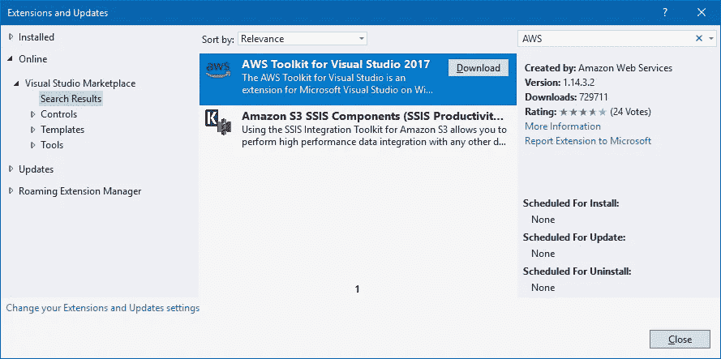

单击下载，关闭 Visual Studio 以触发安装，并在扩展安装完成后重新启动 Visual Studio。当您打开 Visual Studio back up 时，您应该会看到 AWS 入门页面，其中包含了指向 AWS 控制台中 IAM 用户页面的链接。这将使你进入下一页，你必须登录你的帐户或注册一个新帐户。

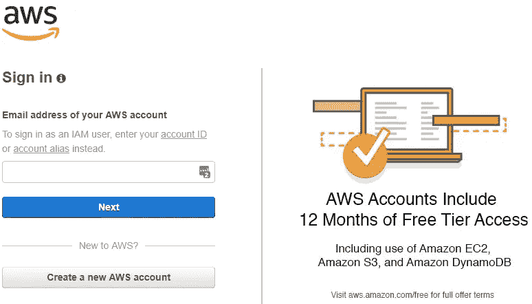

在您完成注册/登录过程后，您将进入 IAM 控制台，我们将通过点击**添加用户**按钮来添加新用户。

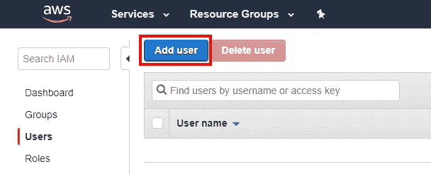

在下一页，填写您想要使用的**用户名**，并勾选**编程访问**复选框，然后点击**下一步:权限**按钮。

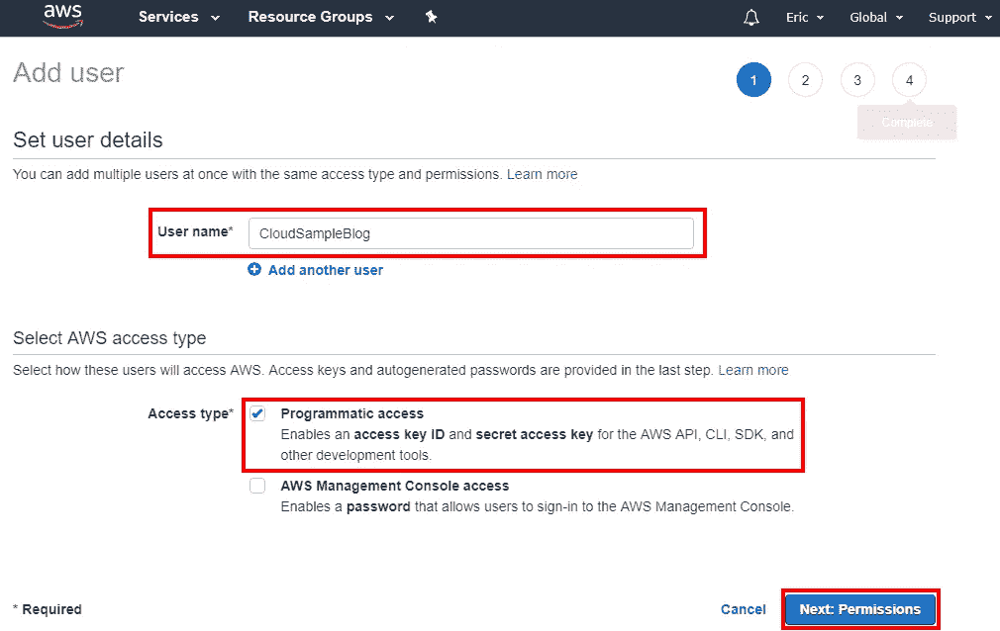

下一页是所有关于用户将有什么权限，这是通过组处理。由于我的帐户没有任何群组，我需要使用**创建群组**按钮创建一个群组。

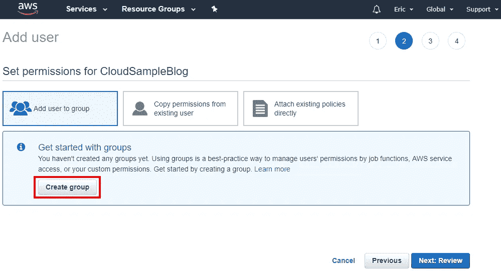

在**创建组**表单上，输入您想要使用的**组名**。接下来，使用**策略类型**的搜索框来查找与 Elastic Beanstalk 相关的策略。我已经为这个示例选择了完全访问策略，但是如果它不仅仅是一个测试，这将需要更多的研究来确定这是否是正确的策略。完成后，点击**创建组**按钮。

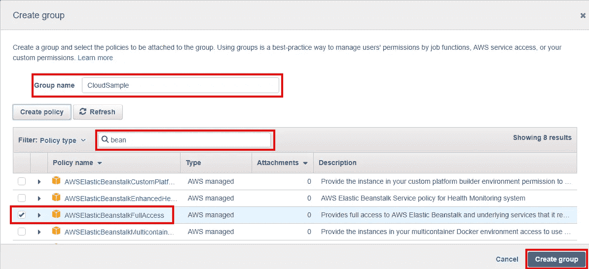

这将使您从上面返回到组页面。点击**下一步:查看**按钮继续。下一页只是对前几页所选选项的回顾。点击**创建用户**按钮继续。

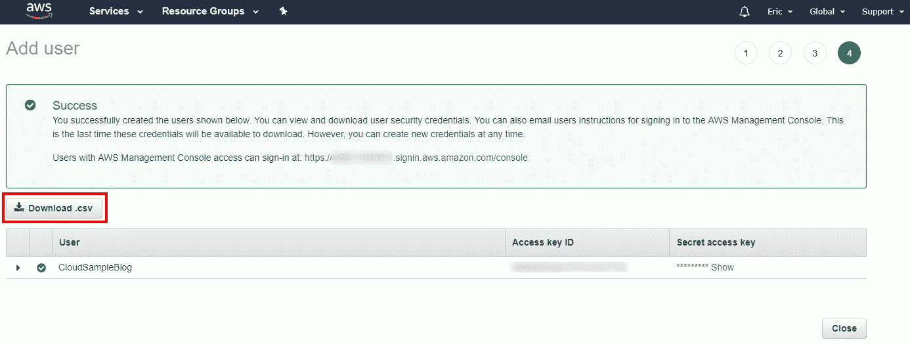

最后一页有一个按钮**下载。csv** ，点击它，下载文件。回到 Visual Studio 的 AWS 入门页面，点击**从 csv 文件导入**。

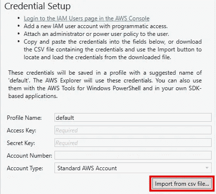

浏览并选择上面的 csv 下载。然后点击 AWS 入门页面上的**保存并关闭**按钮。完成后，您应该会看到 **AWS 浏览器**窗口。

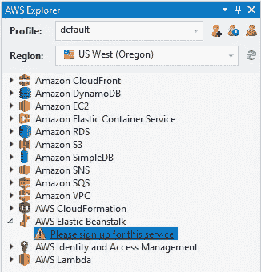

注册 AWS 弹性豆茎

如果你注意到 AWS 浏览器截图上面的**，请在 AWS Elastic Beanstalk 下注册这项服务**。双击**请注册此服务**将打开一个新的浏览器窗口。在此窗口中，点击**AWS 弹性豆茎入门**按钮。


下一页将提示输入付款信息。输入您的信息后，点击**安全提交**按钮。下一步是一个自动电话，以验证你是谁，你说你是谁。注册的最后一步是选择您的计划。


选择**免费**计划，完成注册。

从 Visual Studio 发布

现在注册完成了，希望回到 Visual Studio 并打开您想要发布的解决方案。在 Solution Explorer 窗口中右键点击项目，然后点击**发布到 AWS 弹性豆茎**。

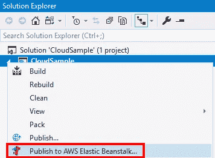

这将打开**发布到亚马逊网络服务**对话框。我只是采用默认值，因为这是一个新的应用程序，我没有任何现有的环境。点击**下一个**按钮继续。

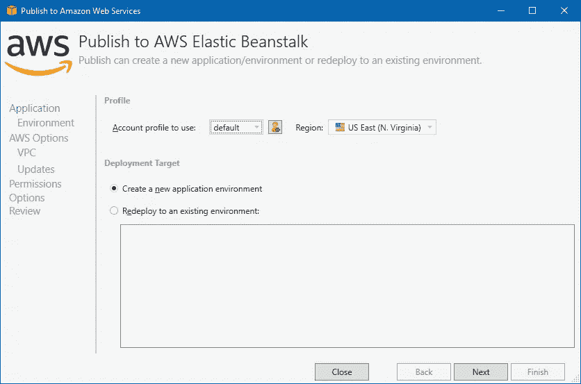

在下一个屏幕上，需要一个**应用名称**和**环境名称**。填写它们并点击下一个的**。**

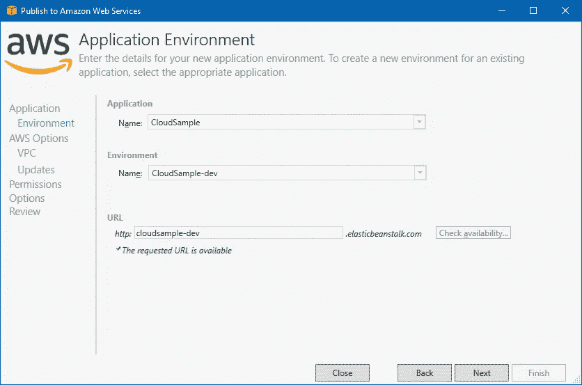

在下一个屏幕中，您可以配置支持您的应用程序的 EC2 实例的类型和大小。我使用了默认值。一如既往，准备好后点击**下一个**。

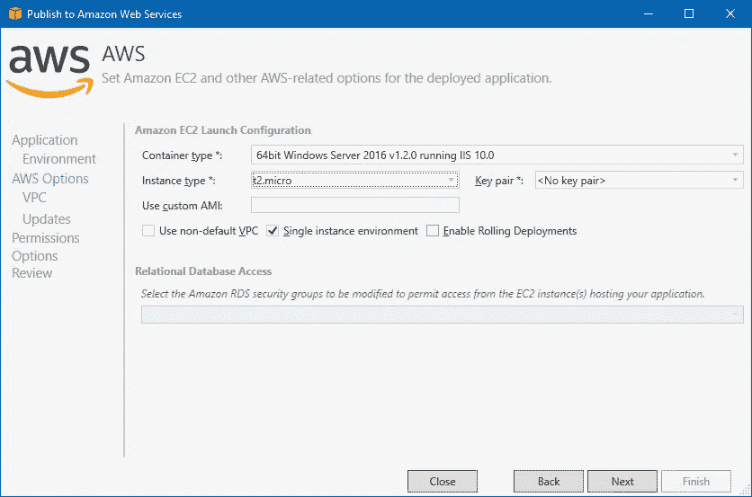

下一个屏幕允许您配置权限。你永远也猜不到，但我使用了默认设置，并点击了**下一步**。

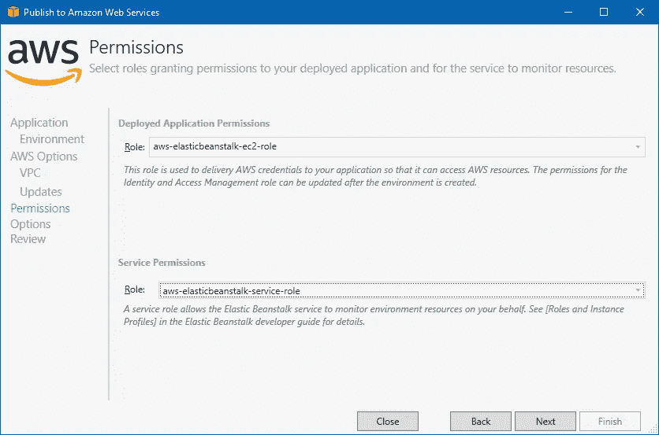

下一个屏幕允许您选择要使用的项目构建配置和框架。默认值是根据您的项目设置的，所以它们应该是正确的。点击**完成**按钮。

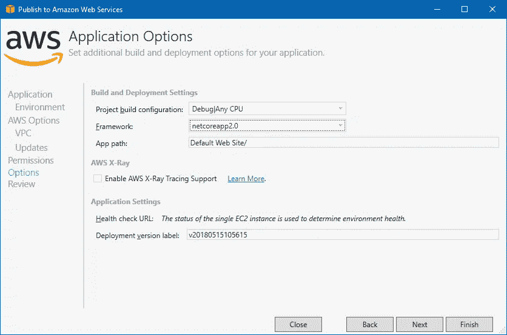

最后一个屏幕是查看所有选项。如果你对一切都满意，点击**部署**按钮。

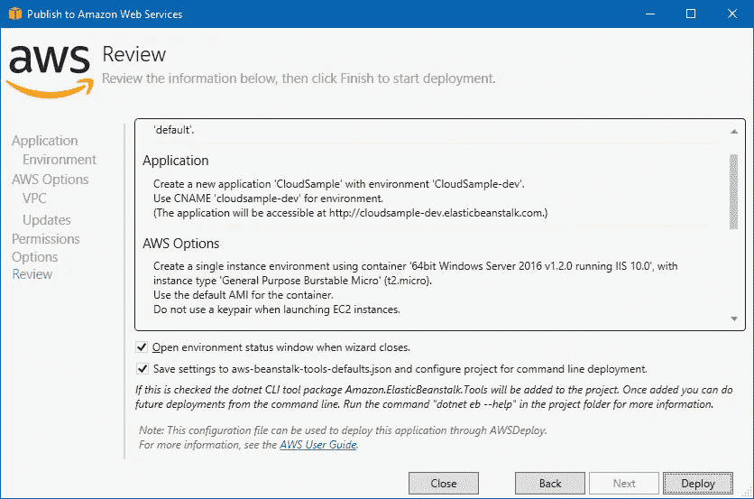

在部署过程中，我在输出窗口中看到以下错误。

> 设置角色时捕获到 amazonitymanagementserviceexception:用户:myUser/CloudSampleBlog 无权执行:iam:GetInstanceProfile on 资源:实例配置文件 AWS-elastic beanstalk-ec2-role
> 设置服务角色时捕获到异常:用户:myUser/CloudSampleBlog 无权执行:iam:PutRolePolicy on 资源:role AWS-elastic beanstalk-service-role

这被证明不是一个真正的问题。我来到我的[Elastic Beanstalk Dashboard](https://console.aws.amazon.com/elasticbeanstalk)那里，应用程序已经在部署过程中。整个过程耗时 5 分钟左右。与谷歌不同，我不得不在仪表板中找到 URL，而不是浏览器自动打开该 URL。

包扎

AWS 的初始设置比 Google 复杂得多。重新部署在两分钟内完成，这比我在谷歌上看到的要快得多。总体看来，Elastic Beanstalk 与 Google 的应用引擎不相上下。

当您完成时，不要忘记关闭和/或删除您的测试项目，以确保您不会被收费。

*原载于*[](https://elanderson.net/2018/06/deploying-an-asp-net-core-application-to-amazon-web-services/)**。**