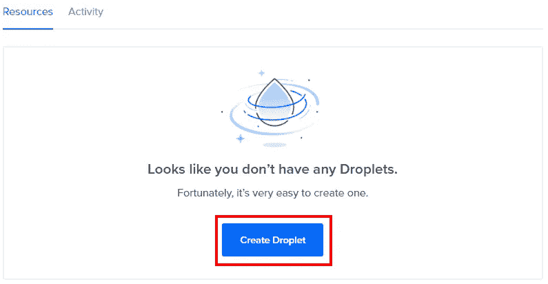
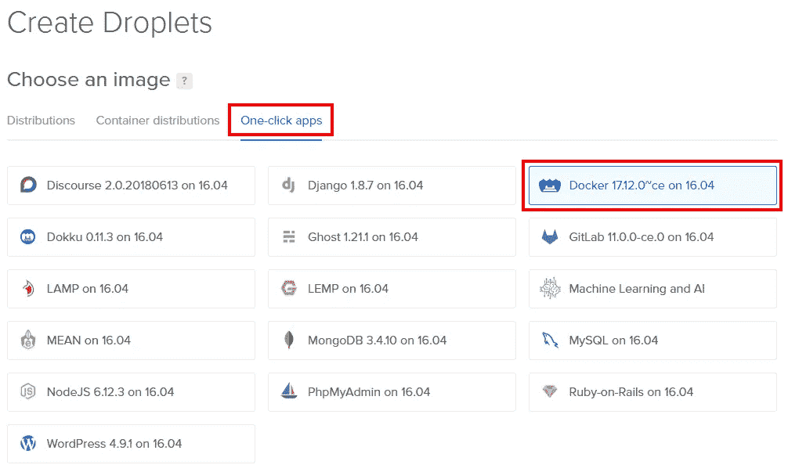
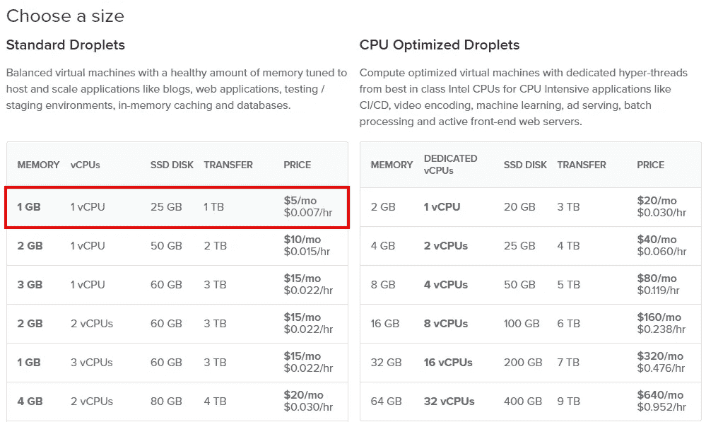
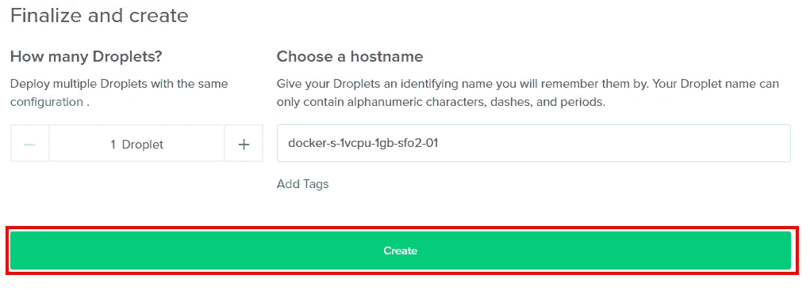
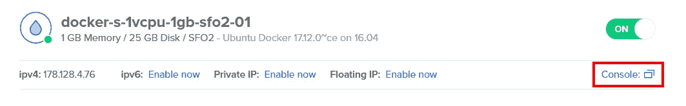
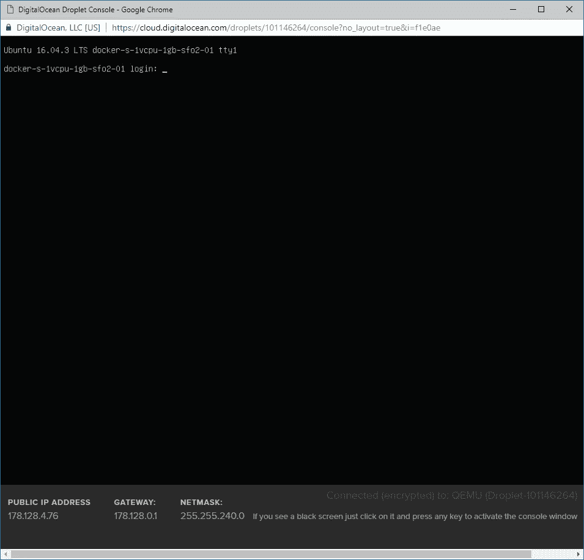

# 向数字海洋部署 ASP.NET 核心应用程序

> 原文：<https://itnext.io/deploying-an-asp-net-core-application-to-digitalocean-a67ff4073dc8?source=collection_archive---------1----------------------->

这是关于部署一个非常简单的 ASP.NET 核心应用程序的系列文章的第四篇。这篇文章将涉及到[数字海洋](https://www.digitalocean.com/)的设置和部署。

[谷歌云平台](https://elanderson.net/2018/06/deploying-an-asp-net-core-application-to-google-cloud-platform/)
[亚马逊网络服务](https://elanderson.net/2018/06/deploying-an-asp-net-core-application-to-amazon-web-services/)
[微软 Azure](https://elanderson.net/2018/07/deploying-an-asp-net-core-application-to-microsoft-azure/)
[数字海洋](https://elanderson.net/2018/08/deploying-an-asp-net-core-application-to-digitalocean/)(本帖)

## 示例应用程序

示例应用程序最终成为了它自己的博客文章，因为它看起来是最容易部署到 DigitalOcean 的。NET 将使用 Docker。查看我的[将 Docker 添加到 ASP.NET 核心应用程序](https://elanderson.net/2018/08/adding-docker-to-an-asp-net-core-application/)的帖子，用 Docker 设置您的应用程序并发布到注册表。

## 数字海洋

前往 [DigitalOcean](https://m.do.co/c/045d3cedaabc) 注册一个账户。使用该链接将获得 10 美元的免费信用(如果你花费 25 美元或更多，我也会获得一些信用，但主要是让你开始使用一些信用)。

作为注册过程的一部分，您必须输入一张信用卡。只要你不超过你的免费额度，它就不会被收费。

完成注册过程后，您将被放在您帐户的控制面板上。点击**创建 Droplet** 按钮开始。



在下一页选择**一键应用**，然后选择 **Docker** 选项。



向下滚动并选择你的水滴大小。由于这是一个基本的例子，永远不会有任何真正的流量，我去了最便宜的选择是每月 5 美元。



有很多选项，但有了上面的两个选项，我们可以采用默认值，这是本示例中的其余选项。向下滚动并点击**创建**按钮。



这将使您返回到您的仪表板，并且您将列出您的新 Droplet。点击水滴的名称以获得其详细信息。


这个页面上有很多信息，但是我们感兴趣的是摘要右上角的**控制台**链接。



应该会打开一个新的浏览器窗口，其中包含一个在您的 Droplet 上运行的控制台。



如果你像我一样，在创建 Droplet 时使用了默认设置，那么你将会收到一封来自 DigitalOcean 的电子邮件，其中包含你可以用来登录的用户名和密码。您将被迫在首次登录时更改密码。

## 安装示例应用程序

现在我们的 Droplet 启动了，我们也登录了，是时候启动并运行我们的应用程序了。所有这部分都将在 Droplet 的控制台中发生。首先，使用下面的命令登录 Docker。

```
docker login
```

接下来，我们需要为我们的应用程序提取图像(您的图像名称会有所不同)。

```
docker pull elanderson/testrepository
```

然后，可以使用下面的命令来运行应用程序。命令中的-p 80:80 将容器中的端口 80 绑定到主机上的端口 80。如果您对所有内容都采用默认值，这将很好地为您工作，但是如果没有，您将调整命令的这一部分。

```
docker run -p 80:80 elanderson/testrepository
```

## 包扎

有一些细节需要解决，但在克服这些驼峰后，Docker 是惊人的。这篇文章是关于 DigitalOcean 的，但是我可以把这篇文章中使用的图像部署到任何支持 ASP.NET 核心和 Docker 的 Linux 图像上。希望我能很快找到一个借口和 Docker 一起玩。

*原载于*[](https://elanderson.net/2018/08/deploying-an-asp-net-core-application-to-digitalocean/)**。**