# 将 ASP.NET 核心应用部署到谷歌云平台

> 原文：<https://itnext.io/deploying-an-asp-net-core-application-to-google-cloud-platform-eff455ad4161?source=collection_archive---------3----------------------->

这是关于从谷歌的云开始向主要云提供商部署一个非常简单的 ASP.NET 核心应用程序的系列文章的第一篇。这个系列的灵感来自于我的一个同事提出的一个关于。NET 之间的云提供商。

系列其他帖子:
[谷歌云平台](https://elanderson.net/2018/06/deploying-an-asp-net-core-application-to-google-cloud-platform/)(本帖)
[亚马逊网络服务](https://elanderson.net/2018/06/deploying-an-asp-net-core-application-to-amazon-web-services/)
[微软 Azure](https://elanderson.net/2018/07/deploying-an-asp-net-core-application-to-microsoft-azure/)

## 示例应用程序

我们将要部署的示例应用程序是使用。NET CLI。以下命令是我用来创建应用程序、创建解决方案以及将项目添加到解决方案中的命令。我在 CloudSample 目录中运行了所有这些命令。

```
dotnet new razor
dotnet new sln
dotnet sln add CloudSample.csproj
```

## 谷歌云平台

这篇文章的其余部分将基于来自谷歌的信息，可以在这里找到。

Google Cloud SDK 安装

第一步是下载并安装 Google Cloud SDK，可以在[这里](https://cloud.google.com/sdk/docs/)找到。我正在为 Windows 完成这些步骤，但是前面的链接也有针对 Linux 和 Mac 的说明。

下载并运行安装程序后，请耐心等待，它需要一段时间才能运行。完成后，您应该会看到以下屏幕。

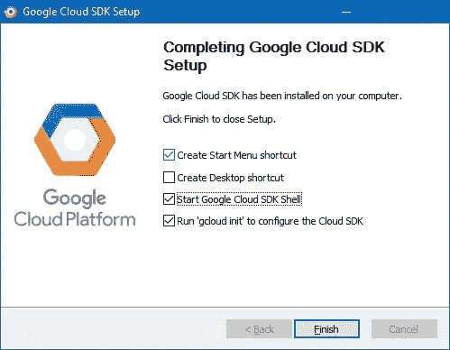

确保底部的两个框处于选中状态，因为 gcloud init 必须完成才能正常工作。单击 Finish 按钮，将会打开一个控制台，引导您完成初始化过程。

该过程的第一步将打开一个网络浏览器，并要求您登录到您的谷歌帐户。登录后，您将被要求使用一个云项目。它应该看起来像下面这样。

```
You are logged in as: [your account].

Pick cloud project to use:
 [1] api-project-276206909805
 [2] blogbackup-141901
 [3] oval-botany-94217
 [4] Create a new project
Please enter numeric choice or text value (must exactly match list
item):
```

我们希望选择创建一个新项目，在我的例子中是选项 4。当提示输入项目 ID 时，我只是按了 enter 键，它让我退出了这个过程，所以我不认为在这一点上实际上需要一个项目，所以这有点令人困惑。

用于 Visual Studio 安装的 Google 云工具

Google 提供了一个 Visual Studio 扩展，使得在 Visual Studio 中与他们的平台交互更加简单。要安装，请打开工具>扩展和更新菜单。在左边选择在线，然后搜索谷歌。接下来，选择 Google Cloud Tools for Visual Studio。

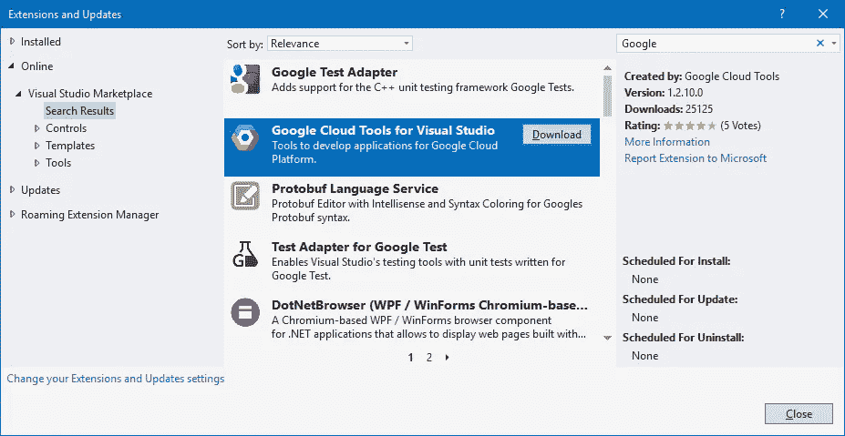

单击下载，关闭 Visual Studio 以触发安装，然后重新启动 Visual Studio。既然已经安装了扩展，我们需要将它连接到一个帐户。使用工具> Google Cloud 工具>管理帐户菜单启动管理帐户对话框。接下来单击添加帐户。

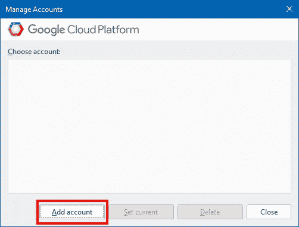

这将启动一个 web 浏览器，您需要在其中完成帐户添加。帐户认证完成后，Visual Studio 应该会显示您选择的帐户登录的 Google Cloud Explorer 窗口。

创建应用程序引擎项目

打开[应用引擎](https://console.cloud.google.com/projectselector/appengine/create)，点击创建。

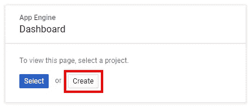

在下一页，您需要为项目命名，然后单击 Create。

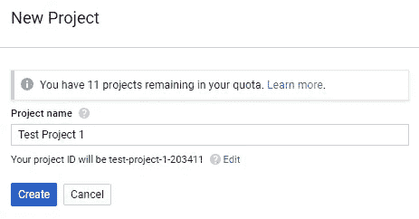

在下一页选择。NET 作为你的语言。

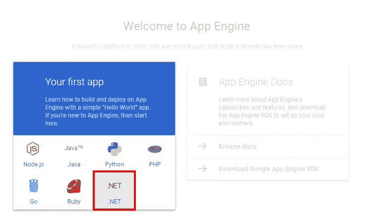

并选择希望应用程序驻留的位置，然后单击 next。

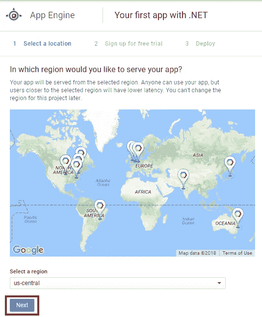

如果你还没有注册，下一步是用价值 300 美元的信用为你注册 12 个月的试用期。单击注册免费试用按钮继续。

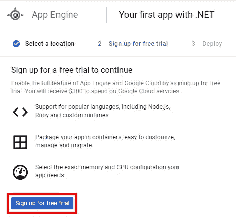

在下一个屏幕上，对于试用，您必须选择您的国家以及同意条款。

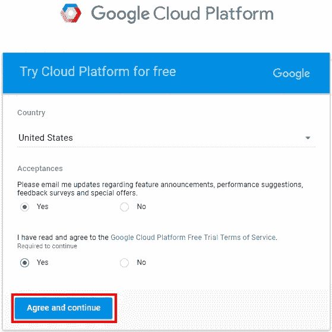

下一个屏幕是您帐户的摘要。查看信息并点击**开始我的免费试用**按钮继续。

从 Visual Studio 部署

在 Visual Studio 的 Google Cloud Explorer 窗口中，选择您刚刚在下拉列表中创建的项目。

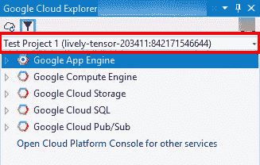

如果您没有看到您的新项目，请尝试单击窗口左上角的刷新按钮。现在您已经选择了正确的项目，切换到解决方案浏览器窗口，右键单击您的项目并选择 Publish to Google Cloud。

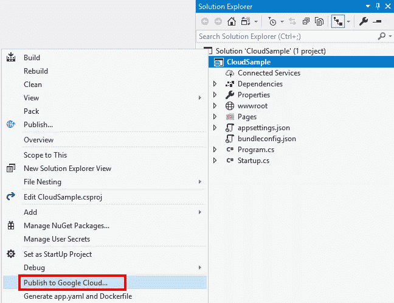

在下一个屏幕上，选择 App Engine Flex。

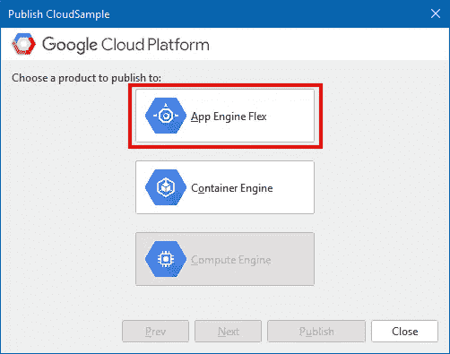

然后在下一个屏幕上点击发布。

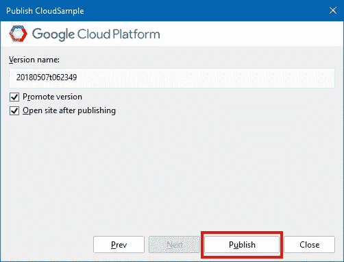

我的第一次部署花了很长时间，所以如果你要等一会儿(5 到 10 分钟)，也不用担心。我尝试了第二次部署，花了同样长的时间，所以我想这就是需要的时间。部署完成后，它应该会在 web 浏览器中打开您的站点。

## 包扎

在最初的安装和设置之后，带有 ASP.NET 核心的谷歌云非常简单。部署时间似乎太长了，但这是我唯一的抱怨。

完成后，不要忘记关闭和/或删除您的测试项目，以确保它不会耗尽您的学分。

*原载于*[](https://elanderson.net/2018/06/deploying-an-asp-net-core-application-to-google-cloud-platform/)**。**