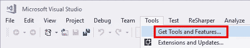
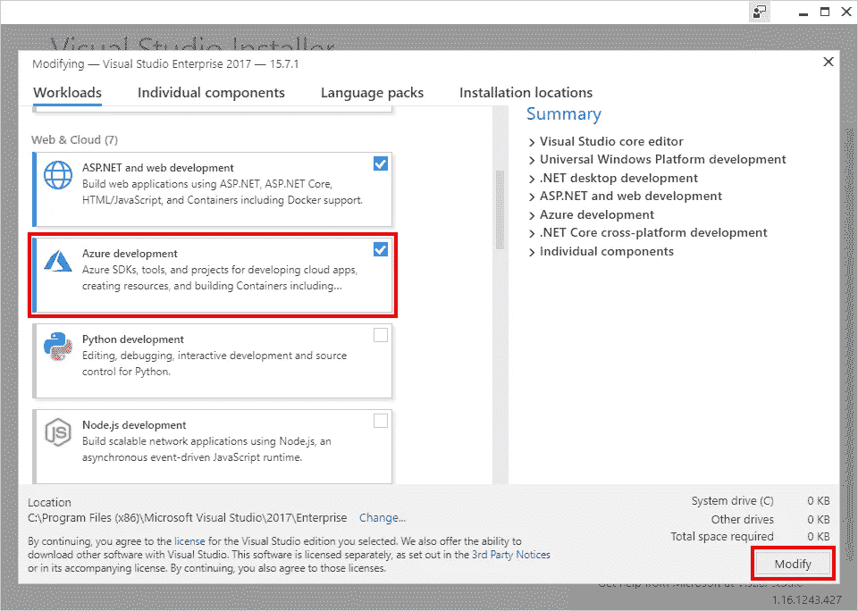
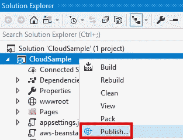
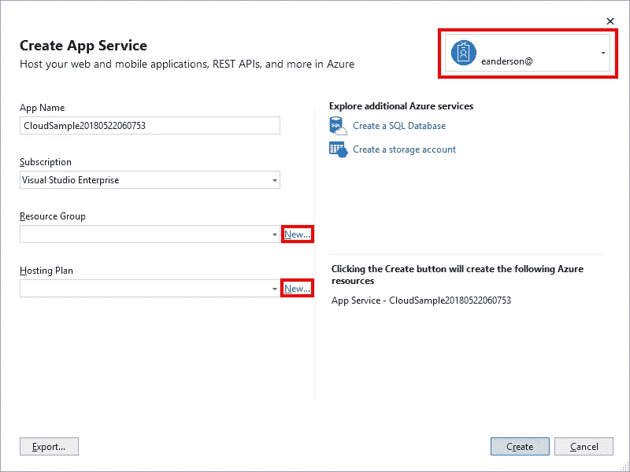
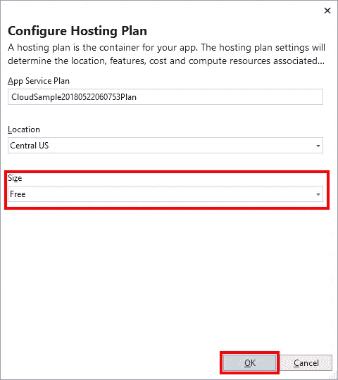

# 将 ASP.NET 核心应用程序部署到 Microsoft Azure

> 原文：<https://itnext.io/deploying-an-asp-net-core-application-to-microsoft-azure-a3a1481fba78?source=collection_archive---------3----------------------->

这是关于将一个非常简单的 ASP.NET 核心应用程序部署到主要云提供商的系列文章的第三篇。这篇文章将讨论微软 Azure 的设置和部署。

以下是这个系列的其他帖子。

[谷歌云平台](https://elanderson.net/2018/06/deploying-an-asp-net-core-application-to-google-cloud-platform/)
[亚马逊网络服务](https://elanderson.net/2018/06/deploying-an-asp-net-core-application-to-amazon-web-services/)
[微软 Azure](https://elanderson.net/2018/07/deploying-an-asp-net-core-application-to-microsoft-azure/) (本帖)

## 示例应用程序

这与该系列的第一篇文章相同，但我把它包括在内，以防你错过了那篇文章。我们将要部署的示例应用程序是使用。NET CLI。以下命令是我用来创建应用程序、创建解决方案以及将项目添加到解决方案中的命令。我在 CloudSample 目录中运行了所有这些命令。

```
dotnet new razor
dotnet new sln
dotnet sln add CloudSample.csproj
```

## 微软 Azure

这篇文章的其余部分将基于官方的[在 Azure](https://docs.microsoft.com/en-us/azure/app-service/app-service-web-get-started-dotnet) 文档中创建一个 ASP.NET 核心 web 应用。我已经安装了所有与 Azure 相关的东西，并且以前用过，所以我会更容易错过一个步骤。如果发生这种情况，请留下评论，我会得到修复后。

面向 Visual Studio 的 Azure 开发

从 Visual Studio 使用 Azure 所需的附加工具是 Visual Studio 安装程序的一部分。我假设已经安装了 Visual Studio。要添加 Azure，请选择**工具>获取工具和功能**菜单。



安装程序启动后，关闭 Visual Studio 的所有实例。从功能列表中选择 **Azure development** 并点击**修改**按钮开始安装。



注册 Azure

如果你还没有帐户，在工具安装的时候是注册 Azure 的好时机。可以在这里报名[。当你已经有一个帐户时，这是其中一个不太好用的部分，但是上面的链接应该可以引导你完成这个过程。](https://azure.microsoft.com/free/)

应用程序发布

希望回到 Visual Studio 并打开要发布的解决方案。在解决方案浏览器窗口中，右键单击项目并选择**发布**菜单选项。



这将显示“发布目标”对话框，您可以在其中选择要发布到的内容。在本例中，我们将发布到一个**应用服务**。细节区选择**创建新的**选项。然后点击**发布**按钮进入下一屏


下一步是收集创建应用服务所需的信息。首先要设置的是屏幕右上角的账户。这可能已经根据您登录 Visual Studio 的方式进行了设置。接下来，单击**资源组**旁边的**新**链接，并输入您想要使用的名称。然后点击**托管计划**旁边的**新建**链接。



在托管计划对话框中，您可以选择为计划命名，选择托管位置和大小。对于**尺寸**，我建议从**自由**选项开始。设置好所有选项后，点击**确定**。



这将使您返回到**创建应用服务**对话框，在这里您可以单击**创建**按钮来部署应用。部署完成后，站点将在您的默认浏览器中打开。

## 包扎

对我来说，从 Visual Studio 使用 Azure 是我迄今为止尝试过的所有云提供商中最简单的体验。我认为这并不奇怪，因为微软控制着这两款产品。忘记了与 Visual Studio 的集成似乎 Azure App Services、Google App Engine、Amazon Elastic Beanstalk 都不相上下。

像往常一样，不要让 get 关闭/删除测试项目的相关资源，以避免更改。

*原载于* [*埃里克·安德森*](https://elanderson.net/2018/07/deploying-an-asp-net-core-application-to-microsoft-azure/) *。*