# 将 ExpressJS(节点)web 应用程序部署到 Heroku

> 原文：<https://itnext.io/deploying-an-expressjs-node-web-application-to-heroku-c0f36e5671fd?source=collection_archive---------2----------------------->

## Heroku PaaS

## 在本课中，我们将使用 ExpressJs 创建一个示例图像处理 web 应用程序，并将其托管在 Heroku 上。


(来源:【unsplash.com】**)**

**[**Heroku**](https://heroku.com/) 是 PaaS ( *平台即服务*)提供商。使用 Heroku，我们可以在几秒钟内在云上部署应用程序。支持 Java、Node.js、Python、PHP、Go 等多种编程语言。**

**Heroku 与 AWS、Google Cloud 或 Azure 等其他平台的不同之处在于将应用程序部署到云的便利性。尽管 Heroku 提供了企业级特性，但它是快速部署和测试应用程序的最简单的平台之一。**

**例如，如果您想要部署名为`my-project`的开源项目的文档(*作为网站*)，您可以简单地创建一个 Heroku 应用程序，将存储库代码推送到 Heroku，您的应用程序将在`[http://my-project.herokuapp.com](http://my-project.herokuapp.com.)`部署。就这么简单。**

**最棒的是，你可以在有一些限制的情况下免费将应用程序部署到 Heroku **。这些限制将应用于应用程序的正常运行时间、它接收的流量、分配给每个应用程序的内存以及其他次要的事情。要了解更多有关这些限制的信息，请阅读本** 文档。或者你可以获得一份 [**保费计划**](https://www.heroku.com/pricing) 。**

## **Heroku 是如何工作的？**

**Heroku 是一个基于容器的平台。每个 Heroku 应用程序都将被部署为一个容器，您可以在每个应用程序中使用多个这样的容器来扩展您的应用程序。尽管 Heroku 提供 Docker 集成，但 Heroku 默认使用 **Dynos** 来运行应用程序。**

**一个 [**dyno**](https://www.heroku.com/dynos) 是一个隔离的、虚拟化的 [Linux 容器](https://www.redhat.com/en/topics/containers/whats-a-linux-container)运行你的应用程序代码。这个 dyno 就像一个虚拟机，具有运行我们的应用程序所需的依赖关系。例如，如果我们的源代码包含一个`package.json`，那么 Heroku 用 Node.js 安装创建一个 dyno。**

**Heroku 为语言特性和工具使用了一个**构建包**。构建包为构建和运行我们的应用程序提供了必要的依赖。对于 Node.js 应用程序，Heroku 使用了`heroku/nodejs`构建包。有关该主题的更多信息，请阅读 [**该**](https://devcenter.heroku.com/articles/buildpacks) 文档。**

> ***💡*如果你想运行一个用 Heroku 不支持的语言编写的应用，那么你可以使用一个[第三方构建包](https://devcenter.heroku.com/articles/buildpacks#using-a-third-party-buildpack)。如果您的应用程序需要多个 buildpacks(对于一个用多种编程语言编写的应用程序)，请遵循 [**这个**](https://devcenter.heroku.com/articles/using-multiple-buildpacks-for-an-app) 文档。**

**一个 **web dyno** 是一个运行你的 web 应用并接收流量的 dyno。在这个 dyno 中，我们可以运行一个 HTTP 服务器，比如 Express application，来接收请求和提供 web 内容。worker dyno 是一个在后台运行的容器，它对于运行后台任务很有用。要了解更多 Heroku 支持的 dyno 类型，请阅读本 文档。**

**一个 Heroku 应用程序包含了我们想要在 web dyno 中运行的应用程序的源代码。当我们第一次创建应用程序时，Heroku 只获得 dyno 的源代码和配置。我们需要通过缩放 **web dyno** 的数量来手动缩放应用程序。默认情况下，这个数字是`1`和自由层帐户给我们一个最大的`1`网页动态。**

**尽管这些信息听起来让人不知所措，但我们真的不需要每天都处理这些信息。Heroku 提供了一个 CLI ( **命令行界面**)来轻松创建、测试、部署和扩展应用程序。**

# **创建 Heroku 应用程序**

**首先，我们需要一个 Heroku 账户。要创建免费帐户，请使用`[signup.heroku.com](https://signup.heroku.com/)` URL 并填写必要的详细信息。请确保使用有效的电子邮件地址作为您的用户名。如果您已经有一个帐户，那么您可以使用`[id.heroku.com/login](https://id.heroku.com/login)` URL 登录仪表板。**

**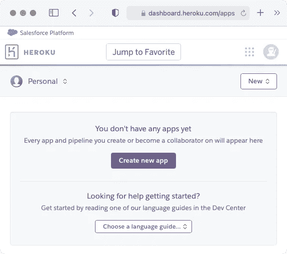**

**([https://dashboard.heroku.com/apps](https://dashboard.heroku.com/apps))**

**登录后，您将被重定向到仪表板页面。这是您将看到 Heroku 应用程序的地方。你可以点击`Create new app`按钮来创建一个新的 Heroku 应用程序并连接到 GitHub 库，但是我们将遵循另一种部署 Heroku 应用程序的方法。**

## **应用程序结构**

**我们将使用 Node 构建一个简单的图像大小调整应用程序。对于图像大小调整，我们可以使用`[sharp](https://sharp.pixelplumbing.com/)`包。我们将创建一个 [**Express**](http://expressjs.com/) 服务器，它接受`/resize`端点上的请求并返回一个调整过大小的测试 PNG 图像。默认的`/`端点返回`index.html`，它包含一些关于`/resize`端点使用的信息。**

**让我们创建一个名为`heroku-image-resize`的项目目录，并运行`$ npm ini -y`命令来初始化`package.json`文件。然后我们需要安装用于调整图像大小的`[sharp](https://github.com/lovell/sharp)`包和`[express](https://www.npmjs.com/package/express)`包。**

```
$ npm install --save sharp express
```

**一旦安装了上述依赖项，我们就可以在 Express HTTP 服务器上工作了。让我们在项目中创建`server.js`文件，并编写一个逻辑来处理`/`和`/resize`端点。对于测试图像，我使用的是 [**Lenna**](https://en.wikipedia.org/wiki/Lenna#/media/File:Lenna_(test_image).png) 。让我们下载这个图像，并在我们的项目中将其保存为`lenna.png`。**

```
**heroku-image-resize/**
├── .gitignore
├── LICENSE
├── README.md
├── lenna.png
├── package-lock.json
├── package.json
├── Procfile
├── server.js
└── www
   ├── index.html
   ├── main.js
   └── style.css
```

> ***💡*你可以在 [**这个**](https://github.com/course-one/heroku-image-resize) GitHub 仓库里找到上面的文件。**

**我稍后会谈到`Procfile`文件，因为它是 Heroku 使用的。`www`目录包含我们的 web 应用程序的资产，尽管现在您可以忽略`main.js`和`style.css`中的内容。`index.html`从``元素内的`/resize`端点呈现样本图像。**

**(server . js/source:[gist.github.com](https://gist.github.com/thatisuday/005c495b65489c6edbcdc9812a068353))**

**在上面的`server.js`文件中，我们在`/`端点上发送`index.html`文件，而`/www`端点从`www/`目录发送资产，如`style.css`和`main.js`。`/resize`端点接收`:size`参数，该参数为要调整大小的图像提供尺寸。**

**HTTP 服务器在端口`80`上启动，除非通过`PORT`环境变量提供端口。这是必要的，因为 Heroku 为应用程序提供了一个端口，它将在这个端口上通过`PORT`环境变量接收 web 流量。让我们通过运行`$ node server.js`命令来启动这个服务器，这个命令将为端口`80`上的应用程序提供服务。**

**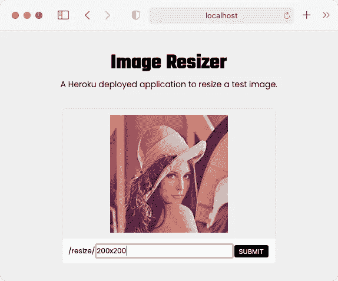**

**( [http://localhost](http://localhost) )**

**一旦服务器启动并运行，您就可以在浏览器中访问`[http://localhost](http://localhost)` URL。这将获取并呈现`index.html`,它显示一个调整过大小的图像和一个提供图像大小的输入。当我们点击`SUBMIT`按钮时，`main.js`内部的一个函数用`/resize/200x200`值( *URL* )替换``元素的`src`属性。**

## **创建和部署 Heroku 应用程序**

**首先，我们需要安装 Heroku CLI。要安装此 CLI，您可以按照这些和说明进行操作。如果您使用的是 macOS，那么您可以使用`$ brew install heroku/brew/heroku`命令来安装它。**

**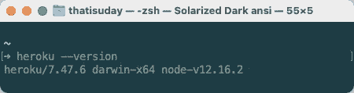**

**$ heroku -版本**

**一旦安装了 CLI，您可以使用`$ heroku --version`命令来检查 Heroku CLI 版本。您还需要安装 [**Git**](https://git-scm.com/) ，因为 Heroku CLI 使用 Git 将应用程序代码推送到 Heroku 服务器。如果您的应用程序目录不是 Git 存储库，运行`$ git init`命令将您的项目转换成 Git 存储库。**

**首先，我们需要从终端登录 Heroku。因为我们正在创建和推送一个 Heroku 应用程序，Heroku 需要知道我们是谁。所以使用`$ heroku login`命令并提供您的凭证。**

**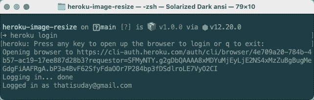**

**$ heroku 登录**

**该命令将打开一个浏览器窗口，您需要在其中提供您的 Heroku 帐户凭证。一旦您登录，终端将退出并打印您帐户的电子邮件地址。**

**要创建一个 Heroku 应用程序，我们需要从项目目录运行`$ heroku create`命令。但是这个命令创建了一个名为 Heroku 的项目，这个名字并不理想。要提供自定义应用程序名称，请使用以下命令。**

**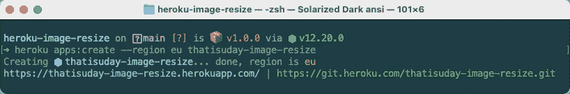**

**$ heroku 应用程序:创建**

**`$ heroku apps:create --region eu thatisuday-image-resize`命令创建一个名为`thatisuday-image-resize`的 Heroku 应用程序。它还生成一个 Git **remote** ( *它将被推送到那里*)和一个子域。**

> ***💡*`--region`标志设置应用部署的区域。你应该选择一个离你近的地区。要查找 Heroku 的区域，使用`$ heroku regions`命令。**

**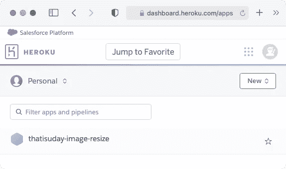**

**(Heroku 仪表板)**

**现在，如果您访问 Heroku 仪表板，您应该能够看到您的应用程序。然而，如果你访问`[https://thatisuday-image-resize.herokuapp.com](https://thatisuday-image-resize.herokuapp.com)`网址，你将看不到我们的应用程序，因为我们还没有将应用程序代码推送到`[https://git.heroku.com/thatisuday-image-resize.git](https://git.heroku.com/thatisuday-image-resize.git)`库。**

**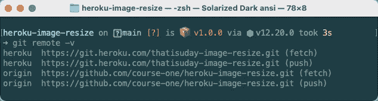**

**$ git remote -v**

**当我们创建一个 Heroku 应用程序时，Heroku 将`heroku` remote 添加到指向`https://git.heroku.com/<app-name>.git`的 Git 存储库中。因为我在做 GitHub 库，所以我也有一个`origin`遥控器。**

**如果您没有看到`heroku` remote，或者您想要将 Heroku 应用程序远程添加到您的本地存储库中，您可以使用`$ git remote [add](https://git-scm.com/docs/git-remote#Documentation/git-remote.txt-emaddem) heroku <app-remote-url>`命令。但是我推荐使用`$ heroku git:remote -a <app-name>`命令，它从应用程序名称解析远程 URL。你可以从 Heroku 仪表盘上得到`app-name`。**

**当我们部署应用程序时，Heroku 需要知道在 **web dyno** 中运行哪个命令。我们在 **Procfile** 中指定 web dyno ( *和其他 dyno*)的配置。`Procfile`是包含进程信息的文本文件( *dynos* )。它的简单形式如下所示。**

```
<process-name>: <command>
```

**对于我们的应用程序，我们希望在`web`进程中运行`node server.js`命令( *dyno* )来启动一个 web 服务器。因此，我们的`Procfile`如下所示。如果您需要关于`Procfile`的更多信息，请遵循 [**本**](https://devcenter.heroku.com/articles/procfile) 文档。**

```
web: node server.js
```

**当我们部署应用程序时，基于应用程序存储库中的`package.json`文件和 Heroku 使用的其他 buildpack 检测方法，Heroku 使用可用的 Node.js 的**最新**[**LTS**](https://nodejs.org/en/)**安装在 web dyno 中运行`node server.js`命令。****

**但是，我建议设置一个自定义版本的 Node.js 来运行应用程序。这样，如果我们的应用程序与 Node.js 的某个版本有不兼容问题，我们可以在本地机器上检测到它。要提供 Node.js 版本，请使用`package.json`文件的`engines`属性。**

```
{
  "name": "myapp",
  "engines": {
    "node": "**12.16.2**"
  }
}
```

**我在这个应用程序中使用 Node.js 版本`12.16.2`,因为它是我安装在本地机器上的版本。您也可以使用`12.x`值，在这种情况下 Heroku 将选择 Node.js 的最新次要版本。您还可以指定 **NPM** 或**纱**版本，如这里的[](https://devcenter.heroku.com/articles/nodejs-support#specifying-a-node-js-version)**所述。****

****在部署应用程序之前，我们想知道我们的本地 Heroku 设置是否正常。使用`$ heroku local <process>`命令，我们可以从`Procfile`本地启动一个进程。让我们通过运行`$ heroku local web`命令来启动`web`进程。****

****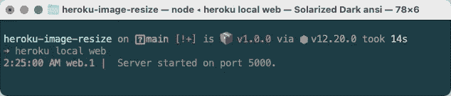****

****$ heroku 本地网站****

****这一次，我们没有运行`$ node server.js`命令来启动 web 服务器，而是让 Heroku 从`Procfile`运行`web`进程的命令。现在，如果您在浏览器中打开`[http://localhost:5000](http://localhost:5000)` URL，您应该能够看到应用程序正在那里运行。端口`5000`由 Heroku 选择，它将通过`PORT`环境变量提供该端口，我们在`server.js`中使用的环境变量是可用的。****

****现在我们的应用程序运行良好，Heroku 的设置也完成了，是时候发布应用程序了。如你所知，**我们已经发布了申请**。我们需要做的是将应用程序代码推送到应用程序的 Git 存储库。因此，让我们创建一个提交，并将这些提交推送到`heroku`遥控器。****

> *****💡*确保您已经将`node_modules`添加到`.gitignore`中。您应该避免将应用程序不需要的任何文件推送到应用程序存储库。heroku/nodejs buildpack 通过自动运行`$ npm install -y`命令安装 NPM 模块。****

****(来源:[**gist.github.com**](https://gist.github.com/thatisuday/5a78a93904d5e4f592ba247b612583d8))****

****我们应该使用`heroku`遥控器的`main`或`master`分支来推送应用程序代码(*提交*)。当 Heroku 接收到这些提交(运行 `*$ git push heroku main*` *命令*后的*)时，它识别应用类型( *buildpack* )。可以看到上面日志中的`Node.js app detected`行。*****

****然后 Heroku 安装 Node.js 和 NPM ( *或 Yarn*)(`*package.json*`中定义的版本的*)并安装`package.json`中提到的所有依赖项。一旦安装了这些依赖项，它会将所有内容压缩到一个 [**slug**](https://devcenter.heroku.com/articles/slug-compiler) 中，并将其部署到 web dyno 中。*****

> *****💡有时，Heroku [检测不到](https://devcenter.heroku.com/articles/buildpacks#detection-failure)build pack。在部署应用程序时，我们可以在终端中得到`failed to detect set buildpack heroku/nodejs`错误。要解决这个问题，您应该使用`$ heroku buildpacks:set heroku/nodejs`命令手动设置 buildpack，如这里的[](https://devcenter.heroku.com/articles/buildpacks#setting-a-buildpack-on-an-application)**所述。*******

******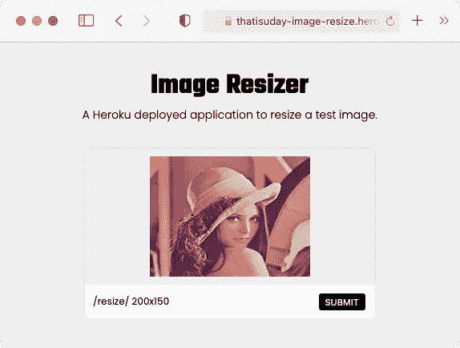******

******([https://thatisuday-image-resize.herokuapp.com](https://thatisuday-image-resize.herokuapp.com))******

******现在我们可以在浏览器中访问`[https://thatisuday-image-resize.herokuapp.com](https://thatisuday-image-resize.herokuapp.com)` URL。我们的应用程序现在运行在 Heroku cloud 上。要检查应用程序历史记录、活动或删除应用程序，请使用 Heroku 仪表板。但是，您可以在终端中使用`$ heroku ps`命令检查 Heroku 应用程序的状态。******

******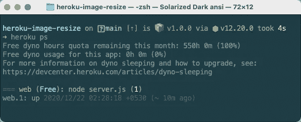******

******$ heroku ps******

******这个命令显示剩余的空闲配额以及 Heroku 应用程序的状态。如您所见，`web` dyno ( *进程*)已经启动并正在运行。如果一个免费的 dyno 在 30 分钟内没有收到流量，它将进入睡眠状态以保存资源，但是一旦收到请求，它将立即醒来。******

******对于免费层帐户，您不能扩展应用程序。这意味着您的应用程序只能在 1 dyno 上工作(*这还不错*)。但是，您可以缩小应用程序的规模。例如，您可以使用`$ heroku ps:scale <process>=<size>`命令将动态编号设置为`0`。******

******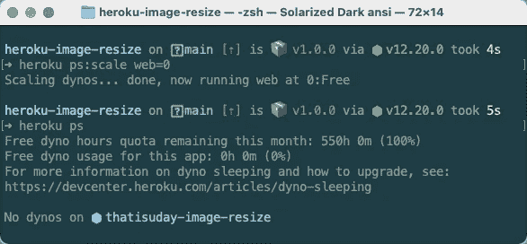******

******$ heroku ps:scale web=0******

******现在，如果您再次访问`[https://thatisuday-image-resize.herokuapp.com](https://thatisuday-image-resize.herokuapp.com)` URL，它将显示一条错误消息，因为我们的应用程序不再运行。为了再次放大 dynos，我们需要使用与 dyno size `1`相同的命令。******

************

## ******更新应用程序(重新部署)******

******当我们想要修改我们的应用程序并再次部署应用程序时，我们只需要创建一个 Git commit 并将其推送到`heroku` remote 的`main`分支。要了解更多关于使用 Git 部署的信息，请阅读本 文档。******

******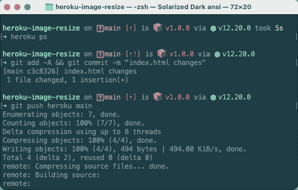******

******$ git push heroku main******

******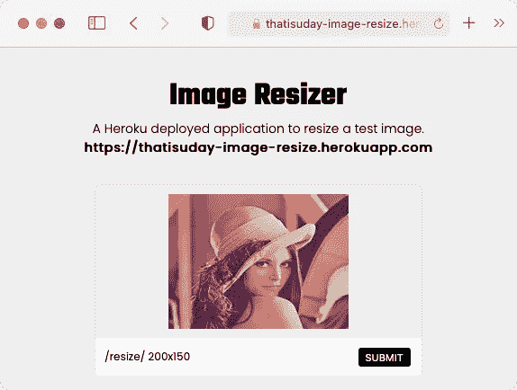******

******([https://thatisuday-image-resize.herokuapp.com](https://thatisuday-image-resize.herokuapp.com))******

************

******([**thatisuday.com**](http://thatisuday.com)/[/**GitHub**](https://github.com/thatisuday)/[**Twitter**](https://twitter.com/thatisuday)/**stack overflow****/[**insta gram**](https://www.instagram.com/thatisuday/))********