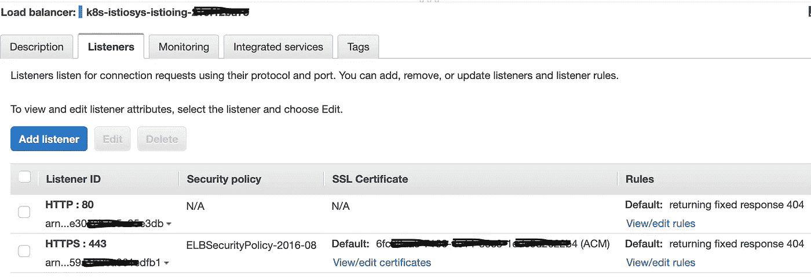

# 使用 AWS 负载平衡器控制器在 EKS 部署带 TLS 的 Istio 网关

> 原文：<https://itnext.io/deploying-an-istio-gateway-with-tls-in-eks-using-the-aws-load-balancer-controller-448812e081e5?source=collection_archive---------0----------------------->


图片来自 Pixabay 用户 publicdomainpictures-14

我使用 Linkerd 作为服务网格已经有一段时间了。一个新的需求是进行服务到服务的授权，这是可能的，但是对于 Linkerd 来说很麻烦。Istio 提供更容易的[集成](https://www.openpolicyagent.org/docs/latest/envoy-tutorial-istio/)与[开放策略代理](https://www.openpolicyagent.org/)和其他[外部授权系统](https://istio.io/latest/blog/2021/better-external-authz/)。但是这个帖子不是关于授权的。我想展示如何在运行 Kubernetes 1.21(也在 1.20 上测试)的 EKS 集群中使用 TLS 和 http-to-https 重定向来配置安全的 Istio 网关。

## 用 istioctl 安装 Istio

我按照推荐的安装方法在 Mac 上安装了`istioctl`:

```
$ curl -sL https://istio.io/downloadIstioctl | sh -
```

然后我[使用默认配置文件安装了 Istio](https://istio.io/latest/docs/setup/getting-started/) :

```
$ istioctl install
```

在撰写本文时，最新的 Istio 版本是`1.12.1`。

我确保`istiod`和`istio-ingressgateway`pod 在`istio-system`命名空间中运行:

```
$ kubectl get pods -n istio-systemNAME                                  READY   STATUS    RESTARTS   AGEistio-ingressgateway-8c48d875-h2cj9   1/1     Running   0          25histiod-58d79b7bff-gjbll               1/1     Running   0          27h
```

我用标签`istio-inject=enabled`标记了`default`名称空间，这样`istio-proxy`容器将作为 sidecar 自动注入到部署在该名称空间中的每个 pod 中:

```
$ kubectl label namespace default istio-inject=enabled
```

默认情况下，`istio-ingressgateway`服务的类型是`LoadBalancer`。在这种情况下，由于我正在运行 EKS，AWS 将为它创建一个网络负载平衡器。我试图让 TLS 与 NLB 合作，但没有成功。经过大量的搜索，似乎更好的方法是将`istio-ingressgateway`部署为`NodePort`服务，然后在它前面创建一个由 ALB 表示的`Ingress`(作为先决条件，这个解决方案需要安装 AWS 负载平衡器控制器)。所以…以下是实现这一目标的步骤。

## 安装 AWS 负载平衡器控制器

我跟踪了官方 AWS 文档。在下面的命令中，我的 EKS 集群名称是`us-east-1`区域中的`my-cluster`。

```
$ curl -o iam_policy.json [https://raw.githubusercontent.com/kubernetes-sigs/aws-load-balancer-controller/v2.3.1/docs/install/iam_policy.json](https://raw.githubusercontent.com/kubernetes-sigs/aws-load-balancer-controller/v2.3.1/docs/install/iam_policy.json)$ aws iam create-policy \ --policy-name AWSLoadBalancerControllerIAMPolicy \ --policy-document file://iam_policy.json$ eksctl utils associate-iam-oidc-provider --region=us-east-1 — cluster=my-cluster --approve$ eksctl create iamserviceaccount \ --cluster=my-cluster \ --region=us-east-1 \ --namespace=kube-system \ --name=aws-load-balancer-controller \ --attach-policy-arn=arn:aws:iam::MYAWSACCOUNTID:policy/AWSLoadBalancerControllerIAMPolicy \ --override-existing-serviceaccounts \ --approve$ curl -o iam_policy_v1_to_v2_additional.json [https://raw.githubusercontent.com/kubernetes-sigs/aws-load-balancer-controller/v2.3.1/docs/install/iam_policy_v1_to_v2_additional.json](https://raw.githubusercontent.com/kubernetes-sigs/aws-load-balancer-controller/v2.3.1/docs/install/iam_policy_v1_to_v2_additional.json)$ aws iam create-policy \ --policy-name AWSLoadBalancerControllerAdditionalIAMPolicy \ --policy-document file://iam_policy_v1_to_v2_additional.json$ aws iam attach-role-policy \ --role-name eksctl-addon-iamserviceaccount-kub-Role1–1WA99F4J8QYNU \ --policy-arn arn:aws:iam::MYAWSACCOUNTID:policy/AWSLoadBalancerControllerAdditionalIAMPolicy$ wget [https://github.com/jetstack/cert-manager/releases/download/v1.5.4/cert-manager.yaml](https://github.com/jetstack/cert-manager/releases/download/v1.5.4/cert-manager.yaml)$ kubectl apply \ --validate=false \ -f cert-manager.yaml$ curl -Lo v2_3_1_full.yaml [https://github.com/kubernetes-sigs/aws-load-balancer-controller/releases/download/v2.3.1/v2_3_1_full.yaml](https://github.com/kubernetes-sigs/aws-load-balancer-controller/releases/download/v2.3.1/v2_3_1_full.yaml)* Make the following edits to the v2_3_1_full.yaml file: * Delete the ServiceAccount section of the file. Deleting this section prevents the annotation with the IAM role from being overwritten when the controller is deployed and preserves the service account that you created in step 3 if you delete the controller. * Replace your-cluster-name in the Deployment spec section of the file with the name of your cluster.$ kubectl apply -f v2_3_1_full.yaml
```

此时，我验证了`aws-load-balancer-controller`部署是健康的，并且相应的 pod 正在运行:

```
$ kubectl get deployment -n kube-system aws-load-balancer-controller$ kubectl get pods -n kube-system
```

## 为 istio-Ingres gateway 配置服务和入口

我删除了由`istioctl`安装的`LoadBalancer`类型的`istio-ingressgateway`服务，并将其重新创建为`NodePort`类型。下面是我为它使用的清单(然后我通过`kubectl apply -f manifest-filename.yaml`应用了它):

```
apiVersion: v1kind: Service metadata: labels: app: istio-ingressgateway install.operator.istio.io/owning-resource: unknown install.operator.istio.io/owning-resource-namespace: istio-system istio: ingressgateway istio.io/rev: default operator.istio.io/component: IngressGateways operator.istio.io/managed: Reconcile operator.istio.io/version: 1.12.1 release: istio name: istio-ingressgateway namespace: istio-systemspec: externalTrafficPolicy: Cluster ipFamilies: - IPv4 ipFamilyPolicy: SingleStack ports: - name: status-port nodePort: 30276 port: 15021 protocol: TCP targetPort: 15021 - name: http2 nodePort: 32361 port: 80 protocol: TCP targetPort: 8080 - name: https nodePort: 30626 port: 443 protocol: TCP targetPort: 8443 selector: app: istio-ingressgateway istio: ingressgateway sessionAffinity: None type: NodePort
```

整个练习中最难的部分是为入口对象提供合适的咒语，这将导致在`istio-ingressgateway`服务前面创建一个 ALB。我发现[这篇文章](https://aws.amazon.com/blogs/containers/secure-end-to-end-traffic-on-amazon-eks-using-tls-certificate-in-acm-alb-and-istio/)非常有帮助，还有这篇 [StackOverflow 讨论](https://stackoverflow.com/questions/62407364/how-to-set-aws-alb-instead-of-elb-in-istio)。

这是我最后拿到的入口清单。我将这个文件命名为 istio- `ingressgateway-alb-ingress.yaml`:

```
apiVersion: networking.k8s.io/v1kind: Ingressmetadata: name: istio-ingressgateway-alb namespace: istio-system annotations: kubernetes.io/ingress.class: alb alb.ingress.kubernetes.io/scheme: internet-facing alb.ingress.kubernetes.io/target-type: instance alb.ingress.kubernetes.io/certificate-arn: ARN_FOR_ACM_CERT alb.ingress.kubernetes.io/backend-protocol: HTTPS alb.ingress.kubernetes.io/healthcheck-path: /healthz/ready alb.ingress.kubernetes.io/healthcheck-port: traffic-port alb.ingress.kubernetes.io/healthcheck-protocol: HTTP alb.ingress.kubernetes.io/listen-ports: '[{"HTTP": 80}, {"HTTPS":443}]' alb.ingress.kubernetes.io/actions.ssl-redirect: | { "Type": "redirect", "RedirectConfig": { "Protocol": "HTTPS", "Port": "443", "StatusCode": "HTTP_301" } }spec: rules: - http: paths: - backend: service: name: ssl-redirect port: name: use-annotation path: / pathType: Prefix - backend: service: name: istio-ingressgateway port: number: 15021 path: /healthz/ready pathType: Prefix - backend: service: name: istio-ingressgateway port: number: 443 path: / pathType: Prefix
```

几个注意事项:

*   我已经使用 AWS 证书管理器为`mydomain.com`和`*.mydomain.com`创建了一个 SSL 证书(我使用了 DNS 验证，这很简单，因为`mydomain.com`在 Route53 中管理)
*   我指定 ALB 为`internet-facing`。在这种情况下，为了使 AWS 负载均衡器控制器能够正确地将公共子网与 ALB 相关联，这些子网需要分别用名为`kubernetes.io/role/elb`和值为`1`的标签进行标记。相反，如果我想创建一个内部 ALB，那么注释`alb.ingress.kubernetes.io/scheme`将会是`internal`并且私有子网将会被标记上一个名为`kubernetes.io/role/internal-elb`和值为`1`的标签。

然后我通过以下方式创建了上面的入口:

```
$ kubectl apply -f istio-ingressgateway-alb-ingress.yaml
```

我验证了入口对象是正确创建的:

```
$ kubectl get ingress -n istio-systemNAME                       CLASS    HOSTS   ADDRESS                                                                  PORTS   AGEistio-ingressgateway-alb   <none>   *       k8s-istiosys-istioing-charstring1-charstring2.us-east-1.elb.amazonaws.com   80      22h
```

为了解决 ALB 创建错误，我检查了`kube-system`名称空间中`aws-load-balancer-controller` pod 的日志:

```
$ kubectl logs aws-load-balancer-controller-75d8b947c5-vdhdc -n kube-system
```

如果成功，这些日志会显示:

```
{"level":"info","ts":1642466289.4974704,"logger":"controllers.ingress","msg":"successfully deployed model","ingressGroup":"istio-system/istio-ingressgateway-alb"}
```

一个让我措手不及的奇怪行为是，这个 ALB 的端口 80 和 443 上的两个侦听器都显示为“Default:returning fixed response 404”:



我期望看到与 httpS 侦听器相关联的目标组，以及与 HTTP 侦听器相关联的从 HTTP 到 https 的重定向规则。但是我想 AWS 负载平衡器控制器这种方式有点古怪。无论如何，我浪费了大量的时间在 Istio 之外部署另一个示例应用程序,只是为了让自己相信当使用 ALB 类型的入口时，事情会像预期的那样工作。

此时，我已经准备好用一个示例应用程序测试 Istio 网关。我选择了一个被许多其他 Istio 例子使用的例子:`httpbin`。

## 创建 httpbin 部署、服务、Istio 网关和 Istio 虚拟服务

我使用这个清单为 httpbin 应用程序定义了 ServiceAccount、服务和部署:

```
$ cat httpbin.yamlapiVersion: v1kind: ServiceAccountmetadata: name: httpbin---apiVersion: v1kind: Servicemetadata: name: httpbin labels: app: httpbinspec: ports: - name: http port: 8000 targetPort: 80 selector: app: httpbin---apiVersion: apps/v1kind: Deploymentmetadata: name: httpbinspec: replicas: 1 selector: matchLabels: app: httpbin version: v1 template: metadata: labels: app: httpbin version: v1 spec: serviceAccountName: httpbin containers: - image: docker.io/asankov/httpbin:1.0 imagePullPolicy: IfNotPresent name: httpbin ports: - containerPort: 80
```

我没有指定名称空间，所以当我运行`kubectl apply -f httpbin.yaml`时，所有这些对象都是在`default`名称空间中创建的。

```
$ kubectl get servicesNAME         TYPE        CLUSTER-IP       EXTERNAL-IP   PORT(S)    AGEhttpbin      ClusterIP   172.20.165.191   <none>        8000/TCP   28hkubernetes   ClusterIP   172.20.0.1       <none>        443/TCP    12d$ kubectl get podsNAME                       READY   STATUS    RESTARTS   AGEhttpbin-5dd5c4dc87-4mqhx   2/2     Running   0          28h
```

注意`httpbin` pod 有 2 个容器。这是因为我用`istio-inject=enabled`标记了`default`名称空间，所以`istio-proxy`容器被自动作为 sidecar 注入到 pod 中。

在为 httpbin 服务创建 Istio 网关对象之前，我创建了一个自签名的 TLS 秘密:

```
$ mkdir -p .tls# Create a root certificate and private key to sign the certificates for our services$ openssl req -x509 -sha256 -nodes -days 365 -newkey rsa:2048 -subj '/O=My Company Inc./CN=mydomain.com' -keyout .tls/mydomain.com.key -out .tls/mydomain.com.crt# Create a certificate and a private key for httpbin.mydomain.com$ openssl req -out .tls/httpbin.mydomain.com.csr -newkey rsa:2048 -nodes -keyout .tls/httpbin.mydomain.com.key -subj "/CN=httpbin.mydomain.com/O=httpbin organization"$ openssl x509 -req -days 365 -CA .tls/mydomain.com.crt -CAkey .tls/mydomain.com.key -set_serial 0 -in .tls/httpbin.mydomain.com.csr -out .tls/httpbin.mydomain.com.crt# Create a secret for the istio ingress gateway$ kubectl create secret tls httpbin-tls \
  --key=.tls/httpbin.mydomain.com.key \
  --cert=.tls/httpbin.mydomain.com.crt
```

所有这些的最终结果是在名称空间`default`中创建了一个名为`httpbin-tls`的类型为`tls`的 Kubernetes secret，其中包含私钥和用于`httpbin.mydomain.com`的自签名证书。

我在 Istio 网关对象的定义中使用了这个秘密:

```
$ cat httpbin-gateway-tls.yamlapiVersion: networking.istio.io/v1alpha3kind: Gatewaymetadata: name: httpbin-gatewayspec: selector: istio: ingressgateway # use Istio default gateway implementation servers: - port: number: 80 name: http protocol: HTTP hosts: - "*" - port: number: 443 name: https protocol: HTTPS tls: mode: SIMPLE credentialName: httpbin-tls hosts: - "*"---apiVersion: networking.istio.io/v1alpha3kind: VirtualServicemetadata: name: httpbinspec: hosts: - "httpbin.mydomain.com" gateways: - httpbin-gateway http: - match: - uri: prefix: /status - uri: prefix: /delay route: - destination: port: number: 8000 host: httpbin
```

上面的清单定义了一个 [Istio 网关](https://istio.io/latest/docs/reference/config/networking/gateway/)对象和一个 [Istio 虚拟服务](https://istio.io/latest/docs/reference/config/networking/virtual-service/)对象。

`Gateway`对象的`selector`是`istio: ingressgateway`，这意味着它将使用我们在前面的步骤中在 ALB 入口后面创建的`istio-ingressgateway`服务。网关定义了两个“服务器”或监听器，公开端口 80 和 443。对于端口 443，网关也使用我们之前创建的 TLS 秘密`httpbin-tls`，因此它处理去往`httpbin`服务/pod 的流量的 TLS 终止(这由`tls mode SIMPLE`表示)。

`VirtualService`对象指定流量路由规则。它将上面定义的`httpbin-gateway`声明为其网关，并为主机`httpbin.mydomain.com`指定 HTTP URL 匹配规则。可以把它们看作 Apache VirtualHost 或 Nginx“服务器块”声明。

我通过以下方式创建了网关和虚拟服务:

```
$ kubectl apply -f httpbin-gateway-tls.yaml
```

然后我可以检查这两个物体:

```
$ kubectl describe gateway httpbin-gateway
$ kubectl describe virtualservice httpbin
```

最后，我为 httpbin.mydomain.com 创建了一个 DNS CNAME 记录，指向 ALB 的名称。我已经准备好测试了！

对 http URL 使用 curl 会导致指向 https URL 的 310 重定向响应，正如所料:

```
$ curl -Iv [http://httpbin.mydomain.com](http://httpbin.mydomain.com)* TCP_NODELAY set* Connected to httpbin.mydomain.com (IP address here) port 80 (#0)> HEAD / HTTP/1.1> Host: httpbin.mydomain.com> User-Agent: curl/7.64.1> Accept: */*>
< HTTP/1.1 301 Moved PermanentlyHTTP/1.1 301 Moved Permanently< Server: awselb/2.0**Server**: awselb/2.0< Date: Wed, 19 Jan 2022 00:05:01 GMT**Date**: Wed, 19 Jan 2022 00:05:01 GMT< Content-Type: text/html**Content-Type**: text/html< Content-Length: 134**Content-Length**: 134< Connection: keep-alive**Connection**: keep-alive< Location: https://httpbin.mydomain.com:443/**Location**: https://httpbin.mydomain.com:443/
```

对 https URL 使用 curl 对抗`/status/418`,也如预期的那样，导致了与 HTTP 代码 418 相关联的现在经典的“我是茶壶”响应:

```
$ curl https://httpbin.mydomain.com/status/418-=[ teapot ]=-_...._
.'  _ _ `.
| ."` ^ `". _,
\_;`"---"`|//
|       ;/
\_     _/
```

虽然这篇文章写得相当流畅，但它掩盖了谷歌搜索和发帖子的大量时间。总共大约 8 个小时。希望它能帮助到外面的人！我将重温 Istio 主题，写一些关于可观察性、认证和授权的帖子，敬请关注！