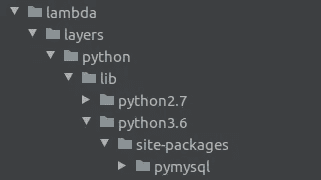

# 使用 CDK 部署带有 Lambda 层的 Lambda 函数

> 原文：<https://itnext.io/deploying-lambda-functions-with-layer-using-cdk-7634f806f92b?source=collection_archive---------1----------------------->


无服务器部署需要将库和依赖项导入 Lambda 函数。因此，将这些第三方依赖项导入函数的最简单方法是使用 Lamda 层。今天我将向你展示如何在你的 CDK 代码中使用这个 lambda 层。

下面的示例代码显示了 python CDK，但是您可以使用 CDK 支持的任何语言来实现相同的功能。

首先，您需要将所需的包安装到本地机器上。这里我将导入 pymysql 库作为 Lambda 层。因此，我使用下面的命令安装了库包，

```
pip3 install pymysql
```

然后最重要的事情是定位软件包，到正确的目录结构。要做到这一点，我们应该对如何将层 ZIP 存档加载到 AWS Lambda 中有一个基本的了解。它被解压缩到/opt 目录。所以要 Lambda 函数导入这个库，它应该放在/opt/python 目录中。

对于 python3 层解压缩如下:

```
**/opt/python/lib/python3.X/site-packages/<LIBRARY>**
```

因此，我们应该将我们的库放置在类似于如下的相同文件夹结构中。



创建上面的文件夹结构，并将“pymysql”库包复制到 site-packages 中。然后我们可以在 lambda 层和 Lambda 函数内部引用这个库，如下所示。

λ层:

```
mysql_lib = lb.LayerVersion(self, 'mysql',
                  code = lb.AssetCode(**'lambda/layers/'**),
                  compatible_runtimes = [lb.Runtime.PYTHON_3_6],
 )
```

λ函数:

```
process_lambda = lb.Function( self, 'core-lambda-function',
                    runtime=lb.Runtime.PYTHON_3_6,
                    code = lb.Code.from_asset('lambda'),
                    handler = 'setup_db_lambda.handler',
                    function_name = "anonymize_db_lambda",
                    **layers = [mysql_lib]**,
                    timeout=core.Duration.seconds(120),
                 )
```

以上代码将把位于“lambda/layers”文件夹中的所有库导入 lambda 函数。