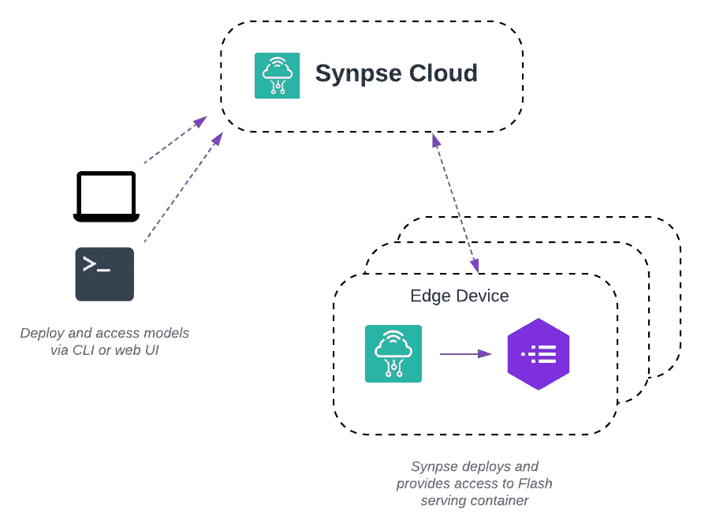
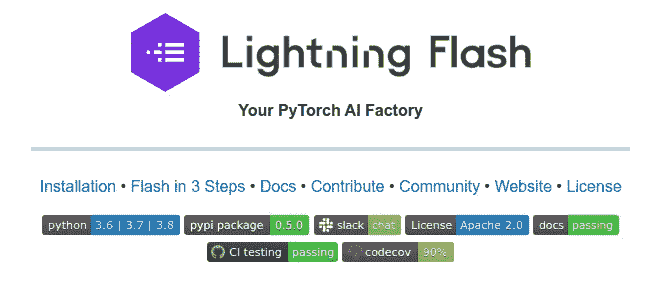
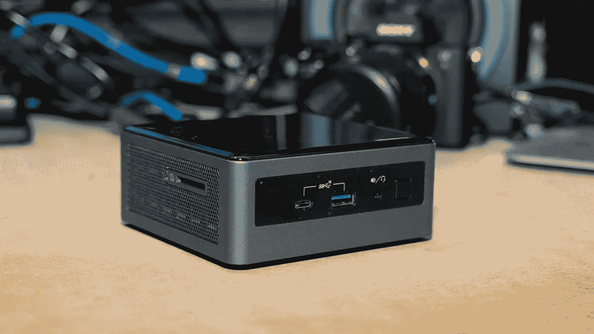
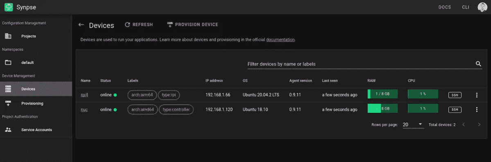
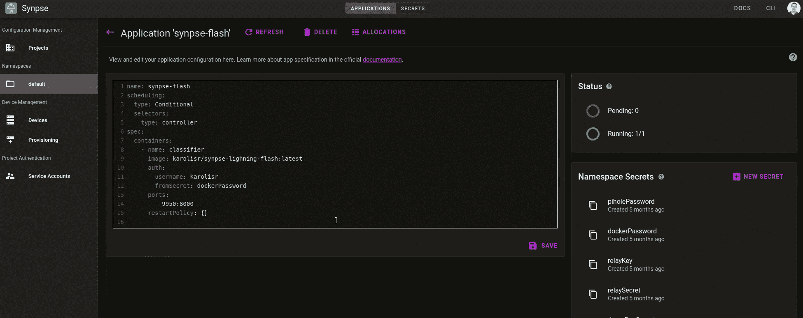
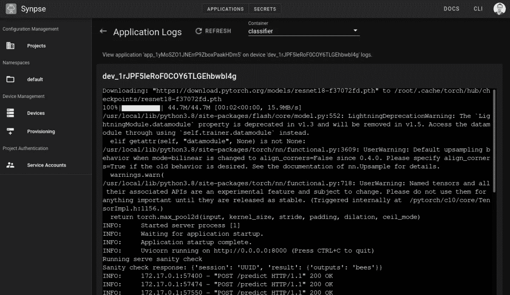

# 利用闪电将 ML 模型部署到边缘

> 原文：<https://itnext.io/deploying-ml-models-to-the-edge-with-lightning-flash-9dbfeac9fdf6?source=collection_archive---------3----------------------->

在本教程中，我们将打包并部署一个简单的模型，该模型公开一个 HTTP API，并为 Synpse 管理的设备提供预测。



# 闪电是什么？



Flash 是一个高级深度学习框架，用于快速原型化、基线化、微调和解决深度学习问题。它提供了一组任务供您进行推断和微调，并且提供了一个易于实现的 API 来定制该过程的每一步，以获得充分的灵活性。

Flash 是为初学者构建的，具有简单的 API，需要很少的深度学习背景，并适合数据科学家，Kagglers，应用 ML 从业者和深度学习研究人员，他们希望快速获得具有高级功能 [PyTorch Lightning](https://github.com/PyTorchLightning/pytorch-lightning) 提供的深度学习基线。

可以在这里查看 PyTorch Lightning 的快速入门:[https://Lightning-flash . readthe docs . io/en/latest/quick start . html](https://lightning-flash.readthedocs.io/en/latest/quickstart.html)。

# 先决条件

*   [Synpse 账户](https://cloud.synpse.net/) —最多 5 台设备免费
*   至少有一台设备[注册到您的 Synpse 帐户](https://docs.synpse.net/synpse-core/devices/provisioning)
*   [码头工人](https://www.docker.com/)
*   Python 环境

# 构建模型

Lightning Flash 公共知识库在这里有大量的例子:[https://github . com/PyTorchLightning/lightning-Flash/tree/master/Flash _ examples/serve](https://github.com/PyTorchLightning/lightning-flash/tree/master/flash_examples/serve)。我决定选择`image_classification`，因为拥有某种可以区分蚂蚁和蜜蜂的服务对我来说很重要。您可以在[图像分类](https://lightning-flash.readthedocs.io/en/latest/reference/image_classification.html)部分了解更多关于该型号的信息。

> *储存库与代码可以在这里找到:*[](https://github.com/synpse-hq/synpse-lightning-flash-example)**。**

# *步骤 1:复制示例回购*

```
*git clone [https://github.com/synpse-hq/synpse-lightning-flash-example.git](https://github.com/synpse-hq/synpse-lightning-flash-example.git)*
```

***在本地运行服务器***

*让我非常惊讶的是，开始使用 Flash 是多么容易。在您喜欢的编辑器中打开`image_classifier.py`文件:*

```
*from flash.image import ImageClassifier# Our downloaded weights
model = ImageClassifier.load_from_checkpoint("./image_classification_model.pt")
# Binding to all interfaces (we will need that so it works in Docker container)
model.serve(host="0.0.0.0")*
```

*现在，开始之前，我们需要安装几个有助于图像分类和服务的依赖项:*

```
*pip install -r requirements.txt*
```

*要在本地启动服务器:*

```
*python image_classifier.py*
```

# *第二步:与客户一起尝试*

*当服务器运行时，使用客户端发出 HTTP 请求:*

```
*import base64
from pathlib import Pathimport requestsimport flashwith (Path("./assets") / "ant.jpg").open("rb") as f:
    imgstr = base64.b64encode(f.read()).decode("UTF-8")body = {"session": "UUID", "payload": {"inputs": {"data": imgstr}}}
resp = requests.post("[http://127.0.0.1:8000/predict](http://127.0.0.1:8000/predict)", json=body)
print(resp.json())*
```

*要运行它:*

```
*python client.py {'session': 'UUID', 'result': {'outputs': 'ants'}}*
```

*我已经将 bee.jpg 和 ant.jpg 的文件都添加到了资产/目录中，所以请随意尝试这两个文件:)*

# *步骤 3:用模型构建和发布 Docker 图像*

*我们可以简单地将带有数据的代码嵌入到 Docker 映像中。您可以使用以下工具构建自己的工具:*

```
*docker build -t <your docker username>/synpse-lighning-flash:latest -f Dockerfile .*
```

*推动它:*

```
*docker push <your docker username>/synpse-lighning-flash:latest*
```

*或者你可以直接用我自己建的发布的:`karolisr/synpse-lighning-flash:latest`。*

# *步骤 4:准备设备*

*几年来，我一直使用 RaspberryPis 和英特尔 NUC 的组合来运行各种后台服务，如家庭助理、NodeRED、无人机、PiHole 等。这是一台非常安静的机器，实际上性能非常好:*

**

*安装说明可以在[这里](https://docs.synpse.net/synpse-core/devices/provisioning)找到，但简短的版本是:*

1.  *在 [Synpse 主页](https://cloud.synpse.net)创建一个项目*
2.  *转到**设备***
3.  *点击**供应设备***
4.  *将命令复制粘贴到您的设备上*

*该命令将找出设备架构，下载正确的二进制文件，并将您的设备注册到服务中。注册后，您的设备将出现在列表中:*

**

*点击设备菜单或设备详细信息并添加标签`type: controller`，您可以在此处添加任何您喜欢的内容，但稍后它必须符合应用规范。*

# *步骤 5:将闪存服务部署到设备*

*部署时，它将类似于您在 Docker Compose 文件中看到的内容(如果您以前使用过):*

```
*name: synpse-flash
scheduling:
  type: Conditional
  # Selecting my device. This could be targeting hundreds or thousands
  # of devices in industrial applications
  selectors:
    type: controller
spec:
  containers:
    - name: classifier
      # Docker image name
      image: karolisr/synpse-lighning-flash:latest
      # Optionally create a secret with your DockerHub password. I need this
      # as my IP pulls a lot of images. This can also be used if you are using
      # a private registry
      auth:
        username: karolisr
        fromSecret: dockerPassword
      # This time, we are exposing a custom port and not the default 8000
      ports:
        - 9950:8000*
```

*部署后，您可以查看应用程序状态和日志:*

**

# *步骤 6:对已部署的模型运行预测*

*一种方法是在 http://:9950 上调用模型。但是，我想演示 Synpse 提供的另一个功能——您的计算机和任何边缘设备之间的 TCP 隧道。*

*要打开代理通道，请在一个终端中运行:*

```
*synpse device proxy nuc 8000:9950*
```

*然后，您可以再次运行我们的客户端进行预测，就像它在您自己的机器上运行一样:*

**

*我们还可以看到 Synpse 仪表板中记录的预测:*

**

# *后续步骤*

*请随意查看 PyTorch Flash 的其他功能，如他们的新 [Flash Zero](https://lightning-flash.readthedocs.io/en/latest/general/flash_zero.html) ，它非常容易使用(在使用 Tensorflow 一段时间后，我真的很欣赏它的简单性)。*

*对于模型培训，你绝对应该看看 [grid.ai](https://grid.ai) ，那里有关于[设置环境的好文章](https://towardsdatascience.com/hyperparameter-optimization-with-grid-ai-and-no-code-change-b89218d4ff49)，因为他们提供一些免费学分以及预装 GPU 依赖等内容的会话。*

*【https://synpse.net】最初发表于[](https://synpse.net)**。***