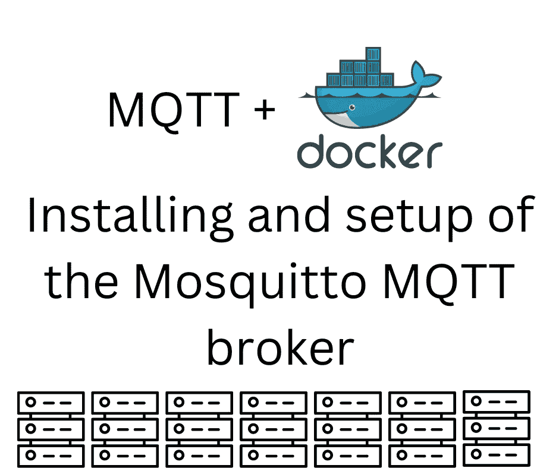

# 使用 Docker 在 Linux 上部署 Mosquitto MQTT 代理

> 原文：<https://itnext.io/deploying-mosquitto-mqtt-broker-on-linux-using-docker-a9a7fa3a7404?source=collection_archive---------0----------------------->

## MQTT DOCKER

## **开始使用 Mosquitto 看似简单。我们向你展示如何避免陷阱。**



Mosquitto 服务器的 Docker Hub 页面使得部署服务器变得非常容易。您只需运行服务器，就可以立即设置监听器并发布一些消息，这一切都非常简单。但是，事实并非如此。有一个配置文件、数据和日志目录要装载到容器中，还有匿名访问服务器的权限问题。一旦这些都被妥善摆好，就很容易安装 Mosquitto 和踢轮胎。

Mosquitto 是 MQTT 协议的消息代理。[https://mosquitto.org/](https://mosquitto.org/)它被描述为轻量级，适用于从嵌入式单板计算机(如 Raspberry Pi)到大型服务器的一系列设备。Mosquitto 项目还包括一个用于 MQTT 的 C 库，以及`mosquitto_pub`和`mosquitto_sub`客户端。

MQTT 是一种使用发布-订阅(pubsub)模型分发消息的协议。按照 MQTT 的说法，代理是分发消息的服务。MQTT 被广泛使用，协议非常精简，因此很容易在微型嵌入式微控制器上实现 MQTT 客户端。典型的用法是将传感器连接到像 ESP32 这样的微控制器上，然后通过互联网将数据传递给 MQTT 服务。该协议记录在:[https://mqtt.org/](https://mqtt.org/)

幸运的是，我们通常不需要自己实现 MQTT，因为有许多现有的客户端库和代理服务。我们在本教程中使用的 Mosquitto 项目就是一个例子。

我们将看看如何使用 Docker 部署 Mosquitto，并运行几个命令。在这个过程中，我们将讨论一些常见的部署失败。我们不打算使用 MQTT 或 Mosquitto 做任何有意义的事情，而是停留在部署和轻量级配置上。

# 在 Linux 主机上部署 Mosquitto

在进入 Docker 之前，让我们快速浏览一下如何在 Linux 主机上部署 Mosquitto。

在基于 Debian 的系统上，如 Raspbian (Raspberry Pi OS)、Ubuntu、Debian 等，这些是有用的命令:

```
# Install server and client packages
sudo apt install mosquitto mosquitto-clients

# Start the server
sudo systemctl enable mosquitto

# Check its status
sudo systemctl status mosquitto

# Restart the server
sudo service mosquitto restart
```

这很容易做到，这是在 Linux 系统上运行服务器的传统方式。对于其他 Linux 发行版，您将使用类似的命令(例如`yum`)并且可能使用不同的包名。

在码头工人时代，这是不推荐的。

基本原理是，如果有人通过 Mosquitto 服务中的一个 bug 闯入，Docker 容器会限制潜在的破坏。任何入侵者都无法破坏集装箱外的任何东西。因为如果出现问题，容器很容易被破坏和重新创建，所以恢复很简单。

Mosquitto 的 Docker 容器包含与我们在本文其余部分讨论的完全相同的服务器和客户机程序。这意味着，如果您喜欢在主机系统上安装 Mosquitto，而不是在 Docker 中安装，我们讨论的命令和配置文件可以直接应用。

# 一个简单的 Docker 编写的 Mosquitto 文件

在 Mosquitto 服务器的 Docker Hub 页面上，我们得到了这个`docker`命令:

```
$ docker run -it -p 1883:1883 -p 9001:9001 \
        -v mosquitto.conf:/mosquitto/config/mosquitto.conf \
        eclipse-mosquitto
```

这有助于我们熟悉 Mosquitto 容器的操作。它将一个`mosquitto.conf`文件挂载到容器中，并公开一对端口。看起来很简单，不是吗？

对于配置文件，我们建议使用:

```
persistence true
persistence_location /mosquitto/data/
log_dest file /mosquitto/log/mosquitto.log
```

这样做的一个问题是，`/mosquitto/data/`和`/mosquitto/log/`这两个目录没有在容器之外持久化。还有一个问题我们稍后会谈到，但这是配置 Mosquitto 的一个很好的起点。

在使用 Docker 时，我更喜欢用 *Docker Compose* ，因为它的灵活性。网站`https://www.composerize.com/`可以帮助你将`docker run`命令转换成`docker-compose.yml`。经过一点调整，我们得到了这个:

```
services:
    mosquitto:
        image: eclipse-mosquitto
        ports:
            - 1883:1883
            - 9001:9001
        volumes:
            - ./mosquitto.conf:/mosquitto/config/mosquitto.conf
            - ./data:/mosquitto/data/
            - ./log:/mosquitto/log/
```

这与`docker`命令相同，但是它也指定了`data`和`log`目录的卷挂载。

要启动它，您需要运行:

```
$ docker compose up
```

注意我用了`docker compose`而不是`docker-compose`。旧的`docker-compose`命令已被新的`docker compose`命令取代。让我们祝愿`docker-compose`平安退休。这个实现足够完整，在大多数情况下，您可以用空格字符替换`-`来达到相同的效果。

如果需要，`up`命令将下载`eclipse-mosquitto`图像，设置容器等，然后启动`docker-compose.yml`中描述的堆栈。默认情况下，服务将在前台启动，因此您可以看到服务器的任何日志输出。

```
$ docker compose up -d
```

以这种方式运行，它运行与终端分离的服务，它们将在后台运行。

`up -d`命令几乎适用于长期的后台服务器。一个问题是，如果服务崩溃，它是否会自动重启。在云计算时代，我们被告诫要时刻为系统组件的故障做准备。目前，如果 Mosquitto 服务器崩溃，它不会自动重启。

要解决这个问题，请对`docker-compose.yml`进行以下更改:

```
services:
    mosquitto:
        image: eclipse-mosquitto
        restart: unless-stopped    # Add this
        ...
```

标签`restart`控制重启服务的条件。`unless-stopped`将确保服务自动重启，除非您明确停止它。

如果你忘记创建`mosquitto.conf`，你会得到这个错误:

> 来自守护程序的错误响应:无法创建 shim 任务:OCI 运行时创建失败:runc 创建失败:无法启动容器进程:容器初始化期间出错:将“/home/David/Projects/nodejs/mqtt/mosquitto . conf”挂载到位于“/mosquitto/config/mosquitto . conf”的 rootfs 时出错:mount/home/David/Projects/nodejs/mqtt/mosquitto . conf:/mosquitto/config/mosquitto . conf(via/proc/self/FD/6)，标志:0x 5000:0 检查指定的主机路径是否存在，并且是预期的类型

我提到这一点是因为我犯了几次这样的错误，也许其他人也会这样做。简单地创建文件，但是 Docker 已经创建了一个目录，您必须首先删除它。

# 停止、重新启动和更新容器

使用`docker compose`可以轻松管理您部署的服务。为此，您的终端会话必须在包含`docker-compose.yml`文件的中。用于此目的的命令有:

```
# Start the service
$ docker compose up -d

# Shut down the service
$ docker compose down

# Restart the service
$ docker compose restart

# Update the service
$ docker compose stop
$ docker compose pull
$ docker compose up -d
```

如果 Docker Hub 上的容器映像已经更新，最后一个将更新服务。

# 在容器内运行 Mosquitto 命令

如果您运行`docker compose ps`或`docker ps -a`，您将看到容器已经启动。

为了查看它的运行情况，让我们听一个 MQTT 主题，查看日志文件，并发送一些消息。

在一个终端窗口中，您可以运行以下命令:

```
$ sudo tail -f log/mosquitto.log 
[sudo] password for david: 
1665640941: Saving in-memory database to /mosquitto/data//mosquitto.db.
1665641912: mosquitto version 2.0.15 terminating
1665641912: Saving in-memory database to /mosquitto/data//mosquitto.db.
1665642425: mosquitto version 2.0.15 starting
1665642425: Config loaded from /mosquitto/config/mosquitto.conf.
1665642425: Opening ipv4 listen socket on port 1883.
1665642425: Opening ipv6 listen socket on port 1883.
1665642425: mosquitto version 2.0.15 running
1665642425: New connection from 172.29.0.1:37076 on port 1883.
1665642425: Client auto-7F81B465-FE74-A7CC-7A16-854BC3AA23E0 disconnected, not authorised.
```

这个监视日志。它必须用`sudo`运行，因为这个目录是受保护的。

接下来，如果我们尝试进入容器来运行命令，我们将得到以下消息:

```
$ docker exec -it mqtt-mosquitto-1 bash 
OCI runtime exec failed: exec failed: unable to start container process: exec: "bash": executable file not found in $PATH: unknown
```

这是因为`eclipse-mosquitto`容器是在没有`bash`的 Alpine Linux 上构建的。将`bash`替换为`sh`，您将在容器中看到一个命令提示符。

此命令应该开始监听特定主题的消息:

```
mosquitto_sub -v -t test/message 
Connection error: Connection Refused: not authorised.
```

但是，如你所见，缺乏授权。很高兴知道 Mosquitto 有授权系统。在生产使用中，MQTT 服务不能对公众开放。

一种快速解决方法是将配置文件更改为:

```
allow_anonymous true

persistence true
persistence_location /mosquitto/data/
log_dest file /mosquitto/log/mosquitto.log

listener 1883
```

我们所做的是允许世界上任何人使用这个 MQTT 代理。显然，这不是生产部署中要做的事情。它让我们继续这个快速教程。

我们必须重新启动服务(`docker compose restart`)，然后重新运行命令。在容器内部运行命令的一个更简单的方法是:

```
$ docker exec -it mqtt-mosquitto-1 \
            mosquitto_sub -v -t test/message
```

这为`test/message`主题设置了一个订阅者。发布到此主题的任何消息都将被打印出来。

要发送消息，我们可以这样做:

```
$ docker exec -it mqtt-mosquitto-1 \
            mosquitto_pub -t test/message -m 'Hello World!'
```

这将向命名主题发布一条消息。在另一个命令窗口中，订户进程将打印以下内容:

```
test/message Hello World!
```

信息已发送，向世界问好。

# 在 Docker 容器外使用 Mosquitto 客户端程序

我们使用了两个 Mosquitto 客户端程序，`mosquitto_sub`和`mosquitto_pub`，在容器内部运行它们。`docker exec`命令让我们进入正在运行的容器，并执行命令。虽然对于简单的演示很有用，但这根本不是生产系统的运行方式。相反，我们的应用程序将通过网络连接到服务。为了模拟这种情况，让我们在容器外运行 Mosquitto 客户端。

通常我们可以在笔记本电脑上安装客户端。例如，我的笔记本电脑运行 Ubuntu，我运行了这个命令:

```
$ sudo apt install mosquitto-clients
```

对于 macOS 来说，MacPorts 或者家酿仓库里有包，在 Windows 上，建议看 Chocolatey 仓库。

这意味着我可以从笔记本电脑上运行 Mosquitto 命令，例如:

```
mosquitto_sub -h localhost -p 1883 -v -t test/message
mosquitto_pub -h localhost -p 1883 -t test/message -m 'Hello World!'
```

`-h`选项指定 Mosquitto 服务器的主机名或 IP 地址。`-p`选项指定端口号。您可能已经将 Mosquitto 部署到了一个远程服务器上，这就是您到达那里的方式。

# 为 Mosquitto 实现身份验证

mosquitto 服务器支持几种身份验证。正如我们前面所说的，这对于生产部署是必要的。上面显示的配置文件允许匿名访问，这将任何安全感都抛到了九霄云外。

我们要做的是建立一个简单的密码文件。

在`mosquitto.conf`中添加这一行:

```
password_file /mosquitto/etc/passwd
```

这表示使用命名文件来存储用户名/密码对。格式为`username:password`，内容使用`mosquitto_passwd`程序管理。

为了支持这一点，我们需要更改`docker-compose.yml`来挂载一个新目录:

```
services:
    mosquitto:
        image: eclipse-mosquitto
        ...
        volumes:
            ...
            - ./etc:/mosquitto/etc/
```

我们将一个目录装入容器，因此必须创建该目录:

```
$ mkdir etc
$ touch etc/passwd
```

接下来，您可以启动或重新启动 Mosquitto 容器。在`passwd`文件中没有定义用户，所以让我们创建一个。

```
$ docker exec -it mqtt-mosquitto-1 \
          mosquitto_passwd /mosquitto/etc/passwd henry 
Password: 
Reenter password:
```

当然，这类似于 Unix/Linux/etc `passwd`命令。

此时有必要重启 Mosquitto 容器。在测试中，服务器似乎不会识别新用户或更改密码，直到它重新启动。

此时，您可以通过添加用户名和密码来订阅主题:

```
mosquitto_sub -u henry --pw passw0rd -h localhost -p 1883 \
          -v -t test/message
```

新选项是指定用户名的`-u`和指定密码的`--pw`。

发送消息需要类似的改变:

```
$ mosquitto_pub -u henry -P passw0rd -h localhost -p 1883 \
            -t test/message -m 'Hello World!'
```

`-P`选项是指定`--pw`的另一种方式。如前所述，运行该命令将导致消息由`mosquitto_sub`打印出来。

# 摘要

Mosquitto 服务器支持的功能比我们在本文中提到的多得多。例如，我们可以使用 SSL 证书对用户进行身份验证，每个用户都可以有一个 ACL 来限制他们的能力。另一个重要的特性是持久化数据的能力。

在 Docker 中设置 Mosquitto 服务器非常简单。这样做只需要一些配置文件和设置。

*最初发表于*[*https://techsparx.com*](https://techsparx.com/software-development/mqtt/mosquitto-docker.html)*。*

## 关于作者


[***大卫·赫伦***](https://davidherron.com/)**:大卫·赫伦是一位专注于技术明智使用的作家和软件工程师。他对太阳能、风能和电动汽车等清洁能源技术特别感兴趣。David 在硅谷从事了近 30 年的软件工作，从电子邮件系统到视频流，再到 Java 编程语言，他已经出版了几本关于 Node.js 编程和电动汽车的书籍。**