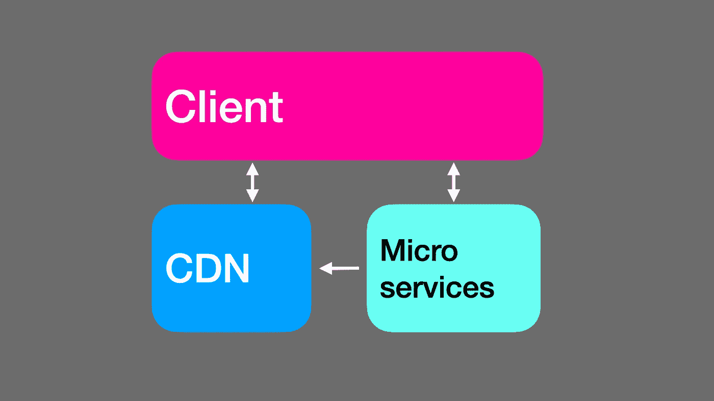

# 使用 WebAssembly 和模块联合部署下一代无服务器功能

> 原文：<https://itnext.io/deploying-next-gen-serverless-functions-with-webassembly-and-module-federation-1471b94e425c?source=collection_archive---------1----------------------->

不需要部署自动化。第二部分，共三部分。

在本文的第 1 部分中，我们讨论了 Wasm 作为无服务器运行时的优势以及它所解决的一些问题，比如消除冷启动性能问题。但是我们不得不考虑如何部署 Wasm 无服务器功能。

没有码头集装箱，对吗？没错。Wasm 是容器的替代品。把它想象成一个纳米容器。它已经提供了保护主机和其他容器所需的隔离。

如果我们不部署 Docker 容器，我们具体部署什么，如何部署？在这一点上，您会记得建议是避免在服务器上安装软件，而是在运行时通过网络传输软件。我们将把程序直接加载到内存中，而不是花费时间和资源将其复制到(短暂的)磁盘或远程存储(例如 S3)中。

考虑到我们可以从任何地方流式传输，源回购甚至 CDN，我们的后端架构可能看起来很像我们的前端——如果我们使用 JamStack 的话。只需添加一个额外的箭头，从无服务器指向 CDN。

Jamstack 架构，支持来自 cdn 的微服务流

## 联合无服务器平台

建立这样一个平台需要什么？K8s，Istio，Casandra，Etherium，Beat-complex-into-submission-ly？我们需要的是一个联邦运行时，它可以被告知哪些模块需要流式传输和执行。回想在前一篇文章中，我们考虑了这样一个[运行时](https://github.com/module-federation/aegis)，以及如何将它嵌入或移植到 Wasm 中。因此，联合无服务器平台的构建块是基于 Wasm 的模块联合运行时。这就是所需的一切:无需额外的软件来协调或执行部署。

在第三篇也是最后一篇文章中，我们将详细研究联邦无服务器平台。