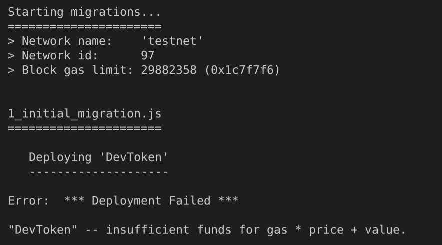
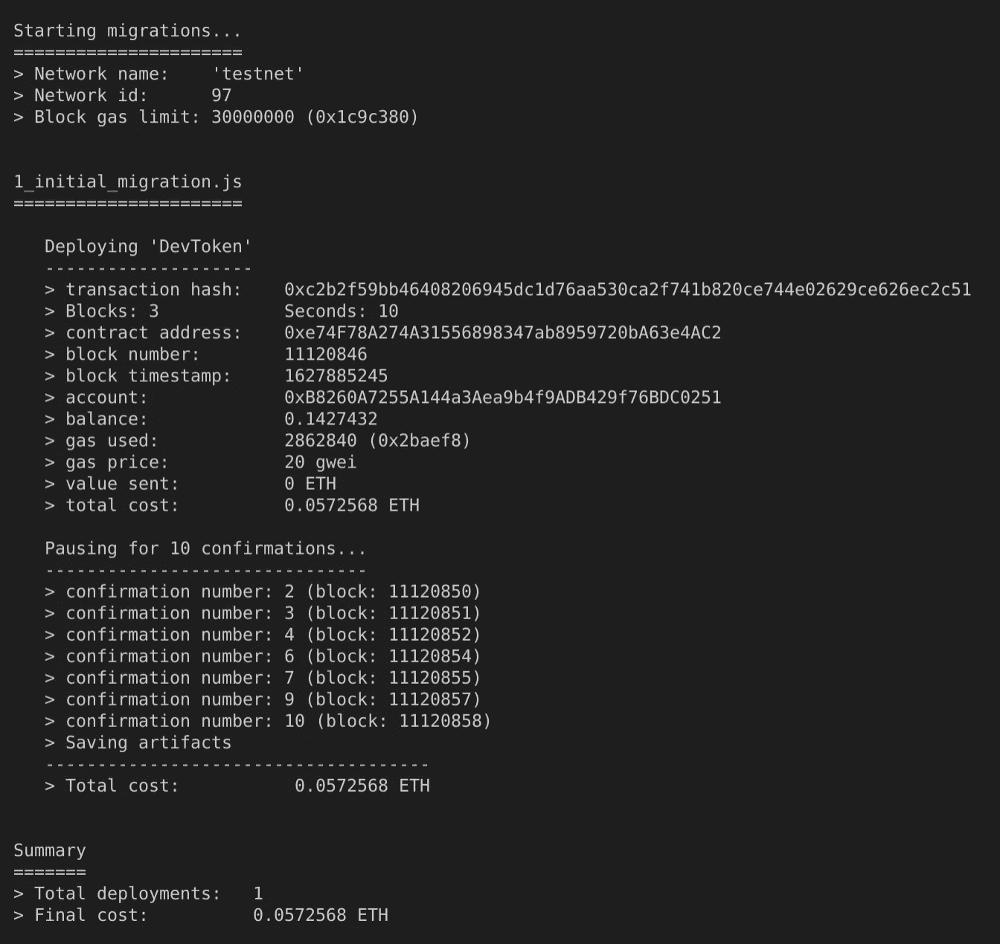
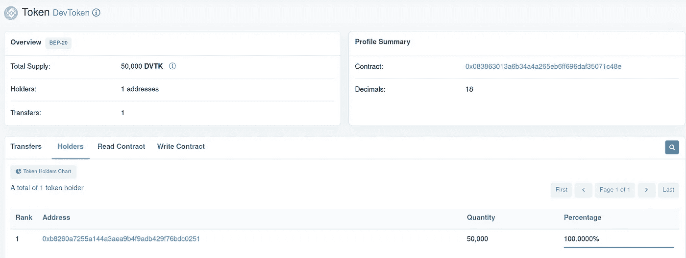
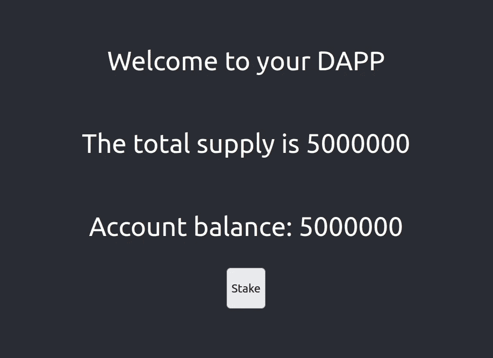
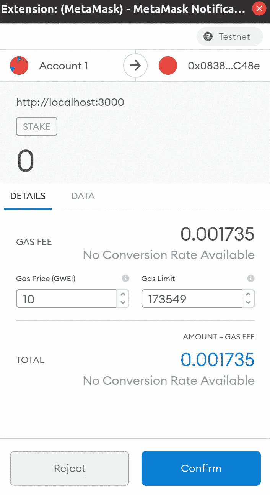
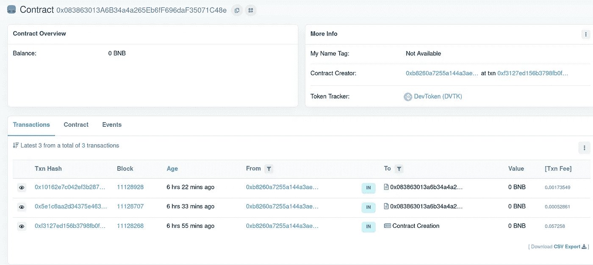

# 将智能合约部署到币安松露智能连锁店

> 原文：<https://itnext.io/deploying-smart-contracts-to-binance-smart-chain-with-truffle-c57a7d1eb6ed?source=collection_archive---------3----------------------->


珀西·博尔默拍摄的图片

这是我们使用定制的 BEP-20 智能合约从头开始构建 DApp 系列的第四篇也是最后一篇文章。
在本文中，我们将看看如何将智能合约部署到币安测试网，而不是我们的本地 Ganache 实例。

1.  [**【在 Solidity 中用 BEP-20 契约构建一个去中心化的应用】**](https://medium.com/@percybolmer1/building-a-decentralized-application-with-bep-20-contract-in-solidity-d2c066447aa6) —这篇文章将帮助你理解 Solidity 的基础知识
2.  [**【在 Solidity 中创建可继承的赌注契约】**](https://medium.com/@percybolmer1/creating-a-inheritable-staking-contract-in-solidity-7804ae2d7a32) —第二篇文章，我们将介绍更高级的 Solidity 项目并实现赌注和奖励
3.  [**【在 Web 应用中使用智能合约】**](https://medium.com/@percybolmer1/using-a-smart-contract-in-an-web-application-78432ed68527) —本系列的第三篇文章，我们将学习如何使用元掩码通过 Web 应用连接到区块链
4.  **【用松露将智能合约部署到币安智能连锁店】** —第四篇也是最后一篇文章，我们将学习如何将智能合约部署到真实网络中

你可以在这里找到前面部分[使用的完整代码。](https://github.com/percybolmer/DevToken/tree/dapp)

我们将从更新我们的 **truffle-config.js 中的 Truffle 配置开始。**我们将开放三个网络，以便我们可以将它们部署到所有三个网络。最新的部署信息可以在[这里找到。我们还需要使用你必须下载的 truffle/hdwallet 提供程序。](https://docs.binance.org/smart-chain/developer/deploy/truffle.html)

```
npm install @truffle/hdwallet-provider
```

之后，我们需要取消对 module.exports 字段的注释，并添加以下三个网络。

Truffle —允许我们部署到所有三个网络的配置

在此工作之前，你需要注意我们正在读取一个名为 **.secret.** 的文件，这个文件应该只包含一个东西，你的[助记符](https://academy.binance.com/en/glossary/seed-phrase)。

这是一个用来访问你的钱包的单词列表。就当是密码吧，不过长。当你在 MetaMask 中创建你的帐户时，你应该已经得到了种子短语。但是如果你忘记了，你可以通过点击这个[链接](https://metamask.zendesk.com/hc/en-us/articles/360015290032-How-to-reveal-your-Seed-Phrase-Secret-Recovery-Phrase)来查看。

## 部署到 TestNet

如果您已经将助记符粘贴到。秘密文件是时候尝试部署智能合同了。我们将开始把它部署到 TestNet，看看它有多容易部署。现在，部署到 TestNet 的原因是，它将像测试一样工作，以查看智能合约是否按预期工作。

测试网是真实生产网络的完全复制品，所以这是一个尝试一切的好方法。使用它将允许我们也有一个开发环境(Ganache)，测试(Testnet)，生产(真正的币安智能链)。

还记得我们如何运行**块菌迁移**部署到加纳切吗？
这里的美妙之处在于，要部署到测试或生产环境，我们可以使用相同的过程，只需在命令中添加一个— network 标志，并指定要部署到哪个网络。请记住，为了推动测试和生产，您将不得不**支付天然气**。

```
truffle migrate --network testnet
```

尝试运行该命令，看看会发生什么。如果您像我在本系列中所做的那样使用新的元掩码帐户，您将看到以下内容。



块菌迁移——由于气体不足而失败

原因是，正如我现在多次重复的那样，部署智能合同需要成本。记住这一点，如果你把智能合同推给真正的币安智能链，它会抽走你的钱。

> 但是我不要花钱去部署测试！—廉价的开发人员

幸运的是，testnet 有水龙头，允许我们免费测试以太坊。让我们通过添加另一个网络将 MetaMask 连接到 Testnet。该网络是官方的币安测试网。如果您忘记了如何添加网络，请阅读本系列的第三篇文章或阅读此处的。

添加自定义 RPC 时要使用的网络数据如下

**网络名称:**智能链— Testnet
**新建 RPC URL:**[https://data-seed-prebsc-1-s1.binance.org:8545/](https://data-seed-prebsc-1-s1.binance.org:8545/)
**Chain id:**97
**符号:**BNB
**Block Explorer URL:**[https://testnet.bscscan.com](https://testnet.bscscan.com)

添加后，通过点击 MetaMask 中的帐户获取您的帐户地址。

访问[官方测试网](https://testnet.binance.org/faucet-smart)智能水龙头，它给你代币使用。只需输入您的地址，然后按“**给我 BNB** ”。等待几秒钟，你的帐户应该被资助。现在，您应该看到元掩码中有 1 个 BNB。是时候给松露迁移一个新的旋转了。

注意。如果您在元掩码中有多个帐户，并且将免费令牌给了除第一个帐户之外的其他帐户，则您需要指定迁移时要使用的帐户。Truffle 将默认为第一个可用的帐户。在 testnet 配置中添加以下内容。

```
from: "0xyouraccount"
```

使用您获得资金的帐户再次运行 migrate 命令到 testnet。



块菌迁移—部署到测试网

祝贺您，您已经部署到 Testnet。你可以复制**合同地址。**然后你可以在[测试网络浏览器](https://testnet.bscscan.com/token/0x083863013a6b34a4a265eb6ff696daf35071c48e#balances)上搜索它。现在，您可以将令牌添加到元掩码，以查看您当前的帐户余额。选择“添加令牌”并输入请求的信息，该信息应为合同地址。要迁移到 mainnet，只需将 migrate 命令中的网络更改为 mainnet，但请记住您的帐户上要有足够的汽油。



dev Token——区块链探险家展示我们的令牌

## 在测试网中测试 DApp

让我们试试我们在本系列第 3 部分中构建的 DApp，看看它是否有效。

转到 App.js 中可怕的硬编码 getContractAddress 函数，替换它返回的契约，以匹配您的智能契约地址。

DApp —更改返回的智能合约以匹配您的智能合约地址

如果您在 MetaMask 和您的帐户中选择了 TestNet network，请使用以下命令再次启动 DApp

```
npm start
```

并访问 [localhost:3000](http://localhost:3000/dashboard) 。



DApp——在测试网上工作

## 在币安测试网浏览器中查看事务和事件。

让我们执行一个 Stake 并访问 testnet explorer 来查看信息，就像在 Ganache 中一样。

按下按钮时，应该会提示您元掩码请求。



元掩码——在测试网上打桩

现在，等待 MetaMask 弹出窗口，显示交易成功。当它出现时，要么单击它以打开浏览器，要么访问浏览器并搜索令牌地址。


元掩码—单击弹出窗口进行查看

这将把您带到浏览器，您可以在其中查看智能合约上发生的所有交易以及所有事件。



DApp —显示所有交易和事件的 Testnetwork explorer。

如果导航到 Events 选项卡，您还应该能够看到已经触发的 Staked 事件。

## 结论

恭喜你！如果你已经完成了这个系列的所有部分，那么你现在已经完成了你的第一个 DApp。

在这个系列中，我们了解到

*   基本坚固性
*   实现了一个简单的锁定机制
*   实施奖励制度
*   使用和控制合同的 web 用户界面
*   如何部署到 testnet 和 mainnet？

希望你已经学到了一些东西。感谢您的阅读！

如果有任何问题或反馈，请随时评论或给我发消息。