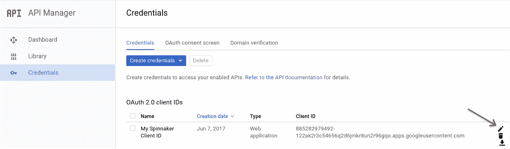
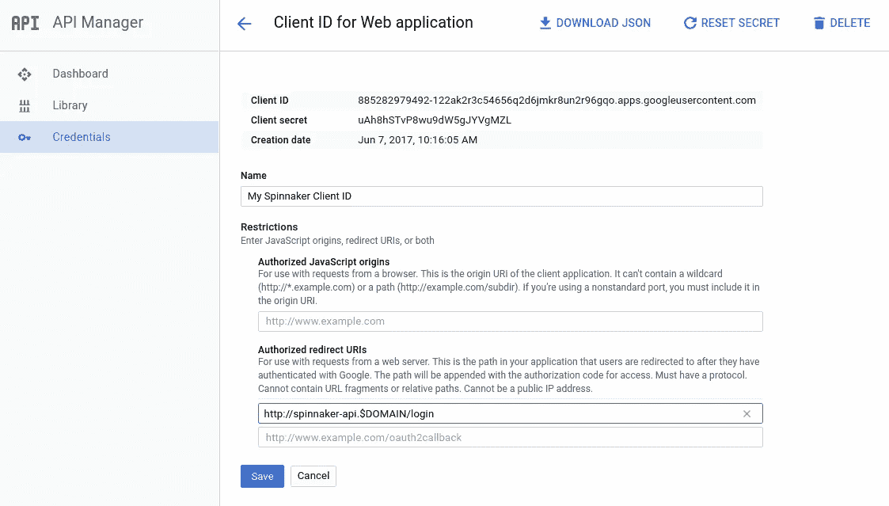
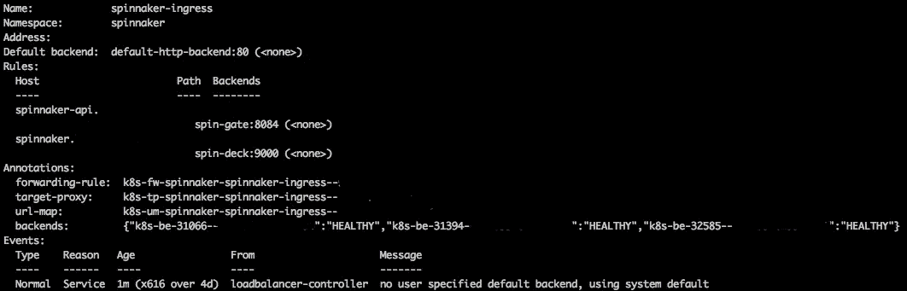

# 在 GKE 部署三角帆

> 原文：<https://itnext.io/deploying-spinnaker-on-gke-125ef47a8c9?source=collection_archive---------2----------------------->


Kubernetes 可以说已经赢得了容器编排之战，并且已经成为在生产中运行容器的事实上的标准。

GKE(Kubernetes Engine)是一个托管的生产就绪环境，用于部署容器化的应用程序。

谷歌的 Kubernetes 引擎也有替代品，比如 [Azure Kubernetes 服务](https://azure.microsoft.com/en-ca/services/kubernetes-service/)或亚马逊的 [EKS](https://aws.amazon.com/eks/) ，这里有一篇[好文章](https://dzone.com/articles/5-hosted-kubernetes-platforms)可能会帮助你决定你想使用哪个提供商。

本指南将引导您完成以下步骤，以便在 Google 的 Kubernetes 引擎(GKE)上安装生产就绪的 Spinnaker

*   安装升降索
*   创建 Kubernetes 集群和服务帐户
*   选择环境
*   配置持久存储
*   展开三角帆
*   将 Spinnaker 配置为可公开访问(带身份验证)

## 安装升降索

Halyard 管理您的 Spinnaker 部署的生命周期，包括编写和验证您的部署配置，部署 Spinnaker 的每个微服务，以及更新部署。

[官方文档](https://www.spinnaker.io/setup/install/)建议使用升降索安装 Spinnaker，如果您需要任何安装支持，而您没有使用升降索，您将只能靠自己，[此引用](https://www.spinnaker.io/setup/install/halyard/#1-install-halyard)来自 Spinnaker 官方安装指南。

> 虽然没有升降索也可以安装 Spinnaker，但是我们不推荐这样做，如果你遇到困难，我们会告诉你使用升降索。

也就是说，让我们从[安装升降索](https://www.spinnaker.io/setup/install/halyard/#1-install-halyard)开始。

我使用了“[在 Debian/Ubuntu 和 macOS 上安装](https://www.spinnaker.io/setup/install/halyard/#install-on-debianubuntu-and-macos)”安装，并将其安装在我的 MacOS 上

## 创建 Kubernetes 集群和服务帐户

如果你还没有集群，你可以使用官方文档在 GKE 上创建一个 Kubernetes 集群

按照[官方文档](https://cloud.google.com/kubernetes-engine/docs/how-to/cluster-access-for-kubectl#generate_kubeconfig_entry)中所示的说明下载凭证。我们将使用这些凭据创建下面的服务帐户

鉴于 GKE 上的所有 pod 共享相同的服务帐户，授予 GKE 上的 Spinnaker 权限也会授予与 Spinnaker 并行运行的所有 pod 权限。出于这个原因，我们将为 Spinnaker 配置一个 Kubernetes 服务帐户来进行身份验证。

创建一个文件`cluster-admin-role.yml`并将该内容粘贴到其中

```
apiVersion: rbac.authorization.k8s.io/v1
kind: ClusterRoleBinding
metadata:
  name: spinnaker-admin-delete-me-after
roleRef:
  apiGroup: rbac.authorization.k8s.io
  kind: ClusterRole
  name: cluster-admin
subjects:
- kind: User
  name: [y](mailto:colin@lottery.com)our-gke-user-account@example.com
```

使用命令可以找到`your-gke-user-account@example.com`

```
gcloud auth list --filter=status:ACTIVE --format="value(account)"
```

> 它应该与下载的凭据文件中的电子邮件地址相同

创建角色:`kubectl apply -f cluster-admin-role.yml`

现在我们有了正确的权限，可以继续为 Spinnaker 创建 Kubernetes 服务帐户了。

首先，创建一个`k8s-spinnaker-service-account.yml`文件并将该内容粘贴到其中，该文件可以在[这里](https://www.spinnaker.io/setup/install/providers/kubernetes-v2/#optional-configure-kubernetes-roles-rbac)找到

```
apiVersion: rbac.authorization.k8s.io/v1
kind: ClusterRole
metadata:
 name: spinnaker-role
rules:
- apiGroups: [""]
  resources: ["namespaces", "configmaps", "events", "replicationcontrollers", "serviceaccounts", "pods/logs"]
  verbs: ["get", "list"]
- apiGroups: [""]
  resources: ["pods", "services", "secrets"]
  verbs: ["create", "delete", "deletecollection", "get", "list", "patch", "update", "watch"]
- apiGroups: ["autoscaling"]
  resources: ["horizontalpodautoscalers"]
  verbs: ["list", "get"]
- apiGroups: ["apps"]
  resources: ["controllerrevisions", "statefulsets"]
  verbs: ["list"]
- apiGroups: ["extensions", "apps"]
  resources: ["deployments", "replicasets", "ingresses"]
  verbs: ["create", "delete", "deletecollection", "get", "list", "patch", "update", "watch"]
# These permissions are necessary for halyard to operate. We use this role also to deploy Spinnaker itself.
- apiGroups: [""]
  resources: ["services/proxy", "pods/portforward"]
  verbs: ["create", "delete", "deletecollection", "get", "list", "patch", "update", "watch"]
---
apiVersion: rbac.authorization.k8s.io/v1
kind: ClusterRoleBinding
metadata:
 name: spinnaker-role-binding
roleRef:
 apiGroup: rbac.authorization.k8s.io
 kind: ClusterRole
 name: spinnaker-role
subjects:
- namespace: spinnaker
  kind: ServiceAccount
  name: spinnaker-service-account
---
apiVersion: v1
kind: ServiceAccount
metadata:
 name: spinnaker-service-account
 namespace: spinnaker
```

现在我们可以将它应用到我们的集群中。

```
kubectl apply --context spinnaker -f k8s-spinnaker-service-account.yml
```

获取此服务帐户依赖的令牌:

```
TOKEN=$(kubectl get secret --context spinnaker \
   $(kubectl get serviceaccount spinnaker-service-account \
       --context spinnaker \
       -n spinnaker \
       -o jsonpath='{.secrets[0].name}') \
   -n spinnaker \
   -o jsonpath='{.data.token}' | base64 --decode)
```

将此令牌放入名为的新用户的`kubeconfig`中

`spinnaker-token-user`

```
kubectl config set-credentials spinnaker-token-user --token $TOKEN
```

配置您的`spinnaker`上下文来使用这个新用户

```
kubectl config set-context spinnaker --user spinnaker-token-user
```

现在，您的`spinnaker`上下文将使用我们上面创建的令牌进行认证。

查看[这些文档](https://kubernetes.io/docs/tasks/access-application-cluster/configure-access-multiple-clusters/#define-clusters-users-and-contexts)以了解更多关于上下文的信息以及它们为什么有用。

完成这些步骤后，我们可以跳回官方指南并[添加一个账户](https://www.spinnaker.io/setup/install/providers/kubernetes-v2/#adding-an-account)。

## 选择环境

添加帐户后，您需要选择一个环境。如果您计划在生产中使用它，推荐的环境是[分布式安装](https://www.spinnaker.io/setup/install/environment/#distributed-installation)

## 配置持久存储

Spinnaker 需要一个外部存储提供程序来保存应用程序设置和配置的管道。对于我的安装，我使用了三角帆 [GCS 指南](https://www.spinnaker.io/setup/install/storage/gcs/)

配置好一切后，我们现在准备部署 Spinnaker

## 展开三角帆

部署 Spinnaker 是容易的部分，只需按照[这些步骤](https://www.spinnaker.io/setup/install/deploy/)

就是这样。这应该就是在 GKE 上设置 Spinnaker 所需的全部内容。

## 将 Spinnaker 配置为可公开访问(带身份验证)

为了更容易地访问 Spinnaker，您希望能够公开访问它。

对于指南的这一部分，让我们假设我们正在使用下面的＄DOMAIN`cznconsulting.com`

[本](https://www.spinnaker.io/setup/quickstart/halyard-gke-public/#part-0-prerequisites)[导轨](https://www.spinnaker.io/setup/quickstart/halyard-gke-public/)的第 0 部分和[第 1 部分](https://www.spinnaker.io/setup/quickstart/halyard-gke-public/#part-1-configuring-authentication)易于遵循，无需更改。

我无法让第 2 部分在 GKE 上工作，旋转平台和旋转门服务上的外部 IP 陷入了待定状态。

作为一个变通办法，而且在我看来，对 GKE 来说这是一个更好的解决方案，我设置了一个入口来将流量路由到这些服务，稍后会详细介绍。

首先导航回 [Google 凭证管理器](https://console.developers.google.com/apis/credentials)，并使用您的值`$DOMAIN`编辑 Spinnaker 客户端 ID:



在我们的例子中，它应该是这样的:http://spinnaker-api.cznconsulting.com/login

现在授权 UI 和 API 服务器使用 Halyard 在这些 URL 接收请求:

```
hal config security ui edit \
    --override-base-url http://spinnaker.cznconsulting.com

hal config security api edit \
    --override-base-url http://spinnaker-api.cznconsulting.com
```

现在，在通过部署 Spinnaker 最终完成这些更改之前，我们需要编辑位于 UI & API 服务器前面的 [Kubernetes 服务](https://kubernetes.io/docs/concepts/services-networking/service/)，以及分别位于`spinnaker`名称空间中的`spin-deck`和`spin-gate`。

运行以下命令

```
kubectl edit svc spin-deck -n spinnaker
```

您将在文本编辑器中打开服务定义。进行以下粗体标注的更改

```
# Please edit the object below. Lines beginning with a '#' will be ignored,
# and an empty file will abort the edit. If an error occurs while saving this file will be
# reopened with the relevant failures.
#
apiVersion: v1
kind: Service
metadata:
  creationTimestamp: 2017-06-01T00:57:34Z
  name: spin-deck
  namespace: spinnaker
  resourceVersion: "6038615"
  selfLink: /api/v1/namespaces/spinnaker/services/spin-deck
  uid: 4c1fb82f-4165-11e7-888f-42020a8a0a12
spec:
  clusterIP: 10.127.244.30
  ports:
  - **port: 9000**                          
    protocol: TCP
    targetPort: 9000
  selector:
    load-balancer-spin-deck: "true"
  sessionAffinity: None
  **type: NodePort  **                 

status:
  loadBalancer: {}
```

现在重复这一步骤，但针对`spin-gate`

```
kubectl edit svc spin-gate -n spinnaker
```

您将在文本编辑器中打开服务定义。进行以下粗体标注的更改

```
# Please edit the object below. Lines beginning with a '#' will be ignored,
# and an empty file will abort the edit. If an error occurs while saving this file will be
# reopened with the relevant failures.
#
apiVersion: v1
kind: Service
metadata:
  creationTimestamp: 2017-06-01T00:57:32Z
  name: spin-gate
  namespace: spinnaker
  resourceVersion: "6038615"
  selfLink: /api/v1/namespaces/spinnaker/services/spin-gate
  uid: 1c4fd288-818a-166e-888f-45251eee0d92
spec:
  clusterIP: 10.127.244.29
  ports:
  - **port: 8084**                           
    protocol: TCP
    targetPort: 8084
  selector:
    load-balancer-spin-gate: "true"
  sessionAffinity: None
  **type: NodePort** status:
  loadBalancer: {}
```

**原生** GKE 入口控制器[目前只支持](https://github.com/kubernetes/kubernetes/issues/26508#issuecomment-222376886)节点端口

最后，重新部署 Spinnaker

```
hal deploy apply
```

我们最终将更新我们的 DNS 设置并创建一个记录来将我们的子域指向一个静态 IP，所以我们需要首先创建静态 IP。

```
gcloud compute addresses create spinnaker-static-ip --global
```

现在我们准备创建入口资源。我推荐阅读这篇[解释入口是什么的优秀文章](https://medium.com/google-cloud/kubernetes-nodeport-vs-loadbalancer-vs-ingress-when-should-i-use-what-922f010849e0)。

首先，创建一个名为`spinnaker-ingress.yml`的文件，并将以下内容粘贴到其中。

```
apiVersion: extensions/v1beta1
kind: Ingress
metadata:
  name: spinnaker-ingress
  annotations:
    **kubernetes.io/ingress.global-static-ip-name: "spinnaker-static-ip"**
  namespace: spinnaker
spec:
  rules:
  - host: spinnaker-api.cznconsulting.com
    http:
      paths:
      - backend:
          serviceName: spin-gate
          servicePort: 8084
  - host: spinnaker.cznconsulting.com
    http:
      paths:
      - backend:
          serviceName: spin-deck
          servicePort: 9000
```

**注意**:注释部分指定新创建的静态 IP 应该与该入口相关联

现在，我们可以将它应用到我们的集群中，这将为我们创建一个新的负载平衡器。

```
kubectl apply -f spinnaker-ingress.yml
```

我们需要采取最后一个步骤来使其工作，这是因为 github 的[现有问题](https://github.com/kubernetes/ingress-gce/issues/42)与 [ingress-gce](https://github.com/kubernetes/ingress-gce)

我们需要在新创建的负载平衡器上手动更新运行状况检查。

首先，确定失败的运行状况检查

```
kubectl describe ingress spinnaker-ingress -n spinnaker
```

该命令将显示如下内容，只是有一个服务不正常



一旦你确定了不健康的服务，前往[谷歌云控制台](https://console.cloud.google.com/compute/healthChecks)，通过编辑失败的健康检查，将健康检查从`/`更新到`/health`。这是因为 spin-gate 不会在其服务的`/`路径上返回 20X 的 http 状态代码，但`spin-deck`会，所以您只需更新/编辑一个健康检查。

如果您给它一两分钟时间并再次运行下面的命令，您应该会看到所有后端现在都报告为健康。

```
kubectl describe ingress spinnaker-ingress -n spinnaker
```

关于该命令还有一条对最后一步有用的信息，那就是在`Address`块中报告的静态 IP。

使用该 IP 来配置您的 DNS 提供商，并为子域`spinnaker.yourdomainhere.com`和`spinnaker-api.yourdomainhere.com`创建两个 A 记录，并将它们指向上面的静态 IP。

如果一切顺利，您将拥有一个功能正常的 spinnaker 安装，它可以通过 Google OAuth 认证公开使用。