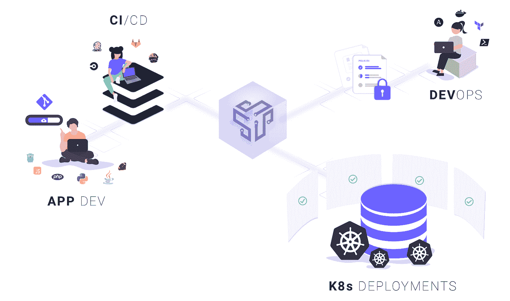
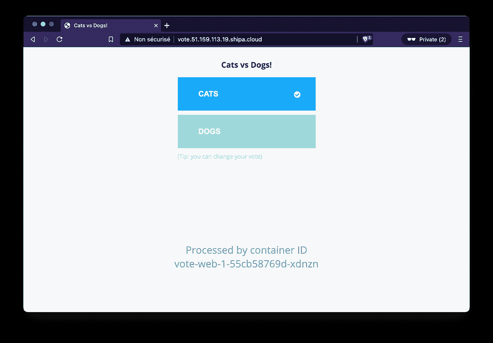
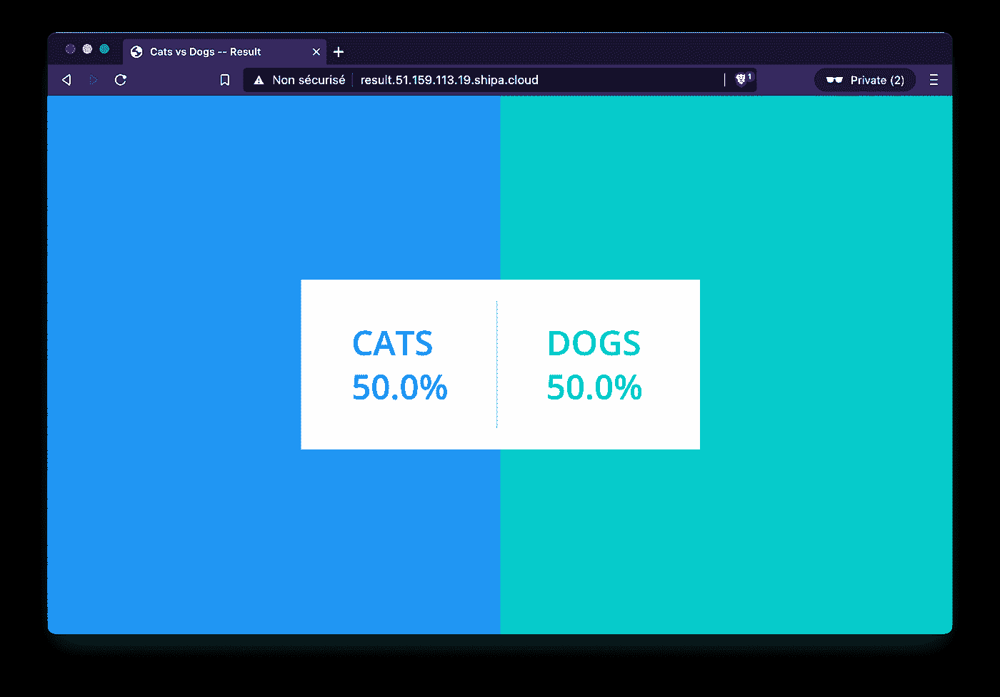
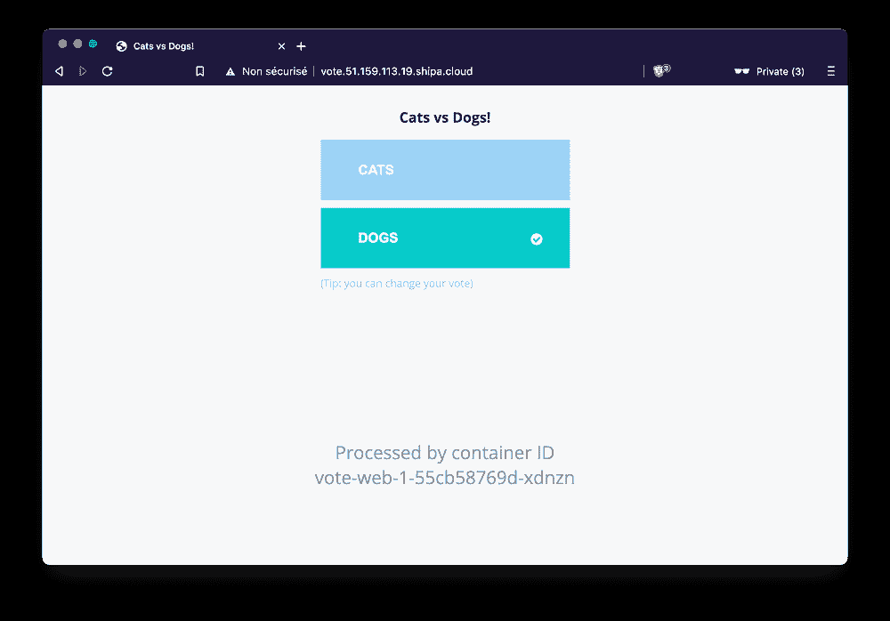
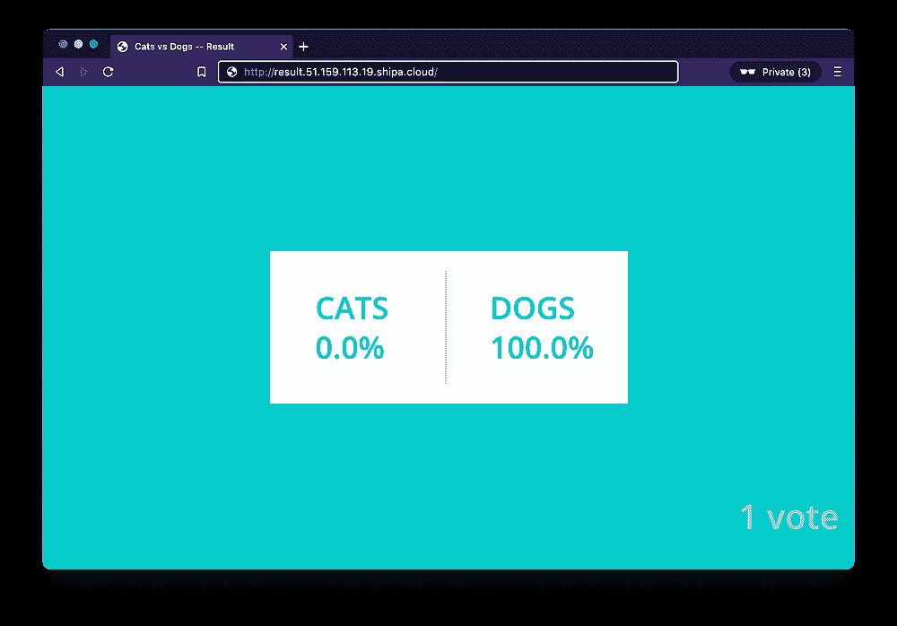

# 在 Shipa 上部署 VotingApp

> 原文：<https://itnext.io/deploying-the-votingapp-on-shipa-2af9c6097bb3?source=collection_archive---------3----------------------->

## 专注于应用，忘记 Kubernetes 的内部


琼·加梅尔在 [Unsplash](https://unsplash.com/s/photos/application?utm_source=unsplash&utm_medium=referral&utm_content=creditCopyText) 上的照片

如果您是一名开发人员，您可能已经被要求在 Kubernetes 集群上部署您的应用程序。你可能已经意识到这不是一件容易的事情，尤其是如果你对 Kubernetes 了解不多的话。Kubernetes 是一个庞然大物，知道如何定义(一路 YAML)和操作它提供的基本资源(Pod、部署、服务、配置图、机密等)并不简单，更不用说更高级的资源(网络策略、RBAC 相关资源等)。

今天，Kubernetes 无疑是运行容器化应用程序的首选解决方案。但是，作为开发者，大部分时候你不需要(也不想？)来了解它所有的内部细节。这就是创建 Shipa 的原因:让开发人员无需学习 Kubernetes 就可以轻松地在 Kubernetes 上部署应用程序。

在本文中，我们将展示如何通过使用 Shipa 在 Kubernetes 中部署 VotingApp 的版本 1，这是一个演示微服务应用程序。

ℹ️如果你不知道 VotingApp，请查看[这篇介绍该应用程序及其不同版本的短文](https://lucjuggery.medium.com/the-votingapp-reloaded-e4f237b8f3bf)

# 关于 Shipa

Shipa 被定义为“以开发者为中心的应用管理框架”。它抽象了底层云和 Kubernetes 基础设施，以便开发人员可以忘记集群和对象，而专注于应用程序部署。简而言之，Shipa 旨在使开发人员在生产中无需了解 Kubernetes 就可以简单地在 Kubernetes 上运行他们的代码。

Shipa 引入了称为**框架**的登陆平台的概念，代表 CI/CD 管道(或从命令行手动推送的代码)交付应用程序代码的目的地。当代码到达 Shipa 时，这些框架跨多个 Kubernetes 集群创建必要的应用程序对象。它们还运行安全扫描、附加策略、管理资源限制、生成应用程序指标等。



Shipa 需要安装在 Kubernetes 集群上，目前支持以下集群:

*   内部
*   迷你库贝
*   GKE(谷歌 Kubernetes 引擎)
*   Azure Kubernetes 服务
*   EKS(亚马逊弹性 Kubernetes 服务)
*   Oracle Kubernetes 引擎
*   RKE(牧场主 Kubernetes 发动机)

在本文中，我们不会深入介绍配置集群的过程，也不会在集群上安装 Shipa，因为已经有几篇文章详细介绍了这些不同的步骤。我们将假设我们可以访问配置了上述列表中的解决方案的集群，并在该集群上安装和配置了 Shipa。

一个**平台**是另一个 Shipa 概念，它被定义为“一个定义良好的包，为一种语言或框架安装了依赖关系”。每个微服务都需要在一个平台内运行，这个平台可以看作是一个包含应用程序运行时及其所有依赖项的环境(定义为 Dockerfile)。Shipa 已经预建了以下平台:

*   去
*   Java 语言(一种计算机语言，尤用于创建网站)
*   节点. js
*   服务器端编程语言（Professional Hypertext Preprocessor 的缩写）
*   计算机编程语言
*   红宝石
*   静态
*   。网

注意:Shipa 还允许创建额外的平台。例如，如果预构建平台中提供的运行时版本与“旧”应用程序所需的版本不匹配，则可能需要这样做。

在接下来的部分，我们将展示如何直接使用各个微服务的源代码在 Shipa 上部署投票 App。它们中的每一个都将被视为 Shipa 中的一个**应用**，并将运行在一个**平台**之上。

# 投票应用的部署

假设您是 VotingApp 的开发人员，现在还负责在 Kubernetes 集群上部署该应用的所有微服务。但是(有一个但是)你不知道 Kubernetes 是如何工作的，现在肯定没有时间去学习它。

你真的很幸运，因为:

*   Kubernetes 管理员已经在集群上安装了 Shipa，所以您根本不需要学习 Kubernetes，因为 Shipa 会为您处理所有的部署工作
*   数据库管理员已经在集群中部署了一个 Redis 和一个 Postgres 实例(通过 Kubernetes 部署和它们各自的服务)，因此您不必管理应用程序不依赖的那些组件
*   Shipa 管理员将您添加到 shipa-admin-team 中(在真实的生产环境中，您可能会被添加到开发团队专用的组中)

对于每个微服务，您需要遵循以下步骤:

*   启用包含应用程序所需运行时的平台(与开发微服务所用的语言相关)
*   向 Shipa 提供一些信息，以便它知道如何构建这段代码(以防您使用的结构不那么通用)
*   提供 Shipa 运行应用程序所需的命令
*   发送代码，让 Shipa 为您管理部署

听起来很简单，对吗？实际上，你会发现事情就是这么简单！

注意:您将使用 Shipa CLI 客户机手动部署整个应用程序，以便了解整个过程。在现实世界中，您可能需要自动化 CI/CD 管道中的一切(这可能是未来文章的主题)。

首先要做的是使用命令行登录，提供管理员给你的凭证。

```
$ shipa login
```

登录后，您就可以使用 Shipa CLI 部署您已经开发了很久的 VotingApp 了。

# 投票微服务

首先，你会考虑投票微服务。这个是用 Python 开发的(顺便说一下，这是个不错的选择)，所以第一步是在 Shipa 中启用 Python **平台**。

注意:这个微服务的代码可以在库【https://gitlab.com/voting-application/vote.git[的 **v1** 分支中找到](https://gitlab.com/voting-application/vote.git)

使用以下命令为 python 应用程序创建平台:

```
$ shipa platform add python
Platform successfully added!
```

接下来，在 python 平台中创建一个投票应用程序:

```
$ shipa app create vote python -t shipa-admin-team
App “vote” has been created!
Use app-info to check the status of the app and its units.
```

在将应用程序代码推送到 Shipa 之前，您需要提供一些附加信息，以便 Shipa 知道如何按照您需要的方式运行应用程序。这些信息可以通过 Procfile 提供。

在投票微服务的根文件夹中添加一个名为 **Procfile** 的文件，其内容如下:

```
web: gunicorn app:app -b 0.0.0.0:$PORT --log-file —-access-logfile —-workers 4 --keep-alive 0
```

注意: **web** 关键字在这里很重要，因为它确保 Shipa 创建一个端点来向外界公开应用程序

接下来，使用以下命令在 *vote* 文件夹中部署代码:

```
$ shipa app deploy -a vote -f .
```

在幕后，Shipa 使用这个 Python 应用程序的 requirement.txt 来安装所需的依赖项。然后，它使用 Procfile 中定义的命令运行应用程序。部署应用程序只需要几十秒钟。

注意:Shipa 还允许立即部署 Docker 映像，而不是应用程序的代码。投票应用程序可在[registry.gitlab.com/voting-application/vote:v1](http://registry.gitlab.com/voting-application/vote:v1)使用以下命令可以轻松部署图像:

```
$ shipa app deploy -a vote \
  -i registry.gitlab.com/voting-application/vote:v1
```

如果您运行 *shipa app-list* ，您将获得投票应用程序可用的 URL，在本例中，该 URL 为[http://vote . 51 . 159 . 113 . 19 . shipa . cloud](http://vote.51.159.113.19.shipa.cloud)。然后，您将能够访问*投票*仪表盘并选择一个项目:



注意:因为 Redis 已经部署在集群中，所以投票微服务使用它来持久化投票

# 结果微服务

正如您对投票微服务所做的那样，您首先需要为这个使用 Node.Js 开发的应用程序启用一个**平台**。

注意:这个微服务的代码可以在库【https://gitlab.com/voting-application/result.git[的 **v1** 分支中找到](https://gitlab.com/voting-application/result.git)

使用以下命令为 python 应用程序创建平台:

```
$ shipa platform add nodejs
Platform successfully added!
```

接下来，您创建将部署在这个新平台上的**应用程序**

```
$ shipa app create result nodejs -t shipa-admin-team
App “result” has been created!
Use app-info to check the status of the app and its units.
```

在推送应用程序代码之前，您需要添加一个 **Procfile** ，它指示运行应用程序的命令和需要创建的端点，以便向外部世界公开接口。不需要提供如何构建应用程序的信息，因为 Shipa 已经知道它需要从一个 *package.json* 文件安装所有的应用程序依赖项。

这个 Procfile 需要添加到结果微服务的根文件夹中，它包含以下指令:

```
web: node server.js
```

接下来，您可以在*结果*文件夹中部署运行以下命令的代码:

```
$ shipa app deploy -a result -f .
```

在幕后，Shipa 使用这个 Node.js 应用程序的 *package.json* 文件来安装所需的依赖项。然后，它使用 Procfile 中定义的命令运行应用程序。部署应用程序只需要几十秒钟。

使用 *shipa app-list* 命令，您将获得结果应用程序可用的 URL，在本例中，URL 为[http://result . 51 . 159 . 113 . 19 . shipa . cloud](http://result.51.159.113.19.shipa.cloud)。然后您将能够访问*结果*仪表板:



注意:由于当前没有部署 worker，投票不会在投票应用程序和结果应用程序之间传播。为了使整个流可用，您还需要部署 worker 应用程序。

# 工人微服务

工人在发展。Net 和 Java，下面我们将展示如何依次部署每个版本。

注意:这个微服务的代码可以在 https://gitlab.com/voting-application/worker.git 的资源库中找到

## 工人进来了。网

就像你之前做的几次一样，你首先需要创建一个**平台**来处理。NET 应用程序。

这里有一个有趣的事情:默认预建。NET 平台基于版本 5.0.4，但是由于 VotingApp 相当旧，它不能在那个版本上工作，需要 dotnet 3.1 来代替。这不成问题，因为也可以在 Shipa 中添加特定的平台(在预构建的平台之上)。

感谢 Shipa 团队专门为这个演示创建了一个. NET 3.1 平台，这个新平台打包在 [Docker Hub](https://hub.docker.com/r/shipasoftware/dotnet-3.1) 中的*Shipa software/dot NET-3.1:v 1.2*容器映像中。

以下命令启用。NET 3.1 平台:

```
$ shipa platform add dotnet-31 \
  -i docker.io/shipasoftware/dotnet-3.1:v1.2Platform successfully added!
```

接下来，您创建将与该平台一起部署的**应用程序**:

```
$ shipa app create worker-dotnet dotnet-31 -t shipa-admin-team
App “worker-dotnet” has been created!
Use app-info to check the status of the app and its units.
```

您需要提供一些附加信息来告诉 Shipa 如何构建和运行这个新的应用程序。这是通过两个附加文件完成的:

*   yml:它告诉 shipa 需要如何构建应用程序。对于没有通用结构的应用程序，Shipa 不可能知道默认情况下如何处理应用程序源代码。该步骤中使用的 shipa.yml 文件定义了。NET app 需要搭建:

```
hooks:
  build:
  - dotnet restore
  - dotnet publish -c Release -o out Worker.csproj
```

*   Procfile 定义了运行。NET 版的 worker

```
worker: dotnet out/Worker.dll
```

将这两个额外的文件添加到存储库中后，您就可以使用从 *worker* 文件夹运行的以下命令来部署代码了:

```
$ shipa app deploy -a worker-dotnet -f ./dotnet
```

注意:也可以直接部署容器映像，而不是代码。

既然已经部署了投票、结果和工作者微服务，就可以从投票界面投票并查看结果了。



在下一步中，我们将展示如何部署 Java 版本的 worker，而不是。网一。

## Java 中的工人

正如您对其他微服务所做的那样，您首先需要为这个 java 应用程序启用一个**平台**:

```
$ shipa platform add java
```

然后创建一个将使用该平台的应用程序

```
$ shipa app create worker-java java -t shipa-admin-team
```

**就像你所做的一样。NET 版本，在部署应用程序代码之前，您需要使用两个附加文件向 Shipa 提供信息:**

*   **yml:它定义了如何调用 maven 来编译工作者的 Java 代码**

```
hooks:
  build:
    - mvn dependency:resolve && mvn verify && mvn package
```

*   **Procfile:它告诉 Shipa 需要调用哪个命令来运行应用程序**

```
worker: java ./target/worker-jar-with-dependencies.jar
```

**创建了这两个附加文件后，您可以在 *worker* 文件夹中部署运行以下命令的代码**

```
$ shipa app deploy -a worker-java -f ./java
```

**既然已经部署了投票、结果和工作人员微服务，就可以从投票界面投票并查看结果，就像我们为。网络版。**

# **删除应用程序**

**为了从 Shipa 中删除 VotingApp，您需要使用以下命令删除每个应用程序:**

```
$ shipa app remove -a vote$ shipa app remove -a result$ shipa app remove -a worker
```

# **关键外卖**

**着眼于开发人员方面，我们通过 Shipa 展示了一个示例微服务应用程序在 Kubernetes 集群上的部署。我们给出了需要提供给 Shipa(通过 Procfile 和/或 shipa.yaml 文件)的额外信息/元数据的示例，以便它知道如何构建和运行每个微服务，而无需更改代码。**

**一个开发人员不必关心幕后发生了什么，他/她只需要推送代码，让 Shipa 处理所有其他的事情。平台管理员负责通过 Shipa 配置每个应用程序，提供附加配置，定义图像扫描、网络策略等**

**在本文中，我们使用 Shipa CLI 来部署代码，这很方便，有助于理解核心组件，但这是一个手动过程。由于 GitLab 用于管理 VotingApp 的代码并定义每个微服务的持续集成(CI)管道，下一步将是让该管道负责在自动化持续部署(CD)步骤中将应用程序发送到 Shipa。这可能是另一篇文章的目的。**