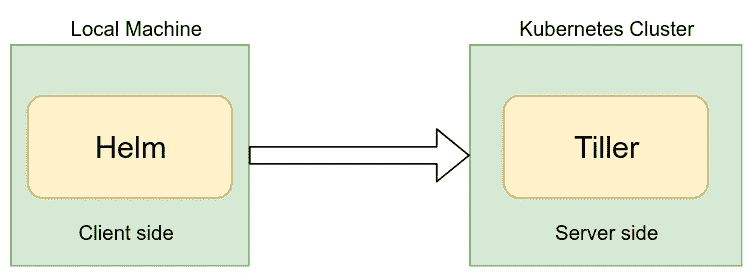
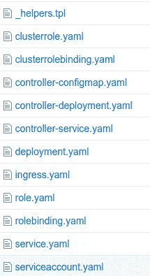

# 使用 Helm2 部署到 Kubernetes

> 原文：<https://itnext.io/deploying-to-kubernetes-using-helm-313af95eadf2?source=collection_archive---------3----------------------->

这篇文章将指导您使用 Helm 创建 Kubernetes 资源并将其部署到集群中。如果你对赫尔姆一无所知，没关系。完全不会有问题。在这篇文章的结尾，你将会对如何使用 helm 有一个很好的了解。

**什么是圣盔？**

Helm 是 Kubernetes 的包装经理。Helm 允许您非常轻松地开发和维护最复杂的部署。相信我，这很容易。好吧，我们继续。Helm 使用一种叫做*图表*的打包格式。一个**图表是描述一组 Kubernetes 资源的文件**的集合。图表可用于部署单个资源或多个资源。

假设您需要在集群中部署一个 Kubernetes pod 和一个服务。如果是，你做了什么？您将编写 deployment.yaml 和 service.yaml 文件，并使用下面的命令部署它们。

```
**kubectl apply -f <file-name>**
```

因为您有两个文件，所以您需要执行上述命令两次。在这种情况下，您需要部署 50 个 Kubernetes 资源，您必须对每个资源文件执行上述命令 50 次。然而，如果您有一个包含所有这 50 个资源文件的 helm 图表，您只需要**执行一个命令**来部署所有这 50 个文件！！有多简单？

当我们谈论舵的时候，我们不能忘记舵杆。Tiller 是运行在 Kubernetes 中的舵服务器，部署所有的舵图。因此，在使用 helm 在 K8S 集群中部署资源之前，还需要将 helm 安装到 Kubernestes 集群中。当您将 helm 安装到您的集群时，它将部署一个“**舵柄舱**”，处理所有的 helm 包。

**如何安装头盔？**



在开始使用 helm 作为您的 Kubernetes 包管理器之前，您需要将 Helm 安装到您的本地机器上，并在您的 Kubernetes 集群中安装 tiller pod，如上图所示。

**安装舵**:请使用[舵公文](https://helm.sh/docs/using_helm/#installing-helm)将舵安装到您的机器上。

**部署 Tiller** :如果您可以在本地机器上使用“kubectl”命令连接到您的 k8s 集群，那么在您的 Kubernetes 集群上部署 tiller pod 就非常容易了。只需运行下面的命令在 K8S 集群中安装 tiller，

```
helm init
```

> **注意:**如果您在运行 helm init 命令时遇到以下错误，请使用[博客](https://medium.com/@madeeshafernando/error-release-name-failed-namespaces-default-is-forbidden-user-99b3b6cb2720)中提到的步骤来修复它。
> 
> "错误:释放 nginx-ingress 失败:命名空间" default "被禁止:用户" system:service account:kube-system:default "无法在命名空间" default "中的 API 组""中获取资源" namespaces " "

现在，您已经成功地配置了本地机器和 Kubernetes 集群来使用 Helm。

**建造舵轮图**

现在你可以开始玩头盔了。图表被组织成一个目录中的文件集合。首先，使用下面的命令创建图表结构。

```
helm create test-helm
```

现在进入“test-helm”目录，您可以看到下面的结构已经在该目录中创建。

```
├── charts
├── Chart.yaml
├── templates
│   ├── deployment.yaml
│   ├── _helpers.tpl
│   ├── ingress.yaml
│   ├── NOTES.txt
│   ├── service.yaml
│   └── tests
│       └── test-connection.yaml
└── values.yaml
```

在 templates 文件夹中，您可以看到两个名为 deployment.yaml 和 service.yaml 的文件。如果您在集群中安装了这个 helm chart，这两个文件将被部署到您的 Kubernetes 集群中。

这个目录中最重要的文件是 values.yaml 文件，因为它存储了模板目录中模板文件的变量。因此，让我们先看看 values.yaml 文件。下面显示了 values.yaml 文件的一部分，它位于我们之前刚刚创建的 test-helm 目录中。

```
# Default values for test-helm.
# This is a YAML-formatted file.
# Declare variables to be passed into your templates.replicaCount: 1**image:
  repository: nginx
  tag: stable
  pullPolicy: IfNotPresent**nameOverride: ""
fullnameOverride: ""service:
  type: ClusterIP
  port: 80ingress:
  enabled: false
  annotations: {}
    # kubernetes.io/ingress.class: nginx
    # kubernetes.io/tls-acme: "true"
  hosts:
    - host: chart-example.local
      paths: []
```

当你看上面文件的“image”块时，你可以看到 nginx:里面使用了 stable image。如果需要更改 deployment.yaml 文件的映像，只需更改 values.yaml 文件的“image”块部分。因为图像细节是从 values.yaml 文件提取到 deployment.yaml helm 模板文件的，如下所示。

```
...
.....
spec:
 containers:
 - name: {{ .Chart.Name }}
 image: "**{{ .Values.image.repository }}:{{ .Values.image.tag }}**"
 imagePullPolicy: {{ .Values.image.pullPolicy }}
.......
...
```

如您所见，如果查看完整的 deployment.yaml 文件，您可以清楚地理解 values.yaml 文件中的变量在 helm 模板文件中是如何引用的。

同样，如果您需要使用 helm 向集群部署更多的资源，只需将这些 YAML 文件插入到模板文件夹中。



正如您在上面看到的，您可以使用 helm 在集群中创建任何 k8s 资源。它可以是部署、服务、角色、服务帐户或任何可以在 k8s 集群中部署的资源。

**安装舵图**

一旦创建了舵图，只需一个命令就可以将其安装到集群中。进入我们刚刚在上面创建的“test-helm”目录，运行下面的命令，

```
helm install --name my-helm-deployment .
```

这将部署您放在模板文件夹中的所有 YAML 文件。这就是为什么我一开始就告诉你，你可以从一个 helm 命令部署任意数量的 Kubernetes 资源。

希望这篇文章能消除你对 helm 的所有疑虑:)

快乐驾驶！！！