# 将 Blazor 应用程序部署到 Azure

> 原文：<https://itnext.io/deploying-your-blazor-application-to-azure-be0cd568ab31?source=collection_archive---------2----------------------->

*本文是我和 ondřej·波里斯* *的系列文章的一部分。为了赶上进度，请查看以前的* [*文章*](#e90d)

> *您已经使用 ASP.NET 的最新功能 Blazor 创建了一个令人惊叹的交互式 web 应用程序，但是现在呢？你如何向世界展示你所有的努力？你在哪里举办？你怎么去那里？*

在本文中，我们将向您展示如何将您的 Blazor 应用程序部署到微软的云计算服务 Azure。我们还将使用 Visual Studio 2019 来发布/部署应用程序。Visual Studio 提供了将应用程序部署到集成开发环境(IDE)中的文件夹、IIS、Azure 或其他目标的能力，从而减少了将应用程序呈现给用户所需的步骤。

# 设置环境

在部署应用程序之前，我们需要创建和配置环境来保存和服务应用程序。我们将在 Azure 中使用属于免费层帐户使用的服务。要查看免费等级帐户上所有可用内容的列表，请点击[此处](https://azure.microsoft.com/en-us/free/)。

# 在 Azure 中创建 web 应用程序

登录 Azure [门户](https://portal.azure.com)。

在门户中，单击左侧菜单上的“+”符号。

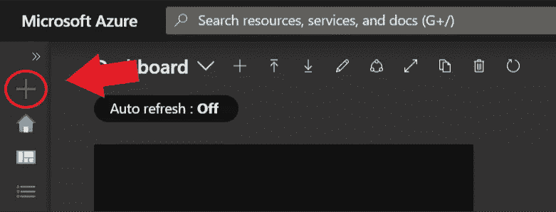

在市场中，搜索“Web App”，

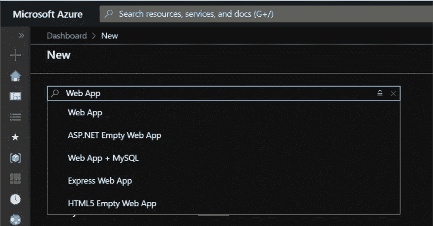

并点击“创建”。

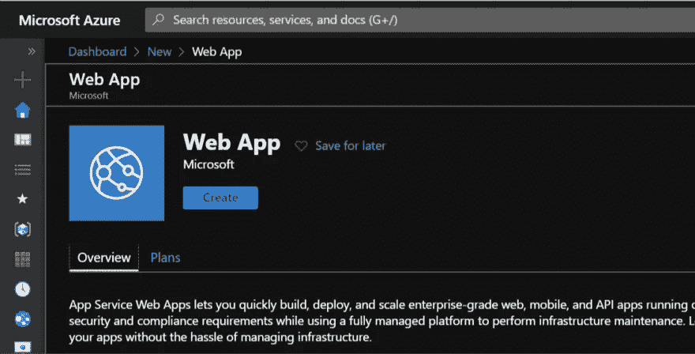

在“基本”选项卡上，确保选择了您希望使用的套餐。我们将创建一个新的资源组来包含我们的应用服务。资源组是共享相同生命周期、权限和策略的资源的集合。然后为我们的应用程序提供一个实例名。

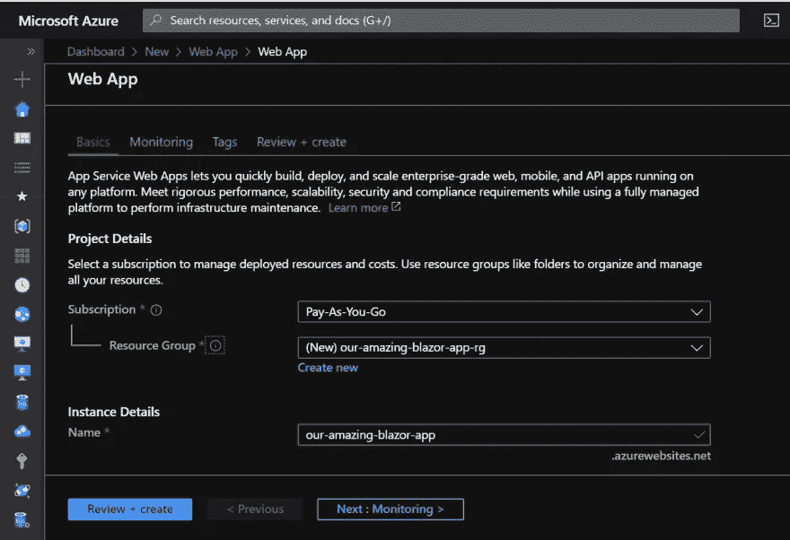

向下滚动页面，将“操作系统”更改为“Windows”，将“运行时堆栈”更改为。“网芯 3.0(当前)”。而。NET Core 3.1 (LTS)于 2019 年 12 月 3 日发布，在撰写本文时，Azure 上 Windows 下运行的 web 应用程序目前不支持最新版本的。开箱即用的 NET Core。不用担心，我们仍然可以运行最新版本的。NET Core 加上一点额外的配置。我们将在本文的后面对此进行配置。

保留其余选项的默认值。

*注:。NET Core 3.1 (LTS)可用于 Azure 上的 Linux 操作系统。*

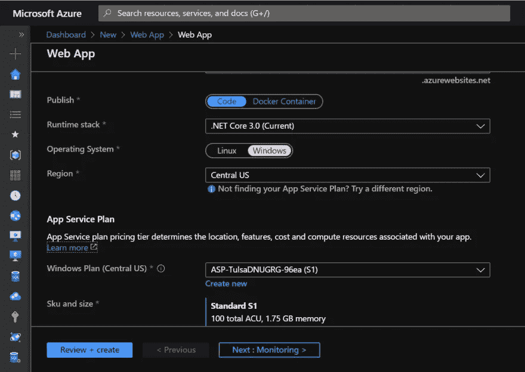

现在点击“查看+创建”

验证所有选项是否正确，然后单击“创建”。这启动了 Azure 中的自动化过程，该过程在选定的区域数据中心内创建 web 应用环境。根据数据中心内的当前负载，此过程可能需要几分钟时间。

部署完成后，单击“Go to resource”导航到新创建的资源。

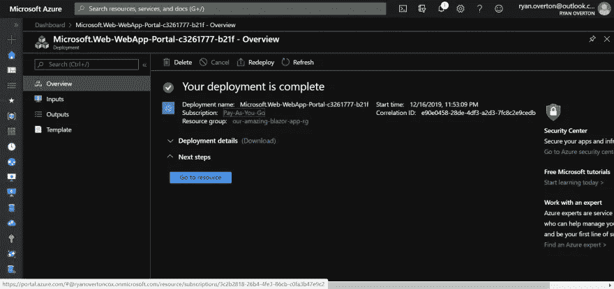

# 正在配置。NET Core 3.1 (LTS)支持

随着我们的 web 应用程序的创建，我们现在可以配置对。网络核心 3.1 (LTS)。在 web 应用程序中，导航到“扩展”选项卡，然后单击“添加”以打开“添加扩展”窗口。

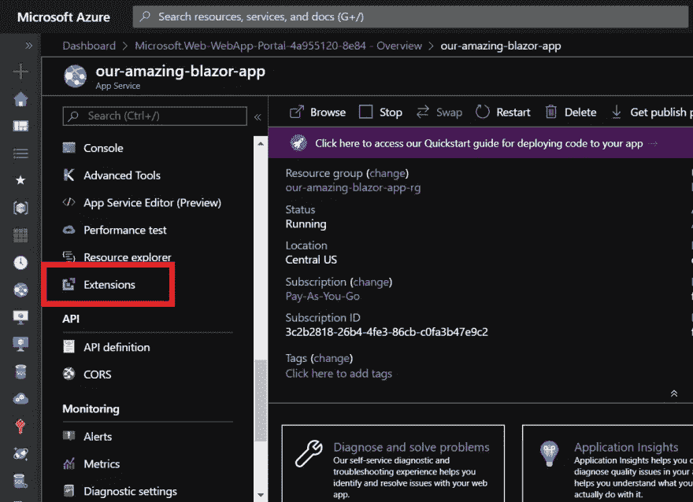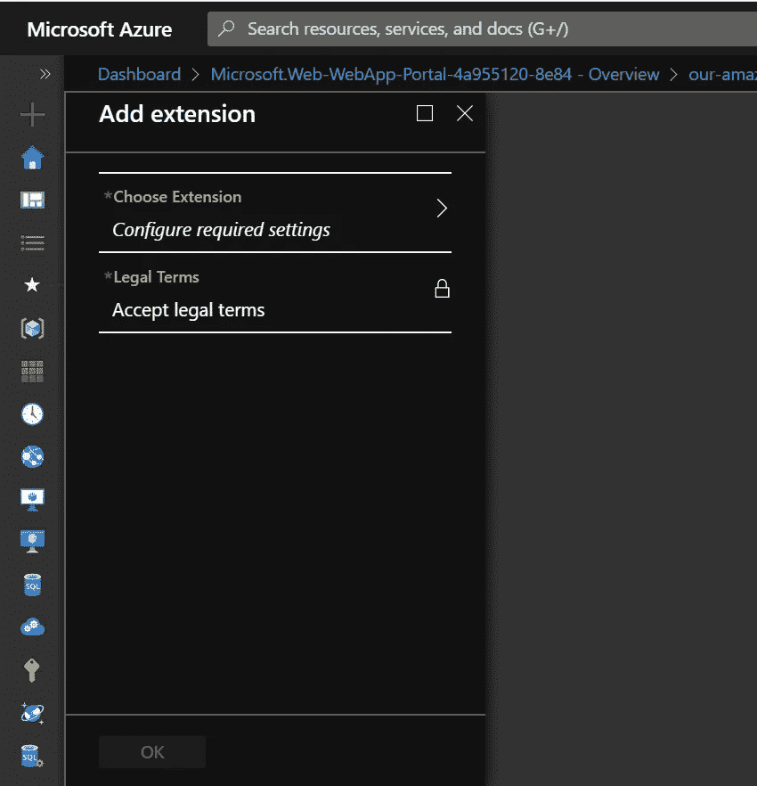

点击“选择扩展”并选择“ASP。NET Core 3.1 (x64)运行时”。

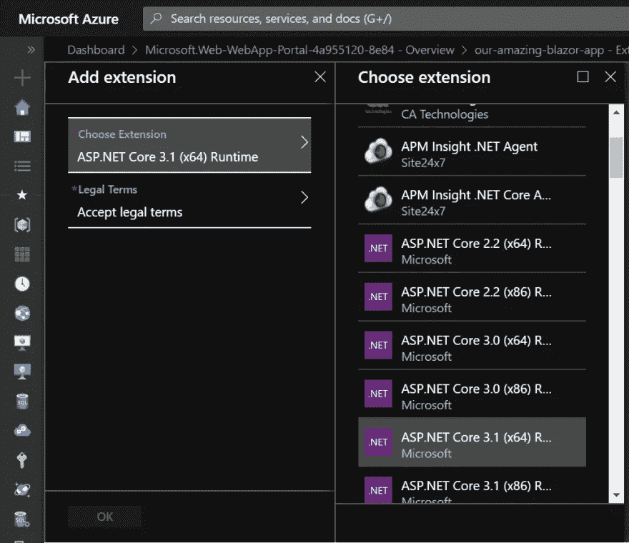

单击“法律条款”，然后单击“确定”接受条款。

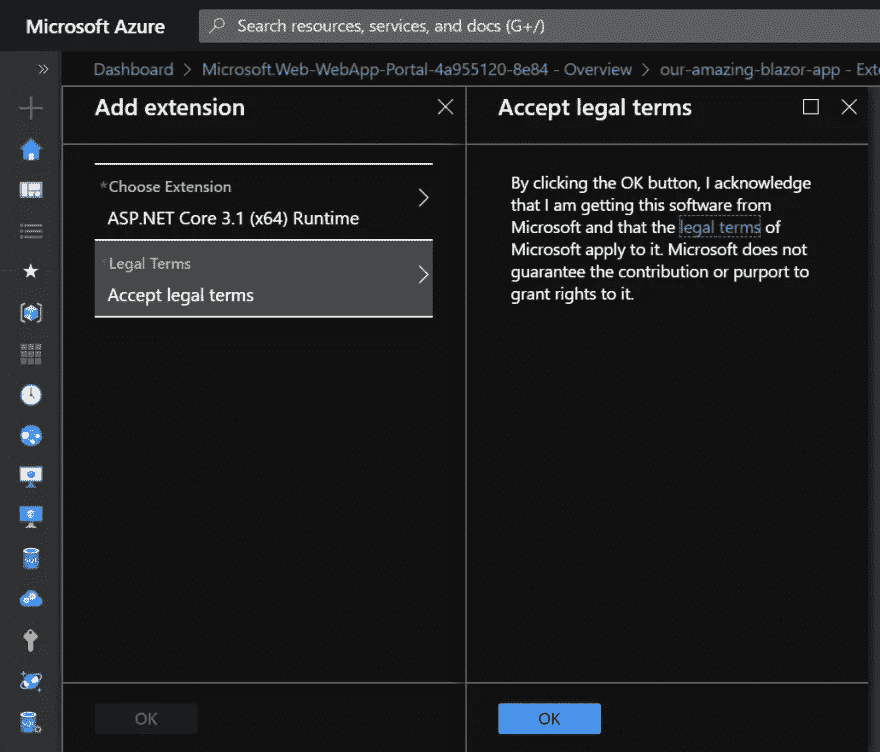

现在点击“添加扩展”窗口下的“确定”。

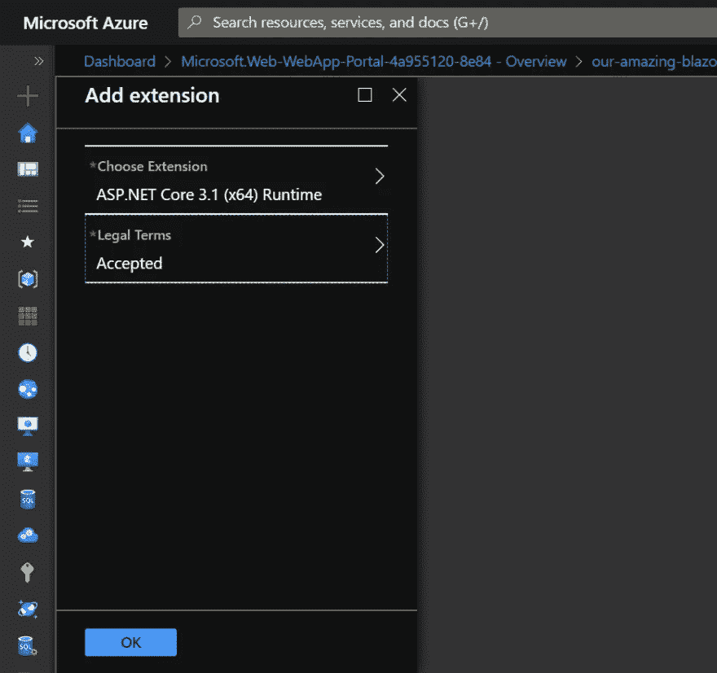

有了添加到 web 应用程序中的扩展，我们可以运行需要。NET Core 3.1，而不必等待 Azure 的支持。当想要测试仅在预览版中可用的新功能时，也可以使用相同的过程。NET 核心，像 Blazor Web Assembly。

在将 Blazor 应用程序发布到 Azure 之前，我们还需要完成一个步骤:将配置更新到 x64。我们必须这样做，因为我们为安装了 x64 扩展。网芯 3.1。

导航到左侧菜单中的“配置”，选择“常规”选项卡，并将“平台”更新为“64 位”。

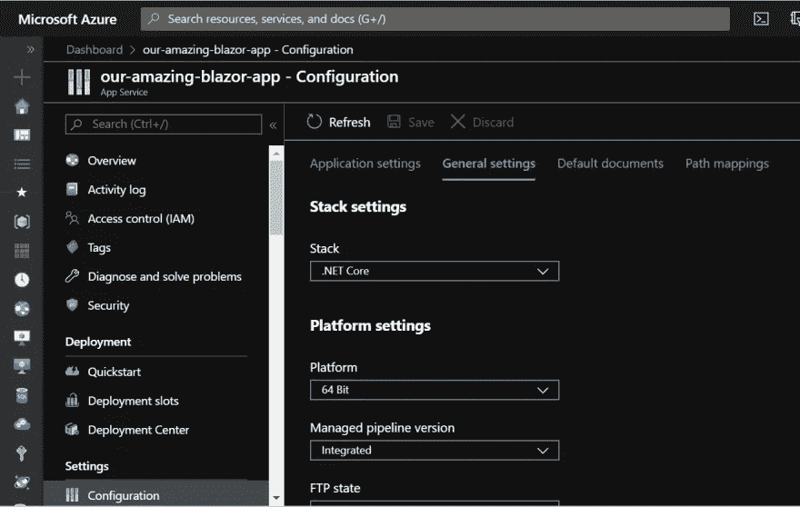

# 部署 Blazor 应用程序

随着 Azure 环境的创建和配置，我们现在已经准备好向它部署 Blazor 应用程序了。我们正在部署的应用程序可以从这里下载/克隆。我们还将从我们的 Azure web 应用服务中获取另一个文件，publish profile。

导航到左侧菜单上的“概述”，然后单击“获取发布配置文件”。

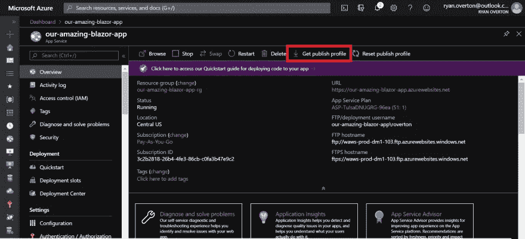

发布配置文件包含 Visual Studio 将应用程序部署到 Azure 所需的所有信息(FTP 位置、凭据)。

现在，在 Visual Studio 2019 中打开上一步克隆的 Blazor 应用程序。右键单击项目“awesome-blazor-app”，然后单击“发布”。

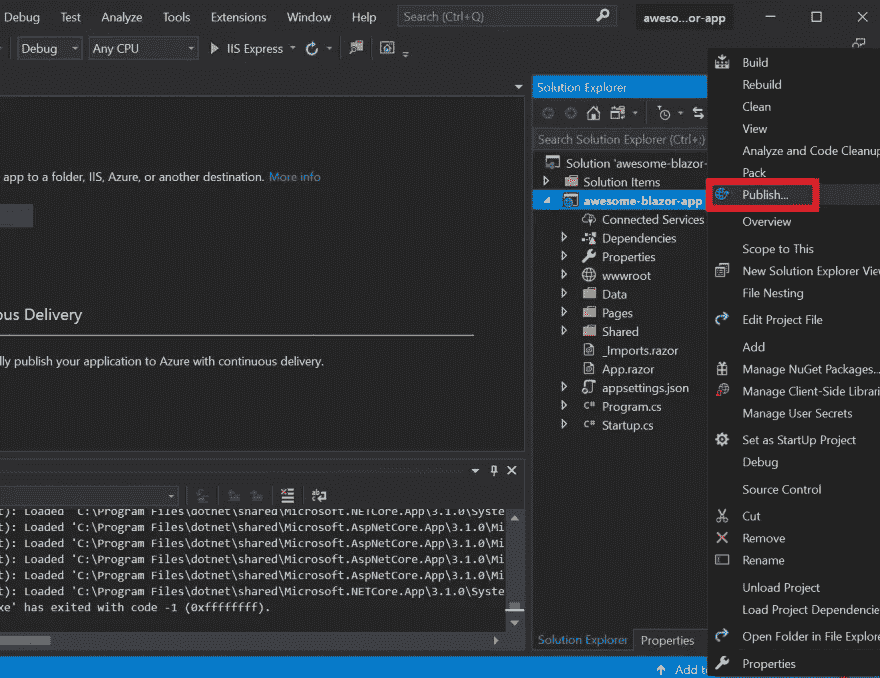

点击“导入配置文件…”并导航到您几个步骤前从 Azure 下载发布配置文件的位置。选择设置文件，然后单击导入。

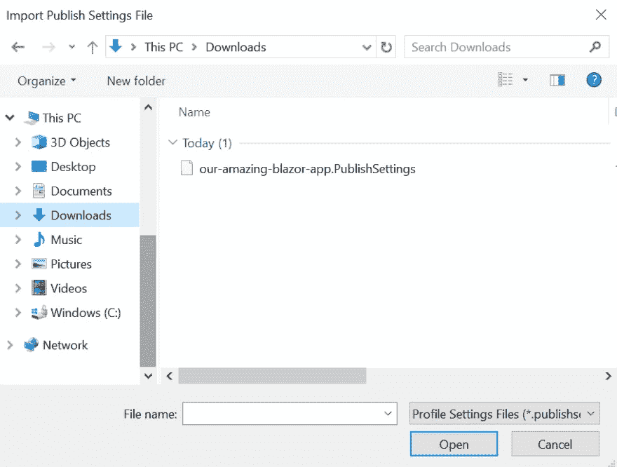

导入发布配置文件后，单击“发布”。这将启动 Visual Studio 发布过程，该过程将在发布模式下构建应用程序，并在成功构建后，将文件 FTP 到我们之前创建的 Azure web 应用程序服务，并在您的默认浏览器中启动我们的站点。

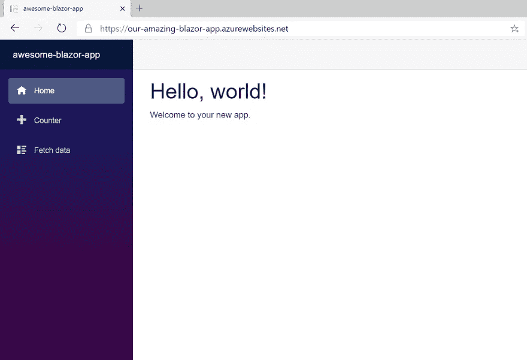

# 摘要

在本文中，我们学习了如何在 Azure 中创建 web 应用程序环境来支持 Blazor 应用程序，以及如何将 Blazor 应用程序从 Visual Studio 发布到我们的 Azure web 应用程序环境中。我们还学习了如何在 Azure 中使用扩展来扩展对。NET Core 3.1 (LTS)到我们的 web 应用程序。这很好，但是不太容易维护，尤其是在团队环境中。我们将在下一篇文章中解决这个问题，我们将自动化整个构建和发布过程，消除瓶颈和部署孤岛。

## **系列其他文章:**

1.  [每个人都在谈论的这个布拉索是什么？](https://medium.com/@ryan.overton/what-is-this-blazor-everyones-talking-about-34529a3e1419)
2.  [如何用 Blazor 打造互动 SPA](/how-to-build-an-interactive-spa-with-blazor-a030bae66b68)
3.  [使用 Blazor 和地理定位功能避免停车罚款](/avoiding-parking-fines-with-blazor-and-geolocation-d45a9a831d93)
4.  将 Blazor 应用程序部署到 Azure
5.  将 Blazor 应用程序的构建和部署自动化到 Azure

*最初发布于 2020 年 1 月 3 日*[*https://dev . to*](https://dev.to/onyxprime/deploying-your-blazor-application-to-azure-4b72)*。*