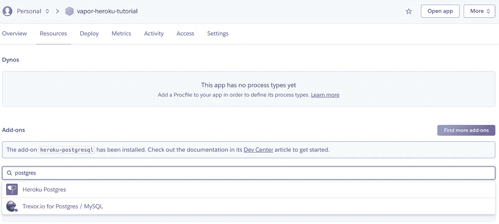
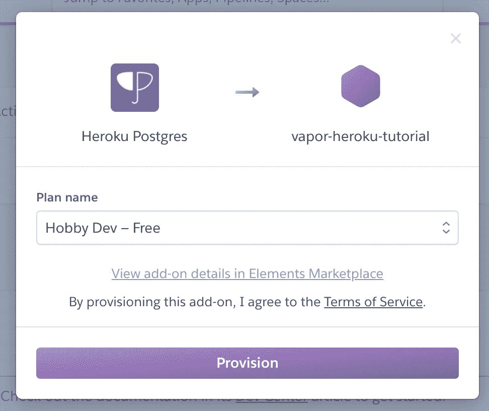

# 将您的 Vapor 4 应用程序部署到 Heroku

> 原文：<https://itnext.io/deploying-your-vapor-4-app-to-heroku-48b26f9f46cb?source=collection_archive---------1----------------------->


你已经完成了你那令人敬畏的 [Vapor 4 应用](https://vapor.codes)的构建。但现在是时候让世界欣赏你的工作了。这意味着您将面临下一个挑战:让您的应用程序上线。

有许多方法可以部署您的应用程序。您可以在 VPS 上运行它，在 Docker 容器中运行它，甚至使用 Kubernetes 编排整个集群。在部署应用程序时，这些都是可行的选择。但是等等……我们不想弄脏自己的手，去摆弄容器、代理、监管器等等。我们只是想把这段漂亮的代码放到网上。

这就是 Heroku 进入游戏的地方。Heroku 是一个 PaaS(平台即服务)。它会为你处理各种事情。它将安排 TLS，允许你查看你的应用程序的日志，监控流量等等。

首先去 Heroku 注册你的免费账户。完成后，安装 CLI，从您的终端舒适地与 Heroku 通信。

```
$ brew tap heroku/brew && brew install heroku
```

安装后，运行`heroku login`并遵循说明。它们应该不言自明。

登录后，我们可以创建一个新的应用程序。

```
$ heroku create vapor-heroku-tutorial --region eu
```

区域参数是可选的，默认为`us`。该名称将是可以访问您的应用程序的子域。

接下来，我们希望将 Heroku 应用程序连接到本地 git 存储库。你可以通过跑步做到这一点

```
$ heroku git:remote -a vapor-heroku-tutorial
```

当然，别忘了用你自己的应用程序名替换`vapor-heroku-tutorial`。如果您还没有本地 git 存储库，请先运行`git init`。

现在我们已经连接好了，我们需要创建一个 Procfile。Heroku 使用这个 Procfile 来启动您的应用程序。所以继续创建你的 Procfile `$ touch Procfile`。Procfile 的内容应该如下:

```
web: Run serve --env production --hostname 0.0.0.0 --port $PORT
```

那里发生了很多事情，所以让我们来看一下。

首先，我们定义过程的类型。在这种情况下，它是一个 web 过程，因为我们希望使用 HTTP 向外界公开我们的应用程序。有多种进程可用于各种任务，但这是我们希望用于应该可以从外部访问的应用程序的一种。其他类型的进程例如可以是运行计划任务的工人。

之后，我们定义 Heroku 应该执行什么命令来启动我们的应用程序。我们想要启动在我们的`Package.swift`文件中定义的`Run`可执行文件，并且我们想要`serve`我们的应用程序。接下来是一些用来配置我们的应用程序的标志。我们希望在生产环境中运行它，以获得适当的日志记录和行为。我们定义主机名，最后定义我们想要绑定的端口。当使用 Xcode 运行您的应用程序时，它会自动绑定到端口 8080。然而，Heroku 为我们决定的端口可能会有所不同，并不能保证是 8080。为了解决这个问题，Heroku 提供了一个`PORT`环境变量，我们可以使用它来绑定。

将该文件添加到 git 存储库中。

```
$ git add Procfile
$ git commit -m "Added Procfile"
```

现在我们都设置好了，我们想部署我们的应用程序。然而，如果我们运行命令`git push heroku master`，我们将面临一个严重的错误。

```
remote: Building source:
remote:
remote:  !     No default language could be detected for this app.
remote:    HINT: This occurs when Heroku cannot detect the buildpack to use for this application automatically.
remote:    See [https://devcenter.heroku.com/articles/buildpacks](https://devcenter.heroku.com/articles/buildpacks)
remote:
remote:  !     Push failed
remote: Verifying deploy...
remote:
remote: ! Push rejected to vapor-heroku-tutorial.
remote:
To [https://git.heroku.com/vapor-heroku-tutorial.git](https://git.heroku.com/vapor-heroku-tutorial.git)
! [remote rejected] master -> master (pre-receive hook declined)
error: failed to push some refs to 'https://git.heroku.com/vapor-heroku-tutorial.git'
```

该错误实际上是不言自明的，因为它表明 Heroku 无法检测到您的构建包。Heroku 使用 buildpack 来决定你的应用程序应该如何构建。因为你输入的代码当然可以包含任何内容。对于所有 Heroku 关心的，你可以推动一个 Perl 应用程序。

幸运的是，一些优秀的贡献者和 Vapor 爱好者为 Vapor 维护了一个 [Heroku buildpack。所以我们可以通过运行`heroku buildpacks:set vapor/vapor`将它添加到我们的应用程序中。如果我们现在再次推送 Heroku，它将开始构建我们的应用程序。](https://github.com/vapor-community/heroku-buildpack)

```
$ git push heroku master
```

这可能需要一段时间，但至少我们可以坐下来放松一下。

一旦你喝完咖啡，写好备忘录，重新摆放好茶杯。您应该会看到一条可爱的消息，说明您的应用程序已经部署好了。

```
https://vapor-heroku-tutorial.herokuapp.com/ deployed to Heroku
```

所以现在我们可以点击网址，看看我们可爱的作品！

# 数据库

对于一个静态应用程序来说，我们能享受的乐趣就只有这么多了。所以让我们进入稍微高级一点的东西:向我们的应用程序添加一个数据库。

伟大的事情是，Heroku 也有一些伟大的内置支持这一点！他们有自己的托管 Postgres 数据库。外部提供者也支持其他数据库类型，但是为了简单起见，我们将使用本地支持的数据库。

为了向您的应用程序添加一个简单的 Postgres 数据库，我们返回到我们的终端并运行以下命令:

```
$ heroku addons:create heroku-postgresql:hobby-dev
```

这个命令的作用是用免费计划`hobby-dev`为你的类型`heroku-postgresql`的应用程序创建一个新的附加组件，现在应该足够了。

如果你对你的终端不太适应，你也可以去 Heroku 仪表板，导航到你的应用程序的“资源”标签，并添加我们的免费爱好 Postgres 数据库。



我们现在将选择免费选项

一旦数据库被提供，它将被添加到资源列表中。但是我们如何联系呢？

就像 Procfile 中的`PORT`环境变量一样，也有一个连接到数据库的环境变量。当我们运行命令`$ heroku config`时，我们将看到为我们的应用程序定义的所有变量。正如你将看到的，有一个`DATABASE_URL`变量，我们可以用它来连接到我们新创建的数据库。

**请注意你千万不要！复制该环境变量的值，或者将其存储在代码中的任意位置。**

这个环境变量将在 Heroku 运行我们的应用程序时出现，因此我们可以使用它来连接到我们的数据库，而不必将这些高度敏感的信息存储在任何地方。我们可以在 Vapor 中使用`Environment`对象读取环境变量。

我总是喜欢用所有的变量为环境创建一个扩展。它使它们很好地聚集在一起，并给出很好的概述。

然后，我们可以使用这个属性连接到 configure.swift 文件中的数据库。

如果我们提交并部署它。一切都会很好，但我们的数据库不会有太多变化。

要向我们的数据库添加一个表，我们必须创建一个实体和迁移。有关说明，请参见:[https://docs . vapor . codes/4.0/fluent/overview/](https://docs.vapor.codes/4.0/fluent/overview/)

一旦我们设置了迁移和实体，我们就将迁移添加到迁移列表中。

然而，这仍然不会对我们的数据库产生任何影响。您可以像这样手动强制迁移:

在开发设置中，这很好，但是它将应用程序的运行与数据库迁移紧密耦合在一起。这可能会带来各种各样的麻烦。因此，请确保我们仅在开发时强制运行迁移:

但是现在最大的问题是，当不开发时，我们应该如何运行我们的迁移？

这就是我们之前讨论的 Procfile 中的另一种进程发挥作用的地方。Heroku 也有一个`release`过程类型。这个过程在[成功的应用构建](https://devcenter.heroku.com/articles/release-phase#when-does-the-release-command-run)上运行。

我们可以用这个来运行蒸汽`migrate`命令。我们可以用类似于`serve`命令的方式来执行它。但是，migrate 命令只会运行数据库迁移并完成。

我们编辑我们的 Procfile，如下所示:

```
release: Run migrate -y
web: Run serve --env production --hostname 0.0.0.0 --port $PORT
```

注意，我们添加了一个类型为`release`的新流程。

因为 migrate 命令不关心环境、主机、端口和所有这些东西，我们可以简单地称之为`Run migrate`。添加`-y`标志是为了直接确认我们在迁移时得到的确认。

如果我们提交并将其推送到 Heroku，我们可以在数据库查看器(可以从 Heroku 项目的 Resources 选项卡中访问)中看到我们新创建的表🎉

我希望这篇文章能够帮助您快速在 Heroku 上运行您的 Vapor 应用程序。

感谢阅读！我也活跃在推特和 Instagram 上，在那里我会发布一些技巧和窍门。