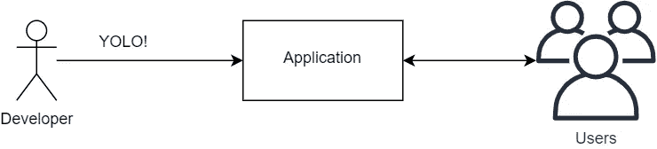
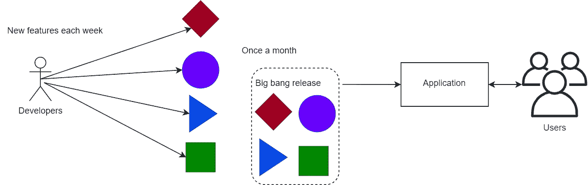
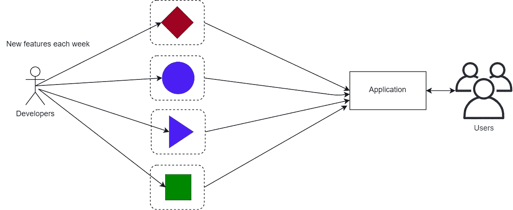
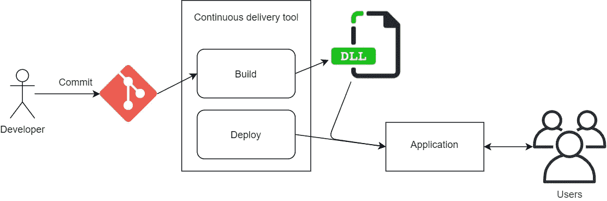
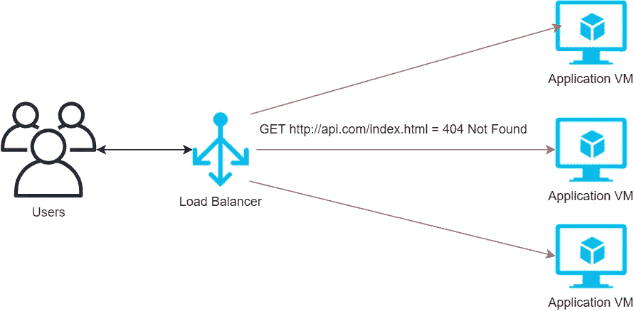
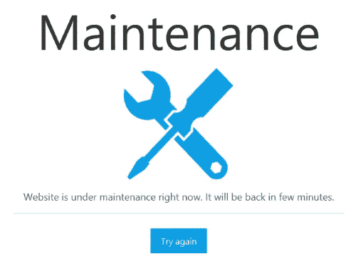
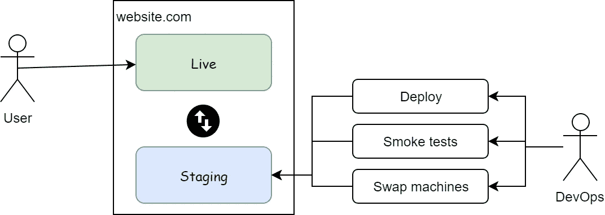
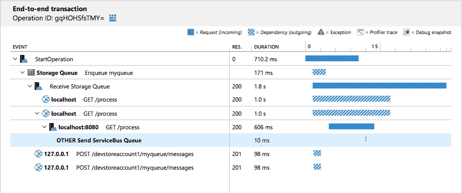
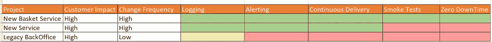

# 部署成熟度级别

> 原文：<https://itnext.io/deployment-maturity-levels-feab55c20d04?source=collection_archive---------2----------------------->

作为软件工程师，我们喜欢开发使客户生活更轻松的功能，但是在这些功能对最终用户可用之前，它不会增加业务价值。因此，部署过程是开发团队成功的重要部分。

凭借六年的连续交付经验，这是我对部署成熟度级别的分类:

# 0 级——YOLO(你只能活一次)

直接来自开发人员机器的部署图

部署过程非常简单；开发人员在他的机器上构建代码，复制并粘贴到生产服务器上。这可能会很快，这是证明一个概念的好方法，但从长远来看，这不是重复和不可审计的。

这也有一定的风险；部署后没有测试运行，所以开发人员必须手动测试。如果应用程序崩溃了，祈祷他能恢复生产环境。

生产系统这一级别的另一个方面是每月一次到两次的间隔部署。部署需要跨多个团队的协调，增加了用户获得某项功能的时间。因为多个团队维护一个代码库，所以这经常发生在 monoliths 上。

## **让我们谈谈每月部署一次。**

每月部署一次和每周部署一次哪个更安全？
假设开发团队每周可以开发一个单一的特性。

一旦我们立刻部署这些特性，许多变化同时发生，风险成倍增加，一旦事情出错，哪个特性导致了问题？有时甚至不是单一的特性问题，而是没有一起测试的多个变化的组合。

大爆炸式部署通常很难回滚，因为它们涉及多个应用程序和数据库。想象一下在你的星期六中断生产，没有一个简单的回滚；你会过得很艰难。

这是违反直觉的，但是通常部署小的变更会分散风险，以更可控的方式一点一点地进行。

编译版本的另一个问题是开发团队必须进行上下文切换。一旦他们完成了特性，它仍然没有被发布，有时在部署或测试过程中会发现问题，影响他们正在做的工作。作为开发人员，一旦我们试图记住一个月前开发的功能的目的，我们的记忆就会受到考验。

# 1 级—连续交付

具有提交、构建和部署工件步骤的连续交付图。

自动化构建和部署，通过 Powershell/Bash 脚本或使用 CI(持续集成)/CD(持续交付)工具，如 Octopus deploy、Circle CI 或 Azure DevOps。

我们可以通过点击一个按钮进入任何版本的应用程序。(这就是我们所说的持续交付的定义。

## **从 YOLO 到连续交付的过渡:**

一旦从手动部署转换，我保证部署过程中有步骤，只有部署的人知道。

**现实世界的例子**

这是很好的迷因

2015 年，我们在自动化 web API 部署，拥有庞大的客户群，所以我们等到黎明才开始第一次自动化部署。

在进行我们在测试环境中测试的自动化部署之前，一切看起来都很有希望，很棒。我们在凌晨 2 点进行了第一次部署，我通过浏览器检查了每台机器，API 正常工作。我很开心，也很自信。

凌晨 4 点，我们发现我们没有收到任何流量。困惑和绝望中，我们联系了我们的运营团队，他们正在和托管公司谈话。经过漫长的 2 个小时的煎熬，有人发现了问题；负载平衡器看不到我们的 web API 计算机。

负载均衡器将 ping 一个特定的 URL，如 http://api.com/index.html 的*并期待一个 200 OK，如果不是，它将从负载均衡器池中删除机器。*

负载平衡器不转发流量，因为 API 没有公开特定的 URL

原因是，部署人员总是记得在每次部署时复制并粘贴 index.html 文件，所以:

> 手动部署只有分步部署的人知道。

当然，第二天，我将该文件添加到源代码控制中，并且未来的部署不会有这个问题。

# 2 级–零停机时间

以前的模型虽然是自动化的，但对服务有一些干扰。这导致我们的用户看到这样的东西:

一旦我们的部署很少，这就很好，可能一个月一到两次在周末完成。但在数字化转型的世界里，我们的市场竞争更加激烈，新功能的发布速度很快，而且经常成为竞争优势。

你能想象在 Amazon.com 工作，并告诉高级管理层我们将每天部署三次，每次 5 分钟的维护窗口吗？这会很快让公司损失数百万美元。请记住，你是一个团队的一部分，亚马逊有数百个团队，想象一下如果每个人都喜欢每天部署，会造成多大的破坏。

> 这就是为什么我们有零停机时间的概念，这样我们就可以在不对最终用户造成干扰的情况下推出变更。

我们可以通过多种方式实现这一目标；两个常见的是:

**蓝/绿部署**

蓝色/绿色部署图

在蓝/绿部署中，您的生产环境将拥有应用程序的两个实例。一个是实时用户访问。另一个“暂存”是用于部署和测试的被动拷贝。

在我们将新版本部署到试运行后，我们可以预热应用程序以避免停机，并运行冒烟测试来验证应用程序是否正常。这是一个很好的安全网，这样你就不会因为错误的部署而破坏整个应用程序。

一旦我们对蓝色插槽感到满意，我们就可以用绿色插槽替换它，并开始发送流量。例如，我们可以在负载平衡器级别应用交换。

**金丝雀/滚动部署**

当您有多台机器时，Canary 部署会很有用。您以滚动的方式增量部署到它们。因此，您不必让应用程序离线，一次只部署一部分流量，从而将风险降至最低。

在部署下一批机器之前，我们还可以在下一阶段之前进行冒烟测试。

金丝雀部署术语来自采矿，一个危险的职业；在一些洞穴里，有毒气体会杀死矿工。所以他们会带着一只金丝雀(小鸟)，把它留在山洞里一会儿，如果它仍然没事，对他们来说就安全了。我们使用类似的方法，首先部署到一个子集。

# 第 3 级–持续部署

奥斯卡·萨顿在 [Unsplash](https://unsplash.com/s/photos/speed?utm_source=unsplash&utm_medium=referral&utm_content=creditCopyText) 上的照片

在这一点上，我认为做一个明确的区分是有用的:

*   持续交付——如第 1 级所述，它是在任何时间进入任何应用程序版本的能力。
*   持续部署——自动部署所有代码变更。

好吧，你有一个成熟的项目。您有很高的代码覆盖率，您相信您的测试套件会在构建/发布管道中发现问题。每一个代码的改变都是在没有任何人批准的情况下进入生产的。

一个小改动不到 30 分钟，甚至可能 10 分钟就可以投产。干得好！只要保证质量，我相信你会得到满意的顾客。

> 作者注:持续部署不是必须的，也许我甚至不会向每个客户推荐。

# **奖金**

尽管这些都不是持续交付的特定主题，但如果您想开发一个具有持续交付的微服务架构，您需要在以下领域提升自己的水平:

## 日志记录和指标

> 你不是超胆侠，如果你看不到它，你就不能解决它。

在这些级别中的任何一个级别，您都必须具备基本的日志记录能力。最好不要记录到您需要连接来远程检查日志的虚拟机文件。

最好你有一个工具来集中应用程序的日志，如果你有一个分布式的跟踪系统就更好了，在那里我们可以看到下游系统中用户请求的所有步骤。

端到端请求跟踪的应用洞察示例

## **报警**

在一个整体架构中，你有一个服务来确保它在工作。在微服务架构中，即使没有数百个，也有几十个。您需要一种方式来查看系统健康状况并获得相关警报。

如果应用程序宕机，我敢肯定，您更愿意收到来自警报系统的短信，而不是 CTO 打来的询问发生了什么的电话。

## 自动化测试

不仅对于烟雾测试，对于我们开始经常部署，我们还需要短的测试时间。花费数周时间进行手动测试是不切实际的。测试需要自动化，快速运行，并为变化提供安全网。

我在这里谈谈我目前的测试策略。

# 结论

使部署更小、更频繁和更快，降低了部署的风险，同时使开发团队能够交付。自动化还使 it 更加安全，使您能够审核您的部署，因此您知道谁在何时推动了什么样的更改。

## 跟踪团队进度

我喜欢使用 [excel 来跟踪我的团队的成熟度等级](https://1drv.ms/x/s!AmKc1a1lxh1XpVt8M4gnGyPWMDQX?e=HxLnaS)，这样我们就可以根据我们应用变更的频率以及项目对客户的重要性来确定哪个项目需要改进。

持续交付成熟度级别的 Excel 矩阵

## 参考资料:

*   马丁·福勒— [微服务先决条件](https://martinfowler.com/bliki/MicroservicePrerequisites.html)