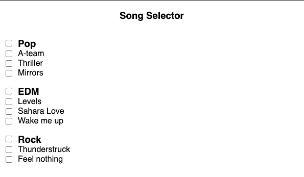
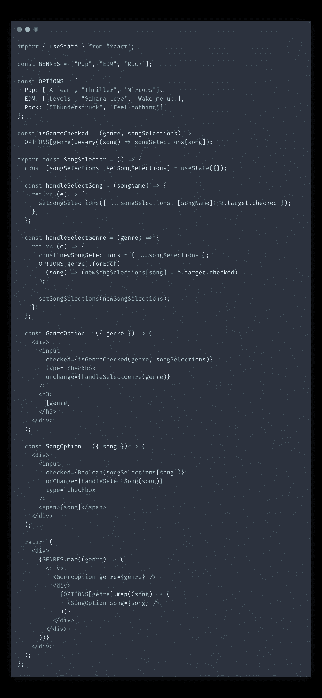

# 派生状态—简化反应状态管理的 Pro 提示被低估

> 原文：<https://itnext.io/derived-state-underrated-pro-tip-for-simplifying-react-state-management-8416aa552ecc?source=collection_archive---------4----------------------->

在我看来，状态管理是构建和扩展 web 应用程序最具挑战性的部分。我甚至认为开发人员主要是通过编写良好的状态管理机器来获得报酬的。使用 UI 库和 NPM 包，所有其他部分都可以外包或自动化(通常都是这样)。

在这篇文章中，我想介绍一种被称为“派生状态”的状态管理技术，我认为这种技术被低估了。在许多情况下，它可以简化您的状态管理逻辑。“派生状态”技术与库无关，您可以将其应用于 Redux、MobX 和 React 的内置状态管理挂钩。

# 派生状态是什么？

这个想法是倾向于在您的状态中存储尽可能少的数据。解决这个问题的方法是避免存储那些可以即时推导或计算的状态变量。

计算变量而不是将它们存储在状态中，这样在发生变化时更容易保持数据同步。

# 派生状态的示例

让我们看一个例子。假设您有一个歌曲选择器，其中包含每首歌曲的复选框。歌曲也按流派分组。我们希望能够选择一首单独的歌曲以及整个流派:

现在，您首先想到的可能是创建两个状态变量:一个用于存储选定的歌曲，另一个用于存储流派。看起来很简单，但是这是最好的方法吗？我们*真的需要两个变量吗？*

在这个例子中，我们实际上可以根据单首歌曲复选框的值来导出流派复选框的值。下面是它的样子:

使用`isGenreChecked`方法和`songSelections`对象动态计算流派复选框的值。仅当选择了某个流派下的所有歌曲时，才会检查该流派。当用户点击一个流派复选框时，我们需要做的就是选择/取消选择该流派下的所有项目。

# 为什么使用这种技术？

那么为什么这种方法更好呢？正如我前面提到的，保持我们的状态同步要容易得多。原因是我们只有一个真实的来源——我们选择的歌曲。拥有一个您需要跟踪的状态变量，而所有其他变量都是从它派生出来的，这简化了状态突变。

例如，当取消选中一首歌曲时，我们不再需要担心更新其父流派的状态。在新的渲染，应用程序将重新计算流派的状态，并自动取消选中它。

# 性能问题

您可能会担心在每次渲染时重新计算状态变量的值的性能问题。根据派生状态计算的复杂性，可能确实存在性能开销。

如果有明显的性能下降，您可以投资优化您的应用程序。例如，您可以使用 [useMemo](https://reactjs.org/docs/hooks-reference.html#usememo) 钩子包装您的计算值，以避免重新计算派生变量，除非它的底层状态已经改变。

# 结论

在这篇文章中，我们介绍了一种叫做“派生状态”的状态管理优化技术“派生状态”通过减少需要存储在状态中的变量数量来帮助您简化代码。

下次构建状态管理部分时，可以考虑使用这种技术，看看某些状态变量是否可以动态计算，而不是存储在状态中。

*原载于 2021 年 8 月 29 日*[*【https://isamatov.com】*](https://isamatov.com/react-derived-state/)*。*