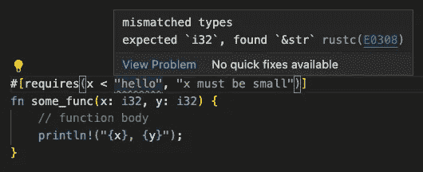
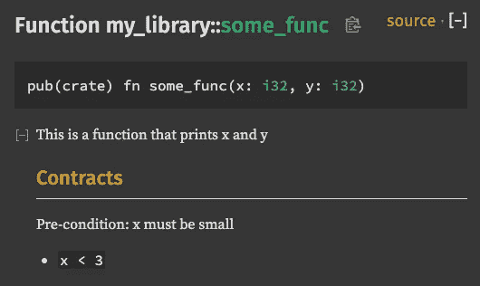

# 铁锈中的合同设计

> 原文：<https://itnext.io/design-by-contract-in-rust-4cfe88b349bd?source=collection_archive---------4----------------------->


[签名专家](https://unsplash.com/@signaturepro?utm_source=unsplash&utm_medium=referral&utm_content=creditCopyText)在 [Unsplash](https://unsplash.com/s/photos/signature?utm_source=unsplash&utm_medium=referral&utm_content=creditCopyText) 上的照片

## 使用 proc 宏的人体工程学设计

*变更日志:【2022 年 12 月 31 日—使用 Medium 的新代码块进行语法高亮显示*

今天我遇到了一件漂亮的作品:板条箱。这个板条箱为程序员提供了程序宏，用契约设计规范来注释函数和方法。

一点背景——契约式设计(Design by Contract)(DBC)，用我自己的话说，是一种编程模式，它通过契约来指定功能的限制和能力。*前置条件*、*后置条件*和*不变量*是常用的规范。

因为这些规范是作为断言或 if-else 语句编写的代码，不幸的是，它可能会掩盖函数中的主角。

以下是我知道的其他语言中的一些 DBC 模式:

**科特林**

在 Kotlin 中，在提供 DBC 习语的标准库中有[preceditions . kt](https://github.com/JetBrains/kotlin/blob/master/libraries/stdlib/src/kotlin/util/Preconditions.kt)模块。

```
fun someFunc(x: Int, y: Int) {
    require(x < 3) { "x must be small" }
    // function body
}
```

**Python**

Python 没有内置的 DBC 习惯用法，但是你有提供装饰函数的库。这里有一个使用了 [icontract](https://github.com/Parquery/icontract) 库的。

```
from icontract import require

@require(lambda x: x < 3, "must be small")
def some_func(x: int, y: int):
    # function body
```

**D**

在 D 编程语言中，[函数契约](https://dlang.org/spec/function#contracts)是该语言中的一个特性👍🏼：

```
int someFunc(int x, int y)
in (x < 3, "x must be small")
{
    // function body
}
```

**铁锈😍**

铁锈呢？

在 Rust 生态系统中，有一个`contracts`机箱，它使用 Rust 强大的类似属性的程序宏，为用户提供符合人体工程学的设计:

```
use contracts::requires;

#[requires(x < 3, "x must be small")]
fn some_func(x: i32, y: i32) {
    // function body 
}
```

这是它能做的:

*   在函数之外定义规范(d ' uh)——你可能认为这是理所当然的，但是因为这些规范是函数的属性，所以我认为从语法上来说，把它们放在函数体之外是合适的。
*   提供必要的编译时参数，如检查参数类型(借助 proc 宏)。



*   根据合同更新文件(`cargo doc --open`)



将这个机箱与 Rust Analyzer 结合起来，您将拥有一个非常棒的开发人员体验。

参考资料:

[https://www.hillelwayne.com/post/contracts/](https://www.hillelwayne.com/post/contracts/)

就这些了，伙计们！

*我发表关于人工智能、机器学习、编程语言、Web 框架、生产力和学习的文章。*

*如果您喜欢阅读更多关于 web 框架的内容，您可以通过我的推荐链接* [*订阅*](https://remykarem.medium.com/subscribe) *以接收我发布的更新，或者* [*注册*](https://remykarem.medium.com/membership) *！请注意，您的会员费的一部分将作为介绍费分摊给我。*