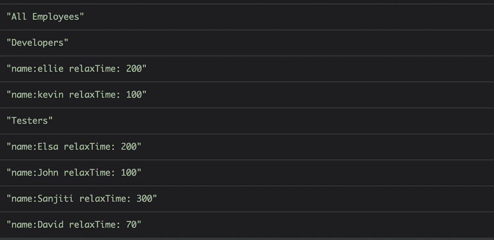

# Javascript 中的设计模式—第 2 部分

> 原文：<https://itnext.io/design-patterns-in-javascript-part-2-bca0ffbe6f25?source=collection_archive---------7----------------------->

*在这篇文章中，我们将深入探讨结构设计模式*

图片来源:【https://www.youtube.com/watch?v=jt-WxJPTV9Y 

在上一篇文章中，我们看到了创造模式。如果你错过了，这里有链接:[创造模式](https://medium.com/@takleakshar/design-patterns-in-javascript-f533632556c1)

# **适配器模式**

*意图:将一个类的接口转换成另一个客户期望的不同的东西。它允许类一起工作，否则会因为不兼容的接口而无法工作。*

假设我们有一家皮划艇店。自从我们更新我们的系统已经有很长时间了，现在我们需要在计算我们皮划艇的租赁价格之前添加一些参数。我们引入了一个适配器，这样客户端程序就可以在不改变 API 的情况下继续工作。

# **代理模式**

*意图:为另一个对象提供一个代理或占位符来控制对它的访问。*

我们的机器人公司从上一篇帖子开始变得庞大。没有助手，经理机器人很难工作。让我们把他的助手菲奥娜带给他，菲奥娜将作为我们经理机器人的代理人。

Fiona 只接受经过身份验证的请求，并存储她自己的报告数据库，以便快速检索。让我们看看菲奥娜是如何工作的

因此，无论何时任何人需要经理机器人的任何报告，他们都可以像这样简单地向 Fiona 索取

# **复合图案**

*意图:复合材料与树木一起工作。将对象组成树形结构来表示层次结构。Composites 允许客户统一处理单个对象和对象的组合。*

所以我们的机器人公司有一个网站，我们需要推出我们的机器人团队。我们需要向开发人员、测试人员或任何其他类型的机器人展示。让我们看看如何使用复合模式来创建我们公司的团队页面。

首先，我们根据机器人的角色对它们进行分组，最终形成一个完整的员工组。我们只需要在这个组上调用 print 来创建我们的团队页面。以下是输出:

# **装饰图案**

意图:通过动态附加属性和方法来扩展现有对象的功能。

有时我们已经有了我们需要的基本对象。例如，假设我们想将我们的机器人升级到最新一代。我们可以通过扩展现有的机器人来增加这个功能。以免看到如何:

这是我们的第一代机器人，名叫亚历克斯。我们可以使用同一个机器人来创建第二代和第三代亚历克斯，以改善放松时间。

就是这样！感谢您的阅读。如果你喜欢它，请给一些掌声！！