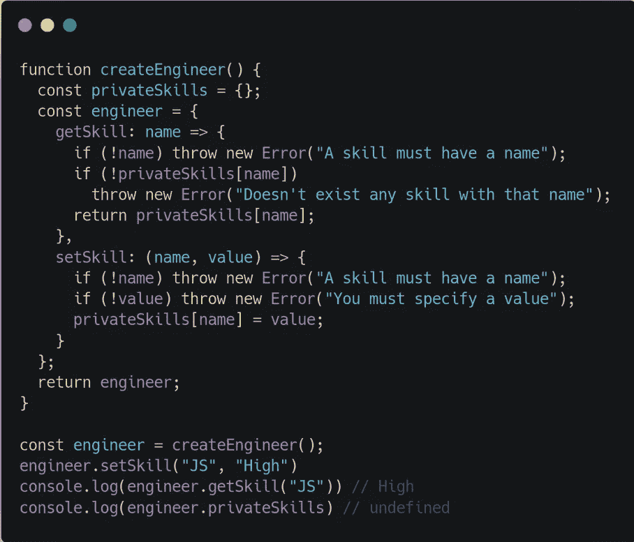
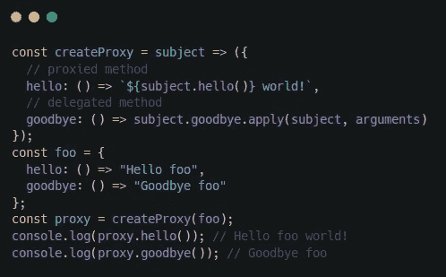
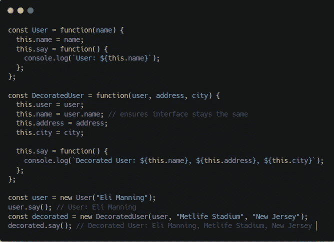
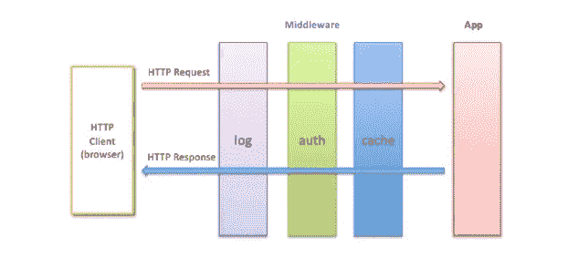

# 节点中的设计模式

> 原文：<https://itnext.io/design-patterns-in-nodejs-990fed17c49c?source=collection_archive---------0----------------------->

关于 Node 中一些最有用的模式的快速指南，包括用例及代码示例。

设计模式是软件设计中常见问题的典型解决方案。每个模式就像一个蓝图，您可以定制它来解决代码中的特定设计问题。

如果你正面临一个软件设计的问题，很有可能有人曾经面临过。看看最常见的模式，因为你可能很幸运，有人创造了一个模式来解决这个问题。

它们是软件设计中常见问题的**尝试、优化和测试解决方案**的工具包。即使你从未遇到过这些问题，了解模式仍然是有用的，因为它**教你如何使用面向对象设计的原则解决各种问题**。

设计模式也改善了团队中的沟通。如果你说:*“嘿，我正在创建一个工厂来解决那个”*，每个人都会明白你的建议背后的想法。如果你知道模式和它的名字，不需要解释什么是工厂。

让我们从 Node 中一些有用的模式以及它们有助于解决的问题开始。

# 工厂模式

事实上，在 JS 中，功能范式通常比面向对象设计更受青睐。在创建新的对象实例时尤其如此。使用 *new* 操作符或 *Object.create()* 从原型创建一个新对象在几个方面都不太灵活或方便。

工厂允许我们将对象的创建和实现分开。它充当新实例的包装。在工厂内部，我们可以使用上一段提到的闭包，创建不同的组合实例。基本上，你需要的一切。消费者将对内部发生的事情一无所知。

另一方面，JS 无法在函数中定义*公共*或*私有*方法，但是，通过工厂，我们可以**强制封装**。

通过这种方式，我们将工程师的创造依赖于工厂，因此消费者可以从中抽象。另一方面， *privateSkills* 无法从函数外部访问，迫使**封装**。

# 代理模式

代理是一个对象，它控制对另一个对象的访问，这个对象叫做主题。两者都有相同的接口，这允许我们透明地交换一个给另一个。代理拦截所有或部分本应在主体上执行的操作，修改它们的行为。

代理在很多情况下都很有用，比如数据验证、安全、缓存、延迟加载、日志记录或者让远程对象看起来像本地对象。

有一些实现代理的技术，比如对象扩充、对象合成或者只是使用 ES6 中引入的 [*代理*](https://developer.mozilla.org/es/docs/Web/JavaScript/Referencia/Objetos_globales/Proxy) 对象。组合可以被认为是创建代理的最安全的方式，因为它不会修改主题，所以我们将在代码示例中使用它。

代理模式

这也可以用原型来完成，但是我更喜欢利用 JS 提供的所有灵活性。

在这种情况下，代理截取修改结果的 *hello* 方法，并委托 *goodbye* 方法。对于大型函数，您可能需要委托大多数方法。在这种情况下，[代表 NPM 包](https://www.npmjs.com/package/delegates)应该有所帮助。

# 装饰图案

它非常类似于代理，但是它不是增强或修改行为，而是增加了新的功能。继承的不同之处在于，decorator 不会将行为添加到同一个类的所有对象中，而只是添加到被修饰的实例中。与代理模式一样，合成和对象增强是主要的技术。

装饰图案

*DecoratedUser* 接收两个参数来帮助修改 say 函数。结构非常相似，但是方法行为发生了变化。

# 中间件模式

它代表一个类似于流的处理**管道**。在 Node 中，这种模式的使用远远超出了 Express 框架的界限。它可以是一组处理单元、处理程序、过滤器和任何函数，用于执行任何类型数据的预处理和后处理。事实上，它提供了灵活性，允许我们毫不费力地获得一个插件基础设施，提供了一种用新的过滤器和处理器扩展系统的不引人注目的方式。

中间件模式

在这个表示中，我们有一个传入的请求，它正在进入我们的应用程序的核心，遍历许多中间件。这部分流程称为**入站**或**下游。**流程到达核心 app 后，会以相反的顺序再次遍历所有中间件，这样它们就可以在执行 app 逻辑后执行动作。这部分被称为**出境**或**上游。**

我用 [**ZeroMQ**](https://github.com/zeromq/zeromq.js) 创建了一个例子，抽象出通过 ZMQ 套接字传递的数据的预处理和后处理，这样我们就可以透明地处理 JSON 对象(序列化/反序列化)，还可以压缩通过网络传输的消息。

在这里 **可以找到代码 [**。**它包含 4 个文件:](https://github.com/boxgames1/nodejs-patterns/tree/master/design-patterns/middleware)**

*   zmqMiddleware.js :负责在接收或发送新消息时执行中间件管道。
*   [jsonMiddleware.js](https://github.com/boxgames1/nodejs-patterns/blob/master/design-patterns/middleware/jsonMiddleware.js) :序列化和反序列化 JSON 消息的中间件。
*   [server.js](https://github.com/boxgames1/nodejs-patterns/blob/master/design-patterns/middleware/server.js) :它将一个套接字回复绑定到本地端口 7000，创建一个管理器实例，添加 JSON 中间件，并创建一个入站函数来处理来自客户端的请求
*   [client.js](https://github.com/boxgames1/nodejs-patterns/blob/master/design-patterns/middleware/client.js) :通过 socket 连接到本地端口 7000，创建一个管理器实例，添加 JSON 中间件，创建一个函数来处理来自服务器的响应，最后设置一个发送 *ping* 请求的定时器。

# 命令模式

这是节点中另一个非常重要的模式。命令是封装了稍后执行动作所需的所有信息的任何对象。因此，我们不是直接调用函数，而是创建一个对象来表示执行这种调用的意图。它是围绕四个主要组件构建的，这四个组件可以根据我们想要实现模式的方式而变化:

*   **命令**:封装了调用函数所需信息的对象。
*   **客户端:**创建命令并提供给调用者。
*   **调用者:**这个负责在目标上执行命令。
*   **目标:**调用的主题。它可以是一个单独的函数，也可以是一个对象的方法。

使用命令模式有几个优点。其中一些是:

*   可以将命令安排在以后运行
*   保留系统中执行的操作的历史记录
*   可以序列化并通过网络发送，因此可以分发。
*   如果还没有执行，可以取消预定的命令

我创建了一个允许*撤销*和*序列化的例子。*代码可以在 [**这里找到**](https://github.com/boxgames1/nodejs-patterns/tree/master/design-patterns/command) **。它展示了将一个操作包装在一个命令中是如何打开一个可能性的世界，而这只是冰山一角**

我是奥利弗·阿隆索，在西班牙远程工作的软件工程师。你可以在[我的网络](https://oliveralonso.dev/)或 [Github 账户中找到更多关于我的资料。](https://github.com/boxgames1)

感谢阅读！