# 颤振中的设计形状——变形形状包介绍

> 原文：<https://itnext.io/design-shapes-in-flutter-introduction-to-the-morphable-shape-package-30e0d33c60a7?source=collection_archive---------3----------------------->

形状和边框是 UI 框架的重要方面。CSS 提供了带有四个现成的可配置边框的圆角矩形。但是你可以使用剪辑路径或一些聪明的技巧来生成各种形状。如果在 Flutter 中也有这些特性，那就太好了。

# Flutter 如何处理形状和边框？

Flutter 中的所有内置形状(更准确地说是形状的边框)都继承自抽象的 ShapeBorder 类。混凝土颤振内置形状边框可分为两类:

*   BoxBorder 和 Border 类。它们有四个边框边，用于描述矩形的四个边，并在 BoxDecoration 中用于样式化容器小部件。四个边框边可以有不同的颜色和宽度，但它们只适用于矩形框。它们还可以在彼此之间平滑地设置动画。

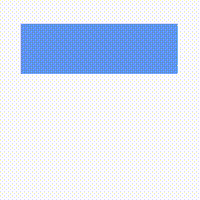

边界类的动画

*   抽象的 OutlinedBorder 类。继承这个类的是 CircleBorder、RoundedRectangleBorder、BeveledRectangleBorder 等。这些边框具有统一的宽度和颜色。您可以将圆角矩形变形/动画为圆形或圆角矩形。但是您不能将圆角矩形变形为斜角矩形。

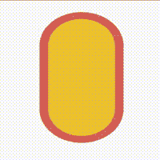

平稳过渡

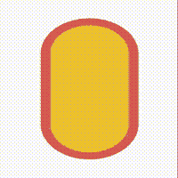

没有流畅的动画

显然，我们有很多可以改进的地方。以下是我希望看到的一些功能:

1.  一个圆角矩形，有四个可配置的边框，就像 CSS 提供的一样。
2.  比较常用的形状，像多边形、星形、三角形、梯形、菱形等。
3.  能够使用百分比单位。这里，我的意思是能够通过使用一些 px 值或者使用矩形的宽度/高度的百分比来设置矩形的边界半径。CSS 天生支持这一点，我们应该在 Flutter 中提出一些类似的解决方案。
4.  渐变边框。CSS 也支持这一点，但是在 Flutter 中不经过一些麻烦是做不到的。
5.  能够顺利动画所有这些形状和边界将是一个巨大的奖励。
6.  能够序列化/反序列化这些形状。所以储存和重复使用你设计的一些复杂形状会很容易。

# 介绍可变形形状包

[morphable_shape](https://pub.dev/packages/morphable_shape) 包旨在提供我上面提到的所有特性。

*   第一，不同边框边的圆角矩形。您可以提供任何边框半径或边框宽度值，包将以没有两个边框重叠的方式处理它，类似于 CSS。

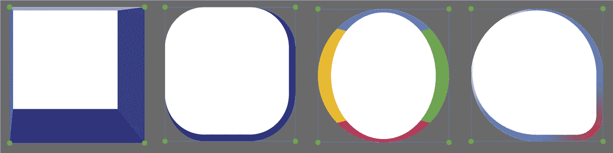

*   比较常用的形状。可以从具有不同拐角样式和拐角半径的矩形生成许多形状。

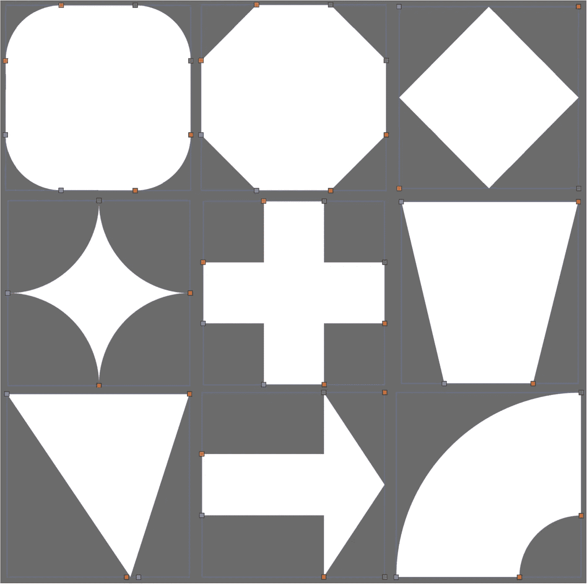

由长方形制成的形状

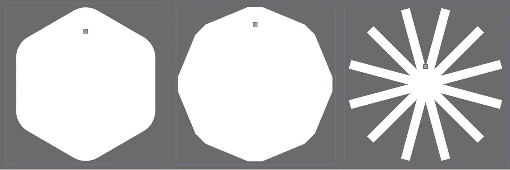

具有不同拐角半径和样式的多边形

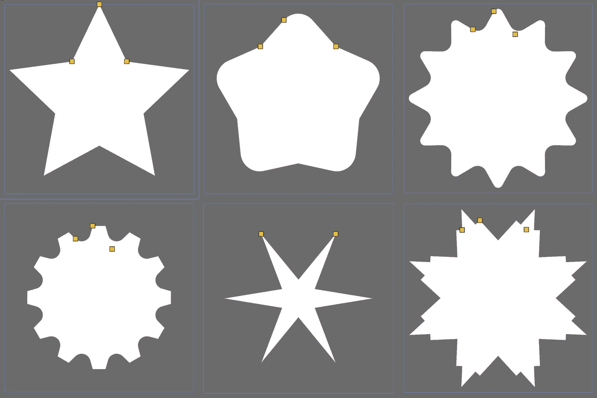

不同圆角半径和风格的星星

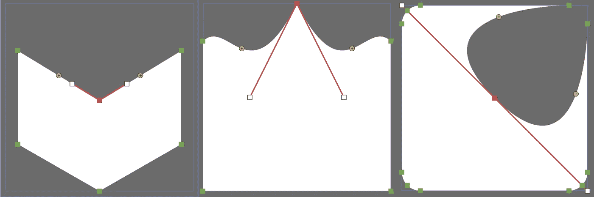

自定义路径形状

*   也支持更常用的形状，如箭头、梯形、气泡、三角形、圆形。
*   使用[尺寸](https://pub.dev/packages/dimension)包支持百分比单位。

```
ShapeBorder rectangle=RectangleShapeBorder(
borderRadius: DynamicBorderRadius.only(
topLeft: DynamicRadius.circular(10.toPXLength),
bottomRight: DynamicRadius.elliptical(60.toPXLength, 10.toPercentLength))
);
```

上面的代码会给你一个矩形，在左上角有一个 60 px 的圆半径，在右下角有一个(60 px，10%)的椭圆角。

*   每种形状都支持渐变边框。您也可以只绘制边框的一部分，或者更改边框的描边帽和描边连接。

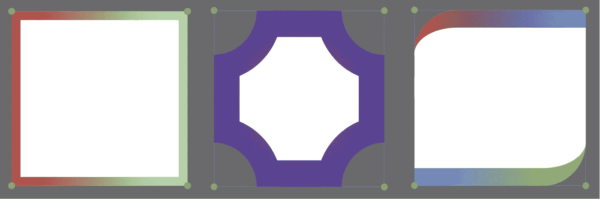

左:单一线性渐变。中间:单一径向渐变。右图:两个线性渐变。

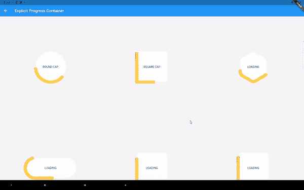

仅绘制部分边界以制作进度指示器

*   还支持任意两个形状之间的变形。实施细节可以看这篇[中的文章](https://kevinvan.medium.com/creating-morphable-shapes-in-flutter-a-complete-rewrite-ac899bfe4222)。经过几十次修改后，变形算法是像素完美的，非常有效。最初的想法来自 https://github.com/veltman/flubber 的[和 https://pub.dev/packages/path_morph 的](https://github.com/veltman/flubber)和[但是后来有了很大的改变。当前的实现更加关注形状的对称性。内置颤振形状的变形都可以使用这个包来复制。](https://pub.dev/packages/path_morph)

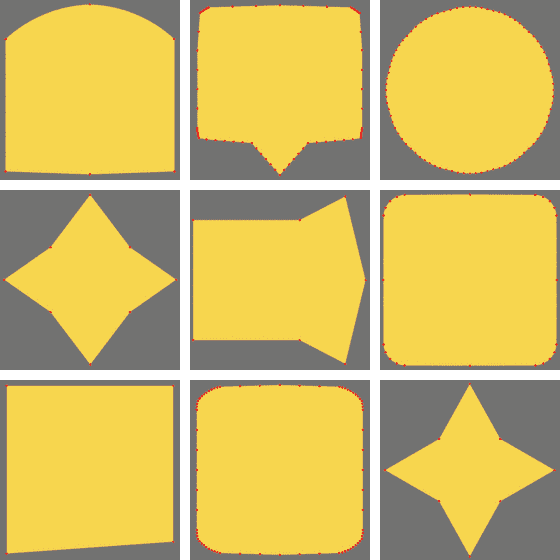

使用零宽度边框变形

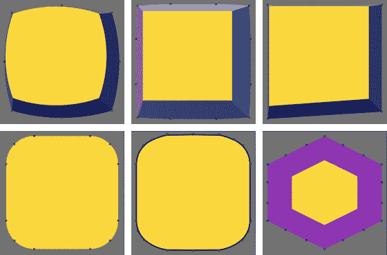

使用不同的边框颜色和渐变进行变形

*   支持序列化。

```
ShapeBorder shape = RectangleShapeBorder();
String jsonStr = json.encode(shape.toJson());
ShapeBorder shapeDecoded = parseShapeBorder(json.decode(jsonStr));
```

我们走吧！我之前提到的六个目标都实现了。如果你想看到生成这些形状和动画的实际代码，请查看 [pub.dev](https://pub.dev/packages/morphable_shape) 或其 [Github 页面](https://github.com/KevinVan720/morphable_shape)上的包。

# 或者玩在线演示…

这个包的示例应用程序可以让你以几乎所有的方式使用这个包。我还在[fluttershape.com](https://fluttershape.com/)在线托管了这个应用。下面是该应用程序界面的一些截图。

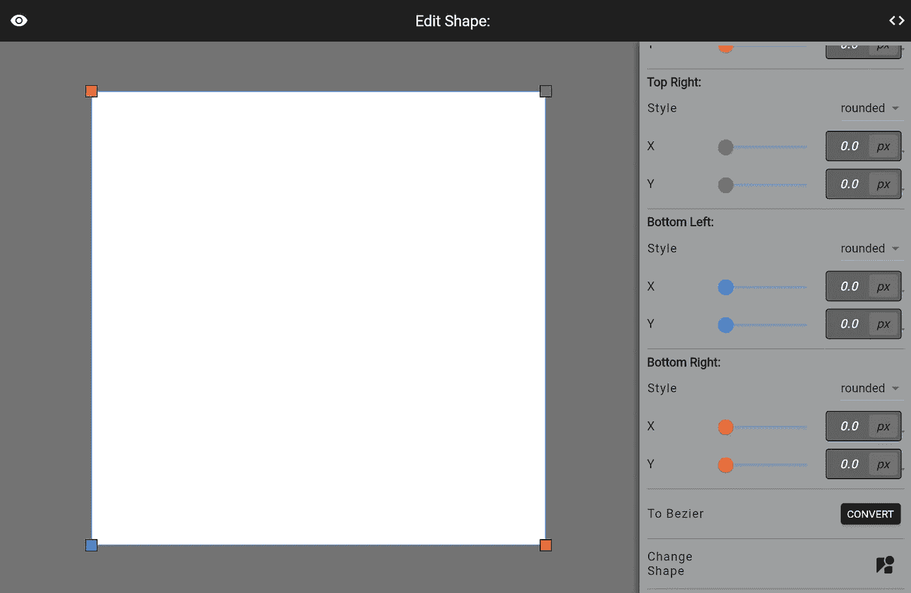

在主屏幕上，您可以拖动形状上的点来修改它或使用右侧的滑块

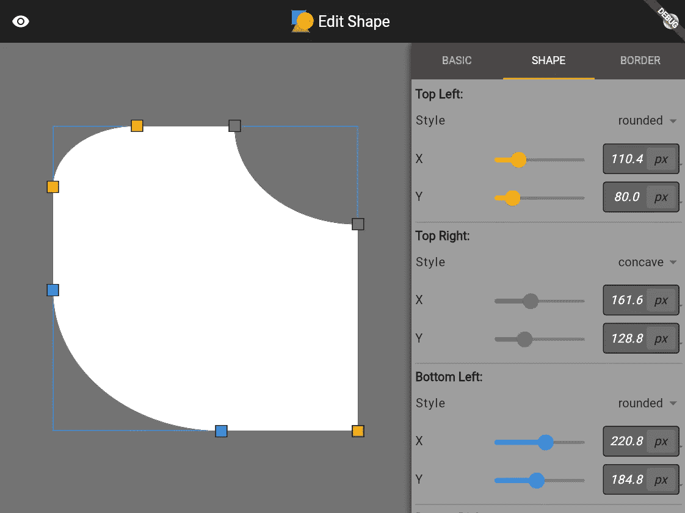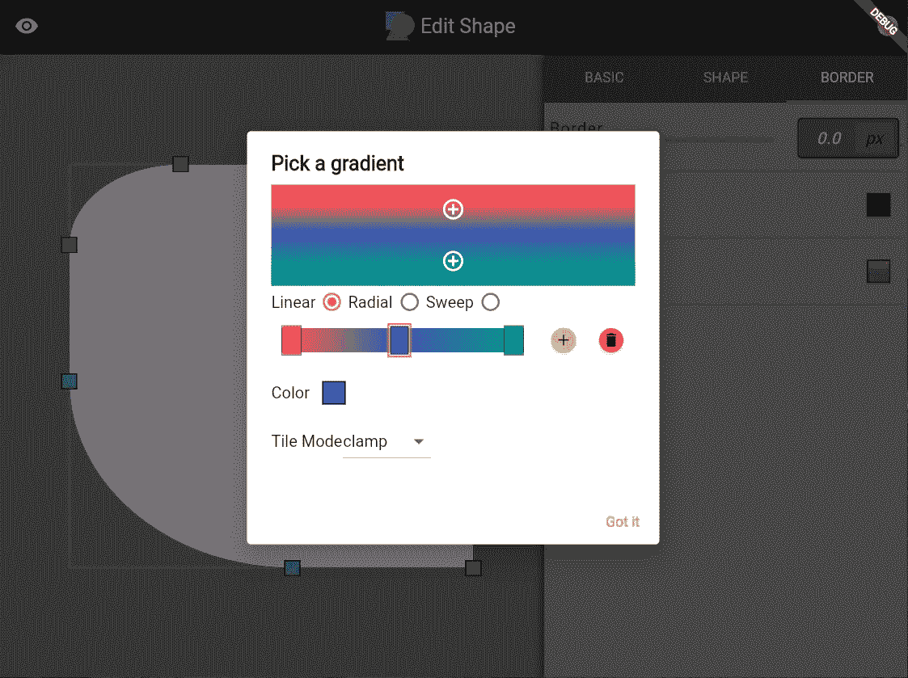

为边框选择渐变

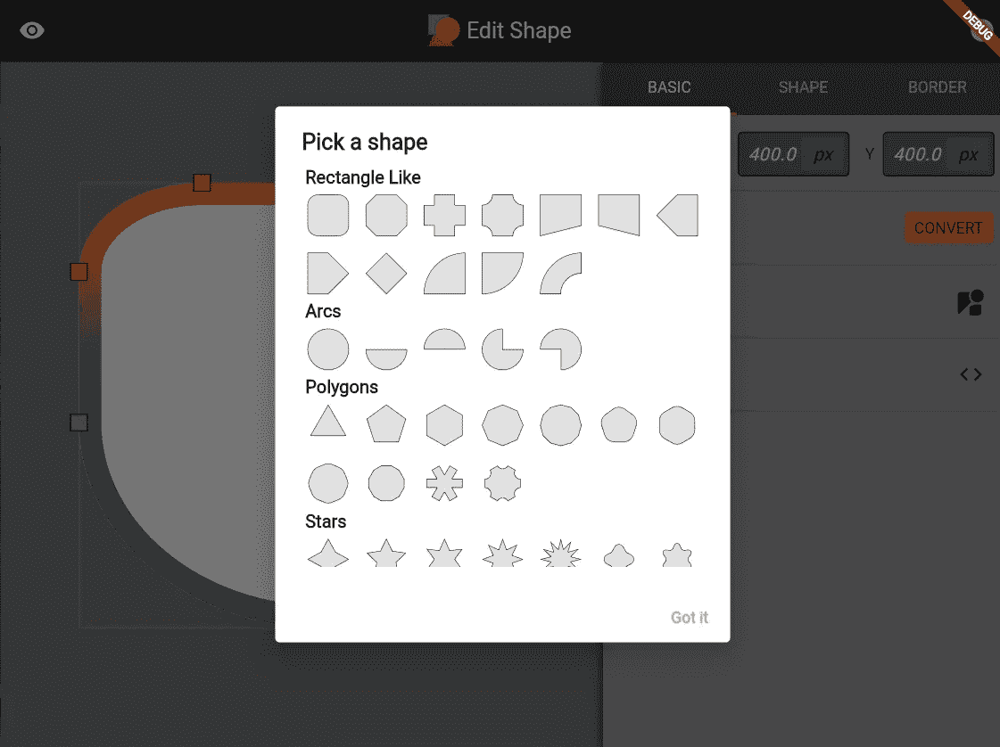

选择新形状

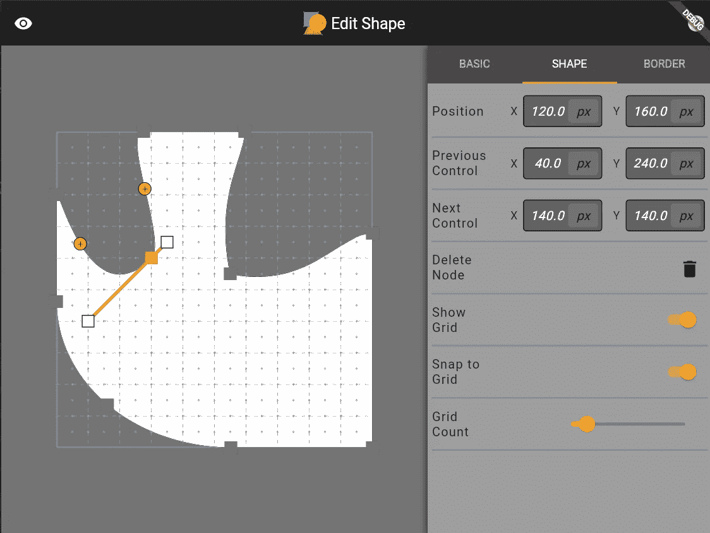

设计自定义路径形状。可以将点捕捉到网格。

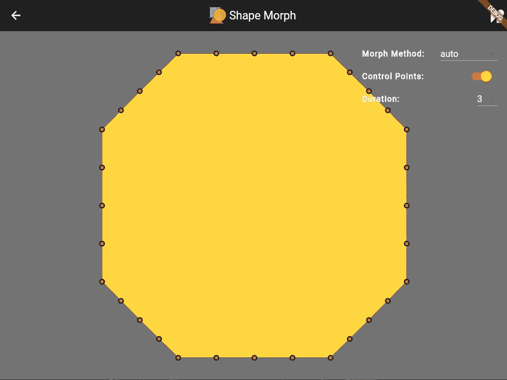

查看不同速度的变形动画

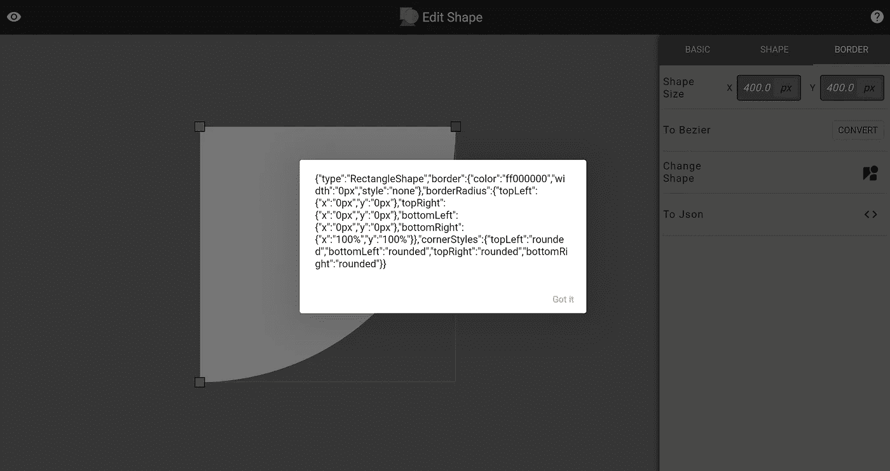

获取当前形状的 JSON

我投入了大量的精力来构建这个工具。如果您对使用这个包感兴趣，我强烈推荐您使用这个工具。

这篇文章应该是总结和展示我每月在 Flutter 世界的长期发展/冒险的结果的最后一篇文章。希望你喜欢，请查看 [pub.dev](https://pub.dev/packages/morphable_shape) 和 [Github](https://github.com/KevinVan720/morphable_shape) 上的套餐。谢谢大家！