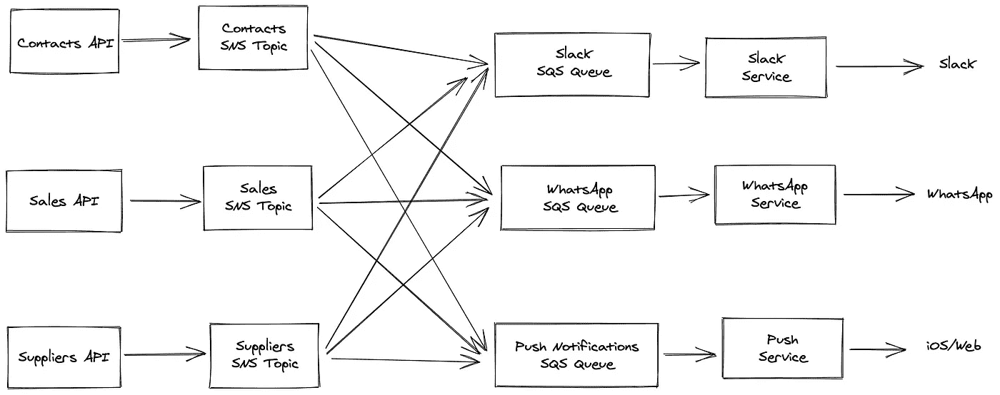
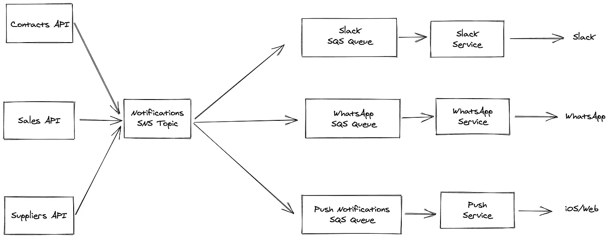
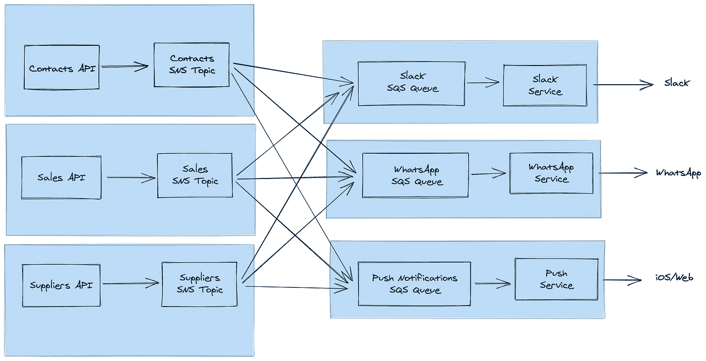
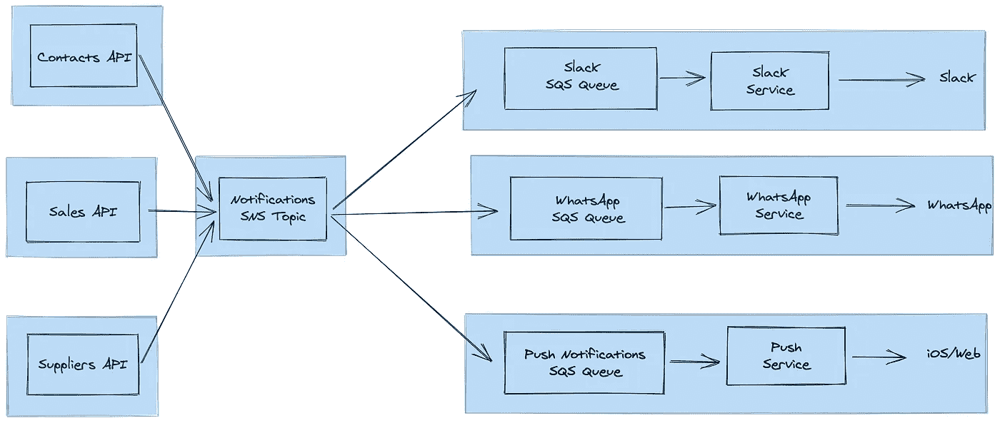

# 用 SQS 和社交网络设计通知服务

> 原文：<https://itnext.io/designing-a-notifications-service-with-sqs-and-sns-176adad42fa1?source=collection_archive---------1----------------------->


照片由[杰米街](https://unsplash.com/@jamie452?utm_source=medium&utm_medium=referral)在 [Unsplash](https://unsplash.com?utm_source=medium&utm_medium=referral)

# 背景

我工作的公司有许多不同的系统，这些系统都通过 API 连接在一起。每个系统都存储和处理有关企业运营的不同信息。将这些系统分开对于我们的开发团队来说非常有效，因为这使得人们独立地使用和部署它们变得非常简单。

我们的用户不必考虑所有这些独立的系统。我们有许多应用程序，但它们是根据用户的使用情况来划分的，而不是根据它们与之对话的后端服务。我们目前正在使用 Apollo Federation 将所有不同的后端连接在一起，以便我们的前端代码可以轻松使用。

# 目标

我们需要能够向用户发送通知，以响应系统中的各种“事件”。我们需要能够发送的初始通知集很小，但是，我们预计它会快速增长和变化。这些事件可能来自我们所有不同的服务，我们可能希望通过多个不同的渠道(例如，本地推送通知、web 推送通知、slack 消息)将它们发送给我们的用户。

# 我如何设计这个系统

## 目标

这类事情的第一步是考虑我们希望我们的系统实现什么。我想到了:

*   我们希望能够向用户发送即时推送通知，以响应各种事件
*   我们维护的其他服务不需要知道这些通知是如何传递的
*   我们应该能够支持通过各种不同的渠道发送通知(例如，推送通知、松弛消息等)。)
*   改变我们所有通知的措辞以及通知送达的地点/时间应该简单快捷

## 选择

接下来，我为如何构建它列出了一个简短的高级选项列表。

1.  单个 API 服务通过 slack、web push、iOS 等各种 API 直接推送通知。
2.  单个 API 服务将通知推送到亚马逊简单通知服务(SNS)中。我们为每个想要推送通知的渠道创建一个 Amazon 简单队列服务(SQS)队列(例如 Slack 消息和推送通知)。然后，我们为每个通道提供一个通知服务。每个通知服务都会侦听 SQS 队列中的新消息，并负责发送通知。

> **亚马逊简单通知服务(SNS)** 是亚马逊提供的一项服务，允许您发布许多不同服务可以消费的事件。每个事件都发送给每个消费者。消费者必须在消息发送时在线才能接收它，因此需要一个队列来创建一个可靠的系统。
> 
> **亚马逊简单队列服务(SQS)** 是亚马逊提供的一项服务，可以让你创建消息队列。它可以直接订阅一个或多个 SNS 主题，也可以直接将消息推送到队列中。如果消费服务运行太慢，队列负责缓冲消息，并处理重试。如果一个队列有多个监听消息的服务，则每条消息都被传递给一个使用者。如果队列变得太长，这允许您增加从队列中消耗的工作线程的数量。

我画了一张表，列出了每个解决方案的利弊。每个人都很清楚，虽然选项 1 对于最初的几个通知来说是最快实现的，但随着复杂性的增加，它不会很好地扩展，因为每个 API 服务都需要处理发送每种类型的推送通知的所有复杂性。

我们决定选择选项 2，在这里我们使用 SNS 和 SQS 将事件从我们的 API 服务路由到专用的通知服务来发送通知。

## 系统图

*我们对这些进行了重新绘制和简化，删除了我们其他内部系统的细节。*

我们已经决定使用单独的服务来发送通知，通过 SNS 和 SQS 连接到我们的 API 服务，但我们仍然有多种方式来构建它。画出这些系统是感受它们的大小和结构的一个非常好的方法。在这一点上，我们考虑了两种广泛的方法。



每个 API 服务将事件发布到自己的 SNS 主题

在第一张图中，每个 API 服务都有自己的 SNS 主题，并向其发布事件。每个通知服务都有一个订阅多个 SNS 主题的 SQS 队列，以便获得所有相关事件。



每个服务将事件发布到一个共享的中央 SNS 主题

在第二张图中，每个 API 服务将事件推送到一个共享的 SNS 主题。每个通知服务都有一个订阅该中心 SNS 主题的 SQS 队列。

我一会儿会回到这个决定，但首先，让我们看看事件本身。

## 事件内容

流经这些系统的事件有两种形式:

描述发生了什么:

```
{event: 'contact_edited', contactId: 1}
```

描述应该发生的情况:

```
{
  userIdsToNotify: [1, 2, 3],
  message: 'The contact Jane Smith was updated'
  action: {type: 'open_contact', id: 1}
}
```

第一个告诉我们一个联系人已经被编辑。我们可以包含被编辑的联系人的详细信息，或者我们可以让这个 API 的消费者根据 ID 获取他们需要的任何详细信息。通知服务将通过构造实际的消息内容并确定应该通知哪些用户来决定如何处理这个问题。

第二个告诉我们发送什么通知，以我们设计的格式。通知服务不需要了解太多的业务领域，它只需要知道如何将消息作为推送通知/松弛消息等发送。

# 公共 API 和封装

在这一点上，我们对如何构建 SNS 主题有两种不同的想法，对消息应该包含什么也有两种不同的想法。在我们作为一个团队就这里的最佳行动方案达成一致之前，需要进行相当多的讨论。

我把这两个决定放在一起，因为它们的理由是一样的。问自己这两个问题:

> 每个服务的边界是什么？
> 
> 每个服务的公共 API 是什么？

为了回答第一个问题，我试着在之前的图上画出边界:



每个 API 和 SNS 主题对被分组到一个服务中

在这里，围绕各种服务划分界限非常容易。SNS 主题是每个 API 服务的公共 API 的一部分，就像它的 GraphQL 或 REST APIs 一样。从外部，您可以订阅一个 SNS 主题，以便从该 API 服务接收事件。

可以将通知服务组合成一个更大的服务，但是我在这里将它们成对绘制。他们没有任何面向公众的 API。相反，它们使用各种其他 API 的 SNS 端点，并推送到各种外部服务。



共享的 SNS 话题最终在它自己的单独群组中结束

当我们查看单个共享 SNS 主题方法时，一切都变得更加混乱，或者至少更加随意。很明显，SNS 主题不能是各种 API 服务的一部分，因为那样的话，它将属于多个服务。如果我们认为每个通知服务都是独立的，那么它也不可能是它们的一部分。这就是为什么我把它画成一个独立的实体。它实际上是一个完整的独立的概念构建块，需要有自己的公共 API，用于将它推送到的 API 端和从中消费其事件的通知端。

根据这些图表，很明显，如果每个服务都拥有自己独立的 SNS 主题，那么在每个服务周围画一个边界会容易得多。接下来我们可以看看定义公共 API 的问题。

如果事件类似于“联系人 123 已更新”，那么 contacts 服务的公共 API 只包含它可以发布的可能事件(及其模式)的列表。

如果事件说“发送‘联系人简·史密斯已更新’给用户 1”，我们就处于尴尬的境地。该消息的类型显然是存在于通知服务中的，因为它是所有各种 API 服务使用的一致结构。因此，contacts 服务的公共 API 包含了一个人类可读消息的 SNS 主题，以便发送给用户。

> 我们决定使用两个系统图中的第一个，让事件包含描述发生了什么的结构化数据，而不是应该发送什么通知。

# 权衡

对于任何系统，了解所做的权衡是很重要的。在这里，我们可以选择:

*   我们可以让 API 服务知道推送通知的结构和内容。这使得 API 边界不太清晰，迫使我们采用最小公分母方法(我们需要一个事件结构用于所有的通知服务，即使它们有不同的功能)。如果我们想要触发其他动作来响应各种 API 中的变化，这些事件也不能被容易地重用或改变用途。
*   **我们可以让通知服务知道业务数据。**这使得通知服务不那么抽象。这也意味着为一个全新的事件添加一个通知涉及两个而不是一个更改。您必须在 API 服务中添加事件，并在通知服务中为其添加处理程序。

在这种情况下，收益似乎超过了成本，因此我们将构建一个通知服务，它能够识别发送通知的业务逻辑。我们相信这将极大地简化我们的 API 服务，因为它们已经需要在某些地方触发这样的事件，以便被其他服务获取。我们还认为，将我们所有的消息模板和逻辑放在一个集中的地方来决定发送什么通知是很有价值的。

在撰写本文时，我们实际上还没有开始构建这个通知服务，所以我非常想听听您的想法。你会怎么做这个？你认为我遗漏了什么权衡？如果您觉得这很有用，可以注册我的电子邮件简讯，以接收更多类似这样的内容: