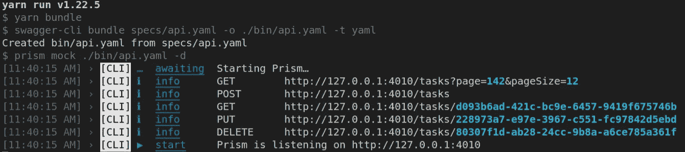
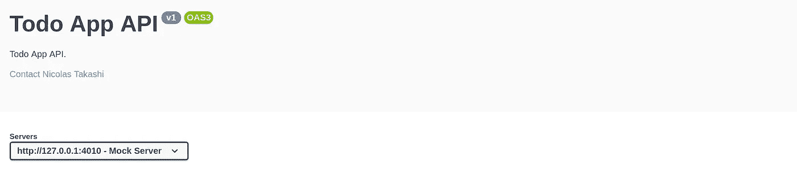
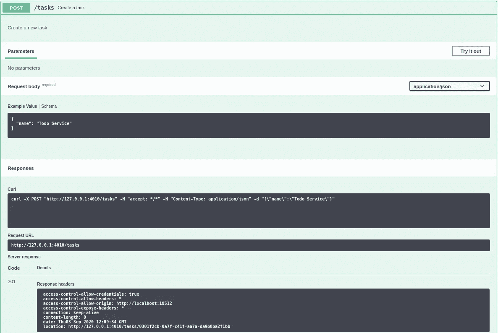
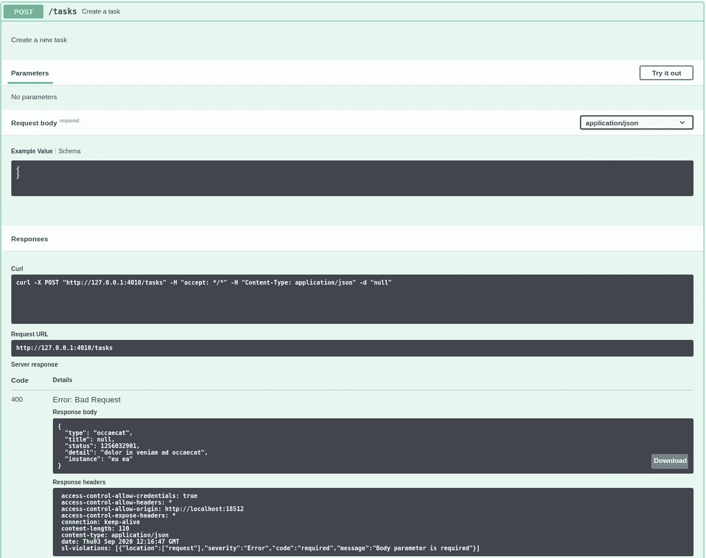

# 使用 API 优先的方法设计 Restful APIs 模仿

> 原文：<https://itnext.io/designing-apis-using-an-api-first-approach-mock-server-78ddbd9993f5?source=collection_archive---------1----------------------->

几周前，我开始了一个新的帖子系列，讨论 API 优先和使用 OpenAPI 规范的 API 设计。

如果你还没有看到这个系列的第一篇文章，我建议你停止阅读，点击[这里](https://medium.com/@nicolastakashi/restful-using-api-first-cd305e59305d?source=friends_link&sk=c7e0e73751dbd62ddea2cf9928dec49c)查看。

在今天的帖子中，我将讨论如何使用 OpenAPI 文档构建一个模拟服务器来改善开发人员的体验和工作并行性。


【https://thesaurus.plus/ 号

# 😎—模拟概念

在我们使用 OpenAPI 文档深入研究 Mock 技术之前，让我们确保每个人都知道根据维基百科 Mock 是什么意思。

> 在[面向对象编程](https://en.wikipedia.org/wiki/Object-oriented_programming)，**模拟对象**是以受控方式模仿真实对象行为的模拟对象，通常作为[软件测试](https://en.wikipedia.org/wiki/Software_testing)计划的一部分。程序员通常会创建一个模拟对象来测试一些其他对象的行为，就像汽车设计师使用一个[碰撞测试假人](https://en.wikipedia.org/wiki/Crash_test_dummy)来[模拟](https://en.wikipedia.org/wiki/Simulation)人类在汽车碰撞中的动态行为一样。该技术也适用于[通用编程](https://en.wikipedia.org/wiki/Generic_programming)。
> 
> [维基百科](https://en.wikipedia.org/wiki/Mock_object)

# 💡—在 HTTP 级别进行模拟。

在 API 世界中，mock 的概念仍然和上面描述的一样，但是不是使用框架来模拟对象，比如 Moq 和 RinoMock，而是使用一个 Mock 服务器来完成。

模拟服务器将对预期的端点、不存在的端点的错误做出响应，如果客户端向其发送无效请求，通常甚至会提供真实的验证错误。

## 模拟服务器替代方案

创建模拟服务器有两种选择，每一种都有其利弊，下面你可以查看一个简短的选项列表。

*   [模拟服务器](http://www.mock-server.com/)
*   [邮递员模拟服务器](https://learning.getpostman.com/docs/postman/mock-servers/setting-up-mock/)
*   [诺克](https://github.com/nock/nock)
*   [棱镜](https://meta.stoplight.io/docs/prism/README.md)

上面列出的每一个选项都是很好的工具，并且肯定能按预期工作。但是这篇文章的目标是展示如何使用 OpenAPI 文档来构建一个模拟服务器。

记住，只是 [Prism](https://meta.stoplight.io/docs/prism/README.md) 为我们提供了一个内置的与 Open-API 的集成来创建一个模拟服务器，所以我们不需要写任何代码来做这件事。

# 🙌Prism 简介

Prism 是一个命令行界面，它使用 OpenAPI 文档聚集了一组 API 模拟包，这是使用 JavaScript 和 NodeJS 开发的，在 [Github Repository](https://github.com/stoplightio/prism) 上有一个巨大的社区和许多明星。

## 入门指南

在上一篇文章中，我在文章系列的代码中使用了一个 [Github 库](https://github.com/nicolastakashi/todoapp-openapidocuments)，所以让我们继续在它的基础上工作，改进解决方案。

现在让我们使用下面的一些命令将 Prism 添加到项目中。

```
yarn add @stoplight/prism-cli
*# or* npm install --save @stoplight/prism-cli
```

Prism 的 HTTP 模拟服务器通过提供 API 描述文档中描述的端点和验证规则来模拟真实的 web API，像任何 HTTP 解决方案一样，它围绕请求消息和响应消息工作。

## 响应生成

Prism 将尝试基于它所拥有的任何信息返回有意义的响应，这意味着任何 OpenAPI 文档都可以使用，但是更好的文档会提供更好的结果。如果您想知道 prism 决策引擎如何生成响应，您可以查看这个[链接](https://meta.stoplight.io/docs/prism/docs/guides/01-mocking.md#the-decision-engine)。

## 响应生成策略

Prism 有两种响应生成策略，**静态生成、**和**动态生成**，这些选项之间有一些差异，我们现在就来了解一下。

## 静态生成策略

默认情况下，Prism 会使用一个静态的**生成策略**来创建一个响应消息，要使用它，你可以运行下面的命令。

```
prism mock <path-to-openapi>
```

如果所提供的 OpenAPI 文档有一个响应体示例，那么它将使用该示例，否则，将通过查看整个模式对象来创建一个假响应，从而创建响应体。

## 动态生成策略

反复测试完全相同的数据并不是构建健壮 API 的最佳方式，在现实世界中，数据是动态的，我们必须能够正确处理它，您可以运行下面的命令。

```
prism mock <path-to-openapi> -d
```

动态模式通过根据所有属性的类型和其他信息(如格式)为所有属性生成一个随机值来解决这个问题，这意味着您的 API 描述得越详细，Prism 在创建模拟响应时就能做得越好。

## 请求验证

基于 API 描述，文档 Prism 可以使用关键字`type`、`format`、`maxLength`来考虑请求体、头部、查询参数的各种验证规则

# 👊Prism 简介

现在您已经知道了 Prism 的基础知识及其工作原理，让我们在我们的 API 项目中配置它，并启动一个新的模拟服务器。

首先，我们需要用两个新命令`mock`和`premock`将`package.json`修改成如下图所示。

现在，只需运行下面的命令来启动 Prism，并在控制台上查看输出。

```
yarn mock
```

如果我们查看控制台输出，有一个模拟服务器正在通过`localhost:4010`运行，从现在开始，我们能够对这个 Prism 服务器进行 API 调用。



## 使用 Swagger UI 进行 API 调用

让我们通过 Swagger UI 发出一个请求调用，但在此之前，更改`api.yaml`并添加 servers 部分，如下例所示。

api.yaml

现在，如果我们查看 Swagger UI，我们会注意到一个新的下拉列表，其中包含可用服务器的列表，如下图所示。



Swagger UI —服务器列表

最后但同样重要的是，让我们尝试创建一个任务，调用`POST /tasks`并查看输出。

## 成功请求

因为`name`是必需的，我们发送了这个属性，所以 request 返回一个带有位置头的 HTTP Created 201，如下图所示。



使用有效参数创建新任务

# 无效请求

在尝试创建一个没有名称的任务后，我们得到了 HTTP 错误请求，如 OpenAPI 文档中所述。



使用无效参数创建新任务

# 🏁结论

今天到此为止，现在您已经有了关于模拟 API 的基础知识，我强烈建议您查看 Prism 官方文档，了解每一个特性，以及如何将它部署到您的客户，利用这一策略。

API Mock 可以预见到 API 消费和系统集成之间可能存在的许多问题。

你可以在 Github 上查看这个项目，所有的东西都随着我们在这篇文章中所做的实现而更新。

我希望你喜欢它，请让我知道你的反馈，在下面评论，并与你的朋友分享。