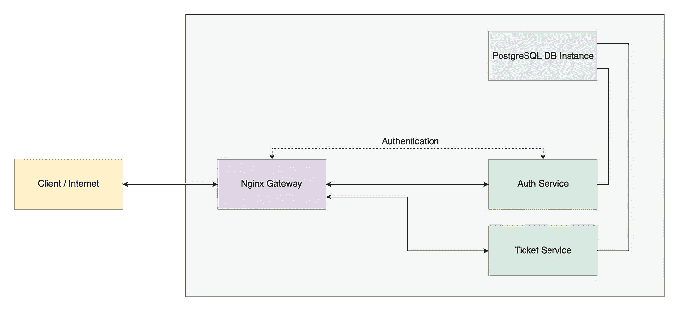
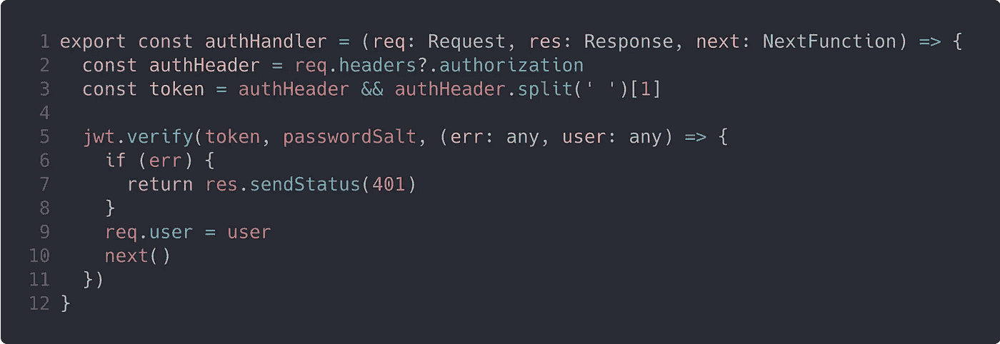
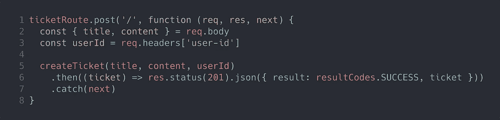

# 使用 ExpressJS 设计微服务

> 原文：<https://itnext.io/designing-microservices-with-expressjs-eb23e4f02192?source=collection_archive---------1----------------------->


在这篇文章中，我将解释如何在 NodeJS 中开发一个基于微服务的架构。我创建了一个票务管理应用程序场景，我画它来解释。



在开始之前，我不会解释所有与 ExpressJS 相关的细节，因为你可以从下面的 Github 链接下载项目文件。

https://github . com/yildizberkay/micro services-with-express js

# 方案

在上图中，Nginx 有两个职责。第一个是管理所有的流量，第二个是检查用户的身份验证。在这篇文章中，我不会深入讨论授权问题。这可能是另一篇文章的主题。

我们也有认证和票务服务，它们只有一种模式。授权服务处理注册和授权验证，而票证服务管理属于用户的票证。

我们有两个公开端点，无需任何身份验证即可注册和登录。中间件管理 auth 服务的认证，而 Nginx 管理其余服务的认证。如果任何请求到达票务服务，Nginx 将向 auth 服务询问令牌的有效性，根据结果，它将拒绝或接受它们。如果请求被接受，Nginx 还会将活动用户的 id 和报头一起传递给票务服务。

# 微服务设计

## 微服务的文件夹结构

```
- tests
- src
  - db
    - config
    - models
  - enums
  - exceptions
  - middlewares
  - services
  - utils
  - index.js
  - routes.js
  - server.js
```

*测试*文件夹是 *src* 文件夹的反映。测试以相同的路径和名称进行。名字的后缀是。 *test.js* 扩展。

*src/db/config* 保存数据库概要文件。这些配置文件可以用环境参数来修改。在这个实现中，我们有 3 个概要文件作为*开发*、*测试*和*生产*。数据库模型保存在 *src/db/models* 文件夹下。我们使用 Sequelize 作为 ORM，但我不会深入细节，只是定义模型并使用它。如果你想了解这个 ORM 的细节，它有很好的文档。

*src/exceptions* 保存微服务特定的异常类。一个异常类包含一个*名称*和 *httpStatusCode* 。 *globalErrorHandler* 使用这两个参数生成一个错误响应。

所有的业务逻辑都位于 *src/services* 文件夹下。业务逻辑文件可以通过模型名称来分隔。

我没有创建 routes 文件夹，因为它们是只包含一个模型的简单服务，并且有一个主端点。如果您计划通过另一种策略来分解您的微服务，您可以创建一个 routes 文件夹，并将您的路径存储在该文件夹下。

## 用中间件处理认证

认证服务在用户认证中使用 [JWT 标准](https://jwt.io/)。 *authHandler* 是我们的关键中间件。它获取*授权*密钥并解析它。在第 5 行中，JWT 被验证。如果无效，它将返回 401 状态代码。



## Nginx 和 Auth 服务之间的通信

*/check-token* 端点返回 200 状态码，并将 *User-Id* 属性添加到头中。Nginx 稍后将处理该属性。


## 从票务服务获取用户标识

Nginx 将头中的 User-Id 传递给所有其他用 auth 实现的服务。



# 网关设计

## Nginx 作为网关

Nginx 是一个独特的 web 服务器，你只需要几行代码就可以把它配置成负载平衡器或网关。当 Nginx 在 Docker 容器上工作时，它可以看到同一网络中的其他服务。

在下面的代码中，它处理来自 8080 的所有请求。 *location /auth* 捕捉以 */auth* 开始的端点，并用 *proxy_pass 将到来的请求传递给*http://service-auth:3000*。你可能会问 Nginx 如何识别这个主机名。Docker 将为位于同一网络中的所有容器设置该主机名。*

```
server {
  listen 8080;
  location /auth {
    rewrite ^/auth/(.*) /$1 break;

    proxy_pass        http://service-auth:3000;
    proxy_redirect    off;
    proxy_set_header  Host $host;
    ...
  }
}
```

这是一个简单的演示。如果你的服务变得更加复杂和拥挤，你也可以使用像 [Consul](https://www.consul.io/) 这样的服务发现解决方案。

## 证明

[*auth _ request*](http://nginx.org/en/docs/http/ngx_http_auth_request_module.html)*模块在请求服务之前处理所有的认证事务。在认证请求完成后， *auth_request_set* 将来自认证结果的任何值设置为一个本地变量，如 *$user_id* ，这样我们可以在以后使用它来传递。*

```
*location /ticket {
  auth_request /check-token;
  auth_request_set $user_id $sent_http_user_id;

  rewrite ^/ticket/(.*) /$1 break;

  proxy_pass        [http://service-ticket:3000;](http://service-ticket:3000;)
  proxy_set_header  User-Id $user_id;
  ...
}*
```

*那么， */check-token* 定义在哪里呢？我们定义了一个内部位置，它被直接传递给 auth service 的相关端点。*

```
*location /check-token {
  internal;
  proxy_pass        http://service-auth:3000/check-token;
  ...
}*
```

## *负载平衡*

*您可能有一组授权服务，并放置了一个内部负载平衡器。为此，我可以建议两个策略。*

***策略一:Nginx 上游**
*上游*如果你想用 Nginx，来帮我们。它用于组合一组服务器，并具有负载平衡能力。*

```
*upstream service-auth {
  server service-auth-1:3000;
  server service-auth-2:3000;
  server service-auth-3:3000;
}

server {
  listen 8080;
  location /auth {
    rewrite ^/auth/(.*) /$1 break;

    proxy_pass        http://service-auth;
    proxy_redirect    off;
    proxy_set_header  Host $host;
  }
}*
```

*   *[https://docs . nginx . com/nginx/admin-guide/load-balancer/http-load-balancer/](https://docs.nginx.com/nginx/admin-guide/load-balancer/http-load-balancer/)*

***策略二:像 PM2
这样的流程管理器服务器可以用 PM2 或者 StrongLoop 这样的流程管理器来运行。它们提供集群模式，任何数量的应用程序都可以在一个容器中工作。***

*   *[https://PM2 . key metrics . io/docs/usage/docker-PM2-nodejs/# starting-a-configuration-file](https://pm2.keymetrics.io/docs/usage/docker-pm2-nodejs/#starting-a-configuration-file)*

# *结论*

*感谢你阅读这篇文章。我试图简单地解释，它当然有更多的细节，但这些细节是由你的需求决定的。我也创建了部署脚本，但是我将在另一篇文章中解释细节。你可以在下面的 Github 链接中找到帖子的所有运行代码。*

*最后，记住没有唯一正确的方法。尤其是在 JavaScript 中:)*

*Github 资源库:[https://github . com/yildizberkay/micro services-with-express js](https://github.com/yildizberkay/microservices-with-expressjs)*