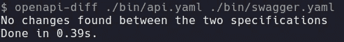
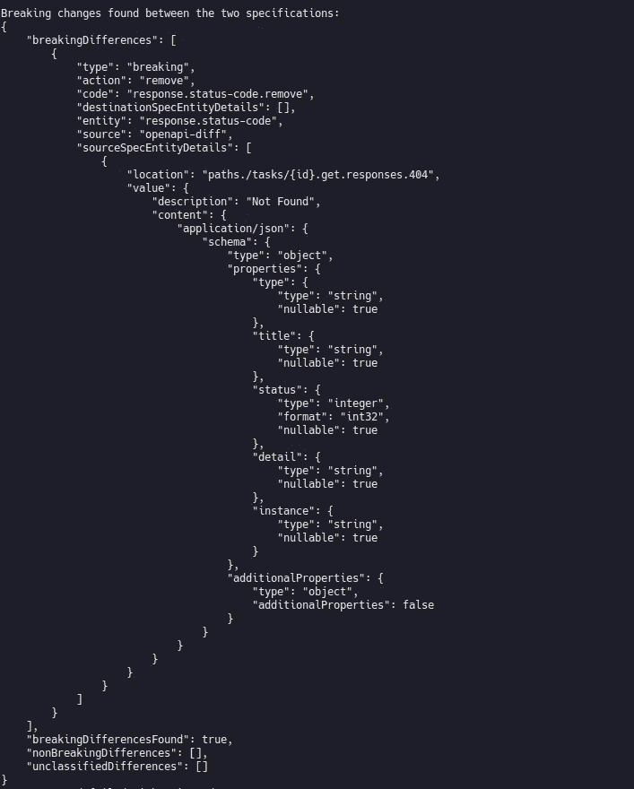

# 使用 API 优先的方法设计 Restful APIs 契约测试

> 原文：<https://itnext.io/designing-restful-apis-using-an-api-first-approach-contract-test-34bde79603dd?source=collection_archive---------3----------------------->

几天前，我写了“*使用 API 优先的方法设计 Restful APIs】系列文章的第二部分，我真的建议你看看第二篇文章，了解一下 [OpenAPI 如何帮助你在不写任何代码的情况下拥有一个 MockServer】。](https://medium.com/@nicolastakashi/designing-apis-using-an-api-first-approach-mock-server-78ddbd9993f5)*

今天我们将讨论契约测试，以及如何确保 API 实现符合提议的设计。


照片由[蒙蒂艾伦](https://unsplash.com/@monty_a?utm_source=unsplash&utm_medium=referral&utm_content=creditCopyText)在 [Unsplash](https://unsplash.com/s/photos/backwards?utm_source=unsplash&utm_medium=referral&utm_content=creditCopyText) 拍摄

当我们谈论 API 时，我们谈论的是契约定义，因此我们必须记住，在 API 可用之后，定义的契约必须得到 API 提供者的支持。

即使在 API 可用之后，它仍在不断发展，API 生命周期中最大的挑战之一就是 API 的发展。因为有时，业务需求变化如此之大，以至于当前的合同不能满足新的需求，需要一个突破性的改变。

# 😈突破性变化——万恶之源

正如我经常说的那样，API 是契约定义，我们不能违反契约而没有任何不良后果。

当一个新的功能打破了契约的当前状态时，如果你不能很好地管理它，你的客户就会有问题，在你的 API 发布后，他们的客户就会被打破。

因此，为了在 API 开发期间获得快速反馈，您必须知道一个变更是否引入了突破性的变更。

# 🧪可能的方法

有几种可能的方法可以帮助您获得关于重大变更的快速反馈。

## 单元测试

针对您的 API 运行单元测试将会让您知道契约何时被破坏，因为您的测试将会开始失败。

这是一个非常容易开始的策略，而且几乎所有的应用程序都已经有了单元测试套件，在订单方面，这种方法很容易被绕过，因为开发人员只需修复测试就可以成功并继续前进。

## API 版本控制

为每个新版本创建一个新版本的 API，保留旧版本，直到您的客户迁移到新版本。

我们知道 API 版本化是一个最佳实践，但是如果你为你的 API 创建一个新版本，毫无疑问，这将很快变得混乱，并且你将很难将所有的版本保持在一起。

## 合同测试

检查 API 设计期间设计的内容和开发的内容之间的差异，在持续集成管道中运行它将为我们提供快速的反馈，这是一种非常灵活和有效的方法。

## 我应该使用什么方法？

如果我们看一下前两个选项，我们可以发现明显的缺点，要么是流程旁路，要么是可维护的问题。

将契约测试与其他两种方法进行比较，我们可以看到，开发人员无法在不对原始 OpenAPI 文档进行更改的情况下绕过该过程，这种更改必须为您的团队以及(如果可能的话)API 利益相关者进行审核。

它更容易自动化，并提供对什么正在下降以及为什么会失败的清晰理解。

# 🤖合同测试实现

如上所述，契约测试似乎是检测构建时突破性变化的最佳解决方案，为了在本期杂志中帮助我们，让我们使用一个名为`openapi-diff`的工具，这是一个 npm 包，它比较两个 OpenApi 文档并查找删除或添加的内容。

OpenAPI-diff 将更改分为两组，**突发更改**和**平滑更改，**让我们来看一些例子:

**突破性变化**

*   删除路径或参数
*   重命名路径或参数
*   添加必需的参数
*   修改响应项目

**平滑变化**

*   添加路径或参数
*   添加响应项目
*   添加或更新描述

安装`openapi-diff`太简单了，你只需要运行下面的一个命令。

```
// using npm
npm install openapi-diff// using yarn
yarn add openapi-diff
```

## 测试什么？

也许你是在问自己，但是我们将通过差异来检查什么。

在我们继续下一步之前，一个非常重要的步骤是提取由您的代码生成的`swagger.json`，这将取决于您用来编写应用程序的平台。

在这篇博文中，我将使用一个 ASP.NET 核心 API，它将位于本系列文章所使用的同一个存储库中。

为了简单起见，我不会展示如何在 ASP.NET 核心项目中设置 Swashbuckle，但是如果你想知道如何正确地做，请在下面评论，我可以写一篇关于这个设置的帖子。

## ASP。NET Core 和 Swashbuckle CLI

既然你已经在你的 ASP.NET 核心项目中配置了 Swashbuckle，你可以安装一个名为`Swashbuckle.AspNetCore.Cli`的 Dotnet 工具，这是一个非常简单的工具，它使用项目 DLL 提取`swagger.json`，如果你想了解这个工具的更多信息，请查看 [Github 文档](https://github.com/domaindrivendev/Swashbuckle.AspNetCore#swashbuckleaspnetcorecli)。

按照官方文档中的描述安装工具后，只需运行下面的命令。

```
swagger tofile --yaml --output ./bin/swagger.yaml ./api/TodoApp.Api/bin/Debug/netcoreapp3.1/TodoApp.Api.dll v1
```

上面的命令将提取`swagger.json`并将其转换为`YAML`文件，这个文件看起来像我们在 API 设计过程中编写的 OpenAPI 文件。

## OpenAPI-Diff 的实际应用

现在我们已经有了设计好的 OpenAPI 文档和通过代码生成的 OpenAPI 文档，是时候比较这些文件并检查输出了。

只需运行上面的命令，让我们看到控制台输出。

```
openapi-diff ./bin/api.yaml ./bin/swagger.yaml
```

## 没有变化



OpenAPI 差异—未检测到任何更改

## 随着变化

我只是对代码做了一些修改，向`GET /tasks`端点添加了一个新的查询字符串参数，并从`GET /tasks/{id}`端点删除了状态代码，我们可以看到下面的输出。



OpenAPI 差异—检测到重大更改

正如您在上面看到的，查询字符串参数中的更改没有被记录，但是删除状态代码的更改被检测为重大更改。

现在，您只需将 OpenAPI Diff 添加到您的 API 管道中，就可以在每次有人更改 API 实现并将其推送到您的存储库时检测可能的重大更改。

这种策略允许开发人员在他们的本地机器上运行相同的脚本，避免管道中断，具有快速失败验证。

# 🏁结论

在我看来，避免中断更改是 API 生命周期中最困难的任务，在大多数情况下，它与设计会话相关，如果我们关注设计的寿命，并尝试理解 API 旨在解决的领域中可能的极限情况，我们就可以在新的业务需求出现时减少中断 API 合同的必要性。

为了让突破性的变化在你的控制之下，契约测试策略可以帮助我们快速反馈，并让我们安全地打破契约，为你的 API 的客户制造问题。

通常每个代码都会在 [Github 库](https://github.com/nicolastakashi/todoapp-openapidocuments)中更新，你可以把它作为这篇文章的补充。

让我知道你认为这个策略怎么样？你已经知道了吗？

下面评论一下，大家分享一下经验吧。希望你喜欢，再见。