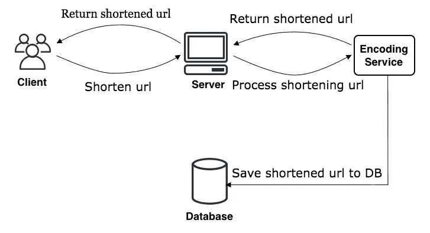

# 像 Bit.ly 一样设计缩短网址系统，一个月加载 60 亿次点击

> 原文：<https://itnext.io/designing-the-shortening-url-system-like-bit-ly-loading-6-billion-clicks-a-month-78b3e48eee8c?source=collection_archive---------2----------------------->


我们肯定都用过一些 URL 缩短服务(缩短链接),比如 Bitly 或 TinyURL。

对于工程师来说，使用是一回事，但如何设计一个每月加载数十亿次点击的系统肯定也是许多人感兴趣的。

今天我写这篇文章是为了深入挖掘这些系统，看看它们是如何设计的。

本条的目的:

*   给你一个如何设计百万用户，每月数十亿次点击的系统的概述。从思考到解决问题。
*   可以像 Bitly，TinyURL 一样自己搭建一个 URL 缩短系统。
*   帮你积累系统设计职位面试的经验。

# 什么是网址缩短系统？

当然，有一些人从来没有使用过链接缩短服务。所以让我简单解释一下什么是网址缩短。

URL 缩短是一项我们可以缩短原始链接的服务。

比如我们的原文链接是:[https://medium . com/jp-tech/docker-image-in-production-1gb-or-100 MB-a 455 ed 5 EB 461？source = your _ stories _ page-————](https://medium.com/jp-tech/docker-image-in-production-1gb-or-100mb-a455ed5eb461?source=your_stories_page--------- - - - - - - - - -)

使用缩短后的链接后，会变成这样:【shorturl.at/bvzO3[](http://shorturl.at/bvzO3)

现在，如果我们在浏览器中打开 shorturl.at/bvzO3 的[链接，它会重定向到原来的链接。](http://shorturl.at/bvzO3)

# 为什么我们需要缩短链接？

这大概是很多人关心的问题。比如只需要把原链接发给查看者，而不需要缩短链接那么费时间？而现在，有人要再手动输入链接吗？…

问那些问题并没有错。

**使用缩短链接的主要目的是:**

*   看短链接更好看。
*   可以统计点击链接的人数，分析评估结果。用于营销。
*   可以隐藏一些以赚钱为目的的联盟营销链接。

# 系统功能需求

大多数链节缩短系统必须满足以下要求:

**功能需求:**

*   输入的是一个原始链接，系统会将原始链接缩短成一个更短且唯一的链接格式
*   当用户访问缩短的链接时，系统会将其重定向到原始链接
*   用户可以随意选择定制自己的缩短链接。
*   缩短的链接将在一定的默认时间后过期。但是，用户可以调整这个时间段。

**非功能性需求:**

*   高可用性系统。我们为什么需要这个？因为如果系统死了，那么到时候所有缩短的链接都会死。
*   当点击缩短的链接以切换到原始链接时，重定向时间必须是最小的(最小延迟)。
*   缩短的链接是无法猜测的。

**扩展请求:**

*   我可以分析点击一个缩短的链接多少次？
*   提供第三方可以使用的 API。

# 系统分析

在这一节中，我将向您展示如何估计每月请求的数量、磁盘空间、内存使用、网络带宽消耗…

大多数链路缩短系统将具有相当高的访问量。

假设我们设计的系统的读写比为 100: 1。(记住这个比率，因为它在整篇文章中都被使用。)

*   这里的阅读率是点击缩短链接的人数
*   写比率是创建缩短链接的人数。

# 交通量估计

假设我们的系统一个月有 5 亿个缩短的链接。

用一个**读:写**比是 **100:1** 那么读的数量将是:500M * 100 = 50B (M 是百万，B 是十亿)

1 秒钟写多少？

500 米/ (30 天* 24 小时* 3600 秒)= 200 URL /秒

1 秒钟阅读的次数是多少？

200 * 100 = 20K URL /秒(因为读写比为 100: 1)

# **存储估计**

假设我们要将所有缩短的链接保存 5 年。因为我们在 1 个月内缩短了 5 亿个链接，所以 5 年后我们将拥有:

5 亿* 12 个月* 5 年= 300 万个网址

假设每个缩短的链接，我们将使用 500 字节来保存它在存储器中。5 年内节省的 5 亿个 URL 的驱动器空间将为:

30B * 500 字节= 15TB

# 带宽估计(网络带宽)

首先，我来解释一下什么是带宽(网络带宽)
网络带宽是一个术语，表示 1 秒钟内的数据传输量(数据大小)。

其中数据传输会包括两种类型的传入数据与传出数据:传入数据是传输到服务器的数据量(与上传类型相同)，传出数据是从服务器返回给用户的数据量(像下载)。因为我们的系统在 1 秒钟内有 200 个新的 URL，那么:

总传入数据= 200 * 500 字节= 100 KB /秒

对于读取请求，我们的系统有 20K URL / s，那么:

总传出数据= 20K * 500 字节= 10MB /秒

# 记忆估计

为了让系统运行得更快，最好的解决方案是缓存很多用户点击的短链接。那么我们需要多少内存呢？

如果我们遵循 80:20 规则，20%的缩短链路会产生 80%的系统流量。(简单来说，只有 20%的缩短链接是供很多用户访问的，其余 80%根本没有访问权限。因此，20%的缩短链接会产生 80%的流量。)

因为我们总共有 20K 个 URLs 秒(或 20K 个请求/秒)，所以 1 天将有:

20K * 3600 秒* 24 小时= 1.7 亿次请求/天

要缓存 20%的请求，我们需要:

0.2 * 1.7 * 500 字节= 170GB 内存

# 系统规模汇总

我们的系统一个月有 5 亿个网址，读写比为 100:1。那么我们的系统规格将如下:

*   每秒生成 200 个 URL
*   访问数量:20K 请求/秒
*   传入数据(与上传相同):100KB / s
*   传出数据(与下载相同):10MB / s
*   5 年后的驱动器容量:15TB
*   高速缓存的内存容量:170GB

# API 设计

我们可以使用 SOAP 或 REST APIs 来设计系统 API。通过以上需求，我们看到我们的系统至少需要以下两个 API:

首先，我们需要一个 API 来创建一个缩短的链接:

```
createURL(api_dev_key,
          original_url,
          custom_alias=None,
          expire_date=None)
```

*   api_dev_key (string):是注册用户帐户的 api 开发者密钥。这个键用于识别用户，限制用户请求的数量(也称为速率限制)original_url (string):原始链接
*   custom _ alias(string-可选):自定义 URL 的关键字
*   expire_date(字符串-可选):缩短链接的到期日期

返回值(字符串):

*   如果成功，它将插入数据库，并返回缩短的链接
*   如果失败，返回一个错误代码。

**删除网址**

第二个 API 也很有必要删除注册的缩短链接。

```
deleteURL(api_dev_key, url_key)
```

*   api_dev_key (string)是注册用户帐户的 api 开发者密钥
*   url_key (string):是一个缩短的链接。

返回值(字符串):

*   如果成功，缩短的链接将被删除。
*   如果失败，它将返回一个错误代码。

# 如何防范黑客？

黑客可以使用 api 创建许多超过当前系统设计的缩短链接。为了让我们的系统安息。

例如，我们当前的系统正在设计一个对每月生成的 5 亿个 URL 的响应。

黑客攻击将创建 100 倍于目前的大约 50 万亿个 URL，因此系统将消耗更多的资源，使用更多的内存，消耗更多的驱动器。那么系统肯定会崩溃。并且整个缩短的链接将被解散。

那么如何解决这个问题呢？最简单的方法是通过 api_dev_key 限制 api 调用的数量(这种技术被称为 Grab 正在使用的速率限制)。例如，每个 api_dev_key 在 1 天内只会创建大约 100 个缩短的链接。

不是 100%完美的方式，但也限制了一些问题。

# 数据库设计

**我们的数据库要求如下:**

*   数十亿条记录需要保存
*   每个 1 对象将尽可能小地保存(范围小于 1KB)
*   记录之间不需要数据关系。
*   该系统具有高读取速率

**数据库模式:** 我们将需要 2 个主表:1 个存储用户信息，1 个存储 URL 信息。


**应该使用什么样的数据库？** 因为我们预计要保存数十亿条记录，而且，表之间没有关系，所以使用 NoSQL 键值可能是最好的选择。比如 DynamoDB 和 Cassandra 我觉得还可以。

# 算法和基本系统设计

这里要解决的问题是如何创建一个缩短的链接，而且只能从原始链接创建。

在第一部分中，我举了一个缩短链接的例子:[shorturl.at/bvzO3](http://shorturl.at/bvzO3)

然后这部分我们就去设计创造缩短的部分，就是 *bvzO3* 。

# 编码 URL

我们可以使用一些散列函数(如 MD5 或 SHA256)来散列 URL 输入值。然后会用一些编码函数来显示。例如，base36 ([a-z，0–9])，或 base62 ([a-z，a-z，0–9])和 base64 ([a-z，A-A，0–9，-，)。]).

问题是，我们用什么密钥长度？6.8 还是 10？

如果 base64 用于 6 个字符，那么我们有 64 个^ 6 = 68.7 b URL
如果 base64 用于 8 个字符，那么我们有 64 个^ 8 = 281 万亿 URL

因为我们的系统每月生成 5 亿个 URL，所以该系统在 5 年内将总共有:

500 万* 12 个月* 5 = 300 万个网址/ 5 年。

因此，68.7 亿个网址(6 个字符)可以使用 5 年。

如果我们使用 MD5 算法作为散列函数，那么它将生成包含 128 位的散列值。然后 base64 编码哈希值，它将生成至少 21 个字符(因为每个 base64 字符将编码 6 位哈希值)。

同时，我们的密钥空间只需要 6 个字符。那么如何选择一把钥匙呢？我们可以选择前 6 个字符。虽然也有重叠的情况。但是概率只有 1 / (64 ^ 6)左右。它非常小。应该可以接受。

如果它是安全的，我们每次生成它时，都会在数据库中检查它是否安全。如果不是，那么 ok，如果是，那么在 URL 前添加任意随机字符串，重复直到生成唯一的字符串。

例如:

**我们的解决方案有什么问题？**

*   许多用户可以共享相同的原始链接，因此缩短的链接将被复制。这是不可接受的。
*   如果 URL 中的某些内容被编码了怎么办？例如，[http://example.com/index.php?id=design](http://example.com/index.php?id=design)和[http://example.com/index.php%3Fid%3Ddesign](http://example.com/index.php%3Fid%3Ddesign)是两个完全相同的 URL，但是 URL 的一部分已经被编码。

**解决方案** 有两种方法可以解决这个问题。

*   我们可以使用一个增量整数并附加到每个根链接的开头。然后它会一直确保我们的原始链接是唯一的，即使有很多人填写单个链接，缩短的链接也会一直不一样。并且在创建了缩短的链接之后，这个整数将增加 1。但有一个问题是，如果数字永远增加，这个整数就会溢出。此外，这种增量处理也会影响系统的性能。
*   或者，我们可以将 user_id 添加到每个 URL 的开头。然而，如果用户没有登录，并希望创建一个缩短的链接，那么我们必须要求另一个密钥。并且这个键必须是唯一的(如果唯一的非唯一输入键需要重新输入，直到唯一)。

这是系统的流程:



首先，输入要缩短的链接，然后按 enter 键。然后，请求将被发送到服务器。

服务器将接收请求，并将其传送到缩短链接的专用部分。让我们称之为编码服务。

编码服务将执行短 URL 处理:

*   如果 URL 在系统中尚不存在，它会将缩短的链接保存到数据库中，并将结果返回给服务器。
*   如果该网址已经存在于系统中(即有人已经使用了这个网址)。然后，它会在 URL 的开头添加一个序列(增量整数),并执行缩短链接。然后将缩短的链接保存到数据库，并将结果返回给服务器。

服务器接收结果并返回给用户。

# 数据分区和复制

如果我们在数据库中存储所有 300 亿个 URL，并且在数据库中有高达 20K 个请求/秒的调用。那么数据库可能会负载过大，导致停机。要解决这个问题，有两种解决方案:

*   对数据库中的数据进行分区(数据分区)。这意味着我们将把数据库分成许多不同的数据库。每个孩子将包含 1 条数据。
*   缓存 URL 或调用以最小化对数据库的查询(我将在下一节解释这一点)

对于数据分区，有两种类型:

**基于范围的分区** 这种类型的分区将依靠 URL 中的第一个字母或散列键来划分数据。

例如，以单词“a”开头的 URL(跳过 https: //或 http: //)将在 DB 类型“a”中。任何以字母“b”开头的 URL 都将进入数据库“b”。如果分区是基于第一个字母，我们将需要 26 个不同的数据库(从 a -> z)

但这种解决方案可能会有问题，假设我们把所有以字母“f”开头的 URL 放入“f”类型的数据库中。但不幸的是，所有以字母“f”开头的网址都是访问量最大的。在当时，这种类型的“f”DB 是相当大的负载。

注意:这种基于首字母的分区只是一个例子，您可以设计自己的算法来正确有效地对数据进行分区。没有必要选择第一个字母来划分。

**基于散列的分区** 在这种类型中，我们将获得被存储对象的散列值。然后，它将根据哈希函数计算将使用哪个分区。我们可以采用主键或根链接的哈希值来确定哪个分区将存储数据。

# 隐藏物

对于一个月几十亿次点击的系统来说，缓存服务器是必不可少的。

为什么我们需要缓存服务器？

**标准流程将是:**

*   步骤 1:用户访问缩短的链接
*   步骤 2:我们必须去数据库从缩短的链接中获取原始链接
*   步骤 3:将用户重定向到原始链接。

如果没有缓存服务器，那么每次都必须进入数据库以获取结果。并且产生的 DB 将承受相当大的负载。为了最小化对数据库的查询，我们将缓存以前的查询结果。下一次，如果用户可以访问缩短的链接，现在我们只需要转到检索到的缓存来完成，而不必再次查询 DB 来获得结果。

因为缓存服务器总是将数据存储在内存中。因此，与从数据库获取结果相比，从内存获取结果要快得多。

我们需要使用哪个缓存服务器？

目前，有许多缓存服务器，如 Redis、Memcache。我发现它非常有名，并且在世界各地的大型系统中被广泛使用。

以前我在一家游戏公司工作，当时我的系统使用 Redis，我发现它非常好，支持很多功能。例如，自动排序结果，可以同步内存和存储之间的数据，以防止数据丢失…

所以如果你不知道使用哪一个，我推荐你学习并实现 **Redis** 。

**我们需要多少内存？** 和上一部分一样，我计算出这个系统将使用高达 170GB 的内存来缓存 20%的 URL。但是现在服务器有 256GB 的内存，解决这个问题绰绰有余。

此外，我们可以组合许多小型服务器(例如，每个服务器有 8GB 的内存)来缓存那些 URL。

**如果缓存满了，那怎么办？**

大多数缓存系统遵循许多机制，如 LRU(最近最少使用)或 LFU(最少使用)。

*   LRU(最近最少使用):丢弃最近使用的缓存项。
*   LFU(最少使用):删除最少使用的缓存项。

由于这些机制，缓存将总是被刷新以避免完全使用。

负载平衡器
对于像这样的多个访问系统，web 服务器可能还不能处理它。为了解决这个问题，我将使用许多网络服务器。每个 web 服务器将接受用户的部分请求。

问题是如何自动请求分发到每个不同的 web 服务器？

负载均衡器就是为了解决这个问题而诞生的。

例如，在负载平衡器下有几个 web 服务器。第一次，从客户端到负载平衡器的请求将被转发到 web 服务器 1。第二次将被发送到网络服务器 2 …

目前，一些服务器提供商如 AWS、Google 或 Azure 支持负载平衡器。因此，您不需要担心必须构建负载平衡器。只要安装使用就完成了。

# 结论

通读这篇文章，你一定会对设计一个服务于数百万用户的大型系统有所思考，这是怎么回事？

我想如果你遇到类似那样的系统，那么你有足够的知识和技能去解决。

因为很多刚毕业或者没有在大系统工作过的人，很可能不知道从哪里入手，用什么技术。那么通过这篇文章希望能帮助你回答那些问题。