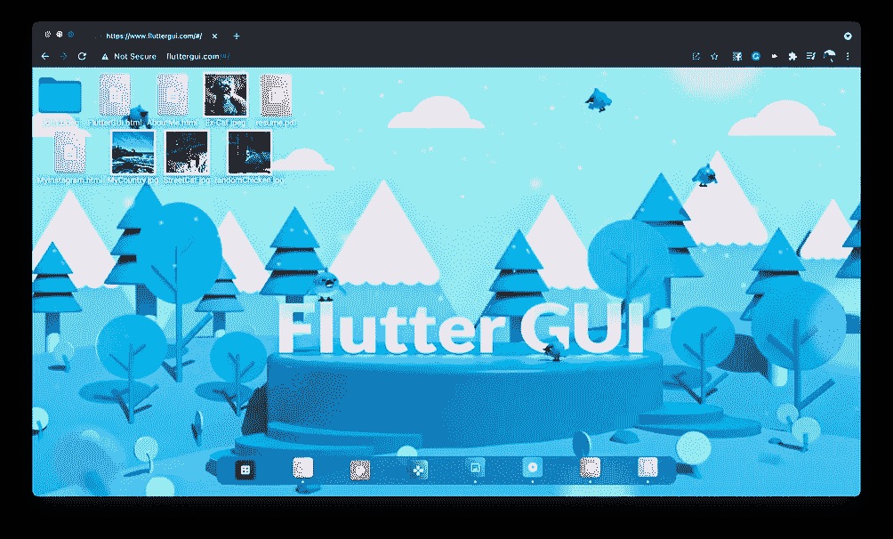
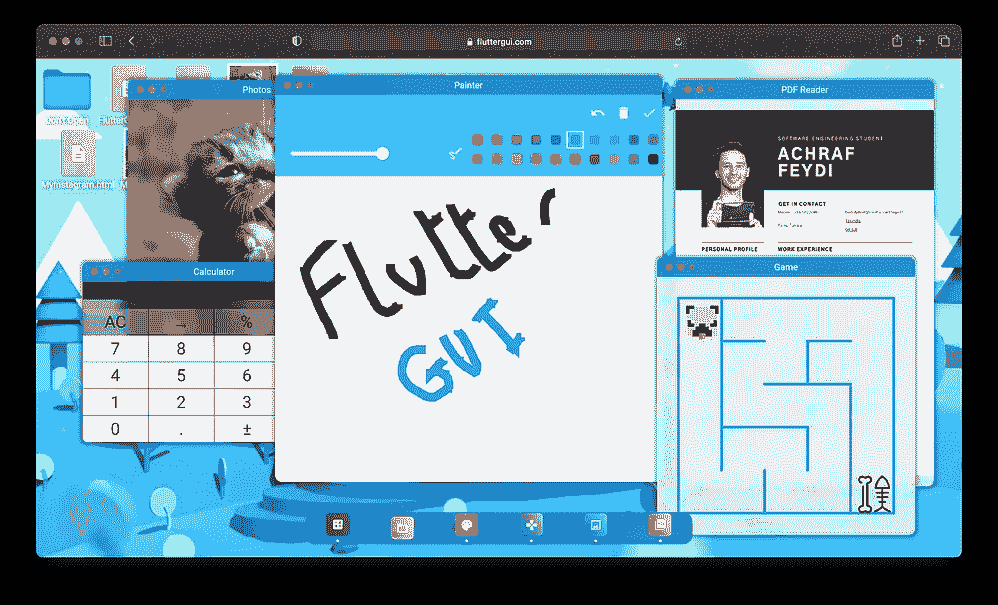
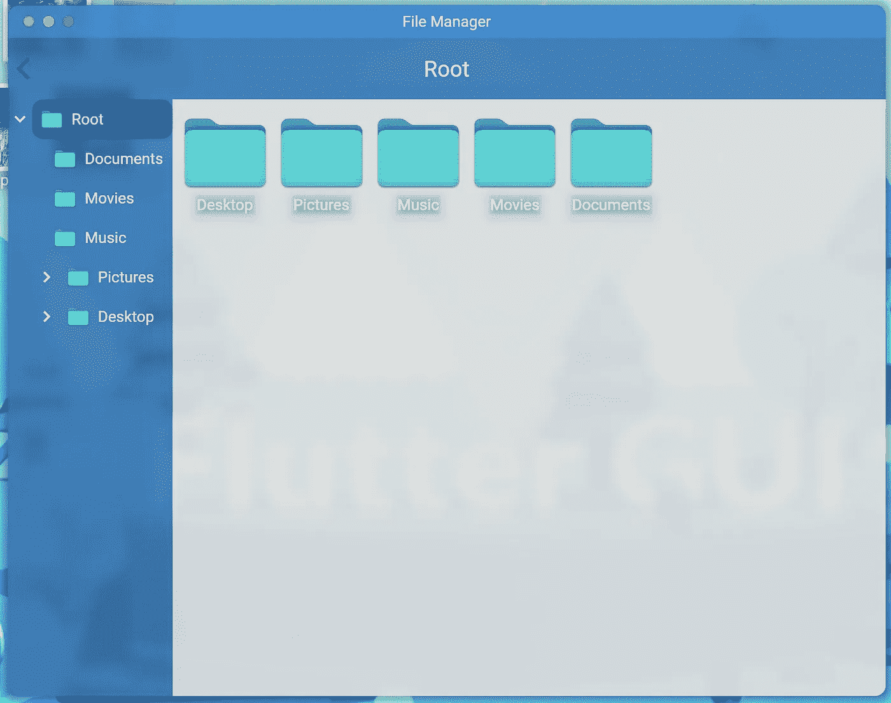
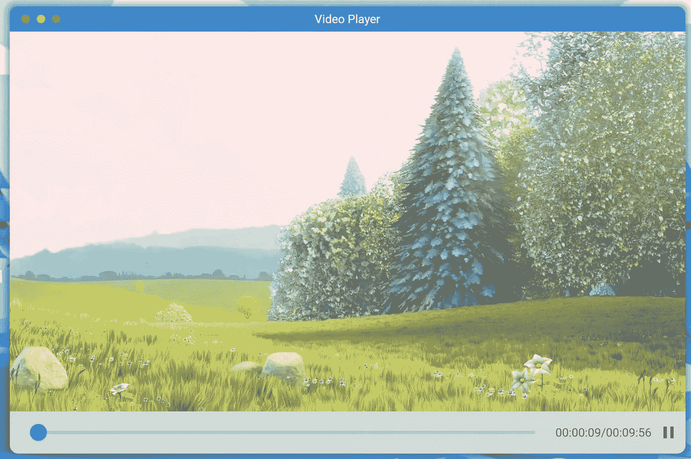
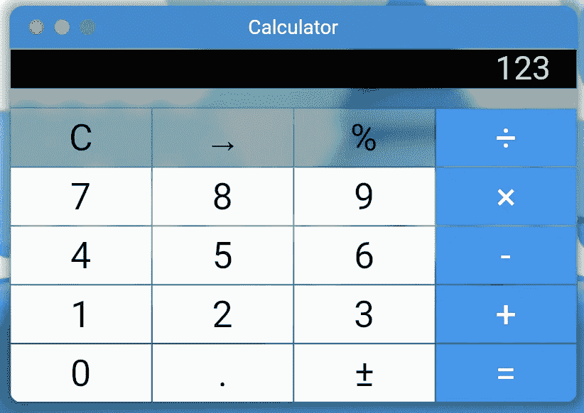
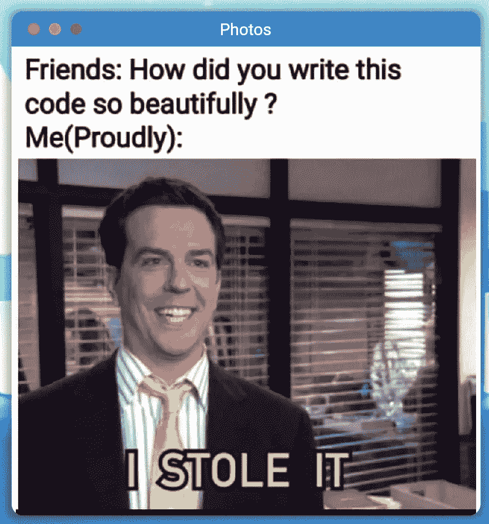
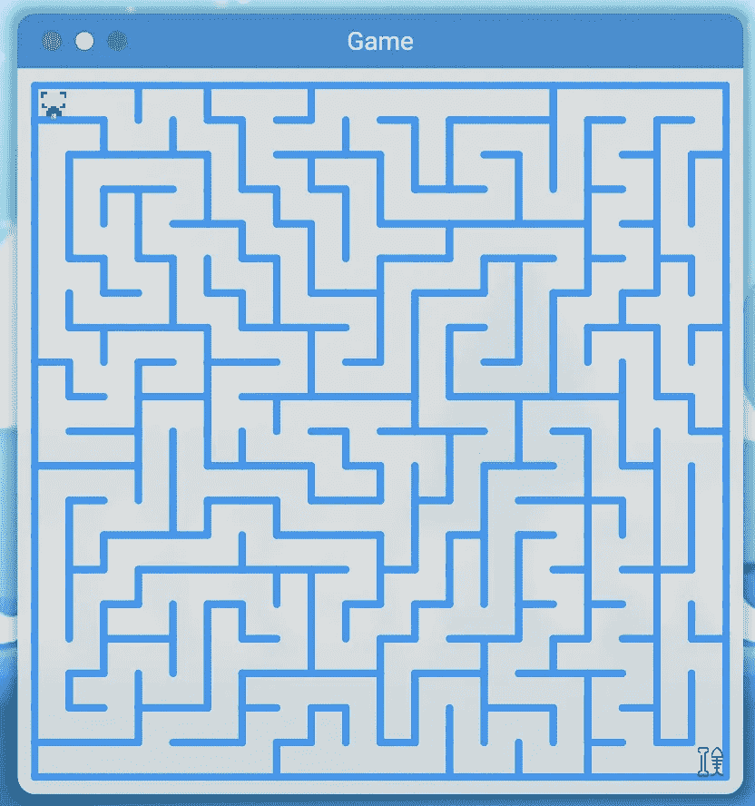
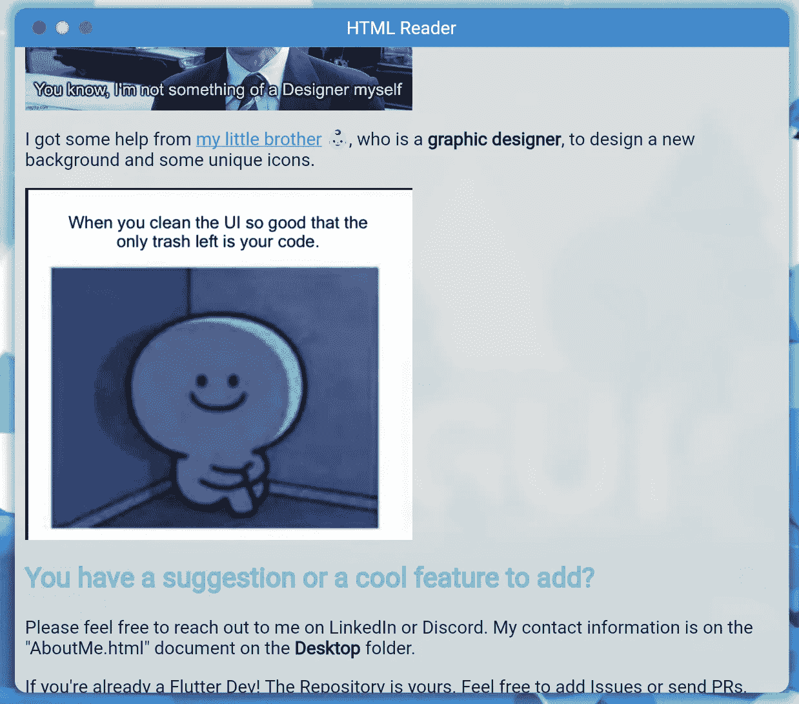
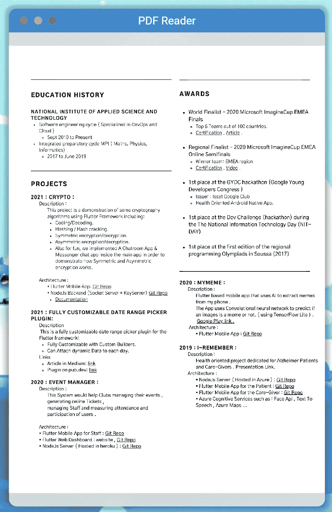
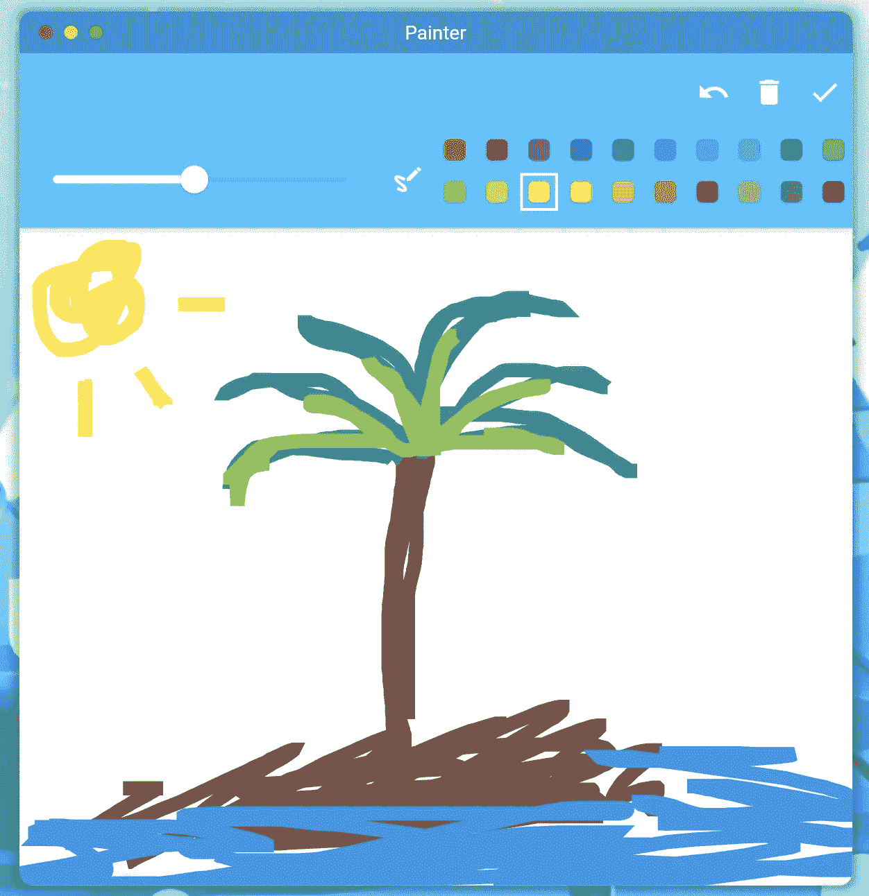

# 使用 Flutter WEB 实现桌面 GUI(第 1 部分:简介)

> 原文：<https://itnext.io/desktop-gui-implementation-using-flutter-web-part-1-introduction-42d21a6e7937?source=collection_archive---------5----------------------->

**网站链接**:【https://www.fluttergui.com/ T3

Github 回购:[https://github.com/achreffaidi/FlutterGUI](https://github.com/achreffaidi/FlutterGUI)

# 为什么是 FlutterGUI？

作为 Flutter 2 的一部分，Flutter 已经宣布 **Flutter 的 web 支持**已经达到了稳定的里程碑。

这不仅意味着我终于可以停止编写 HTML 和 CSS 代码，而且意味着我现在可以拥有一个可以在几乎所有流行平台上运行的应用程序🤯。

我并没有对 Flutter Web 的稳定版本抱太大期望，因为我已经测试过了，而且对大多数插件都没有足够的支持。但是回到两周前，我对目前支持 WEB 的插件数量感到惊讶。

这促使我尝试一些具有挑战性的东西，用 flutter web 创建一个桌面 GUI 作为我的新投资组合网站😎。

坦率地说，这个项目本身不是什么有用的东西🤷🏻‍♂️ ;这不是解决问题，可能也不是我下一个十亿美元的想法。但是，这是发现在 web 项目中使用 Flutter web 的优势✅和局限性⚠️️的最佳方式。老实说，我想我会花至少 2 个月的时间来发布它的第一个版本。

在这个项目上花了两个星期大约两个小时/夜的时间后，我终于有了值得发表的东西。

我很惊讶😲尽管我没有阅读任何文档，也没有像平时那样经常用谷歌搜索，但这种体验是多么的简单和流畅。从使用 Flutter mobile 开发转向 web 真的很简单，在这个项目中，我不需要使用我所学到的任何关于 Web 开发的东西。

要查看所有功能，请观看此演示视频:

# 技术概述

-项目现在有 8 个应用程序在里面运行，正如你已经猜到的:**都是小部件**。

-大多数应用程序都是现有的 flutter 插件，它们被包装在我创建的通用应用程序小部件中。

-该坞站是从零开始构建的，因为我无法找到满足我需求的现有坞站。

-️:这个项目没有后台，Flutter Web 应用程序托管在 Github 页面上。

-️:我用 Firebase Analytics 来跟踪用户与应用程序的互动。

# 应用程序

*   文件管理器:使用 [flutter_treeview](https://pub.dev/packages/flutter_treeview) 和 [reorderables](https://pub.dev/packages/reorderables) 插件构建。

文件管理应用程序

*   视频播放器:使用 [video_player](https://pub.dev/packages/video_player) 插件构建。

影像播放机

*   计算器:使用[flutter _ simple _ calculator](https://pub.dev/packages/flutter_simple_calculator)插件构建。

计算器

*   照片:是使用[的照片视图](https://pub.dev/packages/photo_view)插件创建的。

照片

*   游戏:使用[迷宫](https://pub.dev/packages/maze)插件构建。

比赛

*   HTML 阅读器:使用[flutter _ widget _ from _ HTML _ core](https://pub.dev/packages/flutter_widget_from_html_core)插件构建。

HTML 阅读器

*   PDF 阅读器:使用 [native_pdf_view](https://pub.dev/packages/native_pdf_view) 插件构建。

PDF 阅读器

*   画师:使用[画师](https://pub.dev/packages/painter)插件构建。

# 下一步是什么？

在这一系列文章中，我将解释我是如何在这个项目中实现一些复杂的小部件的。希望能帮助其他开发者做出又酷又**有用的**项目。

你可以在下面找到所有的链接。一旦文章准备好，我会及时更新:

*   [**第二部分:停靠**](https://achraf-feydi.medium.com/desktop-gui-implementation-using-flutter-web-part-2-dock-3ade96f4af8a)
*   [**第三部分:可拖动&可调整大小的窗口**](/desktop-gui-implementation-using-flutter-web-part-3-draggable-resizable-windows-46ea26049605)
*   **第四部分:Windows XP 崩溃**
*   第五部分:全屏动画
*   **第 6 部分:Github 页面和自定义 URL**