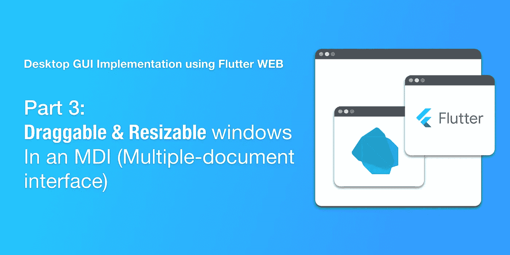
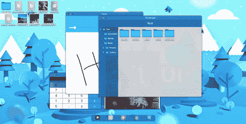
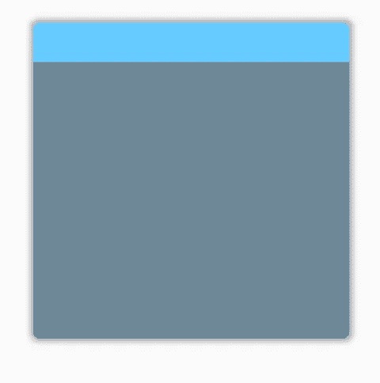
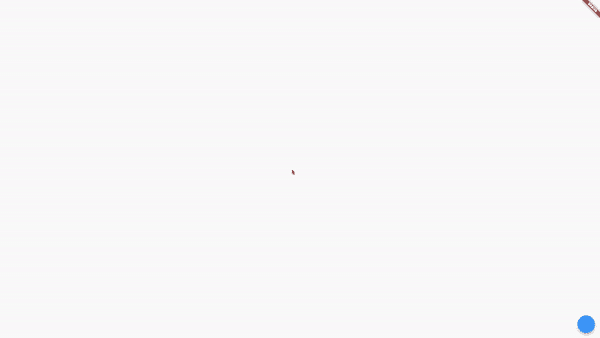
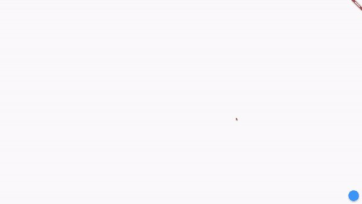
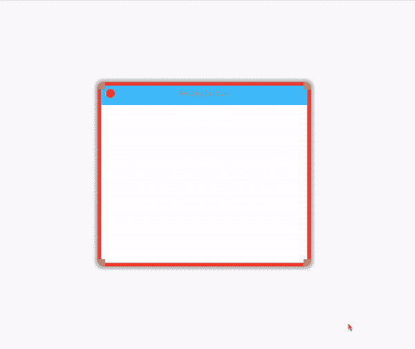
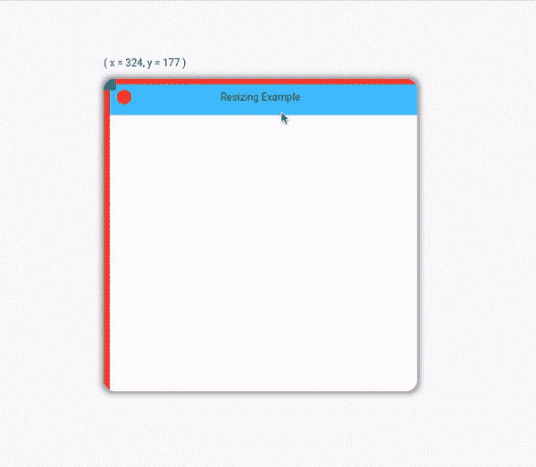

# 使用 Flutter WEB 实现桌面 GUI(第 3 部分:可拖动和可调整大小的窗口)

> 原文：<https://itnext.io/desktop-gui-implementation-using-flutter-web-part-3-draggable-resizable-windows-46ea26049605?source=collection_archive---------1----------------------->



大家好，欢迎来到我的使用 Flutter WEB 实现桌面 GUI 指南的第三部分！

如果您还没有理解第 1 和第 2 部分，我邀请您阅读:

*   [**第一部分:简介**](https://achraf-feydi.medium.com/desktop-gui-implementation-using-flutter-web-part-1-introduction-42d21a6e7937)
*   [**第二部分:停靠**](https://medium.com/nerd-for-tech/desktop-gui-implementation-using-flutter-web-part-2-dock-3ade96f4af8a)

在这一步，我们将讨论我在 [FlutterGUI 项目](https://www.fluttergui.com/)中实现的 MDI 系统的一个更简单的实现。



本教程结束时，你将能够实现一个简单的 MDI 系统，包括一些基本的功能，如拖动和调整大小。


# 目录:

1.  什么是计量吸入器？
2.  设置一个简单的测试用户界面
3.  使小部件可拖动
4.  修复小部件的叠加
5.  计算器示例
6.  使小部件可调整大小

# 什么是计量吸入器？

当我在做这个项目时，我甚至不知道什么是 MDI 系统。幸运的是， [jrheisler](https://www.reddit.com/user/jrheisler) 在我的 Reddit 帖子上让我知道我正在做的实际上是一个 MDI(多文档界面)。

据[我们的好朋友](https://en.wikipedia.org/wiki/Multiple-document_interface) [维基百科](https://en.wikipedia.org/wiki/Multiple-document_interface):

> 一个**多文档界面** ( **MDI** )是一个图形用户界面，其中多个窗口位于一个父窗口下。这种系统通常允许子窗口嵌入其他窗口，从而创建复杂的嵌套层次结构。

果然，这正是我正在建设的！

# 设置一个简单的测试 UI

所以，让我们从一个空屏幕开始:

我正在使用 Flutter Desktop (macOS)测试这款应用，但你可以在任何支持 Flutter WEB、Linux 或 Windows 的浏览器上运行它。


现在让我们创建三个 dart 文件:

*   mdiManager.dart :表示父窗口的有状态窗口小部件。它包含所有窗口，并负责在屏幕上排列子窗口。
*   mdiController : Dart 类，保存打开窗口的列表，并负责添加、删除和更新窗口。
*   resizableWindow.dart :一个有状态的小部件，作为子窗口的模板。它包含标题栏和主体，并且能够检测拖动和调整大小的手势。

从 **ResizableWindow** 类开始，我们将从声明一些重要的属性开始，比如:

*   currentHeight、defaultHeight、currentWidth 和 defaultWidth:这些属性将在调整窗口大小时使用。
*   x，y:表示子窗口在父窗口中的位置(TopLeft 为 0，0)。

现在，让我们将 ResizableWindow 制作成一个简单的方形小部件:

现在对于控制器，我们将声明一个列表 **_windows** 来保存打开的子窗口，并声明一个回调函数 _onUpdate 来在窗口改变位置或大小时触发状态更新。

我们还将定义 **_createNewWindowedApp()** 私有方法来创建新的子窗口并将其添加到打开的窗口列表中。

最后，我们将添加 **addWindow()** 公共方法，该方法将用于创建和添加一个仅用于测试目的的子窗口。

经理很简单。它会将 ResizableWindow 对象的列表转换为定位对象的列表，然后将它们放入堆栈中。就这么简单。

现在我们转到 **main.dart** 文件，使用我们已经创建的小部件！

我们创建一个 MdiController，并将其传递给 Scaffold 主体中的 MdiManager 小部件。

我添加了一个 FloatingActionButton 来测试通过控制器方法 **addWindow()添加新的子窗口。**


创建随机窗口

有点难看，不是吗？

让它看起来像一个真正的窗口应用程序。现在，将小部件分成两部分就足够了:标题栏 **_getHeader()** 和正文 **_getBody()** 。

Tadaaaa！



窗口模板

# 使小部件可拖动

戴上你的眼镜，握紧你的指关节，准备好——我们刚刚到达有趣的部分！

实现拖动行为就足以检测到拖动手势，然后相应地更新 x 和 y 属性。

为此，我们将首先声明 **onWindowDragged** 回调函数，然后使用**手势检测器**的**on 更新**回调函数中的 **dx** 和 **dy** 值来调用它。

作为一种选择，我只做了 TileBar (Header) Draggable，因为这是大多数 MDI 的常见行为。

**onPanUpdate** 的输出是一个包含拖动手势的 **dx** 和 **dy** 的对象。 **dx** 是拖动手势根据 X 轴的变化。dy 和 Y 轴也一样。

例如，如果用户向左拖动窗口 3 个像素，dx = 3。要计算新位置:

```
x = x + dx; 
y = y + dy; 
```

现在实现:

**MdiController** 的 **_createNewWindowedApp()** 方法将负责更新 x 和 y 属性，并触发 **_update()** 方法重建 widget 树:



拖动窗口的演示

# 修复小部件的叠加

我们还有一个问题要解决。窗口不能在堆栈中重新排列。一旦一个子窗口在堆栈的底部，即使我们把它拖到另一个窗口上，它也会一直在堆栈的底部。

最简单的方法是移除窗口并将其重新插入堆栈。它将被自动添加到堆栈的顶部。

这种方法的问题是，当我们移除窗口并将其重新插入小部件树时，窗口的状态将会丢失。这与 Flutter 如何更新小部件树有关。

我们可以使用以下密钥来解决这个问题:

如果你不熟悉在 Flutter 中使用按键，我推荐你看看这篇[中型文章](https://medium.com/flutterdevs/keys-in-flutter-104fc01db48f)。


窗口叠加演示

# **计算器示例**

让我们用一个简单的例子来测试我们的 MDI！为此，我选择使用[flutter _ simple _ calculator](https://pub.dev/packages/flutter_simple_calculator)插件。

但是在我们开始之前，我们需要通过向其构造函数添加参数来使 ResizableWindow 小部件动态化——一个用于标题，另一个用于我们将在窗口内运行的“应用程序”。

我们可以在页眉上添加标题:

当然，body 对 **_getBody()** 方法:

现在我们更新 **_createNewWindowedApp** 的参数如下，以传递标题和子 App。

最后，我们需要添加计算器应用程序依赖项:

```
flutter_simple_calculator: ^1.0.4
```

…并将一个 SimpleCalculator 小部件传递给 _createNewWindowedApp()调用。

正如您将在下面看到的，即使在拖动和重新排列子窗口之后，Calculator 应用程序的每个克隆体的状态仍然保持不变。



状态守恒演示

我们也可以这样添加一个*关闭*按钮:

将 **onCloseButtonClicked** 添加到 **ResizableWindow** 类中。

将红色按钮本身添加到 **_getHeader()** 方法中:

最后，我们更新 _createNewWindowedApp()方法以适应这些变化:


使用关闭按钮的演示

# 使窗口可调整大小

调整窗口大小并不简单。

我们应该首先检测窗口边缘的拖动手势，然后根据拖动的**位置**和**方向**做出相应的动作。

我选择使用带有嵌套定位小部件的堆栈小部件来定义可拖动区域(调整大小区域)。

我还改变了鼠标光标，以显示我可以从哪些区域调整大小。

我们有 8 个可以调整大小的区域:左、右、上、下、左上、右上、左下和右下。

在下面的例子中，我给调整大小的区域添加了颜色，使它们可见:



调整区域大小

你可以在下面的代码中看到**右侧**调整大小区域的实现:

GestureDetector 小部件提供了许多回调函数。我们将使用的是:

*   **onverticaldragdupdate**检测顶部和底部调整大小区域的拖动手势。
*   **onHorizentalDragUpdate** 检测左右尺寸调整区域的拖拽手势。
*   **on 更新**基本上同时检测两者。我们将在可以同时在两个轴上调整大小的角落使用它。

我们应该知道，当我们使用顶部、左侧或顶部左侧调整区域时，我们需要更新窗口的位置(x，y)以及 currentHeight 和 currentWidth 属性。



演示 x 和 y 何时随着调整大小而变化

为了满足这个需求，我们可以使用拖动信息调用 onScreenResized 方法。

其余部分:


最终结果！

**完整代码:**

[](https://github.com/achreffaidi/flutter_app_mdi/tree/v0.0.1) [## achreffaidi/flutter_app_mdi

### 新的颤振应用。这个项目是颤振应用的起点。一些资源让你…

github.com](https://github.com/achreffaidi/flutter_app_mdi/tree/v0.0.1) 

# 下一步是什么？

本教程只是我在 FlutterGUI 项目中实现复杂小部件的总体指南中的一步。希望能帮助其他开发者做出又酷又**有用的**项目。

你最终可以找到下面所有的链接。我会一路更新他们！

*   [**第 1 部分:简介**](https://achraf-feydi.medium.com/desktop-gui-implementation-using-flutter-web-part-1-introduction-42d21a6e7937)
*   [**第二部分:停靠**](https://medium.com/nerd-for-tech/desktop-gui-implementation-using-flutter-web-part-2-dock-3ade96f4af8a)
*   第三部分:可拖动的可调整大小的窗口
*   **第四部分:Windows XP 崩溃**
*   第五部分:全屏动画
*   **第 6 部分:Github 页面和自定义 URL**