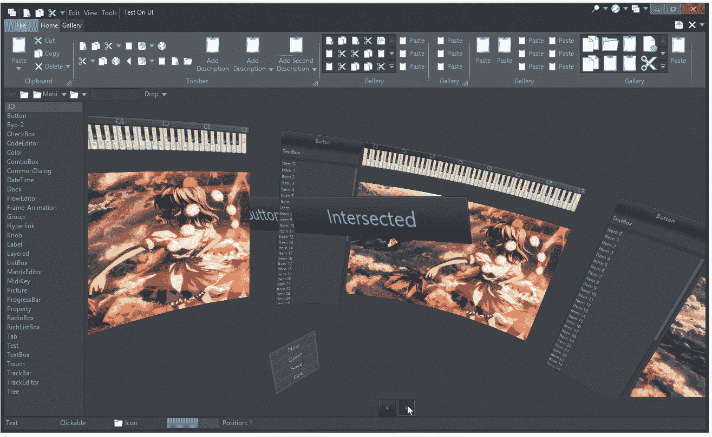
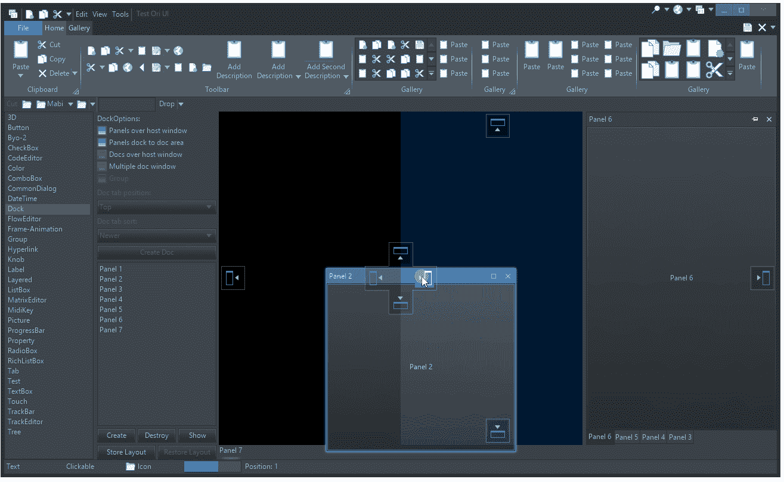
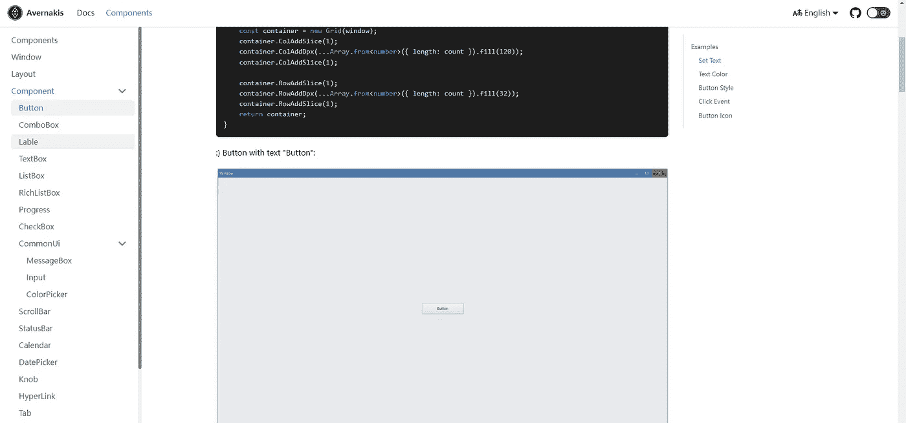
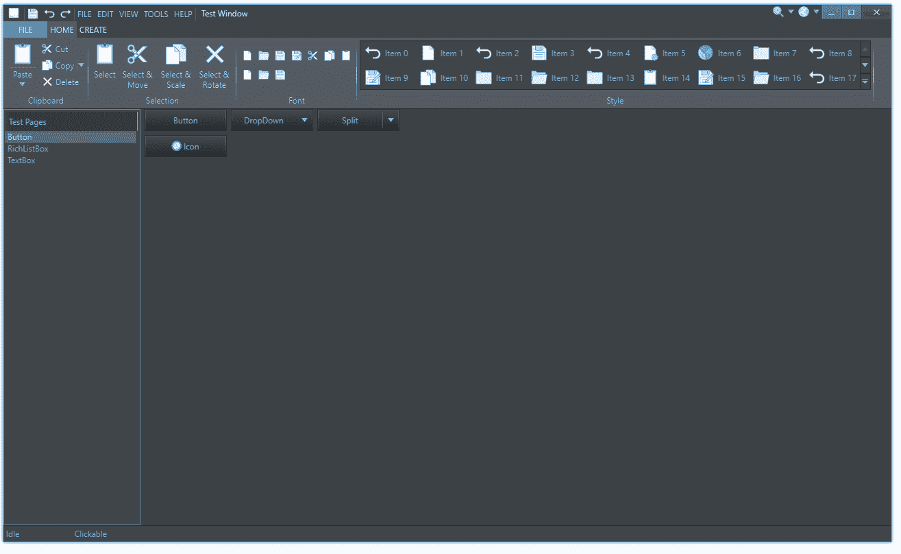
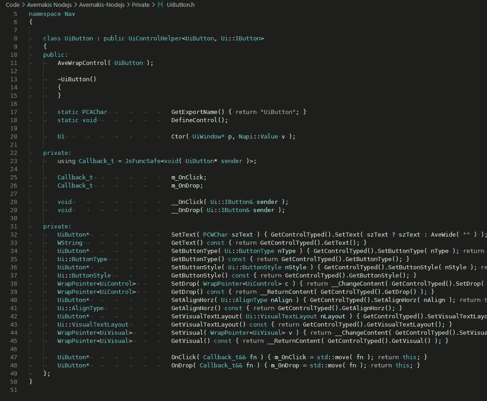
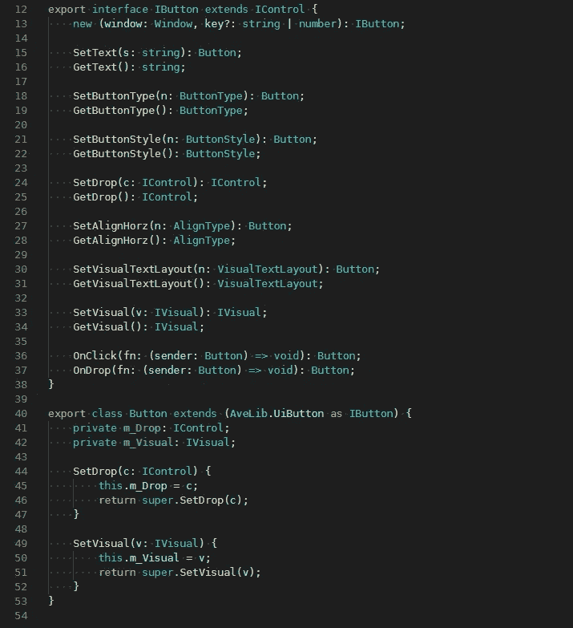
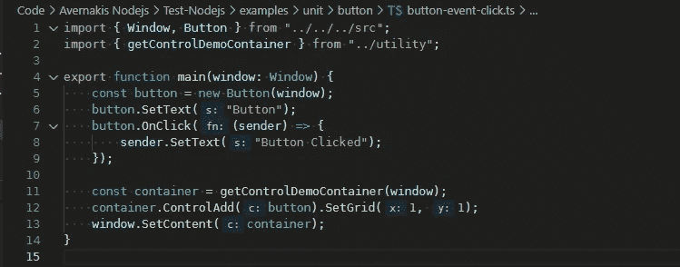

# 桌面 UI 替代:Avernakis

> 原文：<https://itnext.io/desktop-ui-alternative-avernakis-de7504822869?source=collection_archive---------4----------------------->

# 介绍

电子是伟大的，但如果你正在寻找替代品，你可能想看看 Avernakis Nodejs:[https://qber-soft.github.io/Ave-Nodejs-Docs/](https://qber-soft.github.io/Ave-Nodejs-Docs/)。

Avernakis Nodejs 类似于 NodeGui，由 Qt 驱动。不过 Avernakis 是一个新的 C++ GUI 库: [Ave SDK](https://github.com/qber-soft/Ave-SDK/blob/main/README_en-us.md) 。通过皮娜，Avernakis Nodejs 可以利用这些 c++ API。

# Avernakis C++

Ave SDK 是一个平台独立的 C++库，用于开发各种应用程序。它具有丰富的 UI 组件集。

3D 用户界面

Visual Studio Like Dock

所有组件:

所有组件

# Avernakis Nodejs

回购:【https://github.com/qber-soft/Ave-Nodejs 

目前，Avernakis Nodejs 只是 Avernakis C++的一个子集，但它看起来真的很有前途。现在有 20 多个组件可用:

组件文档

演示应用程序:

演示应用程序

# 它是如何工作的？

使用皮娜(允许你使用 JavaScript 来调用 C++ API)，例如，按钮在 C++中的实现:

C++中的按钮

构建一个节点插件，然后我们可以在 JavaScript 中使用这些 API:

打字稿中的按钮

对于开发者，基本按钮用法的代码:

