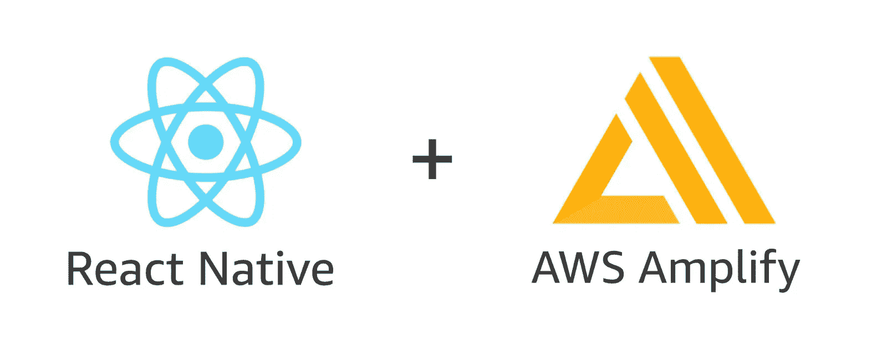
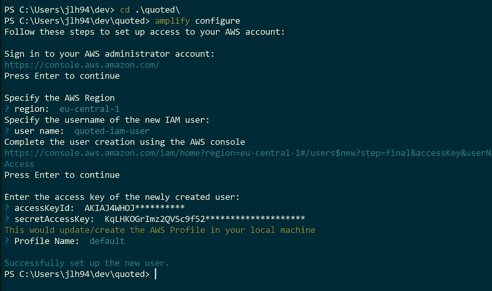
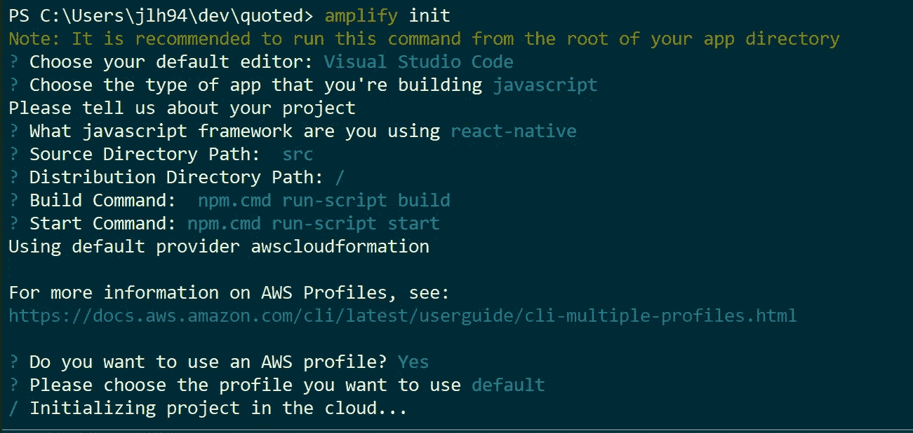
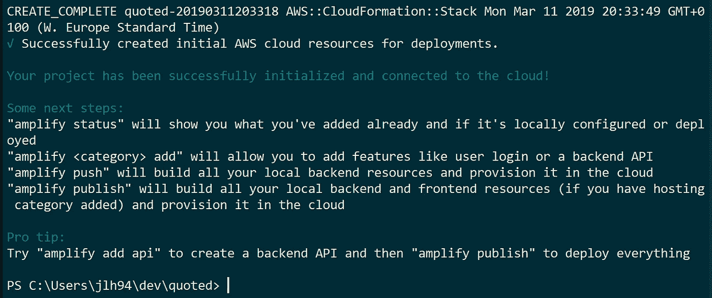
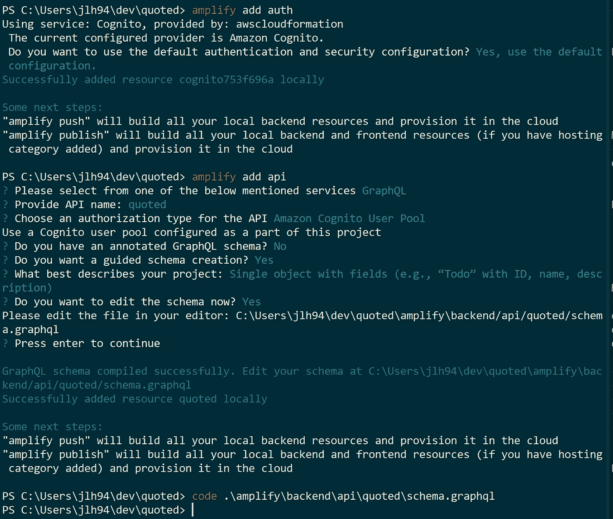
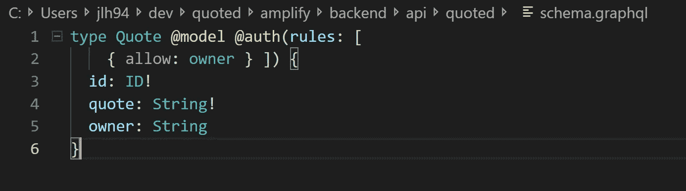
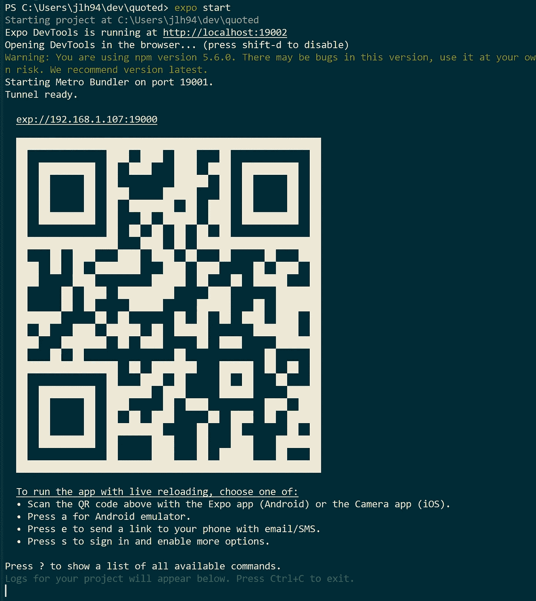
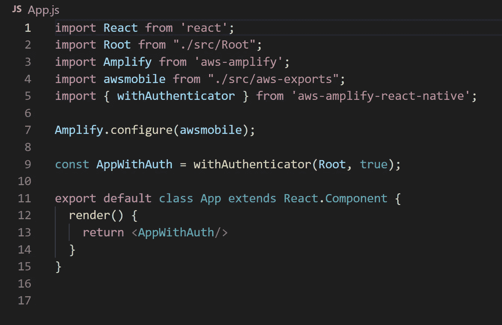

# 摧毁后端——扩大移动应用开发

> 原文：<https://itnext.io/destroying-backends-amplified-mobile-app-development-e1ea8bfe7802?source=collection_archive---------5----------------------->



在本教程中，我将制作一个移动应用程序来发布对 DynamoDB 文档的引用，并在所有设备上实时查看更新。我将使用 React Native 和 AWS Amplify 作为后端，使用 Auth 和 GraphQL API。看看我以前的教程，了解更多关于这些！

[](https://medium.com/capgemini-norway/destroying-backends-with-serverless-introduction-and-authentication-e940946c6de2) [## 使用无服务器销毁后端—简介和身份验证

### 第 1 部分，共 3 部分:介绍和认证。这是集成放大器系列三部分的第一部分…

medium.com](https://medium.com/capgemini-norway/destroying-backends-with-serverless-introduction-and-authentication-e940946c6de2) [](https://medium.com/capgemini-norway/destroying-backends-with-amplify-appsync-graphql-api-5521c0e62a4c) [## 使用 Amplify 销毁后端— AppSync GraphQL API

### 第 2/3 部分

medium.com](https://medium.com/capgemini-norway/destroying-backends-with-amplify-appsync-graphql-api-5521c0e62a4c) 

# 让我们创造

首先，开始使用 React Native。全局安装 [Expo CLI](https://facebook.github.io/react-native/docs/getting-started) 并运行 expo init“项目名称”。

```
npm install -g expo-cli
expo init quoted
cd quoted
```

在项目目录中，安装 [Amplify CLI](https://aws-amplify.github.io/docs/) 并在您的项目中启动它。这要求你至少拥有一个[自由级 AWS 账户](https://aws.amazon.com/free/)。这样，您就可以为您的项目配置 Amplify，但是不要担心。这都是通过 Amplify CLI 完成的。

```
npm install -g @aws-amplify/cli
amplify configure
```

这将启动一组提示。

*   选择离你最近的地区，然后回车。
*   给 IAM 用户一个名称，然后按 enter 键。您将被自动带到 AWS 浏览器控制台，并与您的用户一起登录。
*   登录后，在 CLI 中点击“enter”继续。
*   这将带您进入 IAM 服务，创建一个具有管理员权限的用户。选择所有默认值。
*   完成后，复制访问密钥，转到 CLI，粘贴它，按 enter，返回，复制密钥，转到 CLI，粘贴它，按 enter，完成！



> 这是唯一一次你必须花在 AWS 浏览器控制台，除非你想！

在应用程序目录中创建一个/src 文件夹，并启动 Amplify。这将带您完成另外 5 个提示，它们很容易填写。用作源目录路径的文件夹是 aws-exports.js 文件将出现的目录，该文件用于放大. configure()您的客户端。稍后会详细介绍。

```
mkdir src
amplify init
```



放大初始化过程



您可以使用 Amplify CLI 执行的操作

命令' amplify push '和' amplify publish '将生成 aws-exports.js。如果您使用 GraphQL API(我们稍后会用到)，它将要求您更新生成的代码以与 API 通信。如果您使用“发布”,则需要启用托管，这会自动将应用程序发布到您的 S3 虚拟主机中。

# 添加 Auth 和 GraphQL API

```
amplify add auth
> use default config
> that's it
amplify add api
> Pick GraphQL
> Pick API name (default is your project name)
> Pick Cognito as Auth mechanism
> Pick No for having your own schema
> Pick Yes for automatic schema creation
> Pick Yes to edit the schema now
```



添加 Auth (AWS Cognito)和 API (AWS AppSync GraphQL 服务器)

用您的编辑器找到模式，修改它并保存。当你对你的模式/数据模型满意的时候，运行 amplify push，对所有选项点击 yes。这将自动生成包含 3 个文件的目录“quotes/src/graphql ”; *subscriptions.js、mutations.js 和 queries.js.* 它们包含了 CRUD 到 GraphQL 服务器的代码。



这是一个经过修改的 schema.graphql，它自动将作者保存到数据库中，并且只允许作者读/写。如果希望所有用户都能看到引用，请忽略作者

# 一直到客户

在 AWS (amplify push)中构建 Amplify 模板时，打开另一个控制台窗口，cd 进入您的项目目录并运行“ *expo start* ”。这将启动 expo 服务器来开发/测试您的 React 本地应用程序。此外，下载世博移动应用程序。我使用安卓系统:

[](https://play.google.com/store/apps/details?id=host.exp.exponent&hl=en) [## 博览会 Google Play 上的应用

### 开始使用您的 Android 设备和计算机构建丰富的体验。Expo 是一个开发工具，用于创建…

play.google.com](https://play.google.com/store/apps/details?id=host.exp.exponent&hl=en) 

一个二维码将出现在你的控制台上，一个浏览器窗口将显示你正在运行的 expo 服务器。



下载 Android/IOS 版 Expo 应用程序，扫描二维码即可在手机上查看实时更新。您可能必须在同一个网络上才能工作。

如果您的 Amplify 后端已经完成上传模板，下载连接您的客户端到 Amplify 所需的 2 个 NPM 包

```
npm install --save aws-amplify aws-amplify-react-native
```

# 最终的客户代码

现在，为了完成我们的应用程序，我们需要添加 React 本机代码。我建议在您的/src 文件夹中创建一个新文件 Root.js。从 App.js 引用 Root.js，用 Amplify withAuthenticator()包装。用 Amplify.configure()连接生成的 aws-exports.js 文件。该文件用于在 Root.js 中使用 Amplify 之前设置所有配置。



# Root.js

我们将在这个文件中完成大部分工作。这样做的原因是，我们使用 App.js 链接到 Cognito，我们希望在实际调用 API 之前对用户进行身份验证。我会解释你在这两个文件里看到了什么。

**进口**

*   **{ withAuthenticator }** 在我们的导出中用作特设，用预先制作的授权接口包装整个应用程序。
*   **Amplify，{ API，graphqlOperation }** 用于用从我们生成的/graphql 目录导入的函数调用我们的 API。
*   ***作为查询、突变、订阅**是我们用来调用 GraphQL 函数的由 Amplify 生成的代码。
*   **{ awsmobile }** 是 Amplify 用我们的 API 端点、Cognito 键等生成的文件。不要将此文件存储在存储库中。
*   **amplify . configure(AWS mobile)**是实际连接我们的键、端点等的过程。给我们的客户。
*   而 **react-native 导入**是 React Native 用来编译到 Android Java 和 IOS Swift 的组件。

# 脏污

在 Root.js 文件中，我创建了一些简单的函数，用于添加和删除引号，以及使用强大的 GraphQL 订阅将实时数据流发送到我们的 GUI。简而言之，每次“createQuote”成功返回数据时，它都会在订阅中被侦听，我们可以将它添加到我们的状态数组中。我们将 componentDidMount()中的所有订阅设置为只调用一次，并调用 query . list quotes。

功能的完整客户端代码


# 现在怎么办？

*   我们有一个非常简单的移动应用程序。我将继续添加样式和动画。我可能会在另一个更侧重于 React 本机的教程中写这方面的内容。
*   遵循本世博会指南，你可以签署一份 APK。这会给你一个工作的 Android/IOS 应用程序。
*   该应用程序实时运行。如果更多的用户使用该应用程序登录，GraphQL 订阅将实时更新所有内容。
*   在我的 schema.graph 模型文件中，我添加了@auth ( "owner ")，强制 CRUD 只获取您自己的项目。因此，只有我的报价会出现在这里。如果您希望所有用户都能看到所有报价，请删除此选项。
*   使用的名称是您在注册屏幕上注册的名称。使用 Amplify 的 withAuthenticate()函数，注册屏幕围绕着应用程序本身。

这个应用程序“引用”，我将与我的朋友们一起使用来添加彼此的引用，我会添加更多的功能来改变引用的作者等

感谢您的阅读，让您的移动应用流畅起来。我会继续写文章来推广 Amplify，因为我发现它对测试我的许多想法非常有用。