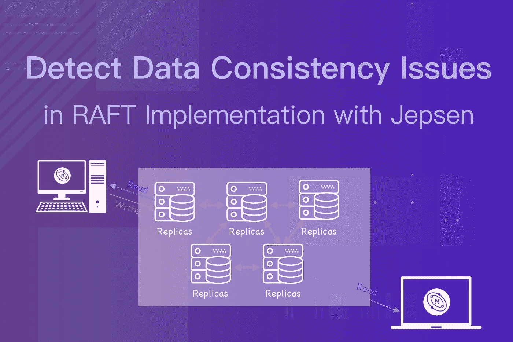
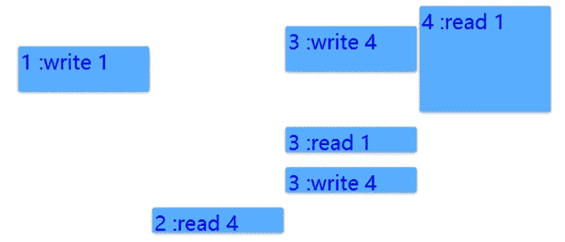
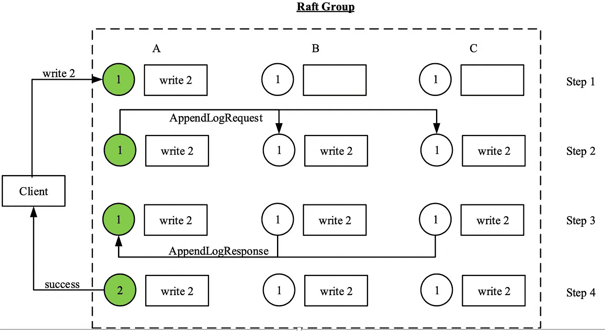
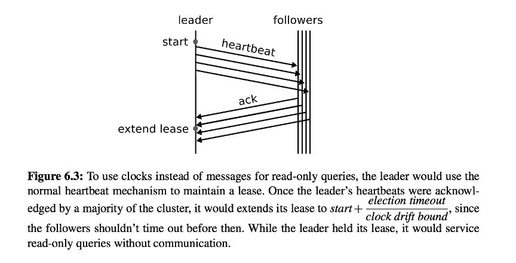

# 使用 Jepsen 检测 RAFT 实现中的数据一致性问题

> 原文：<https://itnext.io/detect-data-consistency-issues-in-raft-implementation-d86431182965?source=collection_archive---------4----------------------->

数据一致性是所有分布式系统的全球性问题。NebulaGraph 作为分布式图形数据库也不例外。

由于查询层和存储层的分离，NebulaGraph 只在存储层公开简单的 kv 接口。使用 RocksDB 作为后端 kv 库，NebulaGraph [通过 Raft 协议确保多个副本之间的强大数据一致性](https://nebula-graph.io/posts/nebula-graph-storage-engine-overview/)。

尽管 raft 应该比 Paxos 更容易理解，但在分布式系统中实现它是很棘手的。

另一个具有挑战性的问题是如何测试基于 Raft 的分布式系统。目前，NebulaGraph 用 Jepsen 验证数据一致性。在我们之前的帖子[nebula graph](https://nebula-graph.io/posts/practice-jepsen-test-framework-in-nebula-graph/)中练习 Jepsen 测试框架，我们已经详细介绍了 Jepsen 测试框架是如何工作的，你可以看看它来获得对 Jepsen 的一些基本了解。

在本帖中，我们将解释如何验证分布式 NebulaGraph kv 存储的数据一致性。

# 解释了强大的数据一致性

让我们从强数据一致性的定义开始。引用《设计数据密集型应用 》一书:

> 在可线性化的系统中，一旦一个客户端成功完成写入，所有从数据库读取的客户端必须能够看到刚刚写入的值。

强数据一致性或线性化的基本思想是使分布式系统看起来好像只有一个数据副本，并且其上的所有操作都是原子的。来自任何客户端的任何读取请求都会将最新数据写入系统。

# 用 Jepsen 验证线性化

以 Jepsen 时间轴测试为例。在这个测试中，我们使用了**单寄存器**模型。客户端只能对寄存器执行读或写操作。所有的操作都是原子的，没有中间状态。

假设有四个客户端同时向系统发送请求。图中的每个条形表示客户端发出的请求，其中条形的顶部是发送请求的时间，条形的底部是客户端收到响应的时间。

从客户端的角度来看，在发送请求和收到响应之间的任何时间都会处理任何请求。从上图可以看出，客户端 1 写 1(即 1: write1)、客户端 3 写 4(即 3: write4)、客户端 4 读 1(即 4: read1)这三个操作在处理时间上是重叠的。然而，我们通过不同客户端收到的响应知道系统处理请求的真正顺序。

方法如下:

初始值为空，但客户端 4 为其读取请求获得 1，这指示客户端 4 的读取操作必须在客户端 1 的写入 1 操作之后开始，并且客户端 3 的写入 4 必须在写入 1 之前发生，否则将为客户端 4 的读取请求返回较旧的值 4。因此，这三个操作的顺序是写入 4 ->写入 1 ->读取 1。

虽然从上图可以看出，首先发送请求 read 1，但它是最后一个处理的。后面的操作在时间上不重叠，也就是说，它们是顺序发送的。客户端 2 的读取请求返回最后的写入值 4。

整个过程没有违反强数据一致性的规则，所以验证通过。

如果客户端 3 的读取请求返回较旧的值 4，则系统不是强一致的。根据前面的分析，最后一次成功写入的值为 1。如果客户端 3 获得旧值 4，则系统的线性化被破坏。

实际上，Jepsen 用类似的算法验证了分布式系统的强数据一致性。

# Jepsen 测试发现数据一致性问题

为了更好地理解数据一致性，下面给出了一个在 NebulaGraph 的 Raft 组(三个副本)中如何处理请求的例子。

读取请求处理相对简单，因为只有选出的领导者服务器可以与客户端交互。领导者在检查它仍然是领导者之后，从状态机获取相应的结果并发送回客户端。

写请求处理稍微复杂一些。这些步骤如下图所示:

1.  领导者(绿色圆圈)接收客户端发送的请求，并将其写入 WAL(预写日志)。
2.  领导者将 WAL 中相应的日志条目发送给其追随者，并进入等待阶段。
3.  follower 接收日志条目并将其写入自己的 WAL，然后返回 success。
4.  当至少有一个跟随者返回成功时，领导者更新状态机并向客户端发送响应。

现在我们将通过下面的例子向你展示一些在 Jepsen 测试中发现的 Nebula Graph Raft 实现问题。

## 数据一致性示例 1:读取请求返回的旧值

如上图所示，A、B、C 组成三复筏组。圆圈是状态机(为了简单起见，我们假设它们是单个寄存器)，盒子存储相应的日志条目。

*   在初始状态，三个副本中的所有状态机都是 1，领导者是 A，术语是 1。
*   在客户端发送请求 write 2 之后，leader 根据之前描述的过程对其进行处理，通知客户端写入成功，然后被终止。
*   那么 C 被选为第二任期的领导人。但是，由于 C 已经将 write 2 的日志条目应用到了状态机(此时值仍然是 1)，如果 C 接收到来自客户端的请求，将返回 1。这绝对违反了强数据一致性的定义，因为 2 已经被成功写入，而一个陈旧的值被返回。

这样的问题发生在 C 当选为第二任期的领导人之后。有必要发送 heartbeat 以确保前一项的日志条目被群集的仲裁接受。心跳成功前不允许读取。否则，可能会返回过时的数据。如果您想了解更多细节，请参考本 [Raft 论文](https://raft.github.io/raft.pdf)中的图 8 和第 5.4.2 节。

## 数据一致性示例 2:领导者确保自己是领导者

我们通过 Jepsen 测试发现的另一个问题是:领导者如何确保自己仍然是领导者？这样的问题发生在网络划分上。当领导者由于网络故障而无法连接到仲裁时，如果仍然允许读取，则很可能会返回一个过时的值。

为了避免这种情况，我们引入了 leader lease 概念。

当一个节点被选为领导者时，它需要定期向其他节点发送心跳信号。如果心跳被大多数节点成功接收，则获得一段时间的租约，并且在该期限内将不会有任何新的领导者。因此，在节点上保证了数据的新近性，并且在此期间正常处理读取请求。

与 TiKV 的进程不同，NebulaGraph 并不考虑*心跳间隔*某个系数*作为租借时间，因为不同节点的时钟偏差存在漂移。

相反，我们存储 1) T1 =心跳间隔和 2) T2 =上一次成功心跳或 appendLog 的时间成本，并通过*(T1-T2)*获得租用持续时间。

当网络被分区时，尽管隔离，旧的领导者仍然在租用时间期间处理读请求(写请求由于隔离而失败)。租约到期时，读取和写入请求都将失败。当追随者节点在等待来自引导者节点的心跳时超时，则发生引导者选举。

# 结论

你需要长期的压力测试和故障模拟来发现分布式系统中的问题。Jespen 在各种故障下验证分布式系统的能力，是一个很好的帮手。

未来，我们将引入其他混沌工程工具来验证 NebulaGraph 中的数据一致性。这样，我们可以不断提高性能，同时确保高数据可靠性。

# 你可能也会喜欢

*   [在 NebulaGraph 中练习 Jepsen 测试框架](https://nebula-graph.io/posts/practice-jepsen-test-framework-in-nebula-graph/)
*   [nebula graph 存储引擎介绍](https://nebula-graph.io/posts/nebula-graph-storage-engine-overview/)