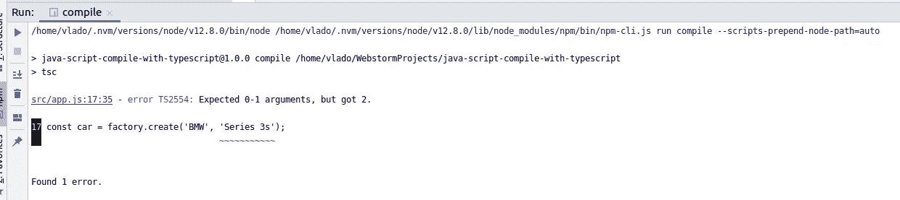
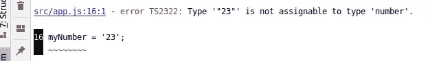
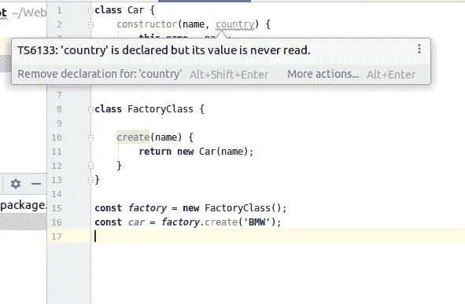

# 使用 TypeScript 编译器在编译时检测 JavaScript 错误

> 原文：<https://itnext.io/detect-javascript-errors-during-compile-time-using-typescript-compiler-be593b853c13?source=collection_archive---------1----------------------->

我们都知道 TypeScript 是一种将自身编译成 JavaScript 语言。在编译时，TypeScript 可以向终端发出错误，并且根本不允许编译代码。

即使您正在编写纯 JavaScript 代码，我们仍然可以使用 TypeScript 编译器在编译时检测可能的错误，而不是在运行时测试和遇到它们。这可能非常昂贵([十亿美元的错误](https://dev.to/joelnet/null-the-billion-dollar-mistake-maybe-just-nothing-1cak))。

JavaScript 编译期间检测问题最常用的工具是 linters。Linters 可以以非常严格的方式配置，这可以显著提高代码的质量。

使用 TypeScript 编译器为我们完成这项工作还有其他优点，例如:

*   有打字稿(。ts)文件，并使用 TypeScript 语言中一些非常酷的特性。(慢慢地将项目迁移到 TypeScript)
*   编译成不同的 JavaScript 版本。

## 配置项目以使用 TypeScript 编译器

配置您的 JavaScript 项目应该非常容易。

我们必须将 TypeScript 作为依赖项添加到项目中:

```
npm install typescript --save-dev
```

之后，我们必须在一个项目的根目录下创建 tsconfig.json。我为这个演示选择了以下配置，但是您可以根据需要进行调整或更改。
您可以在这里找到的所有可能值的列表: [TypeScript 编译器选项。](https://www.typescriptlang.org/docs/handbook/compiler-options.html)

tsconfig.json

这里最重要的标志是:

**allowJs** 和 **checkJs** ，顾名思义就是允许在项目中使用 JavaScript 并编译。必须关闭 noImplicitAny ，因为我们无法在 JavaScript 中定义类型。
**dist** 是一个文件夹，我们将在其中保存编译后的代码。
**src** 文件夹是我们源代码的一个根目录。

我们将在 package.json 中注册用于编译的附加脚本:

```
**"scripts"**: {
  **"compile"**: **"tsc"** },
```

## 演示时间

让我们在 **src** 文件夹中创建一个名为 app.js 的简单文件，并在其中放置一些代码:

以上代码，Node.js 解释器会成功解释。结果将是:

```
Car { name: 'BMW' }
```

如果我们试图用定义好的 **npm 运行编译**脚本来编译它，编译器会发出错误:



我们正在传递一个没有在方法中定义的参数。

例如，如果我们试图在 Node.js 中运行这个简单的代码

```
**let *myNumber*** = 23;
***myNumber*** = **'23'**;

***console***.log(**typeof *myNumber***)
```

输出将是:**字符串**

如果我们试图用一个类型脚本来编译它。



## 写作时间

如果你使用 WebStorm 这样的编辑器，编辑器会立即在屏幕上显示错误，甚至在编译之前。



## 抑制错误

如果您出于某种原因想要忽略该行(将其从编译中排除)，您可以在该行上方放置一个注释// @ts-ignore。

```
**class** FactoryClass {

    *// @ts-ignore* create(name, origin) {

        **return new** Car(name);
    }
}
```