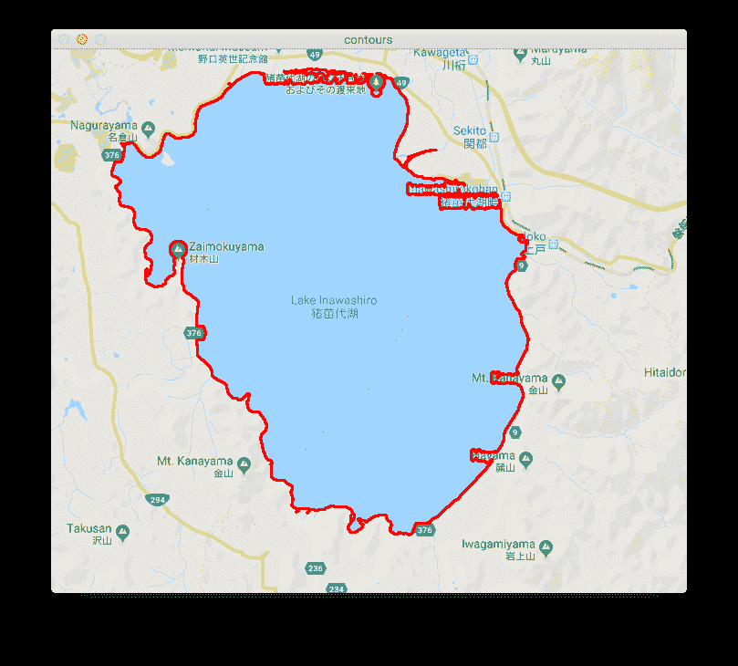
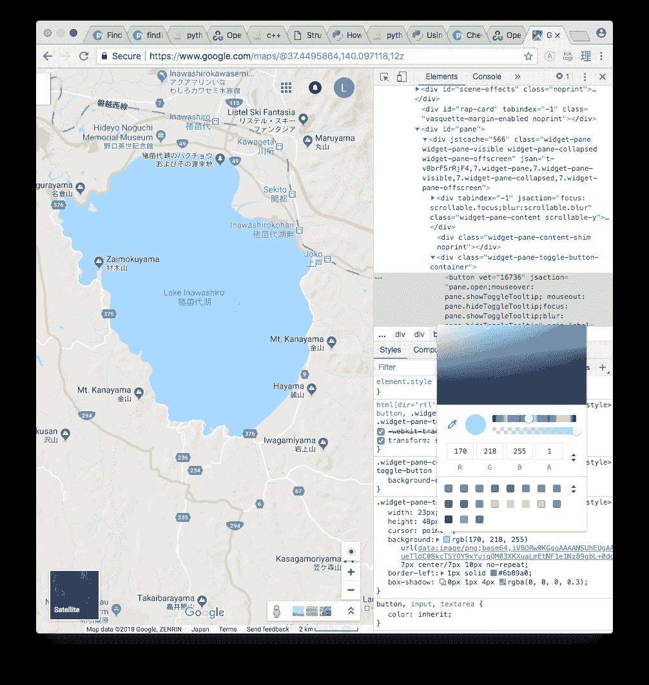
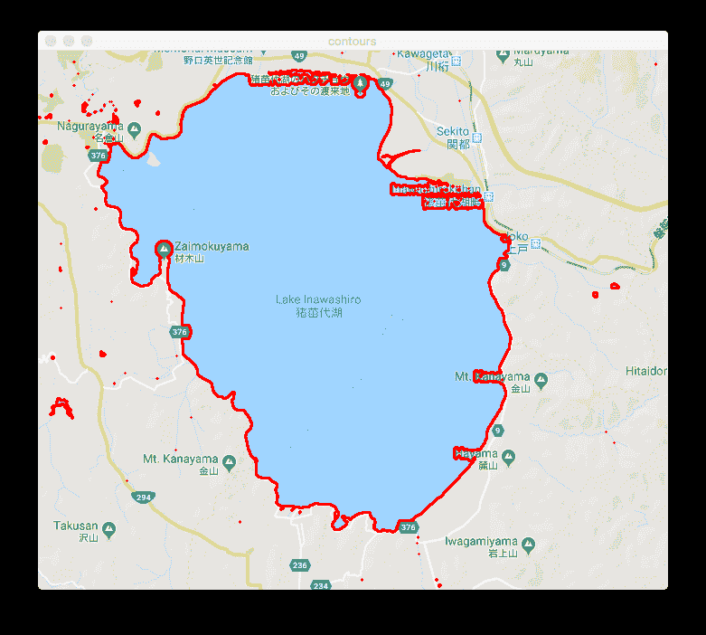
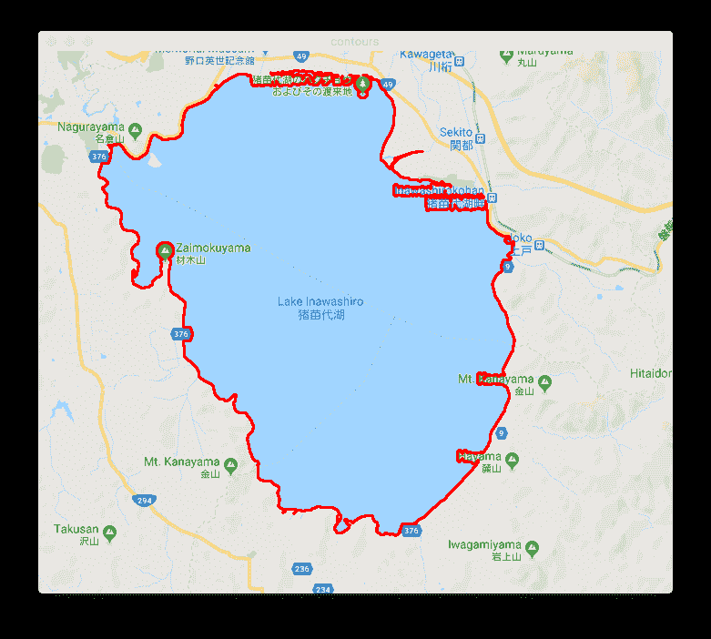

# 用 Python3 和 OpenCV 3 探测和勾画湖泊

> 原文：<https://itnext.io/detecting-and-outlining-lakes-with-python3-and-opencv-3-9156bdeacbf0?source=collection_archive---------3----------------------->

在本文中，我将使用 Python3 和 OpenCV 检查一些基本的形状和轮廓检测。

本文的源代码可以在[这里](https://github.com/lmiller1990/python-opencv-lake-recognition)找到。

*原贴于* [*拉克伦·米勒的博客*](https://lmiller1990.github.io/electic/) *。*

# 目标

目标是检测最大的水体，并根据谷歌地图的屏幕截图计算半径和大致面积。本文介绍了一些代码，这些代码在给定一个屏幕截图的情况下，检测最大的水体，并在边缘周围画一条线:

# 设置

我会用 Python3 和 OpenCV3。安装 Python3 的方法有很多，我用的是[康达](https://anaconda.org/anaconda/python)。我通过运行`brew install opencv`用自制软件安装了 OpenCV。

要检查是否安装了 opencv，创建一个`detector.py`脚本并添加以下内容:

和`python3 detector.py`一起跑。我的输出是:

在上面的输出之前，我得到了一个关于 numpy 的错误。修复方法是使用自制软件重新安装 numpy。

# 使用范围内的基本阈值

下一步是应用一个阈值，去掉我们不感兴趣的数据。因为我们使用谷歌地图，所以湖泊总是同样的蓝色，这让事情变得简单。

湖泊的 RGB 颜色为`[170, 218, 255]`。OpenCV 使用不同的排序，BGR。

我们将使用`cv.inRange`函数，它有三个参数:一个图像、一个较低的颜色范围和一个较高的颜色范围。这里的文档是[这里是](https://docs.opencv.org/2.4/modules/core/doc/operations_on_arrays.html#inrange)。基于反复试验，我发现±10 的范围效果很好。

更新脚本:

现在添加两个函数:`read_image`，获取我们将要操作的图像，和`find_mask`，用`inRange`应用阈值。

在显示阈值图像之前，最好理解一下`cv.imread`返回的是什么。添加以下代码:

我将我的截屏保存为“pond.png”。用`python3 detector.py`运行上述代码会打印出以下内容:

596 是图像的高度或行数。数组中的每一行包含 697 个值，其中每个值是包含[B，G，R]个值的 1×3 矩阵。所以图像只是 BGR 像素的集合。

`inRange`是相似的，然而不是每个像素被映射到一个 BGR 值，而是它被简单地分配一个值 0 或 1 -无论它是否在阈值之间。

尝试使用以下代码呈现遮罩:

运行脚本会显示掩码:

终端中的输出确认`inRange`为每个像素返回 0 或 1 的数组:

# 用`findContours`寻找轮廓

OpenCV 有一个`findContours`函数，可以在二值图像中找到边缘。我们有一个二元图像——这就是为什么我们创造了面具。在的文档[中阅读关于`findContours`的内容。这些论点是:](https://docs.opencv.org/2.4/modules/imgproc/doc/structural_analysis_and_shape_descriptors.html?#findcontours)

*   `image`:要使用的二进制图像。修改图像，所以我们应该传入一个副本
*   `mode`:轮廓检索模式。文档中描述了这些模式。我们关注的是最大的区域，所以最适合这个问题的是`CV_RETR_EXTERNAL`
*   `method`:轮廓逼近法。同样，在文档中有描述。我不太明白哪个最适合这个问题，所以我用了`CHAIN_APPROX_SIMPLE`,因为这是一个简单的问题，而且这个方法的名字中有 simple。`¯\_(ツ)_/¯`

现在我们知道了`findContours`，我们可以编写下面的函数:

`findContours`返回三个值。第一个似乎是被`findContours`修改过的图像，我们其实并不需要。第二个是找到的轮廓。最后是层次结构，它包含关于图像拓扑的信息。我还不完全明白这个能用来做什么。我们只需要第二个值，`cnts`。

运行`find_contours`功能，并传入先前打印的`mask``Found 93 black shapes`。这是计算图像中所有的小水体，或其他蓝色像素。暂时不理想。我们会尽快解决这个问题。

# 使用`drawContours`绘制轮廓

让我们继续创建一个`show_contours`函数来可视化 93 个轮廓，使用 OpenCV 的`drawContours`函数，这里描述的。这些论点是:

*   图像:要绘制的图像
*   轮廓:要绘制的轮廓数组。轮廓是点的阵列
*   contour_index:要绘制的轮廓的索引。现在我们将传递-1，它绘制所有的轮廓
*   颜色:绘制轮廓的颜色。我会用红色:`0, 0, 255`
*   厚度:绘制轮廓的厚度。我发现 2 是个好数字

现在我们知道了参数，我们可以实现`show_contours`:

将这个与`find_contours`一起使用，我们得到如下结果:

# 提取最大的水体

我们有 93 个轮廓，如上图所示。我们只想要最大的那个，也就是点数最多的那个。添加一个`main_contour`功能:

我们简单地按照长度对`contours`进行排序，并返回最长的一个。将所有这些整合在一起:

而且，它有效:

太好了！

# 结论

这篇文章描述了:

*   如何使用`inRange`进行阈值处理并制作蒙版
*   使用`findContours`及其参数寻找轮廓
*   用`drawContours`显示轮廓

这是我很久以来第一次做图像识别。我以前的经验是在 C++中使用 OpenCV，使用 Python 绑定后，它变得更加容易和易于使用，这让我印象深刻。我通过阅读 [Py 图片搜索](https://www.pyimagesearch.com/2014/10/20/finding-shapes-images-using-python-opencv/)学到了很多东西，这是希望尝试 Python 和图片识别的 web 开发人员的绝佳资源。

本文的源代码可以在[这里](https://github.com/lmiller1990/python-opencv-lake-recognition)找到。

*原贴于* [*拉克伦·米勒的博客*](https://lmiller1990.github.io/electic/) *。*