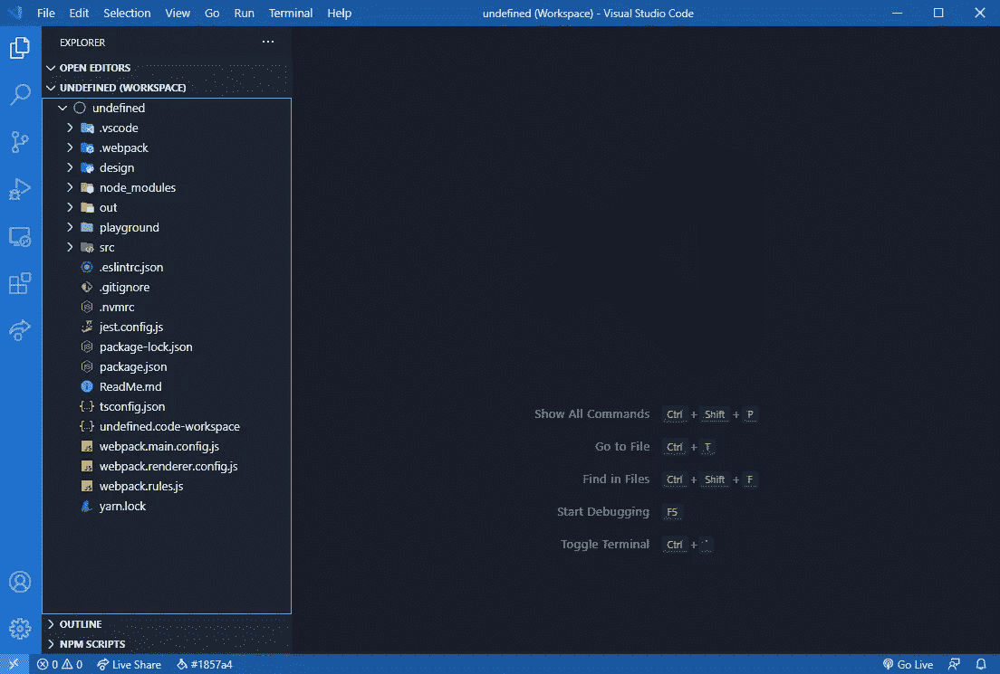
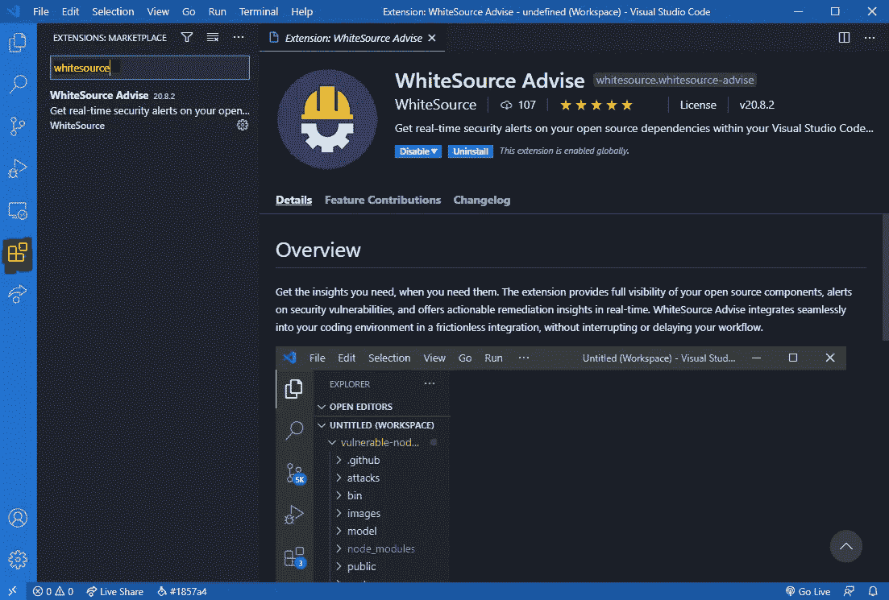
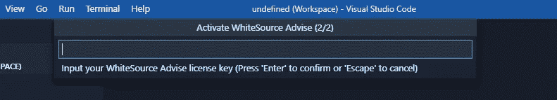
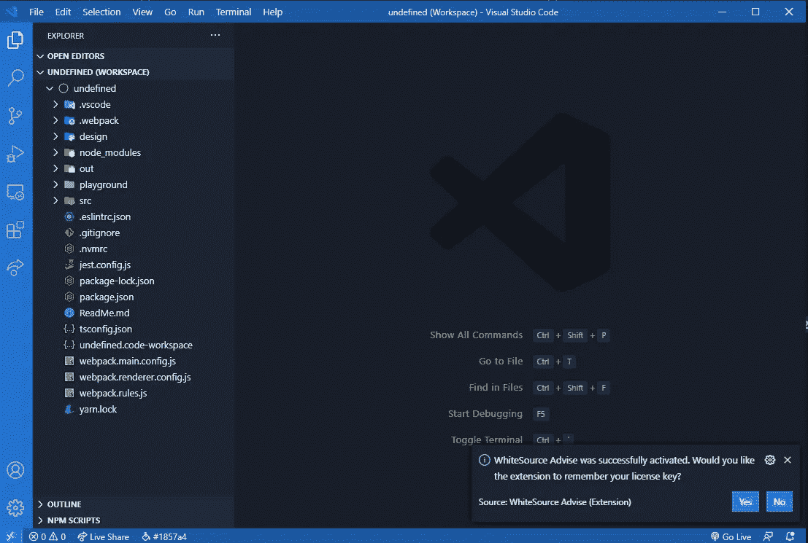
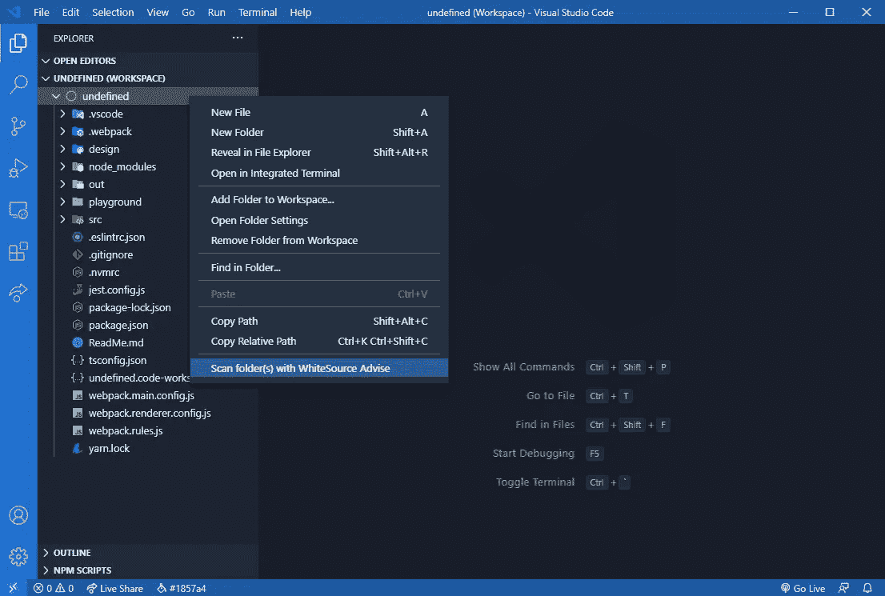
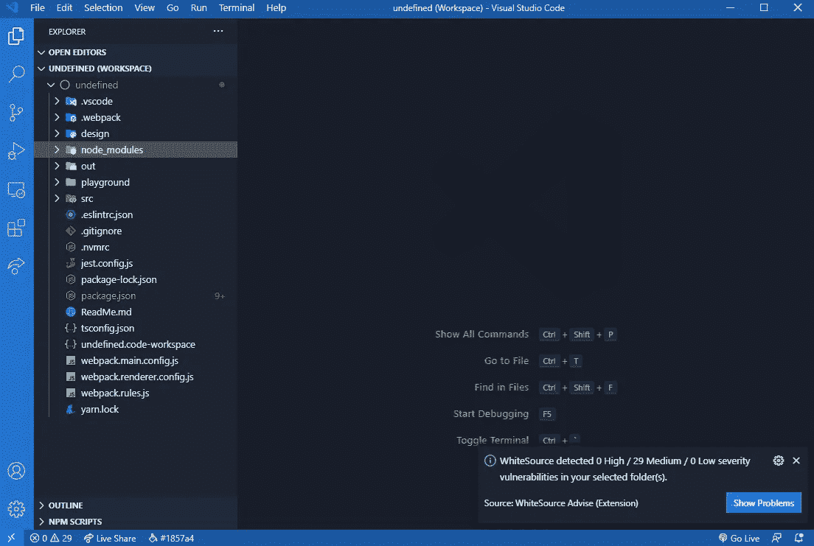
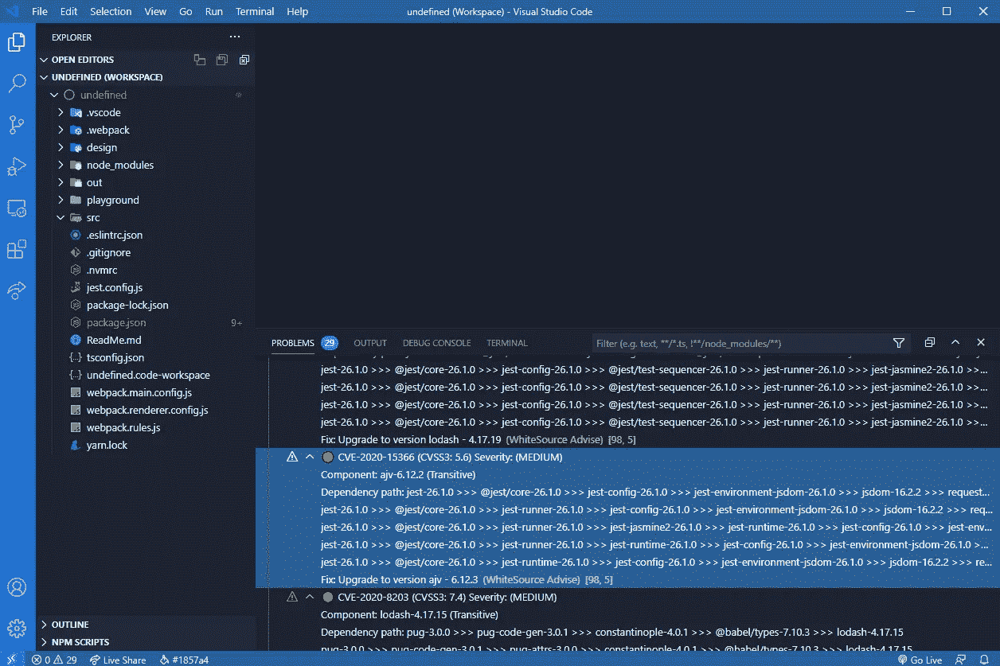
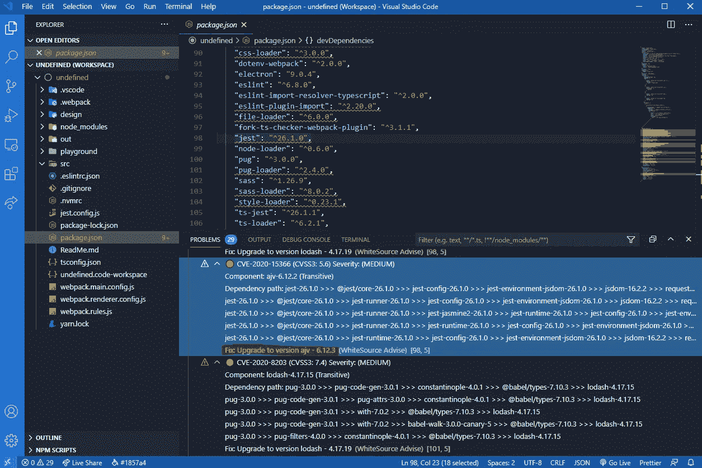
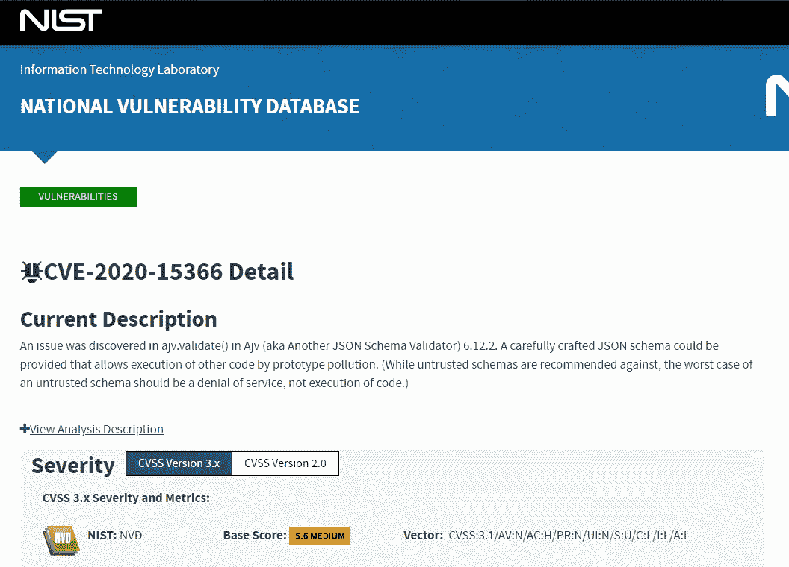

# 检测 IDE 中的开源漏洞

> 原文：<https://itnext.io/detecting-open-source-vulnerabilities-in-your-ide-c3b7c01ba214?source=collection_archive---------2----------------------->

使用开放源代码时，会出现以下问题:

*   开源安全吗？
*   我可以安装这个依赖项吗？
*   此软件包会降低我的应用程序的安全性吗？

第一个问题非常笼统，简短的回答是**是的**。不幸的是，另外两个是特例，不可能有人事先知道。

下面是你应该为另外两个做的事情。您可以做的一件事是查看您想要使用的包/模块/依赖项。在这里你可以看到它有多少下载量，有多少开发者在积极维护这个包，以及它周围的社区有多大。

这些指标应该是一个很好的起点，但是它们不能通知您将来会出现的任何漏洞。

您可以做的另一件事是使用一种工具，它会自动扫描您的开源组件，并通知您任何已知的漏洞。

我们可以使用的几个工具是[依赖性检查](https://owasp.org/www-project-dependency-check/)、 [Bundler-Audit](https://github.com/rubysec/bundler-audit) 或 [WhiteSource Advise](https://marketplace.visualstudio.com/items?itemName=whitesource.whitesource-advise) 。今天我们将重点讨论 WhiteSource Advise。这个工具是各种 ide 的扩展，包括 Visual Studio、Eclipse 和 IntelliJ。它的用途是提供对开源组件的完全可见性，并创建安全漏洞警报。

它将返回的一些洞察是 CVE(常见漏洞和暴露)ID 和 CVSS(常见漏洞评分系统)分数。

下面是如何在 VS 代码中集成和使用这个工具的概述。

# 先决条件

不幸的是，这个扩展在 VS 代码市场上是可用的，并且只适用于 Windows 机器。因此，需要 windows 操作系统。

您还需要您的凭证，例如用于开发人员的[white source](https://www.whitesourcesoftware.com/whitesource-for-developers/)的有效许可证和用于 IDE 的 WhiteSource Advise 的许可证密钥。

一旦你掌握了这些信息，我们就可以继续了。

## 第一步

显然，第一步是打开编辑器。

为了看到这一点，我们需要一个有包管理器的项目，比如 NPM 或 NuGet。

## 第二步

如果我们打开了编辑器，并且有一个合适的项目，那么我们可以转到 Extensions 选项卡，搜索 WhiteSource Advise。

点击**白源建议**，然后点击**安装。**

## 第三步

成功安装扩展后，我们需要使用许可证密钥激活它。

要做到这一点并与扩展进行通信，我们可以利用它通过**命令面板提供的可用命令。**

要打开**命令托盘**，您可以按下 **CTRL + SHIFT + P** 或者您可以进入**视图→命令托盘**

一旦面板出现，搜索**白源**并选择**白源:激活** **白源建议**。

激活向导有两个步骤，这里我们需要逐一提供:

1.  **电子邮件**

2.**许可密钥**

添加完这些凭证后，您应该会在右下角看到下面的消息。

## 第四步

如果我们已经完成了所有这些步骤，这意味着我们已经准备好使用这个工具来分析我们的项目。

有几种方法可以做到这一点。

我们可以**右键单击文件夹上的**，然后选择**使用白源建议扫描文件夹。**

*在这个扫描整个工作区的例子中，我右击了工作区本身。*

或者我们可以按下 **Ctrl + Shift + Q，**这将触发工具对整个工作空间进行扫描。

无论哪种方式，我们都应该在通知栏上看到一条消息，表明正在发生什么。

## 第五步

一旦扫描完成，我们应该看到类似的东西。

好了，我们运行了我们的第一个盒子，但是我们如何根据结果采取行动呢？

如果我们点击**显示问题**或者如果我们打开终端( **SHIFT + `** )并移动到**问题**选项卡，那么我们应该看到每个漏洞和依赖路径。

如果你点击其中一个问题，那么它应该会打开 **package.json** 并关注这个问题起源的依赖关系。

同时，底部会显示一个补救建议，可以帮助您解决问题。

大多数情况下，更新/升级是解决漏洞的唯一方法。

为此，我们可以做到以下几点:

如果我们需要下载一个新的次要或补丁版本的依赖项，我们可以运行`npm update`。

该命令将安装更新的版本，并在 **package-lock.json** 文件中进行相关的更改，努力用新版本填充它。

同时， **package.json** 保持不变。

因此，您应该使用`npm ci`而不是`npm i`来安装您的依赖项。这样，它将带来 **package-lock.json.** 中的内容

`npm update`只会更新到次要或补丁版本。

在我们的例子中，我们有`"jest":"^26.1.0"`，所以运行这个命令只会改变最后两个数字，而不会改变第一个数字。

请记住，在语义版本系统中，我们有 **MAJOR** 。**小调**。**补丁**:

1.  重大突破性变化
2.  MINOR —添加了向后兼容的新功能
3.  补丁—错误修复。

对于主要版本，我们需要运行`npm outdated`来发现新的版本。

此外，如果我们想了解更多关于此漏洞的信息，我们可以获取 CVE ID，并在国家漏洞数据库中进行搜索。

# 结论

开源是安全的，因为社区正在积极地参与项目的监控和改进。这些报告的存在应该表明为维护和提高这些组件的安全级别所做的努力。

不幸的是，开发人员几乎不可能不断地搜索所有新报告的漏洞，然后回过头来检查他们正在使用的依赖关系。

这些工具，就像我们上面看到的，可以帮助解决这个问题，从而让您比恶意黑客领先一步。在有人有机会在已发布的应用程序中利用这些问题之前，您就能够解决这些问题。

* *免责声明—我收到了一位粉丝的个人请求，要求我试用免费版的***white source Advise***，并注册了免费试用。这篇文章反映了我个人对该产品的看法和体验。