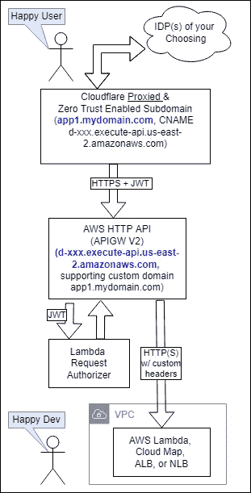

# Dev Joy:简化内部 Web 应用的授权

> 原文：<https://itnext.io/dev-joy-making-authorization-for-internal-web-apps-simple-e51bd1a2c04c?source=collection_archive---------2----------------------->

我和 oauth 或者组装基础 auth 战斗了这么久，都没有让我开心过。不再有了！我们开发者可以把它留在过去。下面是我构建一个简单的小型内部 web 应用程序的新方法:

祝你好运，我落后 2 个代理

第一步:为 50 个用户支付 Cloudflare $0。说真的，你可以免费设置这个。添加一个域名“my domain . com ”, cloud flare 必须对其进行 DNS 授权。(抱歉，你不能在他们的免费计划上添加像 devs.mycompany.com 这样的子域。他们必须是权威的二级域名。)现在，Cloudflare 可以做的一件很酷的事情是**代理** HTTPS 流量到该域。Cloudflare Zero Trust 还可以强制对 IDP 进行身份验证，并在向您的应用程序源发送请求以及简单的 JWT 之前，仅授权您允许的用户。

第二步:为 3 亿个 HTTP API 请求向 AWS 支付 1 美元。(加上 Lambda 成本等。)不幸的是，他们内置的 JWT 授权器无法工作，但为此编写自己的自定义 Lambda 并不太困难。您需要验证 JWT 是由 Cloudflare 签署的，并且受众是您的应用程序。(app1.mycompany.com 的随机受众字符串与 app2.mycompany.com 或 app.other-company.com 不同)幸运的是，您可以为所有应用程序部署一个**单个 Lambda 授权器**——您只需将受众配置为一个 stage 变量，该变量将传递给 Lambda 授权器。太棒了。

请注意，所有未经授权的请求都不会进入您的 VPC。你知道你在公开的 NGINX 服务器上看到的那些随机黑客请求吗？它们将被 Lambda 授权器拒绝，并且不能做或接触你的来源——假设你使用安全组(VPC 链接)或 IAM 来保护它。(对于真正的偏执狂，请尝试在 Cloudflare 和 AWS API Gateway 之间启用相互 TLS！)

步骤 3:您的应用程序可以知道是哪个用户发出了请求，只需查看 HTTP 头中用户的电子邮件地址。该标题应由授权者 Lambda 从 JWT 内的可信电子邮件地址设置或验证(*CF-Access-Authenticated-User-Email*)。

第四步:坐收渔利？老实说，我认为这将是一篇较长的文章。这种架构使事情变得过于简单:经理可以使用零信任 web 界面在组或应用程序中添加和删除用户(即使是完全没有可信 IDP 的承包商也可以获得一次性电子邮件代码)，开发人员只需构建应用程序并验证 JWT。

我们也在考虑使用 Cloudflare 隧道，将我们的 Jenkins 服务器(叹气)置于 Zero Trust 之后。隧道意味着服务器上没有开放的入站端口。

最后，认证和授权可能会变得更简单！我认为这显示了“关注点分离”的真正力量。是的，您信任 Cloudflare 来解密您的流量，但好处是它们可以解决许多令人头疼的问题。如果你有其他选择，请发表评论！

PS:如果你是一个已经在使用 SSO 的企业，有专门的管理员，这对你有好处——这篇文章是针对一个开发人员的设置。我们通常被忽视，但我们存在！

PPS:我的双代理图让我[想到了这个迷因](https://knowyourmeme.com/memes/good-luck-im-behind-7-proxies)；-)