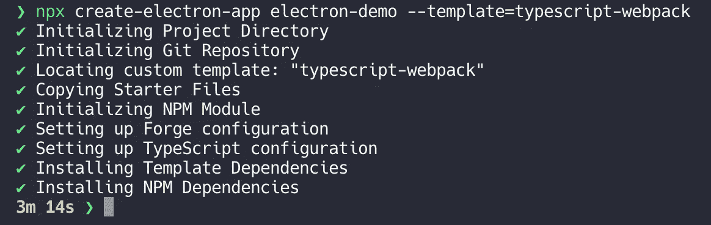
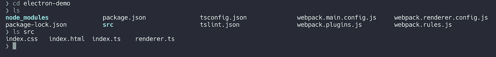
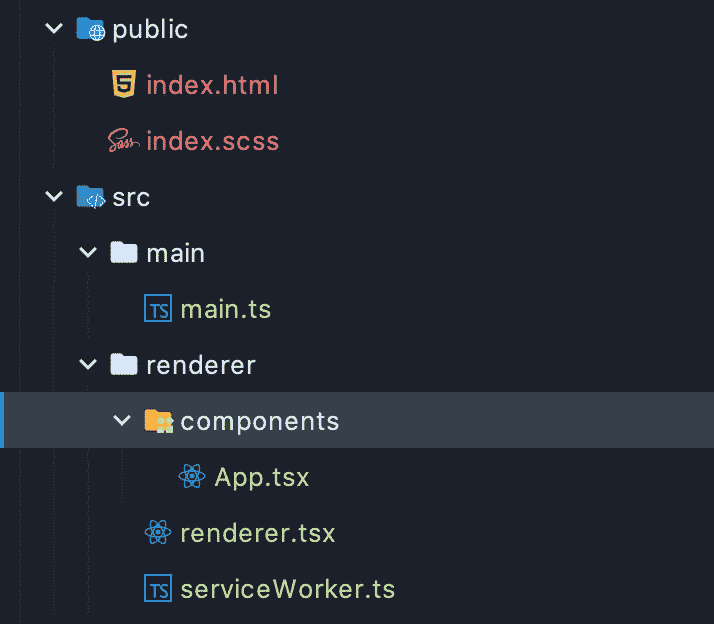
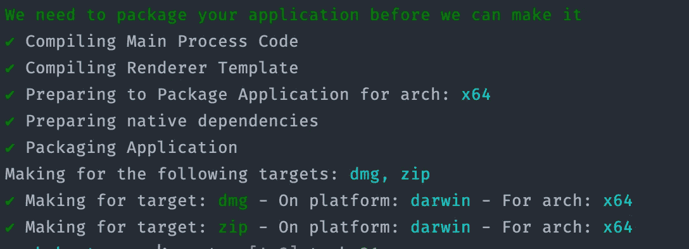

# 用 Electron Forge，React，Webpack & TypeScript 开发一个跨平台的桌面应用程序

> 原文：<https://itnext.io/develop-a-cross-platform-desktop-application-with-electron-forge-react-webpack-typescript-ac2c7452b71f?source=collection_archive---------0----------------------->

## 桌面应用程序入门

## 设置并准备在电子应用程序中使用 React & Webpack，通过 Electron Forge 构建。


您的跨平台桌面应用程序

# 电子框架

Electron 是一个开源框架，它允许你用 Web 技术(HTML、CSS 和 JavaScript)构建跨平台的桌面应用程序(T4)。

您可以访问**原生组件、**加上到配置**自动更新**、**崩溃报告**、**调试**和**剖析**。

它使用**节点**和**铬**来运行应用程序。因此，web 开发技能完全可以转移到电子应用程序中。

你只需要一点 HTML、CSS 和 JavaScript 就可以开始了。

> 电子最初是为 Githubs 的 [Atom](https://atom.io) 编辑器构建的

## 电子建筑

在 electronic 中，有两个主要进程:**主进程**和**渲染进程**。GUI 由**主进程**创建，并通过 Chromium 的**多处理**功能创建网页。

每个 Chromium Web 进程**运行自己的渲染器进程。**作为`BrowserWindow`实例创建的渲染器实例是**孤立的**，并且只关心它自己的网页。

**本地资源**可以通过 **NodeJS** **API** 来处理，与 web 应用程序不同，应用程序可以访问这些资源来创建**低级操作系统交互**。您可以使用`[**ipcRenderer**](https://electronjs.org/docs/api/ipc-renderer)` 和`[**ipcMain**](https://electronjs.org/docs/api/ipc-main)`通过**通信**调用原生 GUI API 来发送和接收消息。

# 电子锻造提供了什么

**electronic-Forge**是一个 [**完整工具**](https://www.electronforge.io) ，除了**安装**和**发布到服务器**之外，它还处理**可分发软件**的创建。

## 插件

电子锻造的插件允许**核心**电子锻造功能的**扩展**。

插件如 **Webpack** 插件`plugin-webpack`，允许使用 **webpack** 构建应用程序，并可选择启用**热重装**和高级**捆绑包配置**。

还有`plugin-auto-unpack-natives`插件，它会**自动在`node_modules`中添加原生模块**。这个**减少了用户机器上的磁盘消耗**和**加载时间**。

> 你甚至可以[编写自己的插件](https://www.electronforge.io/advanced/extending-electron-forge/writing-plugins)

## 模板

Electron Forge 的**模板**允许你集成现有的 web 技术，例如 **Webpack** 模板(它使用 Webpack 插件)和 **TypeScript** 模板，后者在 TypeScript 中为你提供基本的项目配置。TypeScript 模板为您提供了**所需的** `tsconfig.json`文件，以便**将** TypeScript 文件转换成 JavaScript。

typescript-Webpack 插件`typescript-webpack` **将 Webpack 模板(使用 webpack 插件)与 TypeScript 模板(使用 TypeScript 插件)结合起来**。

这是**我们将使用**的模板。

## 制造商

Electron Forge 的 **Makers** 工具获取你打包的应用程序，并生成**特定于平台的分发包**，比如`.dmg` (macOS)和`.exe` (Windows)。

每个 maker 都可以有一个特定于平台的 Maker 配置，指定在哪个平台上运行。

## 出版商

电子锻造**发布者**获取你用**制造者**创建的**工件**，然后发送到**更新服务器**(作为更新使用)或服务(如 S3 桶)进行分发。您可以**使用特定于平台的指令来配置发行商。**

> 发布者默认发布到所有的平台，所以如果你想要默认的行为，你不必指定一个平台。

# 让我们开始建造吧🚀

## 先决条件

*   必须安装 **NodeJS & TypeScript** 。
*   必须安装一个包管理器，如 **npm 或 yarn，**。
*   我将使用节点版本`**10.15.3**` **。**

## 全球安装电子和打字稿

```
**$** npm i typescript electron -g
```

## 让我们创建一个项目

我们将使用`typescript-webpack`模板为我们提供开始一起使用 TypeScript 和 Webpack 所需的文件。

```
**$** npx create-electron-app electron-demo --template=typescript-webpack
```



如果一切顺利

> 如果没有成功，确保您已经安装了**先决条件**中的所有内容。

## 生成的文件

现在已经使用模板创建了**基线项目**。

从**项目结构**中可以看到，基本文件已经用 **typescript + webpack** 模板自动创建。

**主**和**渲染器**进程分别有**和**配置文件:`webpack.main.config.js`和`webpack.renderer.config.js`。

已经包含在`tsconfig.json`文件中的**打字稿**文件。

该文件将在构建过程中处理将**打字稿**转换成 **JavaScript** 的操作，而`tslint.json`用于**林挺**打字稿错误代码&建议使用[ts lint。](https://palantir.github.io/tslint/)

模板还将生成类型`.d`文件，利用`@electron-forge/plugin-typescript`包来使用类型( **TypeScript** )。

您还会看到`index.ts`，它负责**主进程(这就是为什么我喜欢将其重命名为** `**main.ts**` **，因为我觉得它更直观，负责主进程)。**



## 将目录(光盘)转换成电子演示

```
**$** cd electron-demo
```

## 让我们在`src/index.ts`更改文件的名称

```
**$** mv src/index.ts src/main.ts
```

# 在我们做出反应之前，我们需要检查最初生成的文件

## main.ts 文件(从 index.ts 重命名)

主页面

如你所见，**主窗口**是通过**web pack magic constant**动态创建的 URL 加载的。为了使用这个神奇的常量，`MAIN_WINDOW_WEBPACK_ENTRY`被声明在顶部(以满足任何错误)。

然后用**最小配置**创建一个`BrowserWindow`实例(只指定高度和宽度)。

> 如果你想在你的渲染器进程中集成**节点**，这是你将`nodeIntegration: true`包含到`BrowserWindow`配置中的地方。

## renderer.ts 文件

这就是我们的主要应用程序功能将开始的地方。目前它是空的，但是正如你所看到的, **index.css** 是自动导入的(这个**演示了这个文件**的用途，就是**呈现**网页)。

> 注意:当我们开始使用 React 时，Will 将会把这个文件从更改为`renderer.tsx`。

renderer.ts

## tsconfig.json 文件

这控制**类型脚本**转换的**编译器选项**。

tsconfig.json

## webpack 文件

**`webpack.main.config.js`和`webpack.renderer.config.js`文件唯一真正的区别**在于`renderer`配置包括**样式**，而`main`配置指向`src/main.ts`作为**入口文件**。

`webpack.rules.js`文件包括**规则**用于**共享**资源，如**本机模块、ts 加载器和节点加载器。**

为了能够使用 **React，我们将修改这些文件中的大部分。**

# 让我们做出反应

我们将把它分成几个步骤:

*   **安装**依赖项
*   让我们的编译器知道我们正在使用 React/JSX
*   让 **webpack** 知道我们在用 React/JSX
*   添加我们的**服务人员**
*   用一个`.tsx`文件替换我们的条目**渲染器**文件

## 安装依赖项

```
**$** npm i react react-dom react-router-dom react-scripts
```

## 告诉我们的编译器关于 JSX

我们需要告诉 **TypeScript** 编译器使用 **React JSX** ，将我们的 **outDir** 更改为`.webpack/main`，这是我们的**构建应用**将生成的地方(由 webpack 生成)，并包含一些库。

这就是我们的 tsconfig.json 文件的样子。

## 告诉 Webpack 关于 JSX 的事情

我们需要在我们的 webpack 配置中包含正则表达式`test`中的`.jsx`和`.tsx`。

**渲染器配置:**

webpack.renderer.config.js

> 要启用热重装，安装`$ npm i babel-loader @hot-loader/react-dom react-hot-loader`并将其作为`react-dom`的`alias`包含在内。您还需要确保解析(包括 regex 测试)如图所示的`main`和`renderer`配置中的`.tsx`和`.jsx`文件。

你还需要创建一个`.babelrc`文件，包括作为插件的[**react-hot-loader**](https://github.com/gaearon/react-hot-loader)。

。巴伯尔克

**主配置:**

webpack.main.config.js

**共享 webpack 规则:**

让我们安装这个文件使用的**开发依赖项**。

```
**$** npm i css-loader style-loader node-sass sass-loader babel-loader ts-loader node-loader --save-dev
```

网络包.规则. js

> 正如你所看到的，我已经包括了 [**萨斯/SCSS**](https://sass-lang.com/documentation/syntax) (。scss)文件将使用 **sass-loader** 构建。如果您想使用 **SCSS** ，那么只需`**$** npm i sass-loader`并确保您已经包括了如上所述的`test: /\.(scss|css)$/`。

## 服务行业人员

现在让我们保持**简单**，并包含默认的服务工作者文件，该文件通常由`create-react-app`生成。

服务工作者. ts

## 一些文件更改

为了保持全局`index.html`和`index.scss or index.css` **将**与反应**组件**分开，我们将**专门为项目根目录中的那些文件创建目录** `**public**`。

**`**src**`**:****

**我还喜欢将`main.ts`文件放在`src/main`下的`main`目录中，并将所有其他渲染器/react 文件放在`src/renderer`下。我们还将**在`src/renderer/components`下创建一个** `**components**` **目录**来存放我们的 React 组件。**

```
**$** mkdir public && mkdir src/renderer && mkdir src/main
```

**然后**将文件**移动到它们的新目录中。**

**所以新的结构应该是…**

****

**src 和公共**

## **renderer.tsx 文件**

**renderer.tsx(以前的 renderer.ts)**

## **App.tsx 文件**

**将根文件`App.tsx`包装在`hot()`中支持热模块重载。这将确保我们任何源文件中的**更改都将被更新。****

## **Package.json**

**我们需要更改`main`条目和电子锻造**渲染器** **配置**以指向**正确的** `index.html`和`renderer.tsx`文件。**

****主条目****

```
"main": "./.webpack/main",
```

****电子呈现器配置****

```
"renderer": {
  "config": "./webpack.renderer.config.js",
  "entryPoints": [
    {
      "html": "./public/index.html",
      "js": "./src/renderer/renderer.tsx",
      "name": "main_window"
    }
  ]
}
```

# **制作可分发的文件**

**让**让**成为我们的应用。**

**我将为 **MacOS (OSX)** 创建一个`.dmg`文件，只是为了展示**创建另一个可分发的**是多么容易。**

**然而，**默认**创建的`.zip`文件可以在任何平台上运行。**

**为了获得我们应用程序的`.dmg`，我将把它添加到 **makers 配置**中的`package.json`中。**

```
{
  "name": "@electron-forge/maker-dmg",
  "config": {
    "background": "../something_random.png",
    "format": "ULFO"
  }
},
```

**现在**制作****

```
**$** electron-forge make
```

****

# **运行你的应用程序⚡️**

```
**$** electron-forge start
```

**现在你已经有了一个基本的电子+反应+网络包+电子锻造桌面应用程序！🌈**

# **我们的依赖**

**[](https://electronjs.org) [## 电子|使用 JavaScript、HTML 和 CSS 构建跨平台桌面应用。

### 要开始使用 electronic，请查看下面的资源。了解如何用电子包装您的 web 应用程序，访问所有…

electronjs.org](https://electronjs.org) [](https://www.electronforge.io) [## 入门指南

### 您现在应该有一个名为的目录，里面有一个超小型的电子应用程序样板文件。如果你朝那个方向走…

www.electronforge.io](https://www.electronforge.io) [](https://github.com/gaearon/react-hot-loader) [## Gaea Ron/react-热加载器

### ⚛️ ⚡️观看丹·阿布拉莫夫关于时间旅行热重装的演讲。反应热加载器…

github.com](https://github.com/gaearon/react-hot-loader) [](https://babeljs.io) [## 下一代 JavaScript 的编译器

### 通过我们的入门指南了解更多关于巴别塔的信息，或者查看一些关于它背后的人和概念的视频…

babeljs.io](https://babeljs.io) [](https://reactjs.org) [## react——用于构建用户界面的 JavaScript 库

### React 使得创建交互式 ui 变得不那么痛苦。为应用程序中的每个状态设计简单的视图，并反应…

reactjs.org](https://reactjs.org) 

## 如果你有任何问题，我会尽我所能帮助你！**