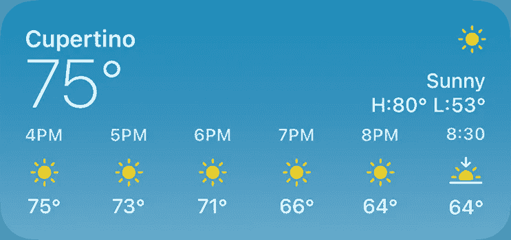
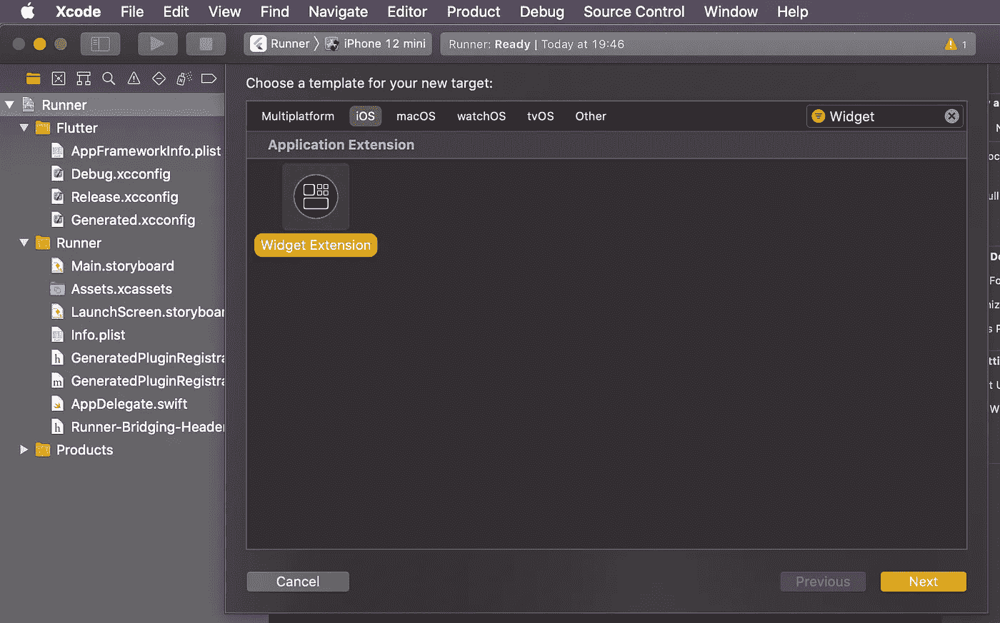
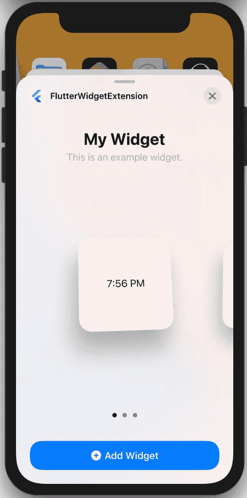
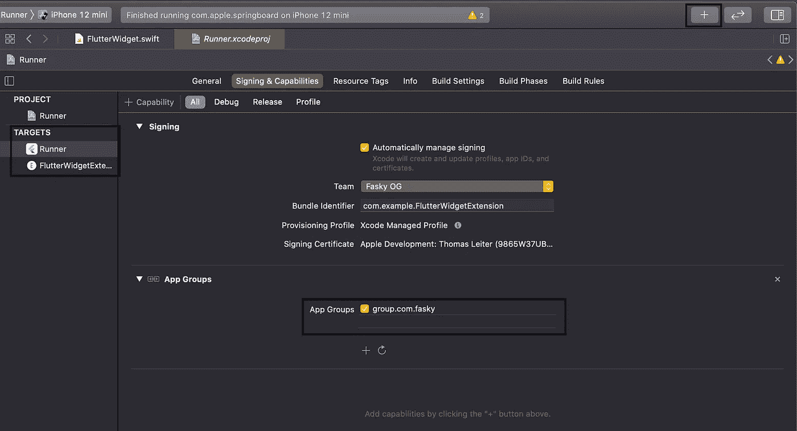
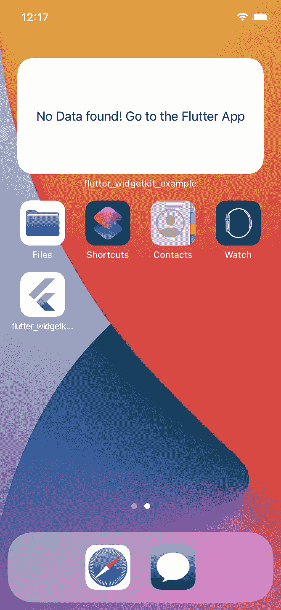
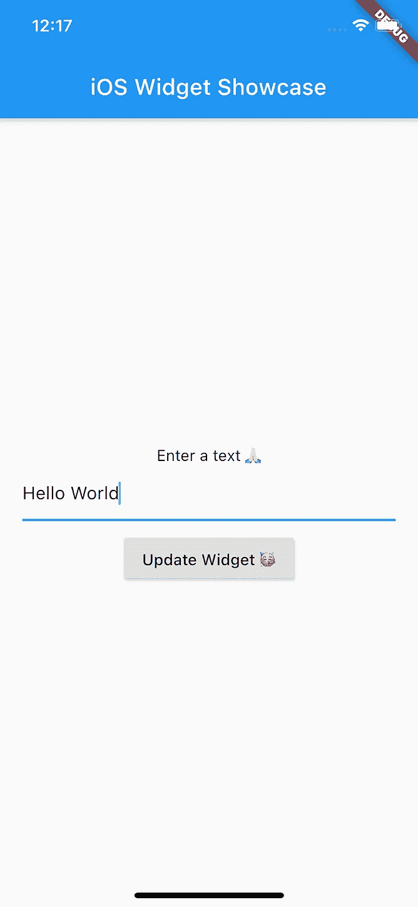
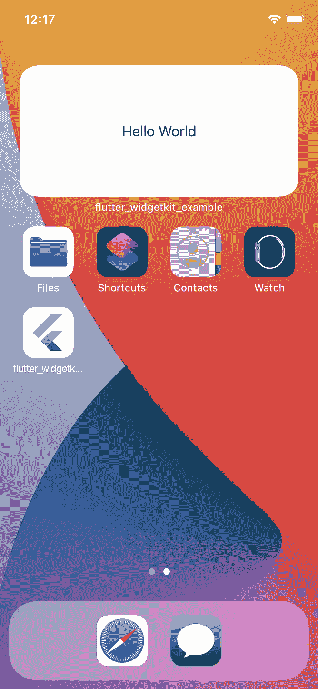

# 使用 SwiftUI 在 Flutter 中开发一个 iOS 14 Widget

> 原文：<https://itnext.io/develop-an-ios-14-widget-in-flutter-with-swiftui-e98eaff2c606?source=collection_archive---------0----------------------->

> 该死，我真的很想创建一个 iOS 14 主屏小工具，但我的应用程序在 Flutter 上运行。所以我猜这是不可能的？🤕



感谢上帝，你错了，你在正确的地方。在本文中，我将向您展示如何为您的 Flutter 应用程序创建一个 iOS 小部件扩展。

2020 年 9 月 16 日，iOS14 发布，这是自苹果移动操作系统发布以来，主屏幕首次发生变化。现在可以在主屏幕上显示小应用程序(widgets)，用户无需打开相应的应用程序就可以看到重要信息。一个众所周知的例子是天气小部件，它绝对是小部件的一个很好的用例。

从正面来看:不幸的是，目前不可能在 Flutter 中编写小部件。小部件必须像往常一样用 Xcode 和 SwiftUI 编程。但最有可能的是实现与 Flutter 的通信，而这正是这一切的意义所在。所以让我们开始吧。

## 先决条件

*   颤振和 SwiftUI 的基本知识
*   颤振设置([https://flutter.dev/docs/get-started/install](https://flutter.dev/docs/get-started/install)
*   Xcode 版本≥ 12

## 应用程序创建

我们将创建一个小的示例应用程序，展示带有 Flutter 的小部件扩展的概念。要创建应用程序，请在您的终端中执行以下命令。

```
flutter create <app_name>
```

## 小部件创建

接下来，让我们创建小部件。打开 ios 文件夹中的`Runner.xcworkspace`，添加一个新的 Widget-Extension 目标(File - > New Target)并给它一个合适的名字。



添加小部件扩展

很简单，对吧？所以我们使用 Xcode 运行应用程序，发现我们的应用程序现在支持 widgets 🥳，要添加一个 widget，你必须点击并按住主屏幕，直到左上角出现一个➕。当你点击图标时，会出现一个应用程序列表。我们新创建的应用程序应该包括在内。



我们新创建的小工具

## 小部件代码结构

让我们深入 Swift，看看小部件扩展的代码结构。如果你打开你的 *< WidgetName >。斯威夫特*你会看到 5 个重要的结构。

FlutterWidget.swift

***func 占位符***widget kit 第一次显示小部件时，会将小部件的视图渲染为占位符。占位符视图显示小部件的一般表示，让用户大致了解小部件显示的内容。

***func getTimeline***使用此方法，您可以使用当前日期时间创建一个时间线条目数组，如果需要，还可以创建未来的条目。因此，您不用一直运行扩展，而是通过“时间线”来允许您在不同的时间触发(例如每小时)更新小部件。在我们的例子中，我们将只创建一个条目，并用 Flutter 手动触发更新😎

***func getSnapshot*** 此函数应返回一个包含虚拟数据的“时间线”条目。它用于在 widget gallery 中呈现预览。

FlutterWidget.swift

***SimpleEntry*** 定义时间线的数据。这些数据随后用于呈现小部件。

FlutterWidget.swift

***FlutterWidgetEntryView***负责用 SwiftUI 渲染小部件。如前所述,`entry`属于 SimpleEntry 类型。

***flutter Widget***允许您设置种类和一些其他配置，如显示名称和描述(显示在 Widget 图库中)

***flutter Widget _ Previews***负责 Widget 图库/预览画布

## 通信抖动➡️小部件

对于通信部分，我们使用[用户默认值](https://developer.apple.com/documentation/foundation/userdefaults)。用户默认数据库的一个接口，在这个接口中，您可以在应用程序启动时持久地存储键值对。



Xcode —应用程序群组

将功能*“应用程序组”*添加到您的 Flutter 应用程序和您的小部件扩展中。在两个目标中，组名(*)必须相同，这一点非常重要。*

*我们的“应用程序组”中存储的值现在可以从我们的应用程序和我们的小部件✅中读取和写入*

*在[**flutter _ widget kit**](https://github.com/fasky-software/flutter_widgetkit)的帮助下，我们可以使用 Flutter 访问我们新创建的应用程序组，并且我们还可以触发时间线重新加载。*

## *我们的 Showcase Flutter 应用*

*计划是创建一个小部件，将增加我们的应用程序的用户体验。简单的原理:小部件要求用户打开应用程序，并输入一个简单的文本。按下按钮后，小工具的视图发生变化，并显示文本。*

*现在是时候安装前面提到的库了—[**flutter _ widget kit**](http://Now the time has come to install a very useful library - flutter_widgetkit)。将`flutter_widgetkit`添加到您的`pubspec.yaml`中，然后运行`flutter pub get`*

*主.镖*

*打开 main.dart 并导入库。我们还引入了类`FlutterWidgetData`,它定义了发送给我们的小部件的数据。*

*主.镖*

*在我们的`build`方法中，我们声明了一个文本字段，用户可以在其中键入一条消息，这条消息稍后会显示在我们的小部件上，我们还声明了一个按钮，它设置了`widgetData`并触发了所有时间线的重新加载。这就是✅的应用程序部分*

## *我们的展示窗口小部件*

*现在我们回到小部件，完成它的实现。*

*FlutterWidget.swift*

*首先我们声明我们的数据结构。当然这和我们在 Flutter app 里声明的是一样的。带有字符串类型文本的简单结构。*

*getTimeline—flutter widget . swift*

*我们的 *getTimeline* 方法变得有点大。我们用我们的组名初始化一个新的 UserDefault 对象，并读取键`widgetData`的值。然后我们把这个 JSON 解码，存入变量`flutterData`。之后，我们用之前收集的数据创建一个时间轴条目。*

*FlutterWidget.swift*

*我们的 SwiftUI 视图非常简单。如果用户还没有在应用程序中输入文本，entry.flutterData 将是`nil`，小部件显示`No Data found! Got to the Flutter App`，否则它将显示文本。*

******

*带有微件❤️的 Flutter 应用程序*

# *结论*

*我们已经到达了旅程的终点。我希望我可以向你展示，为你的 Flutter 应用程序创建一个小部件是非常容易的。如果有什么问题或者功能要求，[**flutter _ widget kit**](https://github.com/fasky-software/flutter_widgetkit)就是提问的地方。本博客中显示的所有源代码都在这个库中(子文件夹示例)。*

*除了 flutter 库，我还开发了[**React-Native-widget kit**](https://github.com/fasky-software/react-native-widgetkit)，它提供了与 React Native 相同的功能。如果你喜欢这个博客，请鼓掌告诉我👏*