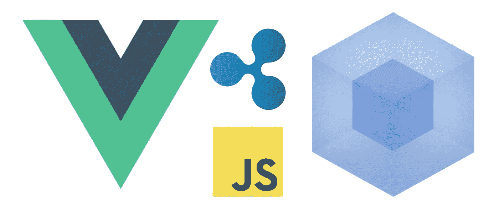
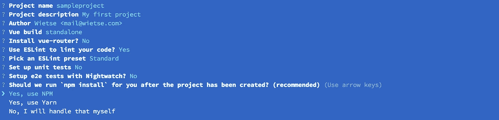
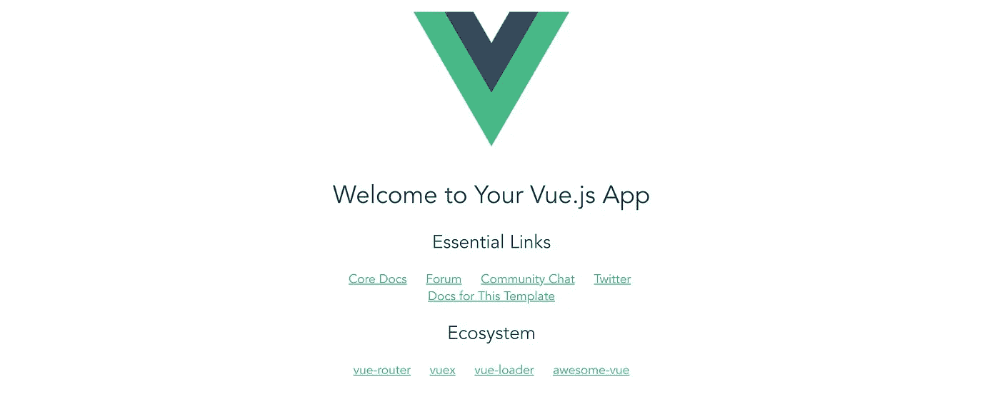
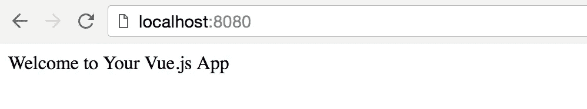
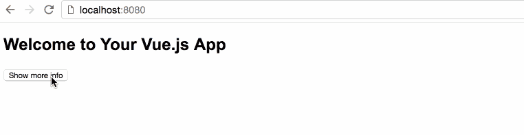
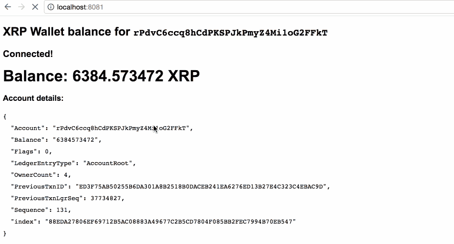
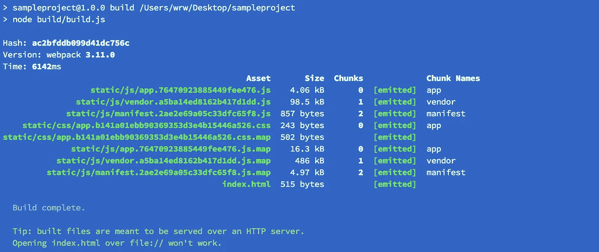
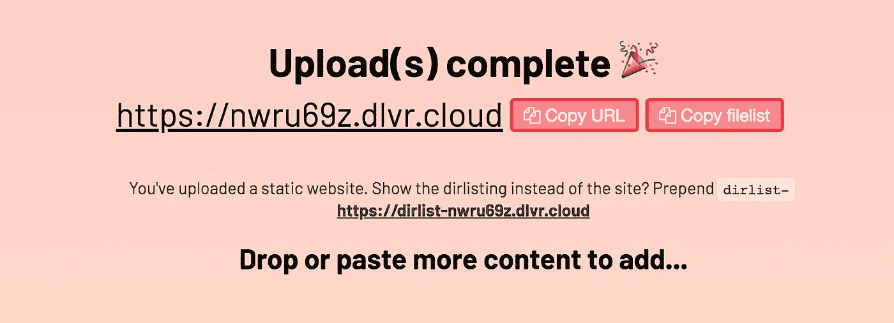

# 使用 VueJS + Webpack 开发出色的 web 应用程序(通过构建 XRP 总账集成进行演示)

> 原文：<https://itnext.io/develop-awesome-webapps-using-vuejs-webpack-bda08ebb691c?source=collection_archive---------5----------------------->



Vue(读作/vjuː/，类似视图)是一个用于构建用户界面的渐进式框架。

使用 VueJS，你可以结合编写 HTML 和 Javascript。Vue 会让你的 Javascript 对象和 HTML 保持同步。这意味着 DOM (HTML)中的事件可以改变 VueJS Javascript 对象，导致 DOM 中的修改(反之亦然)。

[这里有一个简单的例子](https://jsfiddle.net/k6j2u2kx/5/)——这一小段 HTML + VueJS 代码允许你添加和删除待办事项。

您可以在 *vanillajs* 项目中使用 Vue(所以:只需编写普通的旧 Javascript)，但是您可能想做得更多一点。用 ES6 语法，模块，npm 包等怎么样？？

还有:让开发更容易的实时重载怎么样？如何打包所有东西，让您的项目准备好部署到浏览器？

> 本教程可能需要一些关于 html、javascript 和虚拟 dom 的基础知识。

## NPM

npm 是 JavaScript 的软件包管理器，也是世界上最大的软件注册中心。在[https://www.npmjs.com](https://www.npmjs.com](https://www.npmjs.com))有数量惊人的现成可用的软件包

当您在 PC 上安装了 nodejs 后，您将自动安装 **npm** 。我们马上就要使用 **npm** ，所以请确保您已经安装了[node(js)](https://nodejs.org/en/)[](https://nodejs.org/en/download/)**。**

## **认识 vue-cli**

**有很多工具组合在一起，将允许您在几秒钟内开始开发 VueJS webapp。所有好的东西都已经在模板中提供给你了。 **vue-cli** 允许你开始你的项目。**

**让我们在全球范围内安装**vue-CLI**(`-g`选项):**

```
npm install -g vue-cli
```

**现在您可以使用`vue init`命令了(因为我们已经在全球范围内安装了 **vue-cli** ，您可以从每个文件夹(在您的终端中)运行这个命令)**

**`vue init`命令允许你指定一个模板包和一个项目文件夹。在一个小的安装向导后，你的项目文件夹将被创建，并预装了大量的工具和配置，允许你开始开发。**

****vue web pack 模板****

**VueJS 的 webpack 模板附带了许多预安装和预配置的优秀工具:**

*   **开发具有自动重载功能的 web 服务器**
*   **ES6 语法支持(导入、要求等。)**
*   **构建工具(编译、缩小等。)部署到浏览器**
*   **按指定路线发送**
*   **Vue 组件(将 Vue HTML 模板与 Vue 对象和样式组合在一个组件(文件)中)**
*   **调试工具**
*   **语法林挺**

# **创建您的第一个项目**

**转到您想要创建 vue webpack 项目的文件夹(文件夹),并运行:**

```
vue init webpack sampleproject
```

****

**Vue 初始化向导—让我们回答一些问题。**

**这将在文件夹(将被创建)`sampleproject/`中创建一个 vue webpack 项目。**

**你必须输入:**

*   **项目名称(a-z-)**
*   **项目描述**
*   **作者(姓名<mail></mail>**
*   ***Vue 构建*(选择*“运行时+编译器”*)**
*   **如果你想开发一个多页面的项目，安装 *vue-router* ，其中组件可以有自己的 URL。本教程将不涉及路由，所以如果您想尝试 Vue + Webpack 并保持简单，请选择 **No (n)** 。**
*   **用 ESLint？ESLint 将检查您的代码。一开始会很糟糕(因为它甚至会抱怨额外的空间、缺失的空间等等。)但它有助于您编写一致的代码。我会选择**是(Y)** 😇**
*   **ESLint 预设:选择**标准**。这是 ESLint 用来检查代码的规则集**
*   **设置单元测试:**现在没有(N)** 。我们刚刚熟悉 vue webpack，单元测试是另一个层次。**
*   **设置 e2e 测试:**否(否)**暂时。**
*   **我们应该运行“npm 安装”吗？
    选择**是，使用 NPM** 。这为我们节省了另一个命令；)**

**您的项目将被创建，所有依赖项将被下载并安装到您的项目中。这需要一分钟。npm 可能会显示一些警告；只要没有错误，你可能是好的。**

**现在打开您的项目文件夹并启动开发服务器:**

```
cd sampleproject
npm run dev
```

## **开发服务器**

**您可以使用`npm run dev`命令启动一个本地开发 web 服务器。服务器将在 [http://localhost:8080](http://localhost:8080`) 启动，除非端口 8080 已被占用:端口号将递增，直到找到空闲的 TCP 端口。开发服务器将在您的终端中显示 URL。**

**请访问:)
你会看到一个 Vue.js。样本页面:**

****

****关闭开发服务器****

**按下`Ctrl — C`**

## **项目(文件夹)结构**

**如果您打开项目文件夹，这些是相关的文件和文件夹(暂时):**

*   **`index.html`
    项目的基础 HTML。如果你想给你的`<head>,` 添加一些东西，比如`title`，元标签等等。您可以编辑该文件。**
*   **你可以在这里存储你的静态资产，比如图片、固定的 JS / CSS 文件等等。**
*   **`src/` 最重要的文件夹。这是你的 Vue.js 代码所在的地方**
*   **`src/App.vue` 您的应用程序的入口点**
*   **`src/components/HelloWorld.vue` 您的新项目的样本内容，当您在浏览器中访问您的开发服务器时可见，**

**当然还有更多的文件和文件夹，但我们现在不会涵盖它们。**

## **`src/components/HelloWorld.vue`**

**当您访问位于 [http://localhost:8080](http://localhost:8080) 的开发服务器地址时，`src/components/HelloWorld.vue`文件包含了大部分示例页面——因为`src/App.vue` *导入了*该文件，将其注册为 Vue *组件*，`src/App.vue`文件然后使用`<HelloWorld />`显示了徽标下的内容**

**现在在你的编辑器中打开`src/components/HelloWorld.vue`。您将看到该文件包含三个“部分”(根标签):**

*   **这个标签包含了你的 vue 组件将要呈现的常规 HTML。您可以将 Vue 语法与普通的旧 HTML 混合，并引用其他`.vue`文件(如果导入并注册，就像`src/App.vue`对`HelloWorld.vue`所做的那样)。**
*   **`<script>...</script>` 这是导入模块的地方，您的 Vue 组件被导出。vue 组件可以包含*组件*、*方法*、*数据、*等。**
*   **`<style scoped>...</style>` CSS 住在这里。如果*范围的*属性存在，那么样式将只影响这个特定模块中的 DOM。如果省略了*作用域的*属性，样式也会影响其他组件。
    (如果您更喜欢 sass/scss，向下滚动，我添加了一节关于为您的 vue webpack 项目安装 sass/scss 需求的内容)**

## **你的第一个代码**

**编辑`src/App.vue` —移除``标签(包含 Vue 徽标)并移除页面底部的样式(在`<style>`标签中)。**

**现在编辑`src/components/HelloWorld.vue` —删除文件中的现有代码，并替换为组件所需的最少代码:**

**您的开发服务器将自动获取更改，您的浏览器将显示一个非常基本的页面，其中包含来自`msg`变量的消息。**

****

**现在让我们向代码中添加一些简单的东西，向您展示一些基本的(但仍然很棒的)虚拟 dom 技巧(从 DOM 操纵 Vue 对象，反之亦然):**

**你看了代码大概就懂了；**

*   **有一个按钮调用`toggleShowMore`方法。该方法将通过反转`showMore`来更新 Vue 组件数据( *this* 引用 *this vue object* ，可以调用方法或引用数据)**
*   **该按钮将根据`showMore`的状态(真/假)显示“显示”或“隐藏”**
*   **包含更多信息的 div 只有在`showMore`为真时才可见。**

****

## **使用 npm 模块**

**好的，很好。您可以在中编写您的 html、css 和 javascript。vue 文件。那些漂亮的 npm 模块怎么样？如何将它们添加到您的项目中？**

1.  ****安装模块** 退出你的开发服务器(`Ctrl — C`)并安装模块。我将使用 *rippled-ws-client* 模块:这个模块是我为 XRP(加密货币)分类账编写的令人惊叹的应用程序。我们将检查钱包余额。活下去。厉害吧！？**
2.  ****导入模块** 当 **npm** 模块添加到您的项目中时，我们需要'*告诉 vue* 使用它。我们将使用`import`关键字来做到这一点。**
3.  ****使用模块** 我们来写点代码吧！**

**为了安装模块，我们运行带有`--save`属性的 *npm install* 。这将把模块添加到`package.json`文件中，所以如果我们将项目推送到 Git，当有人克隆您的库并运行 *npm install 时，模块会自动安装。***

```
npm install --save rippled-ws-client
```

**现在再次启动您的开发服务器；**

```
npm run dev
```

**…并再次编辑`src/components/HelloWorld.vue`。在 Vue 对象的`export`上方的`<script>`标签中，我们将`import`这个模块。我们还会添加一些代码(查看下面的要点)。**

**让我先解释几件事:**

*   **在第 5 行，我们使用 vue 条件类，关键字是类名(CSS: line 63 ),值是添加这个类的 javascript 条件。**
*   **在第 21 行，我们导入了`rippled-ws-client` npm 模块，并将该模块命名为`RippleClient`——我们现在可以在代码中引用`RippleClient`常量(第 34 行)**
*   **XRP 钱包的地址被硬编码(目前)在第 27 行— *(这是我的钱包。如果你觉得慷慨，请自便😇)***
*   ***波纹 ws-client* 连接到波纹服务器。我们将使用公共服务器`s1.ripple.com`(第 34 行)**
*   **为了获取钱包的余额(一个*账户*，我们向波纹服务器发送`account_info`请求。当服务器应答时，我们将响应数据设置为 vue 对象(第 44–55 行)**
*   **我们可以用`this`引用 vue 对象，因为我们使用 ES6 " *飞船操作符* " `(args) => { function }`进行回调函数。使用*飞船操作符*定义的函数不会覆盖`this`上下文。**

****

**您使用 Vue.js :D 连接到 XRP 总账的第一个应用程序**

# **为浏览器编译**

**所以我们创造了一些很棒的东西。现在您想向全世界展示您的 web 应用程序。您的开发 web 服务器运行在您自己的计算机上，地址为 [localhost:8080](http://localhost:8080) 对于开发来说非常好，但是不能公开使用。**

**因为您在 Vue.js 项目中编写的所有代码都是客户端的，所以您可以使用`npm run build`命令为浏览器编译您的项目。您的 vue webpack 项目将被导出到(新创建的)`dist/`文件夹中。这是将要发生的事情:**

*   **用 [UglifyJS v3](https://github.com/mishoo/UglifyJS2/tree/harmony) 缩小的 JavaScript。**
*   **用 [html 缩小器](https://github.com/kangax/html-minifier)缩小的 HTML。**
*   **将所有组件的 CSS 提取到一个文件中，并用 [cssnano](https://github.com/ben-eb/cssnano) 缩小。**
*   **使用版本哈希编译的静态资产，用于高效的长期缓存，以及自动生成的产品`index.html`，带有这些生成资产的正确 URL。**

**我们使用`Ctrl — C`退出开发服务器，然后运行:**

```
npm run build
```

****

**现在，您可以从 vue webpack 项目中获取生成的`dist/`文件夹，并将内容发布到 web 服务器。**

**提示:为了方便地将媒体或静态网站发布到一个唯一的网站，我开发了 [**dlvr.cloud**](https://dlvr.cloud) 。使用现代浏览器(例如 Chrome)将项目中的`dist/`文件夹拖放到 [https://dlvr.cloud](https://dlvr.cloud) 中——您的生产就绪 vue webpack 项目现已上线😁**

****

# **额外的**

## **在`. vue `文件中使用 sass/scss**

**如果要用 scss(牛逼，嵌套 css 样式，变量等。)在你的 vue webpack 项目中，你必须安装两个包，并将`lang="scss"`属性添加到`.vue`文件中的`<style ...>`标签中:**

```
npm install --save node-sass sass-loader
```

**现在将`lang="scss"`添加到您的`<style>`标签中:**

```
<style lang="scss" scoped>
  /* scss */
</style>
```

****SCSS(嵌套 CSS，函数)示例****

```
<style lang="scss" scoped>
  div {
    &.hello {
      font-family: Arial, Tahoma, Verdana; 
      font-size: 1em; line-height: 1.5em; .waiting { color: darken(orange, 10%); }
    }
  }
</style>
```