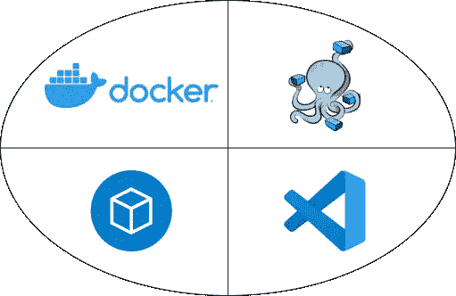
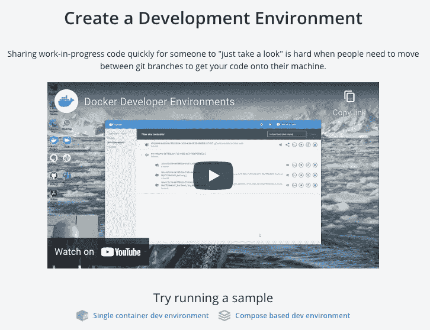
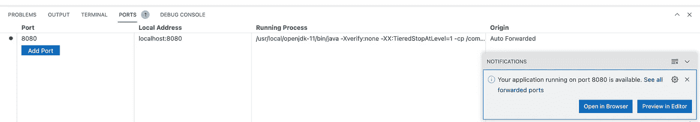
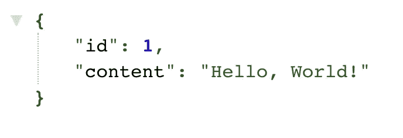
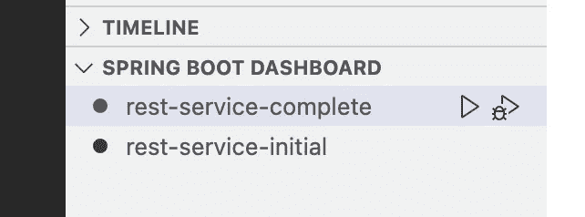
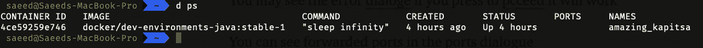
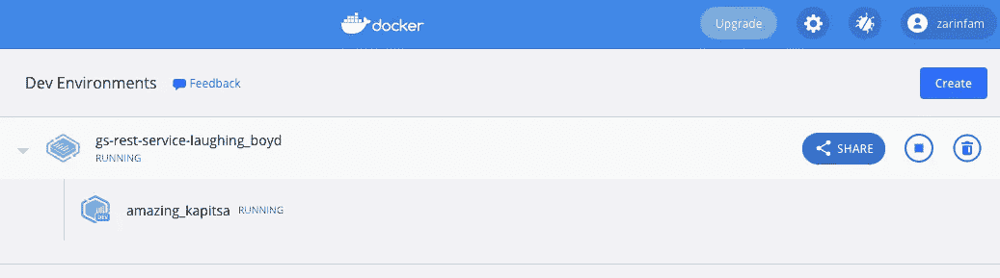

# 使用 Docker 桌面开发环境特性开发 Spring Boot 应用程序

> 原文：<https://itnext.io/develop-spring-boot-applications-using-the-docker-desktop-dev-environments-feature-c624463c9f61?source=collection_archive---------4----------------------->

## Docker、VS 代码、Docker 编写器和远程容器插件的良好组合



我总是喜欢有一个干净和独立的(从我的主操作系统)开发环境，在过去，我用 [Multipass](/how-to-have-a-clean-dev-environment-like-wsl-2-using-multipass-on-linux-mac-or-windows-6828a78b87d7) 和 [WSL 2](/using-wsl-2-to-develop-java-application-on-windows-8aac1123c59b) 写了两篇文章来拥有这样的开发环境:

[](/how-to-have-a-clean-dev-environment-like-wsl-2-using-multipass-on-linux-mac-or-windows-6828a78b87d7) [## 如何在 Linux、Mac 或 Windows 上使用 Multipass 获得一个像 WSL 2 这样干净的开发环境

### 保持您的开发人员笔记本电脑整洁的指南

itnext.io](/how-to-have-a-clean-dev-environment-like-wsl-2-using-multipass-on-linux-mac-or-windows-6828a78b87d7) [](/using-wsl-2-to-develop-java-application-on-windows-8aac1123c59b) [## 使用 WSL 2 在 Windows 上开发 Java 应用程序

### 比较使用 Maven 和 IntelliJ Idea 时 WSL 2 和 Windows 10 的性能

itnext.io](/using-wsl-2-to-develop-java-application-on-windows-8aac1123c59b) 

最近 docker 引入了一个新的特性叫做 Dev Environments，这是一个预览特性，但是对我来说非常有趣。这个新特性是 Docker、docker-compose 和 VS 代码(带有远程容器插件)的组合。

通过使用这个特性，您可以从 docker 卷(或在**您的本地目录**)中的项目 git 库**轻松构建一个快速开发环境，然后连接到**创建的 docker 容器**，该容器使用 VS 代码(远程容器插件)连接到该卷，并开始编码和运行该项目。您甚至可以**将您现有的 Docker 开发环境图像**上传到 Docker Hub 上与其他人共享。**

如果你只是想快速浏览一个项目或者帮助你在分支机构工作的同事，你不需要通过安装 SDK、编译器和其他开发工具来把你的系统弄得一团糟。

Docker 桌面`Dev Environments`支持两种类型的项目:

*   单一容器开发环境
*   基于组合的开发环境

在本文中，我们将为 Spring Boot 团队的[官方 REST API 示例项目创建一个`docker Dev environments`(单个容器)。下一篇文章将为一个更复杂的带有数据库的 Spring Boot 项目创建一个`docker Dev environments`(基于组合)。](https://github.com/spring-guides/gs-rest-service)



# 准备您的机器来创建您的第一个 Docker 开发环境

**首先**，你需要安装 [Docker 桌面](https://www.docker.com/products/docker-desktop)和 [VS 代码](https://code.visualstudio.com/)，然后你需要在 VS 代码中安装 [Remote-Containers 插件](https://marketplace.visualstudio.com/items?itemName=ms-vscode-remote.remote-containers)。

**接下来，**运行 Docker 桌面，点击 macOS 菜单栏(或 Windows 系统托盘)中的`Whale icon`进入仪表盘，点击`Dashboard`子菜单。

**最后**，你应该点击位于左窗格的`Dev Environemnts`，看到你的`Docker Dev Environments`列表。

# 如何创建 Docker 开发环境？

当您在 Docker 桌面仪表板的开发环境窗格中时，按下创建新环境按钮，您将有 3 个选择来创建新的开发环境:

*   **远程 git 存储库:**从 docker 卷中的远程 Git 存储库(可能是该存储库的一个分支)克隆项目代码，用创建的卷创建 docker 容器并打开 VS 代码，并使用 [Remote-Containers 插件](https://marketplace.visualstudio.com/items?itemName=ms-vscode-remote.remote-containers)将其连接到创建的 Docker 容器。
*   本地文件夹:与前一个相似，但是你的源代码在本地目录中，绑定在创建的 docker 容器中。您的源代码将在 docker 容器和您的本地目录之间同步，因此与前面的方法相比可能会慢一点。
*   **现有的开发环境:**您可以通过将现有的开发环境发布为 docker 映像来重用它们，然后通过这种方法重用它们。

# 为 Spring Boot 项目创建 Docker 开发环境

按下 Create New Environment 按钮，在第一个选项卡( **Remote Git Repository** )中，输入 Spring Boot 团队的[官方 REST API 样例项目的 URL](https://github.com/spring-guides/gs-rest-service):

[](https://github.com/spring-guides/gs-rest-service) [## GitHub-spring-guides/GS-rest-Service:构建 RESTful Web 服务::学习如何创建一个…

### 本指南将带您完成用 Spring 创建一个“Hello，World”RESTful web 服务的过程。

github.com](https://github.com/spring-guides/gs-rest-service) 

按下`Create`按钮后，创建您的第一个开发环境的过程就开始了。Docker 开发环境执行以下步骤来创建您的第一个开发环境:

*   基于你的项目的编程语言和技术拉一个 docker 映像**，在这种情况下，docker 拉`docker/dev-environments-java:stable-1`并基于它创建一个容器和所需的卷。**
*   将源代码从给定的 git 存储库中克隆到其中一个已创建的卷中。
*   最后，docker desktop 将为您打开一个 VS 代码窗口，该窗口使用 [Remote-Containers 插件](https://marketplace.visualstudio.com/items?itemName=ms-vscode-remote.remote-containers)连接到创建的 docker 容器。

# 在开发环境中开发和运行项目

作为一名 Java 开发人员，我不喜欢 VS 代码用于日常的 Java 和 Spring Boot 开发，我还没有发现它是 Java 开发的完美 IDE。

如果你只想运行这个示例 REST API，你不需要在 VS 代码中安装任何插件，也不需要在容器中安装 JDK。开发环境创建的 Docker 容器有 JDK 和 [SDKMAN！](/install-several-versions-of-jdk-gradle-kotlin-scala-spark-and-on-your-os-in-parallel-a7de30f691ad)，SDKMAN 的存在！如果你想安装其他 SDK 和工具(例如 Maven、Scala 或 Kotlin ),这是非常有用的。

所以你只需要进入项目中的`complete`目录，从 VS 代码终端执行这个命令:

```
cd complete
./mvnw spring-boot:run
```

当构建和运行过程完成时，VS 代码将 Spring Boot 运行端口映射到您的本地机器，并显示一个对话框让您打开浏览器。



在你的主机上打开浏览器，进入[http://localhost:8080/greeting](http://localhost:8080/greeting)



对于 VS 代码中的 Java 和 Spring Boot 开发，您有两种选择:

*   安装[Java 扩展包](https://marketplace.visualstudio.com/items?itemName=vscjava.vscode-java-pack)
*   安装 [Spring Boot 扩展包](https://marketplace.visualstudio.com/items?itemName=Pivotal.vscode-boot-dev-pack)

我使用了 [Spring Boot 扩展包](https://marketplace.visualstudio.com/items?itemName=Pivotal.vscode-boot-dev-pack)，关于 VS 代码和[远程容器插件](https://marketplace.visualstudio.com/items?itemName=ms-vscode-remote.remote-containers)有趣的是，当你连接到这个容器时，已安装的插件才可用，这意味着如果你在你的主机上正常打开你的 VS 代码，而没有连接到任何容器，则 [Spring Boot 扩展包](https://marketplace.visualstudio.com/items?itemName=Pivotal.vscode-boot-dev-pack)不会被安装。

现在您可以使用 Spring Boot 仪表板运行(或调试)项目，只需点击运行(或调试)按钮(可能您需要到终端并按下`Ctrl + C`来停止之前运行的实例)。



# 最后一瞥

如果你运行`docker ps`命令，你会看到你的**开发容器**:



如您所见，所创建的容器的名称是由 Docker Dev 环境创建的随机名称(在我的例子中是`amazing_kapitsa`)。

除了创建的容器之外，您还可以看到为您的开发环境创建的映像(包含所有内容，甚至是 WIP 代码！)在 Docker 桌面仪表盘中(在我的例子中是`gs-rest-service-laughing_boyd`):



如果您有`Docker Team Plan`，您可以点击分享按钮与您的团队成员分享此图片。

像所有的工具和技术一样，Docker 桌面中引入的这个新功能也有一些优点和缺点，但总的来说，我喜欢这个功能，作为最后的结论，我在下面的列表中尝试提到 Docker 开发环境功能的优点和缺点。

## 优势:

*   将开发环境与主机操作系统完全隔离
*   良好的性能
*   为每个项目在 VS 代码中安装所需的插件
*   可重复的开发环境，更好的团队合作
*   减少向团队添加新开发人员的入职时间

## 缺点:

*   尚不支持 Intellij Idea
*   如果在开发过程中，开发环境容器崩溃，那么你的代码将会丢失！
*   共享开发环境在免费计划中不可用