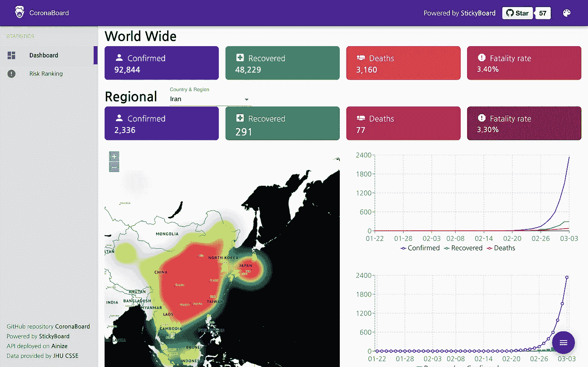
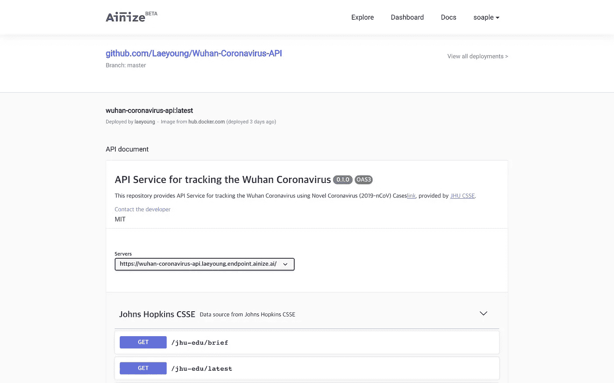
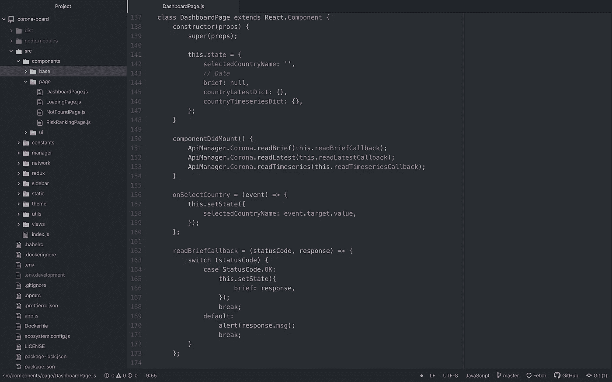
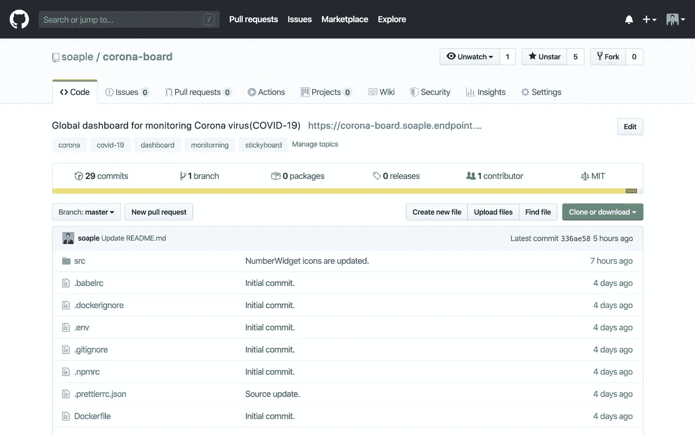
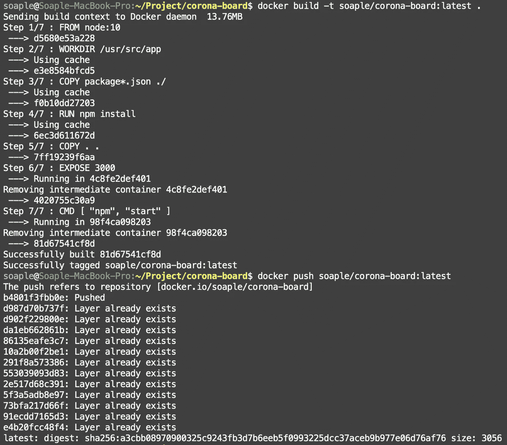
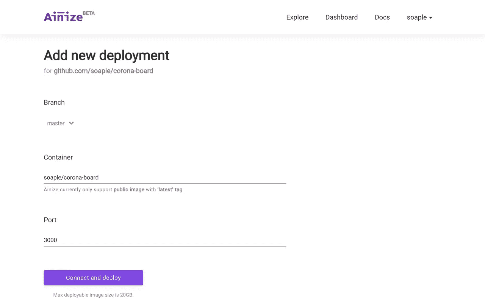
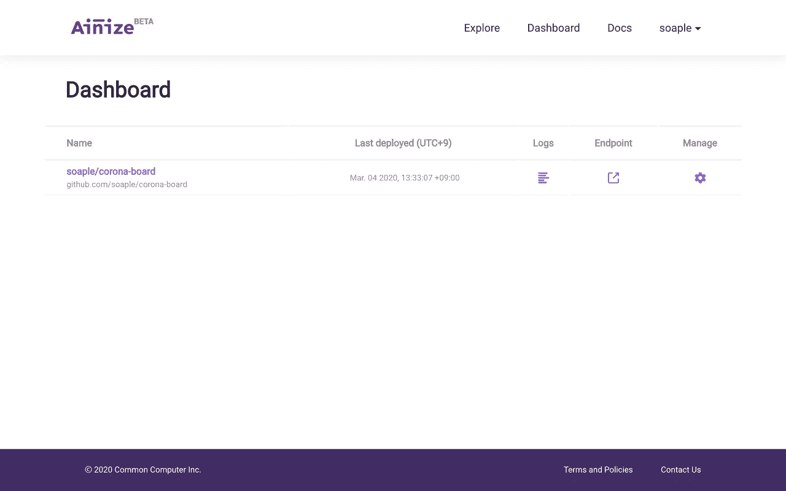

# 一天之内开发出 Corona 仪表板

> 原文：<https://itnext.io/develop-the-corona-dashboard-in-a-day-b5f1be41fe33?source=collection_archive---------2----------------------->

开发者们，你们好。世界上许多人因为新冠肺炎 T2 冠状病毒而恐慌，所以我创建了一个跟踪每个地区感染人数的仪表板，因为很难找到一个仪表板来监控全球的情况。

首先要有数据才能开发一个仪表盘。
所以，我找到了一个 API，它提供来自**约翰霍普金斯大学**的冠状病毒感染数据。
([https://ainize.ai/laeyoung/wuhan-coronavirus-api](https://ainize.ai/laeyoung/wuhan-coronavirus-api))

API 由名为 **Ainize** 的服务提供服务。
**Ainize** 是一个开源项目的无服务器平台。因此，任何对开源项目感兴趣的人都可以免费部署他们自己的项目。

 [## Ainize

### 开源项目的无服务器平台

ainize.ai](https://ainize.ai) 

因此，API 已经准备好了，创建仪表板的下一步是可视化数据。
在这一步，我决定使用我的开源项目， **StickyBoard** 。

 [## 肥皂/粘性纸板

### 基于 React 的完全可定制的 Web 管理/仪表板入门套件

github.com](https://github.com/soaple/stickyboard) 

使用 StickyBoard，任何人都可以轻松地开发 web 管理页面和仪表板。

首先，将 StickyBoard 项目下载到一个. zip 文件中，以创建一个新项目。
我集成了我们之前找到的 API，修改了仪表板页面和图表的布局。

我不会解释开发过程的细节，因为这将是一个漫长而复杂的书面描述。

可以看到确诊、痊愈、死亡人数和病死率。此外，您可以通过热图和图表了解趋势。

接下来，我必须将这个仪表板部署到服务器，如果我使用云服务，我必须付费。
所以，我决定把它上传到我之前找到的名为 Ainize 的服务上。

首先，我在 GitHub 中创建了一个新的资源库，让项目开源，我推送了所有的源代码。
(【https://github.com/soaple/corona-board/】T21)

然后我需要把这个项目归档。
( **Dockerize** 是创建一个容器映像的过程，这样就可以上传到 Docker。)
因为 **Dockerfile** 已经存在于 **StickyBoard** 中，所以我只是用下面的命令构建并推送镜像。

**soaple** 是我的 **DockerHub** 用户名， **corona-board** 是 DockerHub 库名的名称。一旦映像上传到 DockerHub，我就可以最终将它们部署到 Ainize。

在 Ainize 网站上创建一个新的部署，如下所示。

部署完成后，您可以在仪表板上看到它，如下所示。

如果你按下右边的端点图标…
你可以看到一个这样的网站！

下面的链接是到 **CoronaBoard** 网站的完整链接。

 [## 日冕牌

### 由粘扣板供电的全球电晕仪表板

corona-board . soap le . endpoint . ainize . ai](https://corona-board.soaple.endpoint.ainize.ai/) 

这个开源和开源部署平台使我能够在一天内创建一个全球 Corona 仪表板。

如果你想为这个项目做贡献，或者你对这个项目有任何疑问，请在 GitHub 上写一期。

希望冠状病毒尽快平息，我很快会带着新的帖子回来。

感谢您的阅读！

*   **GitHub 库**
    [https://github.com/soaple/corona-board](https://github.com/soaple/corona-board)
*   **由粘扣板驱动**
    [http://stickyboard.co.kr](http://stickyboard.co.kr)
*   **Ainize**
    [上部署的 API 和网站 https://ainize.ai](https://ainize.ai)
*   **约翰·霍普金斯大学**
    【https://github.com/CSSEGISandData/COVID-19 提供的数据