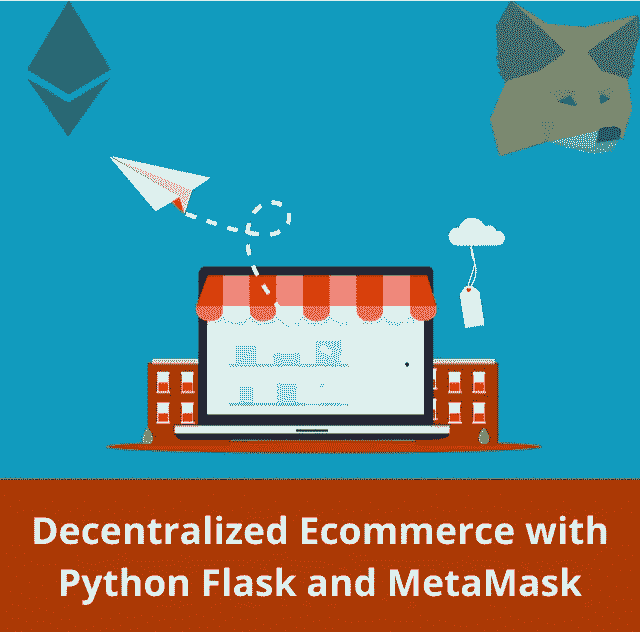
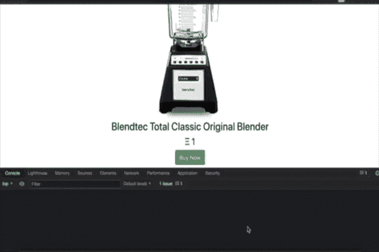
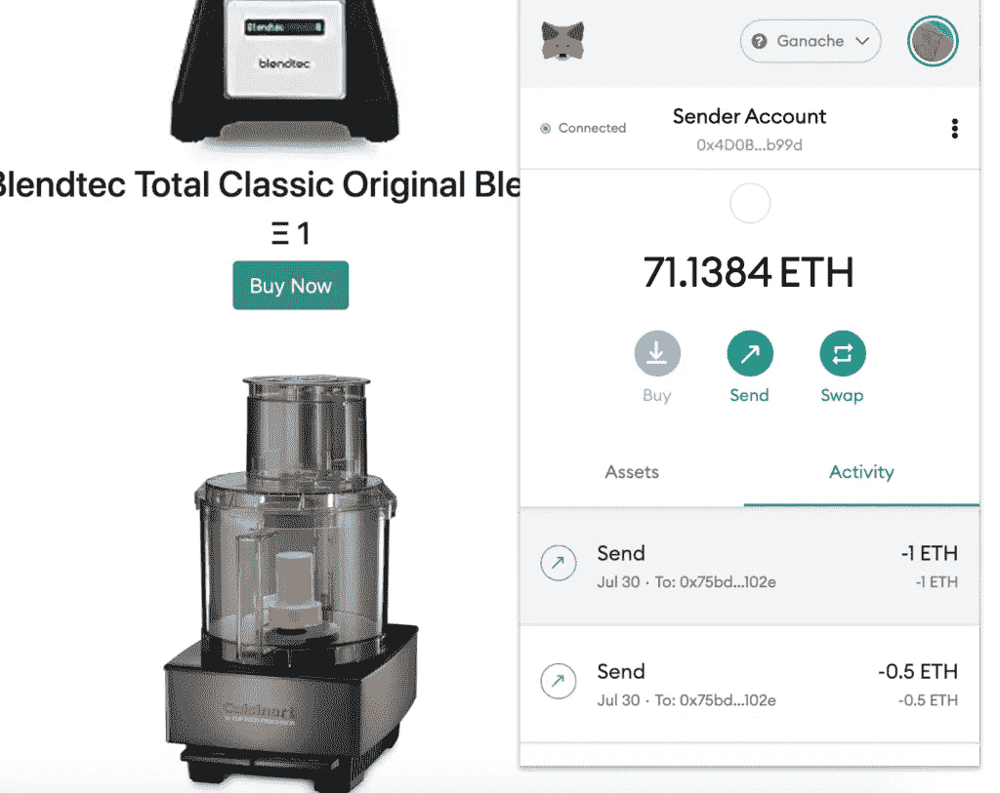
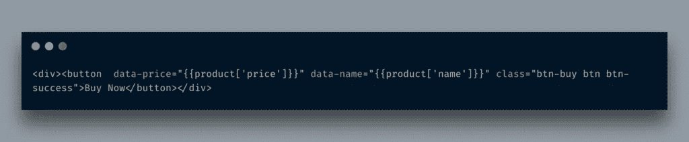
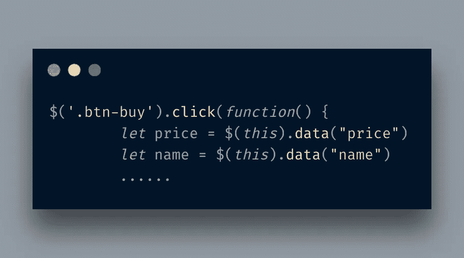
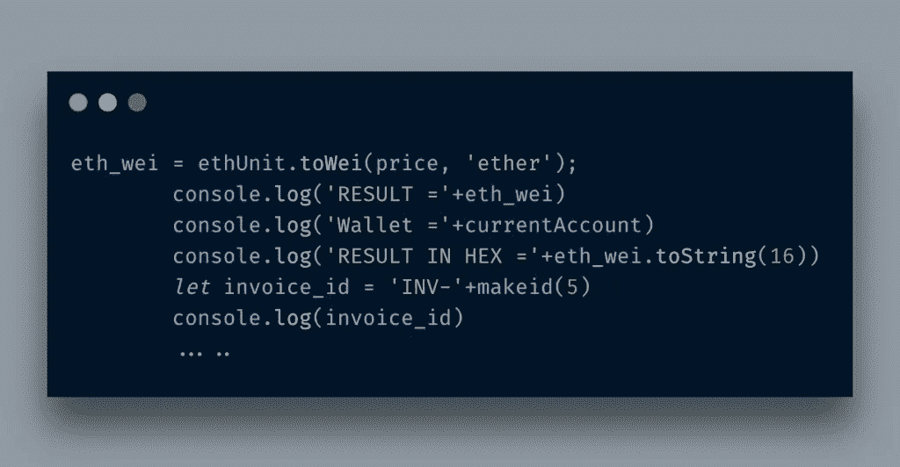
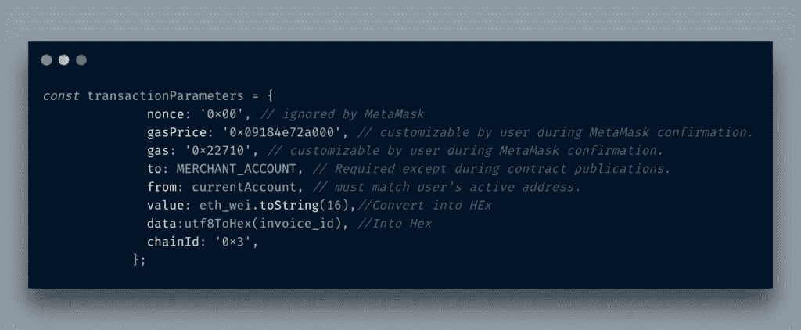
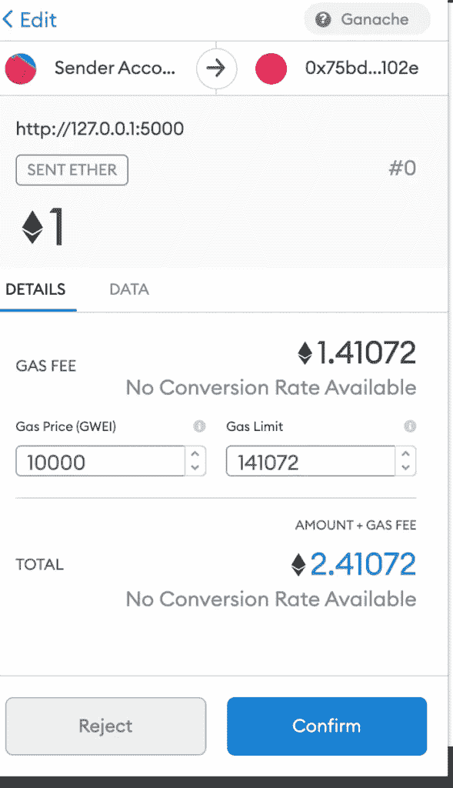
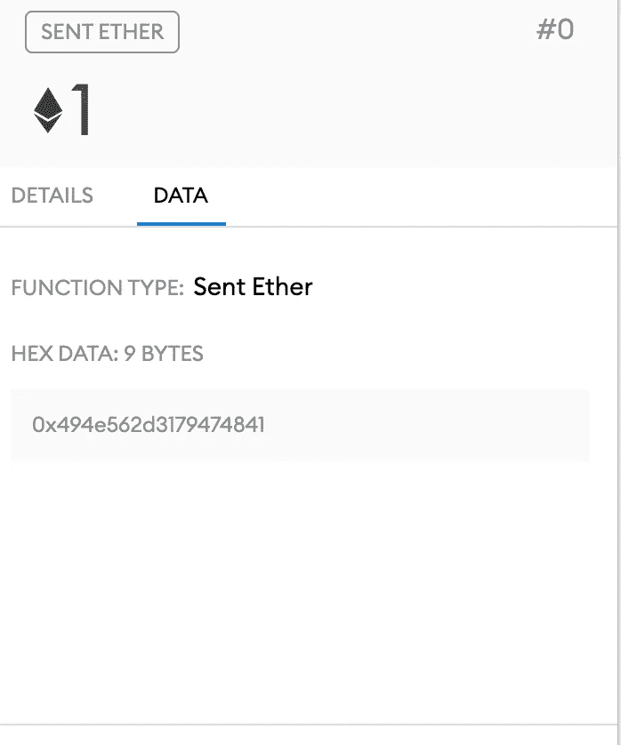
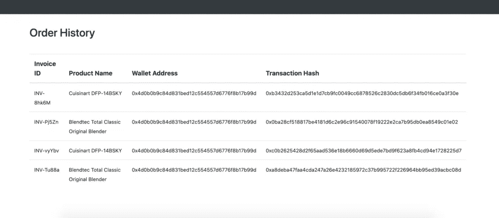

# 使用 Python Flask 和 MetaMask 开发您的第一个去中心化电子商务应用程序

> 原文：<https://itnext.io/develop-your-first-decentralized-e-commerce-application-with-python-flask-and-metamask-96d9344e415d?source=collection_archive---------0----------------------->

在之前的[帖子](http://blog.adnansiddiqi.me/build-your-first-solidity-dapp-with-web3-js-and-metamask/)中，我讨论过如何使用 MetaMask 和 Web3.js 库来创建区块链应用的前端。在这篇文章中，我将进一步讨论如何通过使用 Python Flask 作为后端和 MetaMask 库来创建一个分散的电子商务网站，以便在您的网站上接受 ETH。我们典型的演示网站如下所示:

dapp 商务在行动

除了告诉您现有的后端应用程序如何开始接受以太坊和其他 ERC20 令牌， ***我想指出的一点是，您并不总是需要智能合约或 web3.js 库来使您的应用程序成为分散的应用程序(根据 d app 的当前定义)。***

我制作的 web 应用程序使用了用于数据库目的的 ***Flask 2*** 库和 Sqlite3。

我不打算教如何开发 Flask 应用程序，你可以查看其他教程。我将讨论如何通过 MetaMask 将您的 web 应用程序与以太坊节点(在本例中为 Ganache)集成，并开始在您的网站上接受令牌。

当你打开主页时，它要求你连接你的钱包。连接后，您会看到您的钱包已连接到网站。

`$(document).ready()`函数包含检测元掩码和注册*购买*按钮的*点击*事件的代码。在 HTML 中，我使用数据属性，`data-`来传递所需的信息。

在 Javascript 中，我通过 JQuery 在 *click* 事件上获取这些值。

接下来，我使用 [etjs-unit](https://www.jsdelivr.com/package/npm/ethjs-unit) 库将 *Eth* 转换为 *Wei。*

首先我用`ethUnit.toWei`把一个单位乙醚转换成魏，也就是后来我把它转换成了十六进制。我这样做是因为*元掩码*事务函数需要所有十六进制数据。我还生成一个发票 ID，并在每笔交易中传递该信息。这是非常重要的，因为它将有助于你在审计。

接下来，我将构建一个常量 *dict* 对象，它包含与事务相关的所有信息:

我从 MetaMask [文档](https://docs.metamask.io/guide/sending-transactions.html)中提取了代码。您可以设置大多数参数，有些参数在 MetaMask 界面中可用并可编辑，例如*气体*量。

上面的承诺实际上调用了元掩码接口。如果您进行交易，那么像交易散列这样的信息对您是可用的。

上面的屏幕是根据您在上面的变量中设置的参数构建的。

我设置的数据参数，在本例中是发票 ID，也存储在这里。当一个交易成功时，它被记录在区块链中，在这种情况下，Ganache 包含所有的数据(*注:您在下面看到的数据来自上一个交易*)。

你可以看到 TX 散列，ETH 数量，Gash 价格和消耗，以及 Tx 数据，所有信息都在这里给出。顾客钱包中的金额被转移到商家钱包地址。客户可以在*订单历史*中看到所有这些信息。

# 结论

如你所见，将以太坊区块链集成到你的电子商务网站并开始接受支付是非常简单的。该代码可在 [Github](https://github.com/kadnan/PythonFlaskDecentralizedEcommerce) 上获得。

*原载于 2021 年 8 月 2 日*[*http://blog . adnansiddiqi . me*](http://blog.adnansiddiqi.me/develop-your-first-decentralized-ecommerce-application-with-python-flask-and-metamask/)*。*