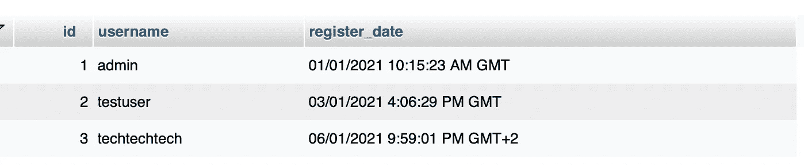
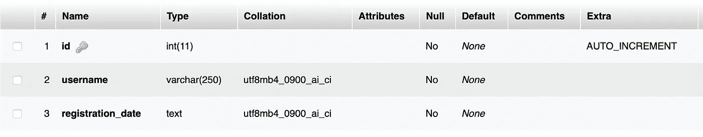

# 开发商:停止这个日期错误！

> 原文：<https://itnext.io/developers-stop-this-date-mistake-e3a30e8c63d1?source=collection_archive---------6----------------------->

## 这个著名的数据结构错误让开发人员的生活如同地狱。

照片由 [krakenimages](https://unsplash.com/@krakenimages?utm_source=medium&utm_medium=referral) 在 [Unsplash](https://unsplash.com?utm_source=medium&utm_medium=referral) 上拍摄

让我们来看看一个著名的数据库结构错误，以及如何避免它。这些错误会使应用程序的维护和进一步开发变得异常困难。

# 日期和时间

这是开发者最大的挫折。错误构造的时间相关数据会使数据排序、数据转换以及根据用户时区显示正确时间变得困难。让我们一劳永逸地停止这一切。

## 日期和时间:问题

让我们来看看下面的数据库表`users`您发现下面的数据有什么问题吗？

“用户”数据库表示例

正如你可能猜到的，日期和时间有问题。让我们再深入一点，看看为`users`定义的表结构。

“用户”表的表结构

我们有一个列`id`被定义为主键，自动递增。目前为止一切顺利。一个用户名，定义为`varchar(250)`，虽然这个`varchar`的大小对于用户名来说可能太大了，但是`varchar`仍然是一个合理的选择。然后我们发现存储为`text`的`registration_date`列。

出于多种原因，这应该会立即敲响警钟。为了存储小字符串，我们应该使用`varchar`数据结构，它是为更小的文本片段优化的。我们将在下一个主题中更详细地了解这一点。

但这还不是全部，假设您是一名开发人员，您希望在网页上显示日期。好，我们可以简单地显示数据库中的原始数据，对吗？

使用原始文本日期的社交媒体网站示例

那看起来不太好，是吗？设计团队给了我们下面的设计模型作为要求。

幻想 UX 团队提供的设计模型

基本上，他们不希望我们显示日期，而是显示自消息发出以来已经过去的时间。这意味着我们需要准确理解日期值在我们的前端代码中的含义。让我们继续 JavaScript 的一些例子。

我们现在必须将`text`日期转换成 JavaScript 能够理解的`Date`对象日期。从这个日期开始，我们可以计算从现在到指定时间的差值。让我们使用一个著名的数据库来使我们的生活变得更容易，这个数据库叫做 [MomentJS](https://momentjs.com) 。

moment 库对于将文本日期转换成真实的 javascript 对象日期非常有用。然而，你可能已经注意到了，我们的 06/01/2021 应该是`6 January`，而不是`1 June`。那是因为 moment 认为我们给了它一个`month/day/year`日期格式，而不是`day/month/year`格式。

没问题！我们可以解决这个问题。让我们使用矩的魔力来解析正确格式的字符串。

我们拿到了。这确实是两个月前的事了，因为这是一条旧消息。然而，时区现在似乎是错误的。Moment 似乎没有获取该时区的格式。Moment 确实有一个方法`.utcOffset()`来处理它，但是它的使用需要更多的手工操作，这是我们首先要避免的！

总之，我们看到，由于保存日期和时间使用了错误的数据结构，要正确显示日期需要花费相当大的努力。

## 日期和时间:解决方案

让我们想办法解决这个问题吧！它可以像定义一个好的数据结构一样简单。不使用字符串日期，为什么不使用 Unix 时间戳？这是自 1970 年 1 月 1 日午夜(UTC)以来以秒为单位的时间。

通过一个简单的命令，我们可以获得当前的时间戳。那把它转换回日期呢？

这就是我们的 JavaScript 日期对象！我们甚至不需要任何第三方库，真的很简单。

## 日期和时间:日期时间和时间戳

一些数据库引擎提供的`datetime`数据类型呢？它们也工作得很好。然而，时间戳以一种通用的方式工作，并且通常在数据库上更加轻便。在数据库领域，整数是一种非常有效的数据类型。

时间戳和日期时间的一个重要区别是`datetime`也会存储日期的时区。另一方面，时间戳将只存储从 epoch 开始的秒数，以 UTC 表示。您将无法计算出保存日期的时间戳。根据您的应用程序，您可以选择 DateTime 或 timestamp。这些都是非常可靠的选择。另一种方法是单独存储时区，如果这样更符合您的要求的话。

## 日期和时间:摘要

虽然开发人员可能很难使用文本格式，但还有其他原因不选择文本日期:

*   与整数时间戳相比，文本日期需要更多的数据库存储空间
*   通过文本日期对数据进行排序可能非常棘手和繁重。另一方面，按整数时间戳排序对于数据库来说非常容易

日期时间和时间戳都是有效的选项，而时间戳更简单，日期时间提供了更多的功能，例如存储日期的时区。

## 如果太迟了呢？

如果您的应用程序已经使用了错误的数据类型，该怎么办？常见的迁移策略是复制数据列。如果您之前有一个`date`列，只需添加一个新列，比如`timestamp`。创建一个脚本，将以前的数据迁移到新格式的新列中。为以前的格式创建转换器可能很麻烦，但至少您可以在将来摆脱旧的数据格式。

逐步将您的应用程序迁移到新列。一旦确定以前的数据列不再用于任何应用程序，就可以安全地将其删除。当第三方集成到您的 API 中时，一定要通知他们，或者保持向后兼容。

# 关键要点

处理新数据或旧数据时要三思。考虑一下强加的数据结构将如何影响整个架构，从过滤数据、搜索数据到显示数据的能力。这不仅是关于日期，也适用于其他项目。

从长远来看，项目开始时的快速决策对其可维护性有很大的影响。如果以不需要的格式指定一个值，它会给数据库、开发团队和整个项目带来额外的压力。

重温您的[数据库规范化技术](https://en.wikipedia.org/wiki/Database_normalization)以避免陷入这些情况！不要在一个字段中存储多个数据，总是尽可能将字段提取到不同的列中，直到这些列可以独立为止。你的开发伙伴会感谢你的。这正是数据库规范化技术的第一范式或 1NF 所指示的。确保数据是原子的。

至于日期，您可以使用时间戳或实际日期对象。两者都可以正常工作。根据您的架构和项目，您可能必须使用其中的一种。如果您的应用程序需要知道日期的时区，您将需要使用一个 date 对象，因为时间戳不包含这个值。

虽然正确的数据结构设置很重要，但不要忘记数据库的其他方面，如索引和其他性能优化。

保持你的数据整洁，让你的开发伙伴开心！

# 额外资源

[1NF、2NF 和 3NF:数据库规范化技术。](https://en.wikipedia.org/wiki/Database_normalization)

日期时间与时间戳:何时应该使用哪个？

[MariaDB 时间戳文档](https://mariadb.com/kb/en/timestamp/)

[订阅我的媒介](https://kevinvr.medium.com/membership)到**解锁** **所有** **文章**。通过使用我的链接订阅，你是支持我的工作，没有额外的费用。你会得到我永远的感激。