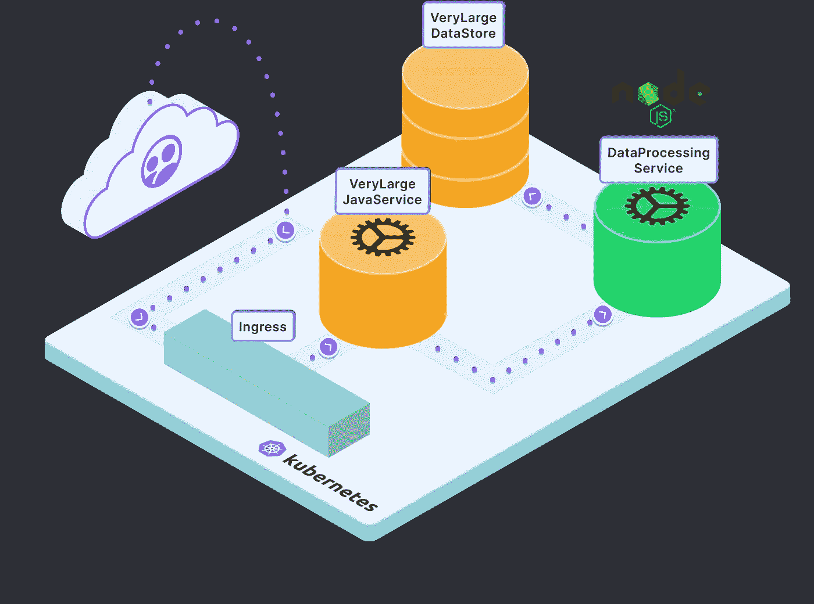

# 在 Kubernetes 上开发 JavaScript 应用程序

> 原文：<https://itnext.io/developing-javascript-applications-on-kubernetes-307775c1fb84?source=collection_archive---------2----------------------->

## 使用远程呈现和节点构建云开发环境

现代组织采用 Kubernetes 来更快地发布特性。使用 Kubernetes，用户可以部署和扩展任何规模的容器化应用程序:从一个服务到数千个服务。通常，Kubernetes 的学习曲线特别陡峭，尤其是对于应用程序开发人员来说。Kubernetes 应用程序开发需要新流程和新工具。那么 JavaScript 开发者如何在 Kubernetes 上创建一个快速有效的开发工作流呢？

在 Kubernetes 上构建生产性开发实验有两个主要挑战:

1.  Kubernetes 应用程序被设计为原生于云，但是大多数遗留开发工作流是为本地开发而构建的。
2.  Kubernetes 应用程序建立在微服务架构之上。随着新的微服务向您的应用程序添加额外的依赖项，开发环境变得更加复杂。这些[服务很快变得过于消耗资源](https://www.getambassador.io/resources/eliminate-local-resource-constraints/)，并且超出了本地机器的限制。

在本教程中，我们将为 Kubernetes 设置一个开发环境，并对 NodeJS 微服务进行更改。要进行本地开发，我们必须等待容器构建，推进到注册中心并进行部署，以查看代码更改的效果。相反，我们将使用[网真](http://www.getambassador.io/products/telepresence/)来立即看到我们改变的结果。

# 步骤 1:部署一个示例微服务应用程序

对于本例，我们将对在资源密集型 Java 服务和大型数据存储之间运行的 NodeJS 服务进行代码更改。我们将从部署一个由 3 个服务组成的示例微服务应用程序开始:

*   **verlargejavaservice**:用 Java 编写的内存密集型服务，为我们的应用程序生成前端图形和网页
*   **DataProcessingService** :一个 NodeJS 服务，管理两个服务之间的信息请求。
*   **verylagedatastore**:一个大型数据存储服务，包含 Edgey 公司商店的样本数据。

注意:我们调用这些非常大的服务是为了强调这样一个事实，即您的本地环境可能没有足够的 CPU 和 RAM，或者您可能不想为每个开发人员支付所有额外的开销。



在这个架构图中，您会注意到来自用户的请求通过入口控制器路由到我们的服务。为了简单起见，我们将在本教程中跳过[部署入口控制器](https://www.getambassador.io/docs/latest/topics/install/install-ambassador-oss/#kubernetes-yaml)的步骤。如果您准备在自己的设置中使用网真，并且需要一种简单的方法来设置入口控制器，我们建议查看 [Ambassador Edge Stack](https://www.getambassador.io/products/edge-stack/) ，它可以通过 [K8s 初始化器](https://app.getambassador.io/initializer)轻松配置。

1.  将示例应用程序部署到您的 Kubernetes 集群

```
kubectl apply -f [https://raw.githubusercontent.com/datawire/edgey-corp-nodejs/main/k8s-config/edgey-corp-web-app-no-mapping.yaml](https://raw.githubusercontent.com/datawire/edgey-corp-nodejs/main/k8s-config/edgey-corp-web-app-no-mapping.yaml)
```

# 步骤 2:设置您的本地开发环境

我们需要一个本地开发环境，这样我们就可以编辑`DataProcessingService`服务。正如您在上面的架构图中所看到的，`DataProcessingService`依赖于`VeryLargeJavaService`和`VeryLargeDataStore`，因此为了对此服务进行更改，我们还必须与这些其他服务进行交互。我们开始吧！

1.  从 GitHub 克隆这个应用程序的存储库。

```
$ git clone [https://github.com/datawire/edgey-corp-nodejs](https://github.com/datawire/edgey-corp-nodejs).git
```

2.将目录更改为数据处理服务

```
$ cd edgey-corp-nodejs/DataProcessingService
```

3.安装依赖项并在本地启动服务。

```
$ npm install && npm start
```

4.您现在应该看到您的服务正在运行！

```
==trimmed===
Welcome to the DataProcessingNodeService!
{ _: [] }Server running on port 3000
```

5.测试应用程序。在另一个终端中，我们将向服务发送一个请求，它应该返回‘blue’。

```
$ curl localhost:3000/color“blue”
```

# 步骤 3:使用网真快速开发

我们将使用 Telepresence，这是一个开源云本地计算基金会项目，而不是等待容器映像构建、推送到存储库并部署到 Kubernetes 集群。Telepresence 在您的本地开发和 Kubernetes 集群之间创建了一个双向网络连接，以实现快速、高效的 Kubernetes 开发。

1.  下载网真(约 60MB)

```
# Mac OS X
sudo curl -fL [https://app.getambassador.io/download/tel2/darwin/amd64/latest/telepresence](https://app.getambassador.io/download/tel2/darwin/amd64/latest/telepresence) -o /usr/local/bin/telepresence#Linux
sudo curl -fL https://app.getambassador.io/download/tel2/linux/amd64/latest/telepresence -o /usr/local/bin/telepresence 
```

2.使二进制文件可执行

```
$ sudo chmod a+x /usr/loca/bin/telepresence
```

3.通过连接到远程集群来测试远程呈现

```
$ telepresence connect
```

4.向 Kubernetes API 服务器发送请求:

```
$ curl -ik [https://kubernetes.default.svc.cluster.local](https://kubernetes.default.svc.cluster.local)HTTP/1.1 401 Unauthorized
Cache-Control: no-cache, private
Content-Type: application/json
Www-Authenticate: Basic realm="kubernetes-master"
Date: Tue, 09 Feb 2021 23:21:51 GMT
```

太好了！您已经成功配置了网真。现在，Telepresence 正在拦截您向 Kubernetes API 服务器发出的请求，并通过其直接连接路由到集群，而不是通过互联网。

# 步骤 4:拦截 NodeJS 服务

截取是远程呈现的路由规则。我们可以创建一个拦截来路由去往集群中的`DataProcessingService`的流量，而是将所有流量路由到在端口 3000 上运行的`DataProcessingService`的*本地*版本。

1.  创造拦截`telepresence intercept dataprocessingservice --port 3000`
2.  通过网真直接访问应用程序。拜访`[http://verylargejavaservice:8080](http://verylargejavaservice:8080)`。同样，网真拦截来自浏览器的请求，并将它们直接路由到 Kubernetes 集群。
3.  现在，我们将更改代码。打开`edgey-corp-nodejs/DataProcessingService/app.js`，将`DEFAULT_COLOR`从`blue`改为`orange`。保存文件。
4.  在浏览器中重新加载页面，看看颜色是如何从蓝色变成橙色的！

就是这样！借助网真，我们看到了从编辑本地服务到查看这些变化在部署到更大的应用程序时会是什么样子的速度。当您将它与我们在每次更改后构建和部署容器的原始过程进行比较时，很容易看到您可以节省多少时间，尤其是当我们进行更复杂的更改或运行更大的服务时。

# 了解有关网真的更多信息

今天，我们已经了解了如何使用网真来快速迭代运行在 Kubernetes 中的 NodeJS 微服务。现在，我们不用等待缓慢的本地开发过程，而是可以通过即时反馈循环和高效的云原生开发环境快速迭代。

如果您想了解更多有关网真的信息，请查看以下资源:

*   观看[演示视频](https://www.youtube.com/watch?v=W_a3aErN3NU)
*   阅读更多关于[拦截的信息](https://www.getambassador.io/docs/latest/telepresence/howtos/intercepts/#intercepts)
*   了解[预览 URL](https://www.getambassador.io/docs/pre-release/telepresence/howtos/preview-urls/#collaboration-with-preview-urls)以便与队友轻松协作
*   [加入我们的 Slack 频道](https://d6e.co/slack)与网真社区建立联系

在我们的下一个教程中，我们将使用 Telepresence 来设置一个本地 Kubernetes 开发环境，然后使用 VSCode 来设置断点和调试一个中断的服务。当有更多教程可用时，我们会通知您，请务必[查看我们的网站](http://www.getambassador.io)或[在 Twitter 上关注我们](http://www.twitter.com/ambassadorlabs)。