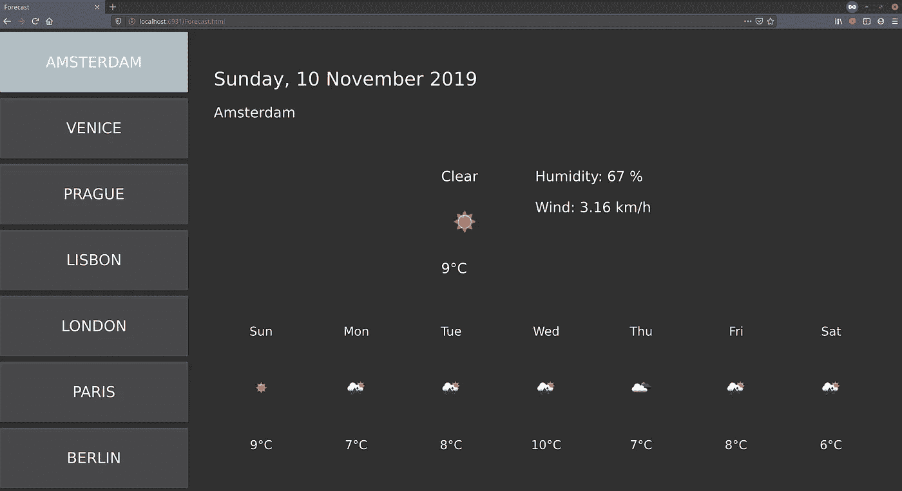
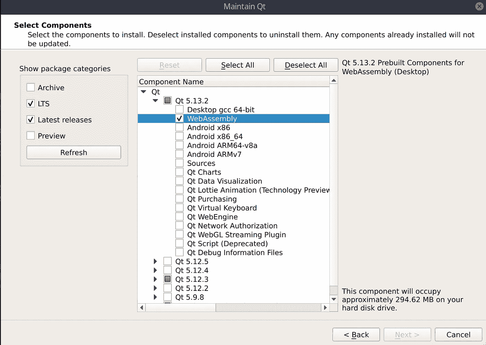
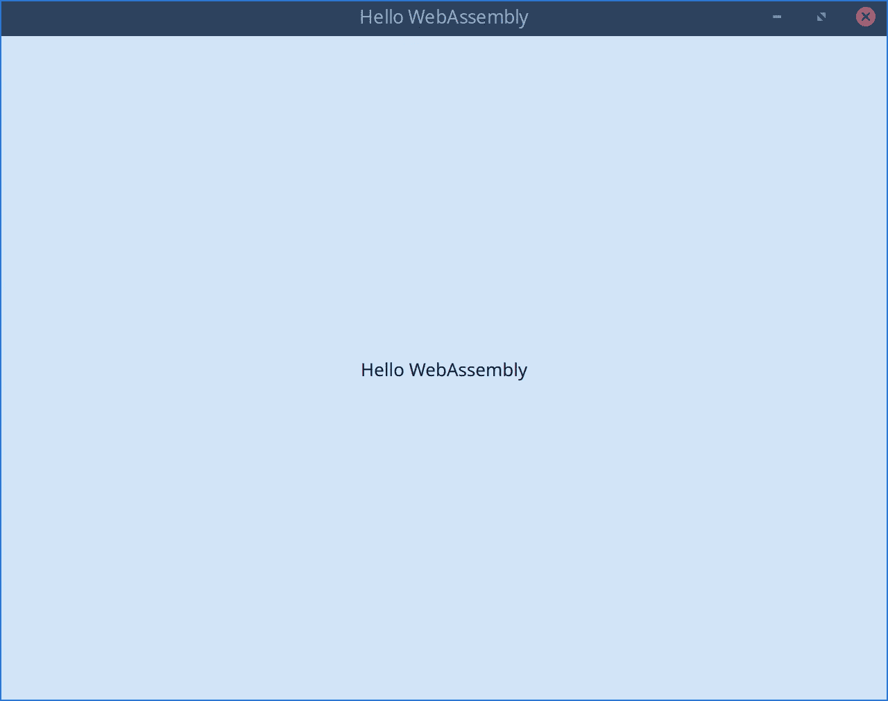
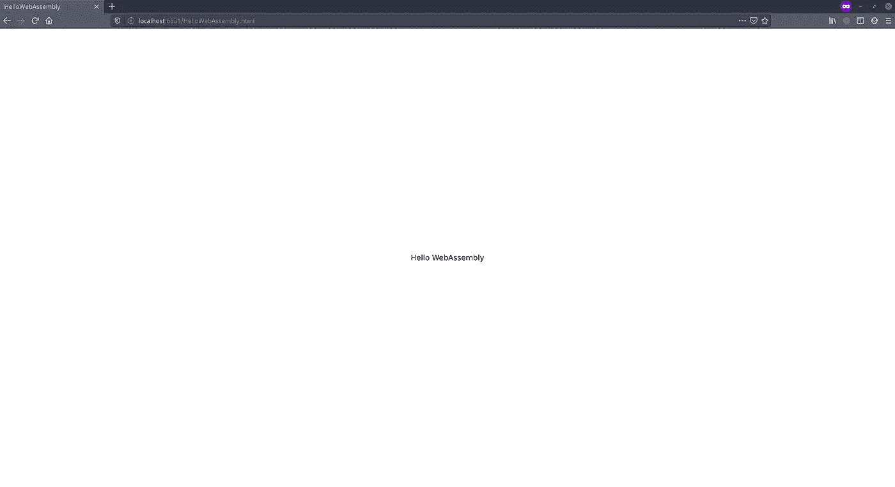
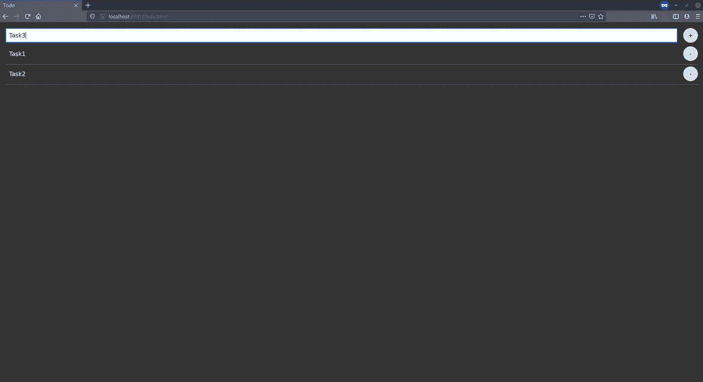

# 使用 QML 和 Qt 为 WebAssembly 开发 Web 应用

> 原文：<https://itnext.io/developing-web-apps-using-qml-and-qt-for-webassembly-aa84453f2f61?source=collection_archive---------0----------------------->



作为 HTML 应用程序运行的 QML 应用程序

这看起来很有趣，对吧？

在[的第 1 部分](https://medium.com/@petar.koretic/why-you-should-use-qt-qml-for-you-next-cross-platform-application-part-1-desktop-5e6d8856b7b4)中的[为什么你应该为你的下一个跨平台应用使用 Qt/QML](https://medium.com/@petar.koretic/why-you-should-use-qt-qml-for-you-next-cross-platform-application-part-1-desktop-5e6d8856b7b4)中，我们提到了用于 WebAssembly 的 [Qt。这是大约 10 个月前。](https://doc.qt.io/qt-5/wasm.html)

在软件开发中，[进展很快](https://github.blog/2019-11-06-the-state-of-the-octoverse-2019/)，WebAssembly 的 [Qt 已经从技术预览版转移到支持平台。](https://doc.qt.io/qt-5/wasm.html)

因此，在这篇文章中，我们将探索使用 [QML](https://doc.qt.io/qt-5/qtqml-index.html) 构建 Web 应用。

> Qt for WebAssembly 是一个[平台插件](https://doc.qt.io/qt-5/qpa.html)，可以让你构建 Qt 应用程序，它可以集成到你的网页中。它不需要任何客户端安装，并减少了服务器端的资源使用。

# web 程序集

> WebAssembly(缩写为 Wasm)是基于堆栈的虚拟机的二进制指令格式。Wasm 被设计为 C/C++/Rust 等高级语言编译的可移植目标，支持客户端和服务器应用程序在 web 上的部署。
> 
> 这种格式几乎和本机代码一样快，现在所有主流 web 浏览器都支持它。

本质上， [WebAssembly](https://webassembly.org/) 允许用不同语言编写的代码在任何嵌入了 [WebAssembly](https://webassembly.org/) 虚拟机的环境中执行。

其中一个环境是网络浏览器，这是它有趣的地方，因为几乎所有其他平台 Qt 都已经支持了。

# 设置

设置可能仍然有点棘手，但一如既往，关于这个主题的官方文件会让你明白。

本质上，我们需要做两件事，为 Webassembly 设置 Emscripten 编译器和 Qt。

## Emscripten

在 linux 上，它大致如下:

```
# fetch Emscripten SDK and install target version
git clone [https://github.com/emscripten-core/emsdk.git](https://github.com/emscripten-core/emsdk.git)
cd emsdk
./emsdk install sdk-1.38.30-64bit
./emsdk activate --embedded sdk-1.38.30-64bit
source emsdk_env.sh
```

有关确切的要求和说明，请查阅[官方文档](https://emscripten.org/docs/getting_started/downloads.html#sdk-download-and-install)。最后，如果一切顺利，至少会有`em++`在你的道路上。

请注意，1.38.30 是推荐的版本，也有多线程支持，所以现在不要尝试其他版本，因为他们会有问题(测试:)

> 源文件 emsdk_env.sh 对于设置有效的 Emscripten 环境很重要，所以不要忘记运行它(每次打开新的终端时)

## Qt WebAssembly

这就更简单了。从 [Qt 下载页面](https://www.qt.io/download)下载 Qt 安装程序，或者打开现有的 [Qt 维护工具](https://doc.qt.io/qt-5/gettingstarted.html#updating-or-removing-qt)如果你已经安装了它。

在这两种情况下，您只需要为 WebAssembly 选择一个 Qt，在我的例子中，我在撰写本文时使用了最新的 Qt，5.13.2。



安装 Qt WebAssembly

安装完成后，我们就可以开始我们的 Hello World 了。

# Hello WebAssembly

那么让我们从一个明显的例子开始。

创建一个包含基本内容的新 Qt/Qml 项目:

```
import QtQuick 2.13
import QtQuick.Window 2.13Window {
    visible: true
    width: 640
    height: 480
    title: qsTr("Hello WebAssembly") Text {
        anchors.centerIn: parent
        text: qsTr("Hello WebAssembly")
        color: "black"
    }
}
```

如果我们在本地平台上构建并运行它，我们会得到:



这里没有多少 WebAssembly

嗯，这正是我们想要的，并按预期工作。

现在，让我们继续真正的 WebAssembly。如果没有，你必须如上所述设置脚本环境:`source /path-to-emsdk/emsdk_env.sh`

转到您的新项目并创建一个`build`目录(或者您想怎么称呼它都可以，以进行一次源代码外的编译——可选)。然后调用 WebAssembly 支持的 new `qmake`:

```
cd /path-to-hello-webassembly-project
mkdir build && cd build
/path-to-qt-with-webassembly/5.13.2/wasm_32/bin/qmake ..
make 
```

这将需要一段时间，尤其是在第一次运行。后续运行将有所改善，但目前在我的 i7–7700 上仍然需要大约 2 分 32 秒。
请注意，`make -j`标志并不十分有用，因为 Emscripten 构建已经并行化。

完成后，你将在你的构建目录中得到一堆文件，其中一个是`projectname.html`文件。为了在浏览器中运行它，我们通常需要一个网络服务器。您可以使用任何您想要的来服务这些静态文件，但是也有一个方便的 [emrun 命令行工具](https://emscripten.org/docs/compiling/Running-html-files-with-emrun.html)可以用于此目的，因为它已经作为 Emscripten 环境的一部分可用。
因此，要在 Firefox 网络浏览器中打开我们的应用程序，可以这样做:`emrun — browser=firefox *.html`



看起来完全一样，但这次是一个在浏览器中运行的 HTML 应用程序

那感觉很好，不是吗？就连标签标题也如我们所料更新为应用标题。
我们已经知道我们可以在多个平台上构建和运行这款应用，但现在无需任何代码更改，我们也可以在网络浏览器中运行它。干净利落。

# “真正的”应用程序

构建一个简单的`Hello WebAssembly`很有趣，但如果能看看它是否能处理一个真正的应用就更好了。为了方便起见，我们可以使用[前几篇文章](https://medium.com/@petar.koretic/why-you-should-use-qt-qml-for-you-next-cross-platform-application-part-1-desktop-5e6d8856b7b4)中介绍的应用程序。

## 待办事项应用程序

在[为什么你应该使用 Qt/QML 进行跨平台开发](https://medium.com/@petar.koretic/why-you-should-use-qt-qml-for-your-next-cross-platform-application-part-2-mobile-todo-app-b4eb08fa8415)系列的[第二部分](https://medium.com/@petar.koretic/why-you-should-use-qt-qml-for-your-next-cross-platform-application-part-2-mobile-todo-app-b4eb08fa8415)中，我们开发了一个小的 Todo 应用。让我们重复构建过程，看看这是否可以作为 Web 应用程序。

```
git clone [https://github.com/pkoretic/Todo](https://github.com/pkoretic/Todo) && cd Todo
mkdir build && cd build
/path-to-qt-with-webassembly/5.13.2/wasm_32/bin/qmake ..
make
emrun --browser=firefox *.html
```



在 QML 开发的 Todo 应用程序作为 HTML 应用程序运行

第一次尝试，它确实工作，看起来几乎完全一样，我们开发它！

注意:我们替换了 unicode plus /- heavy 符号，因为当前字体不支持这些符号:

> 应用程序无法访问系统字体。字体文件必须随应用程序一起分发，例如在 Qt 资源中。Qt for WebAssembly 本身就嵌入了一种这样的字体。

## 预测应用程序

转向更复杂的东西。

在 [part-3](https://medium.com/@petar.koretic/why-you-should-use-qt-qml-for-your-next-cross-platform-application-part-3-tv-forecast-app-91e3901ed64f) 中，我们做了一个电视应用。这个更大，使用图像和网络请求。


在 QML 开发的 Todo 应用程序作为 HTML 应用程序运行

完全没有代码变化的工作，甚至我们的关键导航。我们当时没有实现触摸支持，所以这里不可能有点击，但这将是一个小的增加，因为[按钮](https://doc.qt.io/qt-5/qml-qtquick-controls2-button.html)已经被使用。

# QtCreator

这将需要一篇单独的文章来了解细节，但是添加对 QtCreator 的支持就像[用 Emscripten 编译器创建一个新的工具包](https://doc.qt.io/qtcreator/creator-targets.html)一样简单。

它需要在工具—选项—套件—编译器中添加定制的`emcc` / `em++`编译器，在 Qt 版本中添加新的`qmake`。然后剩下的部分就是使用官方文件中描述的[创建一个工具包，并构建你的应用程序。](https://doc.qt.io/qtcreator/creator-targets.html)

# 结论

尽管它出乎意料的好，但是仍然有一些重要的限制，你可以在[官方平台说明](https://doc.qt.io/qt-5/qtwebassembly-platform-notes.html)中读到。

构建时间也不是最快的，但请记住，这些都是优化的构建`(-O3)`，没有必要在每次更改时都将应用程序编译为 HTML，因为我们可以在默认平台上快速测试它。

在[官方文档](https://doc.qt.io/qt-5/wasm.html)中还有很多例子，最近发布了一个非常好的例子——[基于 Web 的 Qt 设计查看器](https://www.qt.io/blog/web-based-qt-design-viewer)，所以请确保查看这些例子，以便进一步阅读。

最后，我们可以看到这是一个非常好的进步。请记住，Qt 5.13.x 是第一个以 Qt for WebAssmbly 作为支持平台的版本，因此我们可以期待未来会有更好的事情发生。

快乐编码。