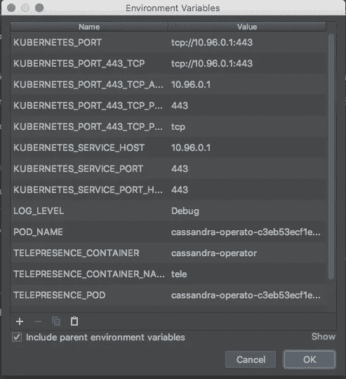
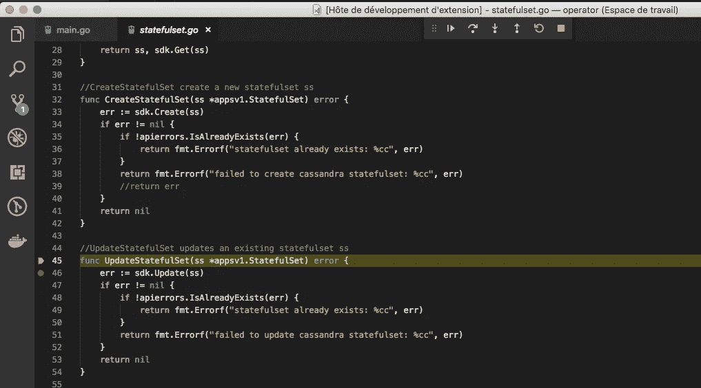

# 使用 Kubernetes 进行开发和调试

> 原文：<https://itnext.io/development-and-debugging-with-kubernetes-296bb60d9549?source=collection_archive---------2----------------------->

我正在使用一台 osx 笔记本电脑，在本文中，我将展示如何快速创建一个开发/测试 kubernetes 集群，以及使用一些有用的工具来使用 Kubernetes 进行工作和调试。

# 创建一个开发 Kubernetes 集群

在这种情况下，我想在我的开发中创建一个真正的 kubernetes 集群，使用最少的内存和快速的启动时间，使用 Docker 中的 Docker 代替传统的本地虚拟机。
我发现 [kubeadm-dind-cluster](https://github.com/kubernetes-sigs/kubeadm-dind-cluster) 就是为此而生

# 安装 Kubeadm-dind-cluster

## 先决条件

我在笔记本电脑上使用 docker-for-mac，用自制软件安装 Unix 软件

```
brew install jq
brew install md5sha1sum
```

我们还需要创建一个`/boot`目录(它在 OSX 上不存在),并使用`preferences->File Sharing`将其绑定挂载到 docker 中

下载引导脚本:

```
wget https://cdn.rawgit.com/kubernetes-sigs/kubeadm-dind-cluster/master/fixed/dind-cluster-v1.11.sh
chmod +x dind-cluster-v1.11.sh
mv dind-cluster-v1.11.sh /usr/local/bin/dind-cluster.sh
```

> **注意**:您可以选择不同的 kubernetes 版本(1.8、1.9、1.10、1.11)

启动集群

```
# start the cluster
$ dind-cluster.sh up
```

> *默认将创建 1 名主工人和 2 名工人*

您可以指定节点的数量

```
NUM_NODES=3 dind-cluster.sh up 
```

您还可以访问不安全的注册表

```
DIND_INSECURE_REGISTRIES='["my-private-registry.com"]' dind-cluster.sh up
```

> *在我的例子中，脚本的输出告诉我连接到 Kubernetes Web UI 的 Url:*[*http://127 . 0 . 0 . 1:32768/API/v1/namespaces/kube-system/services/Kubernetes-dashboard:/proxy/#！/工作量？名称空间=默认*](http://127.0.0.1:32768/api/v1/namespaces/kube-system/services/kubernetes-dashboard:/proxy/#!/workload?namespace=default)

## 拆除集群

当您需要资源做其他事情时，您可以关闭集群

```
dind-cluster.sh down
```

如果您不想以后再次启动集群，那么您需要清除所有资源。

```
dind-cluster.sh clean
```

# 有用的工具

# Kubernetes 的别名

使用 Kubernetes，您将会键入大量的 kubectl 命令，我建议您使用一个简单的别名:

```
alias k=kubectl
```

为了保持 kubectl bash 的完成，您还需要更新 osx 上的`/usr/local/etc/bash_completion.d/kubectl`或 Linux 上的`/etc/bash_completion.d/kubectl`中的完成脚本的结尾

```
if [[ $(type -t compopt) = "builtin" ]]; then
    complete -o default -F __start_kubectl kubectl
    complete -o default -F __start_kubectl k
else
    complete -o default -o nospace -F __start_kubectl kubectl
    complete -o default -o nospace -F __start_kubectl k
fi
```

# 切换 Kubernetes 上下文和名称空间

Kubectl 可以通过它的配置文件`.kube/config`管理几个 Kubernetes 集群，但是在它们之间切换或者改变名称空间并不容易。有一些非常有用的工具会让你在 Kubernetes 上的工作变得更容易。

[Kubectx / Kubens](https://github.com/ahmetb/kubectx) 将安装两个工具:`kctx`和`kns`，这将允许你轻松地改变 kubernetes 的上下文和名称空间。

```
brew install kubectx --with-short-names
```

现在可以快速查看和更改 kubernetes 上下文:

```
$ kctx dind
Switched to context "dind".
```

我们还可以轻松地更改 kubernetes 名称空间:

```
$ kubectl create namespace demo
namespace/demo created
$ kns demo
Context "dind" modified.
Active namespace is "demo".
```

# 使用 Helm 部署应用程序

我们将使用[舵](https://www.helm.sh/)来部署应用程序。

```
brew install kubernetes-helm
```

实际上，helm 使用了`tiller`,我们必须使用以下命令在集群上安装它:

```
$ helm init
Tiller (the Helm server-side component) has been installed into your Kubernetes Cluster.
Happy Helming!
```

我们可以使用 helm 在 Kubernetes 上部署应用程序，就像我们使用`apt`或`yum`在 Linux 上部署软件包一样。

我们可以搜索包:

```
$ helm search wordpress
NAME            	CHART VERSION	APP VERSION	DESCRIPTION
stable/wordpress	3.0.0        	4.9.8      	Web publishing platform for building blogs and ...
```

并安装:

```
$ helm install stable/wordpress
...
...
NOTES:
1\. Get the WordPress URL: NOTE: It may take a few minutes for the LoadBalancer IP to be available.
        Watch the status with: 'kubectl get svc --namespace demo -w hazy-hedgehog-wordpress' export SERVICE_IP=$(kubectl get svc --namespace demo hazy-hedgehog-wordpress -o jsonpath='{.status.loadBalancer.ingress[0].ip}')
  echo "WordPress URL: http://$SERVICE_IP/"
  echo "WordPress Admin URL: http://$SERVICE_IP/admin"2\. Login with the following credentials to see your blog echo Username: user
  echo Password: $(kubectl get secret --namespace demo hazy-hedgehog-wordpress -o jsonpath="{.data.wordpress-password}" | base64 --decode)
```

查看当前部署的内容:

```
$ helm list
NAME         	REVISION	UPDATED                 	STATUS  	CHART          	NAMESPACE
hazy-hedgehog	1       	Sun Sep 30 00:24:19 2018	DEPLOYED	wordpress-3.0.0	demo
```

如果不再需要，请删除:

```
$ helm delete hazy-hedgehog
release "hazy-hedgehog" deleted
```

# 在 Kubernetes 中调试应用程序

# 艰难的道路

我以前写过一篇文章[Debug a Go Application in Kubernetes from IDE](/debug-a-go-application-in-kubernetes-from-ide-c45ad26d8785)，它解释了我们如何复制一个管道以在调试模式下编译我们的应用程序，用`dlv` go 调试器创建一个特殊的容器，暴露 dlv 服务端口，并使用 kube forward 命令从我们的本地 IDE 连接到它。

在下一节中，我们将看到更简单的替代方案。

# 使用网真调试应用程序

[网真](https://www.telepresence.io/)用一个双向网络代理来代替在 Kubernetes 集群中运行的普通 pod。这个 pod 将 Kubernetes 环境中的数据(例如，TCP 连接、环境变量、卷)代理到本地进程。本地进程的网络被透明地覆盖，因此 DNS 调用和 TCP 连接通过代理路由到远程 Kubernetes 集群。

这将允许在我们的 IDE 中启动一个本地程序进行调试，该程序将能够像在 Kubernetes 集群中一样进行通信。

> 这在你的计算机和 kubernetes 集群之间使用了一个类似 vpn 的解决方案，因此它可以中断你的其他连接。
> 使用网真时，您的所有流量都被路由到隧道，因此您使用的其他应用程序可能无法正常工作

## 安装在 OSX 上

```
brew cask install osxfuse
brew install socat datawire/blackbird/telepresence
```

## 试验

在这个例子中，我们创建了一个本地 docker 容器，它可以访问由 kubernetes API 挂载(并由 telepresence 检索)的`/var/run/secrets`,该容器能够调用 Kubernetes API

```
telepresence --mount=/tmp/known --docker-run --rm -it -v=/tmp/known/var/run/secrets:/var/run/secrets lachlanevenson/k8s-kubectl version --short
```

我们要求 telepresence 在本地目录`/tmp/known`中挂载远程 pod 文件系统，并将其挂载到我们的 test docker 容器中。

## 用本地 docker 映像交换部署

远程呈现允许**将集群中的 pod 部署与您的本地机器交换**。

这里，我们启动了一个测试 Cassandra 操作符，它是使用 helm 部署的，这在 Kubernetes 集群中创建了一个部署。

```
helm install --name cassandra-operator ./helm/cassandra-operator/
```

我们可以看到它已经创建了`cassandra-operator`部署:

```
$ kubectl get deployments
NAME                 DESIRED   CURRENT   UP-TO-DATE   AVAILABLE   AGE
cassandra-operator   1         1         1            1           4h
```

现在，我们将使用 telepresence 将操作员部署与 Cassandra 操作员的本地 docker 映像进行交换:

```
$ telepresence --swap-deployment cassandra-operator --mount=/tmp/known --docker-run --rm -it -v=/tmp/known/var/run/secrets:/var/run/secrets sebmoule/cassandra-operator:0.1.3-master
INFO[0000] Go Version: go1.10.4
INFO[0000] Go OS/Arch: linux/amd64
INFO[0000] operator-sdk Version: 0.0.5+git
INFO[0000] cassandra-operator Version: 0.1.3
INFO[0000] cassandra-operator LogLevel: debug
INFO[0000] Watching db.orange.com/v1alpha1, CassandraCluster, tele, 10
DEBU[0000] starting cassandraclusters controller
```

*   `--swam-deployment`允许更换部署
*   `--mount=/tmp/known`我们用它来创建`TELEPRESENCE_ROOT`，它将用于与 kubernetes pods 同步卷
*   `--docker-run -v`我们使用 docker 挂载选项在本地容器中创建 TELEPRESENCE_ROOT 卷

> *远程呈现代理示例可以使用另一幅图像。有关* ***网真*** *的更多信息，请查看* [*文档*](https://www.telepresence.io/reference/proxying.html#volumes) *:*
> 
> `*export TELEPRESENCE_REGISTRY=myprivateregistry.com/datawire*`

## 交换部署以使用我们的本地 IDE

现在，我们将在本地机器上设置远程呈现隧道，并从 Cassandra operator 部署中检索 Pod 环境变量，以便稍后可以将它们注入到我们的 IDE 中。

```
telepresence --swap-deployment cassandra-operator --mount=/tmp/known --env-file cassandra-operator.env
```

这将创建类似于以下内容的文件:

```
$ cat cassandra-operator.env
KUBERNETES_PORT=tcp://172.18.0.1:443
KUBERNETES_PORT_443_TCP=tcp://172.18.0.1:443
KUBERNETES_PORT_443_TCP_ADDR=172.18.0.1
KUBERNETES_PORT_443_TCP_PORT=443
KUBERNETES_PORT_443_TCP_PROTO=tcp
KUBERNETES_SERVICE_HOST=172.18.0.1
KUBERNETES_SERVICE_PORT=443
KUBERNETES_SERVICE_PORT_HTTPS=443
LOG_LEVEL=Debug
POD_NAME=operator-cassandr-7313751b30734a338851b579db9c2608-67bb84dhb6gg
TELEPRESENCE_CONTAINER=cassandra-operator
TELEPRESENCE_CONTAINER_NAMESPACE=cassandra-test
TELEPRESENCE_POD=operator-cassandr-7313751b30734a338851b579db9c2608-67bb84dhb6gg
TELEPRESENCE_ROOT=/tmp/known
WATCH_NAMESPACE=cassandra-test
```

现在我们可以在 IDE 调试器中导入这些环境变量了



我们在本地文件系统上做了一点小小的改动，以便操作员可以找到目标文件:

```
sudo mkdir -p /var/run/secrets/kubernetes.io/
sudo ln -s /tmp/known/var/run/secrets/kubernetes.io/serviceaccount /var/run/secrets/kubernetes.io/serviceaccount
```

> 然后，您可以单击 IDE 上的 debug 按钮，操作员将启动并像在 Kubernetes 集群中一样工作，您可以正常地调试它。

# 用于调试的 KubeSquash

> [*KubeSquash*](https://github.com/solo-io/kubesquash)*是一个简单的命令行工具。他们将其用户界面设计得非常简单:用一个命令“kubesquash”调用，定位所需的 pod，调试会话自动启动，无需配置或部署。*

从[这里](https://github.com/solo-io/kubesquash/releases)下载 KubeSquash

## 它是如何工作的

当启动 kubesquash 时，它将在 Kubernetes 集群中创建一个名称空间`squash`,并创建一个 Pod，该 Pod 将与 Go 调试器一起部署，并且能够连接到您想要调试的 Pod。

> *出于调试目的，wa 可以要求 kubesquash 保留它在集群中安装的临时 pod*
> 
> `*kubesquash -no-clean kubectl -nsquash describe pod kubectl -nsquash logs -l squash=kubesquash-container*`

## 在命令行中使用它

如果您在无法访问互联网的私人 kubernetes 上使用 kubesquash，您可以首先下载 kubesquash 图像:`soloio/kubesquash-container-dlv:v0.1.6`并将其推送到您的私人注册表，然后要求 kubesquash 使用您的图像:

```
$ kubesquash --container-repo my-private-registry
? Select a namespace  [Use arrows to move, type to filter]
❯ default
```

Kubesquash 现在要求您选择想要调试的目标名称空间，然后要求您选择目标 Pod，并选择`dlv`调试器。

```
kubesquash --container-repo registry.gitlab.si.francetelecom.fr/dfyarchicloud/dfyarchicloud-registry
? Select a namespace cassandra-demo
? Select a pod operator-cassandra-operator-88fd9bb9c-jwqvl
? Going to attach dlv to pod operator-cassandra-operator-88fd9bb9c-jwqvl. continue? YesIf you don't see a command prompt, try pressing enter.(dlv)
```

> 现在，您有了一个直接连接到目标 pod 的调试器

警告:

> 为了让 kubesquash 在其他 pod 进程上创建具有调试功能的 pod，您需要在集群上拥有特权访问权限。

## 在您的 IDE 中使用它

在撰写本文时，Kubesquash 只支持 VsCode 作为 IDE，它提供了一个 VsCode 扩展。

因为我的私有 kubernetes 集群不能访问互联网，所以我需要请求 kubesquash 为 docker 映像获取我的私有注册表。
这在扩展中目前是不可配置的，我不得不直接修改扩展代码`extension.js l 179`中的行:

```
let stdout = await exec(`kubesquash --container-repo myprivate-registry -machine -debug-server -pod ${selectedPod.metadata.name} -namespace ${selectedPod.metadata.namespace}`);
```

为了让我的 IDE 能够正确地设置断点，我还需要将 remotePath 改为在`extension.js l 202`中使用:

```
remotePath: "/go/src/path/to/my/app",
```

这样，我只需要在 VsCode 命令行中启动扩展:

```
KubeSquash - debug pod
```

它会询问您要连接的 pod。
然后，我将开始下载 kubernetes 节点上的名称空间 squash 中的 kubesquash docker 映像，这是您的目标 pod，我将在您的目标 pod 上附加 dlv 调试器。

它还在本地配置您的 VsCode，使其自动附加到集群中的 dlv，然后您就可以在 IDE 中使用本地断点开始调试您的应用程序了。



这是一个非常棒的工具！！

# 其他工具

还有很多其他工具我还没有测试过，你可以在这里找到一些:

[https://kubernetes . io/blog/2018/05/01/developing-on-kubernetes/](https://kubernetes.io/blog/2018/05/01/developing-on-kubernetes/)