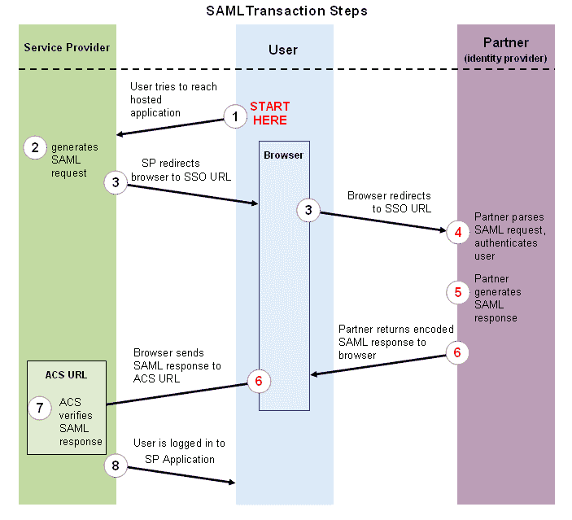
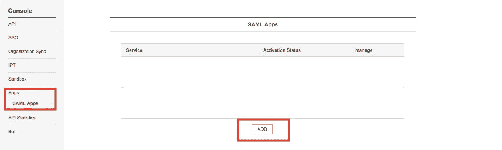
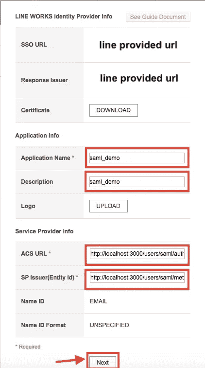
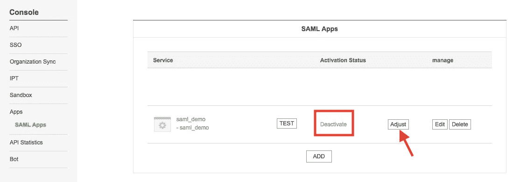
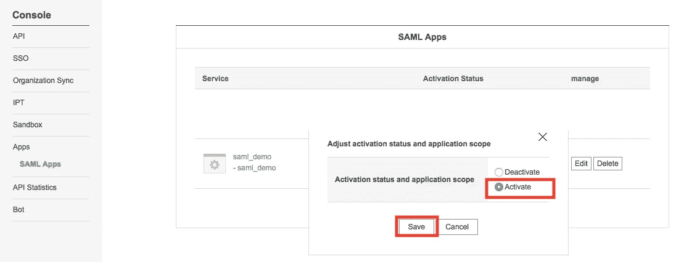
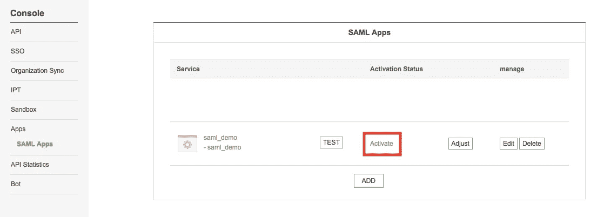
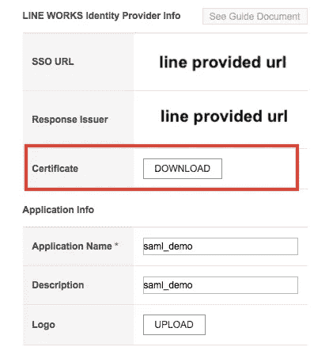

# 用 Ruby On Rails 设计和 SAML 认证(Line Works)

> 原文：<https://itnext.io/devise-and-saml-authentication-with-ruby-on-rails-line-works-e04b5174be1d?source=collection_archive---------1----------------------->

## 认证和授权(生产线工程)


# **什么是 SAML？**

安全声明标记语言(SAML)是一个基于 XML 的框架，用于在两个实体(服务提供商和身份提供商)之间进行身份验证和授权。服务提供商同意信任身份提供商来认证用户。作为回报，身份提供者生成一个身份验证声明，表明用户已经过身份验证。

SAML 是一种标准的单点登录(SSO)格式。认证信息通过数字签名的 XML 文档进行交换。这是一个复杂的单点登录(SSO)实现，支持无缝认证，主要是在企业和企业之间。
有了 SAML，你不必担心输入认证凭证或者记住并重置密码。

# **SAML 认证有什么好处？**

SAML 身份验证有以下好处:

> ***标准化:*** *SAML 是一种标准格式，允许系统之间的无缝互操作，独立于实现。它消除了与供应商和平台特定的架构和实现相关的常见问题。*
> 
> ***改善用户体验:*** *用户只需登录一次即可访问多个服务提供商，无需额外的身份验证，从而在每个服务提供商处获得更快、更好的体验。这消除了密码问题，如重置和恢复。*
> 
> ***增加安全性:*** *安全性是软件开发的一个关键方面，对于企业应用来说，更是极其重要。SAML 提供单点身份验证，这发生在安全的身份提供者处。然后，SAML 将身份传递给服务提供商。这种形式的身份验证确保凭证不会离开防火墙边界。*
> 
> ***目录的松耦合:*** *SAML 不需要维护用户信息，也不需要目录间的同步。*
> 
> ***降低服务提供商的成本:*** *使用 SAML，您不必跨多个服务维护帐户信息。身份提供者承担这一负担。*

# **为什么组织使用 SAML？**

随着各种组织将其基础设施、服务和数据迁移到云中，SAML 提供了一种安全的方法，用于在不断扩大的平台、数字接触点和设备范围内对用户进行身份验证和授权。SAML 通过使消费者更容易访问 Web 应用程序，实现了更健壮的连接系统。

SAML 通过启用基于令牌的身份验证交换消除了对多个 Web 应用程序密码的需求，这种身份验证交换发生在 IdP 防火墙内部的 IdP(持有用户凭据)和 SP(服务提供商)之间。在“SP 启动的”SAML 事务中，当用户请求访问某个应用程序时，SP 会自动将他们重定向到 IdP，在 IdP 中对用户进行身份验证，而不会将个人信息传递给 SP 的系统。

SAML 通过启用单点登录(SSO)功能解决了一个关键挑战:允许用户注册或登录，并在一段时间内使用一组凭据获得跨多个属性的授权。SAML 还支持单点注销功能，确保当用户从一个站点注销时，他们会自动从该公司拥有的所有其他服务提供商处注销。

# 【SAML 认证是如何工作的？

SAML SSO 的工作方式是将用户的身份从一个地方(身份提供者)转移到另一个地方(服务提供者)。这是通过交换数字签名的 XML 文档来完成的。

假设:一个用户登录到一个充当身份提供者的系统。用户希望登录到一个远程应用程序，如智能流应用程序(服务提供商)。会发生以下情况:

> *-用户访问智能流程应用(*[*【https://smartflow.vebuin.com】*](https://smartflow.vebuin.com/)*)。*
> 
> *-应用程序识别用户的来源(通过应用程序子域、用户 IP 地址或类似信息)，并将用户重定向回身份提供商，要求进行身份验证。这是认证请求。*
> 
> *-用户与身份提供者之间存在活动的浏览器会话，或者通过登录身份提供者建立一个会话。*
> 
> *-身份提供者以包含用户用户名或电子邮件地址的 XML 文档的形式构建认证响应。*
> 
> *-已经知道身份提供者并具有证书指纹的服务提供者检索认证响应，并使用证书指纹对其进行验证。*
> 
> *-建立用户的身份，并向用户提供应用程序访问。*

# **SAML 单点登录流程**



# **SAML vs OAuth**

OAuth 是比 SAML 更新的标准，由 Google 和 Twitter 于 2006 年联合开发。开发它的部分原因是为了弥补 SAML 在移动平台上的不足，它基于 JSON 而不是 XML。

除了 SAML 不太出色的移动支持，两者有什么区别？正如我们所见，SAML 标准定义了提供者如何提供认证和授权服务。另一方面，OAuth 只处理授权。

# **你需要什么？**

要在 Rails 应用程序中启用 SAML 功能，您需要一个身份提供者。目前我有 Line works 和 okta。这是线条作品的例子。如果你没有 Line Works 帐户，那么你也可以在 Okta 使用。

[](https://www.okta.com/) [## Okta |永远在线

### 看起来你关闭了 Javascript！请启用它以改善您的浏览体验。对…的深入研究

www.okta.com](https://www.okta.com/) 

`http://blog.cloud66.com/adding-sso-to-your-rails-application-with-saml/`

我假设你熟悉设计宝石，也在你的应用程序实现。如果你还没有实现，那么请通过下面的链接。

`https://qiita.com/alokrawat050/items/5267e6ab0e274ad1188a`

`https://medium.com/@alokrawat050/devise-gem-tutorial-authenticate-a-user-by-user-id-and-email-ruby-on-rails-e25ae60ca437`

# **让我们开始 SAML 配置**

首先，我们将使用 SAML 设计作品。

**1。**将设计相同的认证宝石添加到您的 gem 文件中

```
gem 'devise_saml_authenticatable'
```

`refer https://github.com/apokalipto/devise_saml_authenticatable`

**2。**添加:saml_authenticatable 到您的用户模型 user.rb(此处模型名为 user.rb):

```
class User < ApplicationRecord
  devise :saml_authenticatable, :database_authenticatable, :registerable,
         :recoverable, :rememberable, :trackable, :validatable, :authentication_keys => [:login]

  attr_accessor :login

  def login=(login)
    @login = login
  end

  def login
    @login || self.user_id || self.email
  end

  def self.find_for_database_authentication(warden_conditions)
    conditions = warden_conditions.dup
    if login = conditions.delete(:login)
      where(conditions.to_h).where(["user_id = :value OR email = :value", { :value => login.downcase }]).first
    else
      where(conditions.to_h).first
    end
  end

  def send_devise_notification(notification, *args)
    devise_mailer.send(notification, self, *args).deliver_later
  end
end
```

这里我用的是 attr_accessor :login，为什么？
因为用户可以通过用户名和电子邮件登录。但是如果你不需要，请忽略。您不需要在应用程序中设置。

**3。**将以下内容添加到您的 config/initializer/device . Rb 文件中:

```
Devise.setup do |config|
……
……

Devise.setup do |config|  
      config.saml_create_user = false
      config.saml_update_user = true
      config.saml_default_user_key = :email
      config.saml_session_index_key = :session_index
      config.saml_use_subject = true
      config.idp_settings_adapter = nil
      config.saml_configure do |settings|
        settings.assertion_consumer_service_url     = "<your url>/users/saml/auth"
      settings.protocol_binding = "urn:oasis:names:tc:SAML:2.0:bindings:HTTP-POST"
      settings.name_identifier_format             = "urn:oasis:names:tc:SAML:2.0:nameid-format:transient"
      settings.issuer                             = "<your url>/users/saml/metadata"
      settings.authn_context                      = "urn:oasis:names:tc:SAML:2.0:ac:classes:PasswordProtectedTransport"
      settings.idp_slo_target_url                 = ""

      #line configuration
      settings.idp_sso_target_url                 = "<your SSO auth url>"
      settings.idp_cert_fingerprint               = '<your fingerprint of the certificate>'
      settings.idp_cert_fingerprint_algorithm     = 'http://www.w3.org/2000/09/xmldsig#sha256'
      end
    end
end
```

在这里，您需要更改以下设置:

`<your url>: http://localhost:3000`#对于开发来说是一个本地主机，但是你可以根据你的开发环境来设置

`<your SSO auth url>`:#检查第 4.2 步

`<your fingerprint of the certificate>`如何生成指纹，查看第 8 步。

在你的 **routes.rb** 文件中，

```
Rails.application.routes.draw do
  root 'home#index'  
  devise_for :users, skip: :saml_authenticatable, controllers: {
    registrations: "user/registrations",
    sessions: "user/sessions",
    passwords: "user/passwords"
  }

  # opt-in saml_authenticatable
  devise_scope :user do
    scope "users", controller: 'saml_sessions' do
      get :new, path: "saml/sign_in", as: :new_user_sso_session
      post :create, path: "saml/auth", as: :user_sso_session
      get :destroy, path: "sign_out", as: :destroy_user_sso_session
      get :metadata, path: "saml/metadata", as: :metadata_user_sso_session
      match :idp_sign_out, path: "saml/idp_sign_out", via: [:get, :post]
    end
  end
end
```

**4。**你应该在 Line Works 有个账户。点击开发者控制台上的
[https://developers.worksmobile.com/](https://developers.worksmobile.com/)
。下面是设置指南。

**4.1。**在 Line Works 开发者控制台成功登录后，进入 Apps/SAML Apps。



**4.2。**现在创建您的应用程序，点击“添加”按钮，设置以下字段，然后点击“下一步”按钮。

**在申请信息部分，**

```
・Application Name: 
・Description:
```

**在服务提供商信息部分，**

```
・ACS URL: http://localhost:3000/users/saml/auth
・SP issuer(Entity Id): http://localhost:3000/users/saml/metadata
```



**4.3。现在激活您的应用程序。点击调整按钮，然后选择激活。**

*   1



*   2



*   3



**5。**如果你在 ex，[的开发环境下运行你的 app，http://localhost:3000(这里](http://localhost/:3000(here)我用 3000 作为默认的 Rails 端口，根据你的设置进行调整)。
对于生产，请确保您使用 https，并在您的应用程序和服务器上设置它。

**6。**复制您的 SSO URL(身份提供者单点登录 URL)并将其值作为 _**IDP _ SSO _ target _ URL**_ 粘贴到**device . Rb**中。

**7。**现在点击下载证书按钮，保存证书文件。



**8。**运行以下命令获取证书的指纹:

```
openssl x509 -text -noout -in ~/Downloads/<your file name> -fingerprint -sha256
```

`This assumes that you saved the certificate in ~/Downloads/<your file name>`复制输出的最后一行，

SHA256 指纹=。复制该值并粘贴到 devise.rb 文件的 idp_cert_fingerprint 中。

看起来是这样的:

`59:10:LO:D0:9L:31:PO:AM:59:10:LO:D0:9L:31:PO:AM:59:10:LO:D0:9L:31:PO:AM:59:10:LO:D0:9L:31:PO:AM`

**9。**在您的 apps 配置目录中，创建一个名为 attribute-map.yml 的文件，并将以下内容放入其中:

```
"urn:mace:dir:attribute-def:uid": “login”
"urn:mace:dir:attribute-def:email": "email"
```

这告诉 Devise SAML 从 Id Provider 返回的属性映射到用户模型的哪个属性。

**10** 。现在你已经准备好测试，使用**/用户/saml/sign_in** ，这将重定向到 Line Works 登录页面，然后在认证后返回到你的应用程序。

就是这样！👏👏👏👏

感谢您抽出宝贵的时间阅读。

享受编码。

**谢谢&最诚挚的问候
Alok Rawat**

*原载于*[*qiita.com*](https://qiita.com/alokrawat050/items/98a40c414d06a6e679ca)*。*