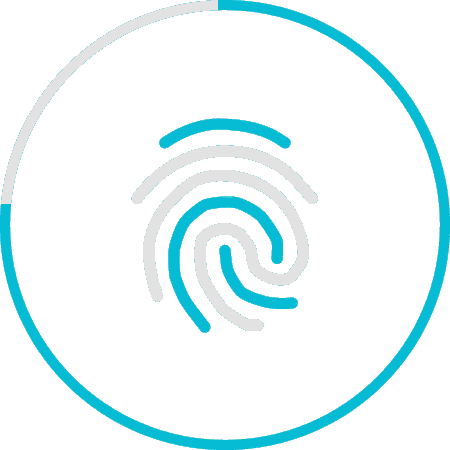

# 设计 Gem 教程，通过用户 id 和电子邮件认证用户(Ruby On Rails)

> 原文：<https://itnext.io/devise-gem-tutorial-authenticate-a-user-by-user-id-and-email-ruby-on-rails-e25ae60ca437?source=collection_archive---------1----------------------->



用户认证

[*点击这里在 LinkedIn* 上分享这篇文章](https://www.linkedin.com/cws/share?url=https%3A%2F%2Fitnext.io%2Fdevise-gem-tutorial-authenticate-a-user-by-user-id-and-email-ruby-on-rails-e25ae60ca437)

用户管理和认证设计

以下链接是设计宝石的详情:【https://github.com/plataformatec/devise】T5

本教程的主要目的是实现 devise gem 并通过用户 id 和电子邮件验证用户。
来实现吧。

**第一步。在宝石文件中添加设计宝石**

```
gem 'devise', '3.4.1'
```

**第二步。安装宝石**

```
bundle install
```

**第三步。模型和视图设置**

```
$ rails generate devise:install
$ rails generate devise MODEL
$ rails generate devise:views
```

(如果您想更改视图的布局)

**第四步。运行迁移**

```
rake db:migrate
```

**第五步。配置/环境/开发. rb:**

```
config.action_mailer.default_url_options = { host: 'localhost', port: 3000 }
```

**第六步。/config/application.rb 中的其他配置设置**

```
config.action_mailer.delivery_method = :smtp
    ActionMailer::Base.smtp_settings = {
    address: "smtp.gmail.com",
    enable_starttls_auto: true,
    port: 587,
    authentication: :plain,
    user_name: ENV["MAIL_USERNAME"],
    password: ENV["MAIL_PASSWORD"],
    openssl_verify_mode: 'none'
    }
```

**关于环境设置请查看此** [**条**](http://qiita.com/alokrawat050/items/0d7791b3915579f95791) **。**

**步骤 7。设置，用户通过电子邮件或 user_id**
登录到您的/model/user.rb 中

```
devise :database_authenticatable, :registerable,:confirmable, :lockable, :timeoutable,:recoverable, :rememberable, :trackable, :validatable, :authentication_keys => [:login]here we are using :authentication_keys => [:login], to authenticate user’s login.
```

并在/model/user.rb. '#虚拟属性中添加以下代码，用于通过 user_id 或 email 进行身份验证

#这是对“user_id”等真实持久化字段的补充

```
attr_accessor :login

  def login=(login)
    @login = login
  end

  def login
    @login || self.user_id || self.email
  end

  def self.find_for_database_authentication(warden_conditions)
    conditions = warden_conditions.dup
    if login = conditions.delete(:login)
      where(conditions.to_h).where(["user_id = :value OR email = :value", { :value => login.downcase }]).first
    else
      where(conditions.to_h).first
    end
  end

def send_devise_notification(notification, *args)
    devise_mailer.send(notification, self, *args).deliver_later
  end
```

**第八步。在/config/initializer/device . Rb 文件**
中添加下面一行，行号 33→config . authentic ation _ keys =[:log in]

**步骤九。/views/device/sessions/new . html . erb 中视图**
的更改

替换以下代码:

```
<%= f.label :email %>
<%= f.email_field :email, autofocus: true %>
↓
<%= f.label :login %>
<%= f.text_field :login, autofocus: true, class: 'form-control'  %>
```

在/views/device/registrations/new . html . erb 中

```
<%= f.label :user_id %>
<%= f.text_field :user_id, class: 'form-control' %>
```

然后运行您的应用程序。如果您有疑问，请随时询问。

享受编码。

**感谢&最诚挚的问候
Alok Rawat**

【qiita.com】最初发表于[](https://qiita.com/alokrawat050/items/5267e6ab0e274ad1188a)**。**