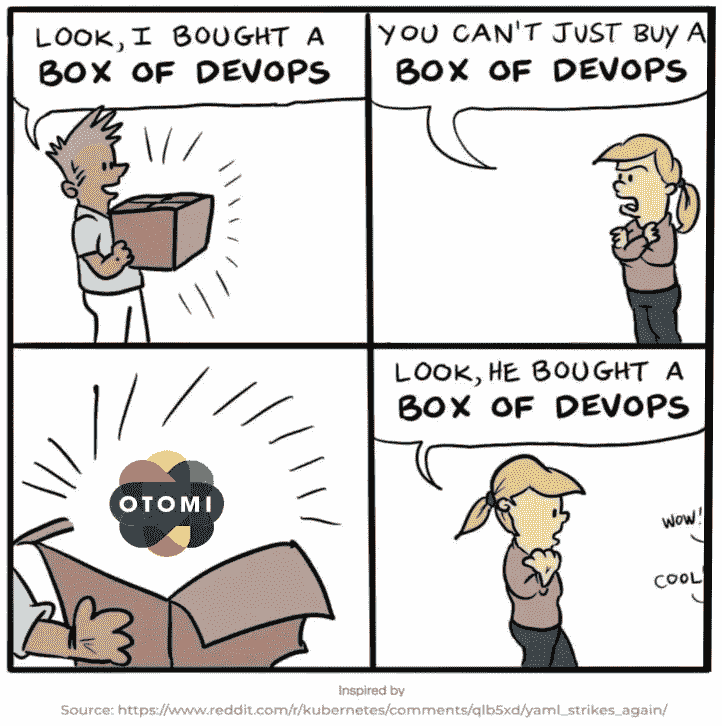
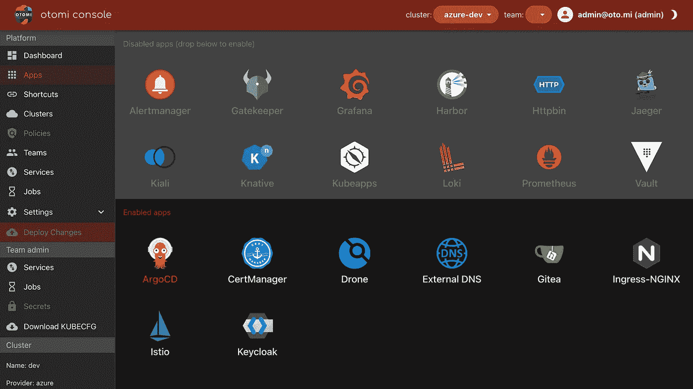
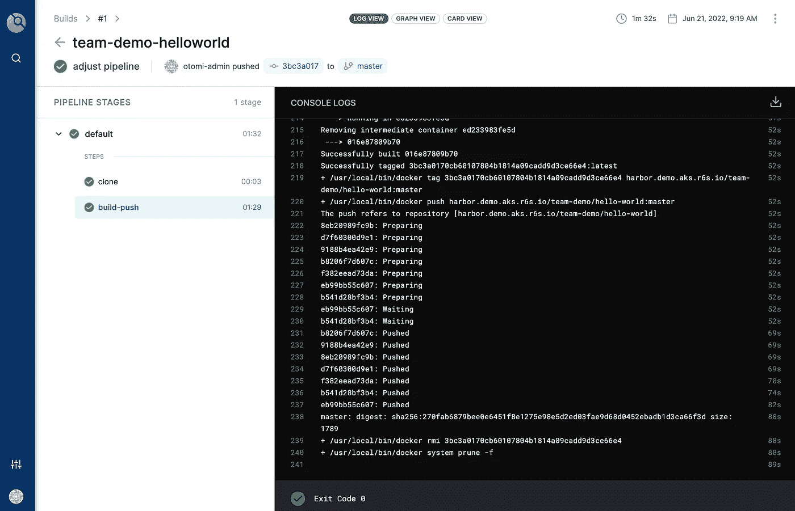
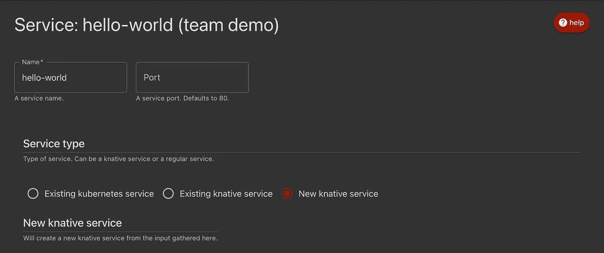
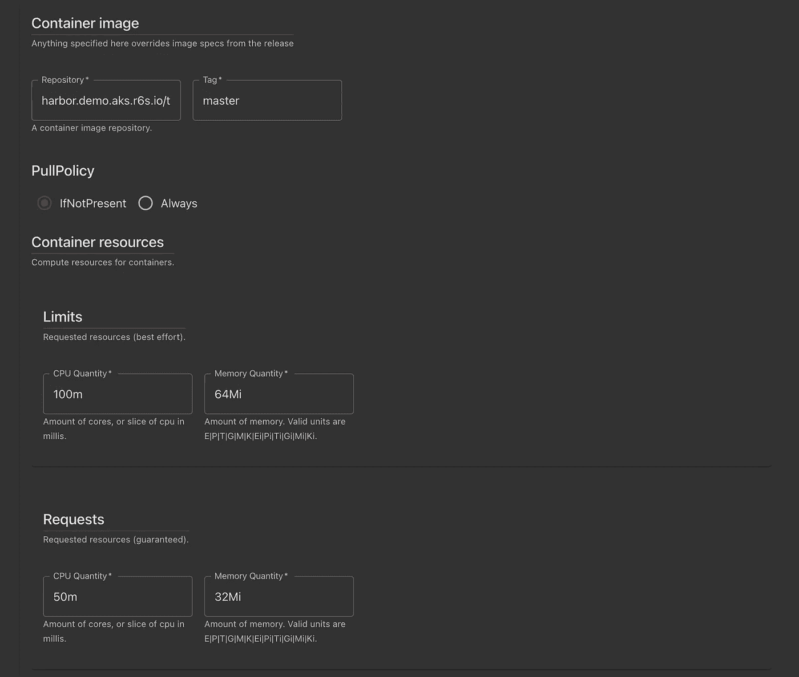
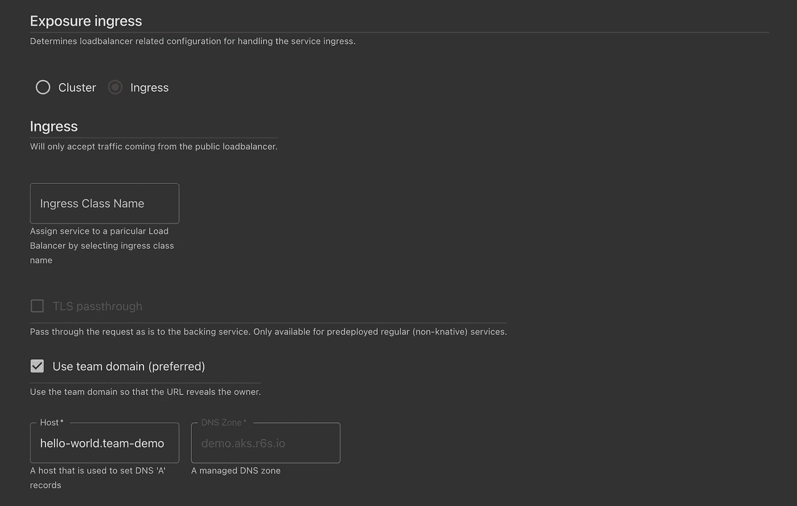
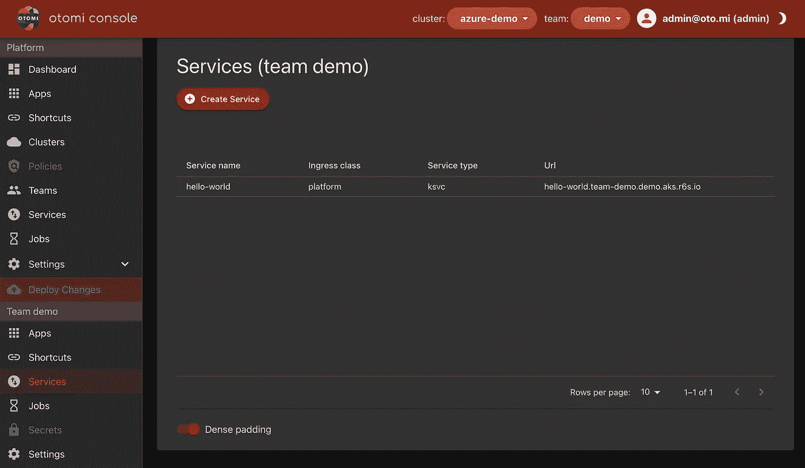
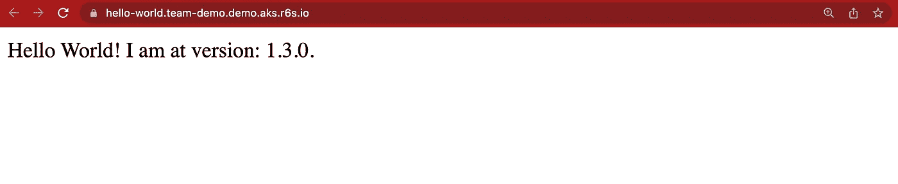
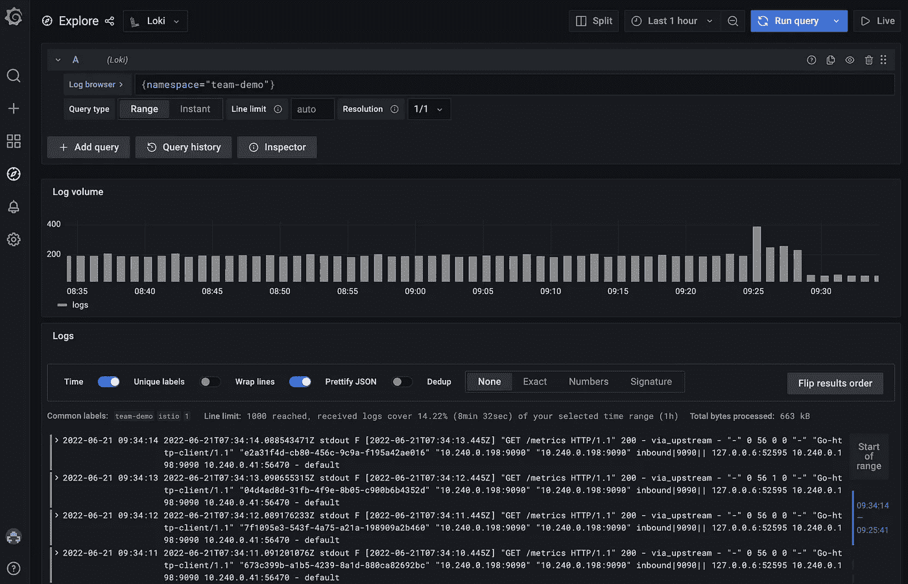
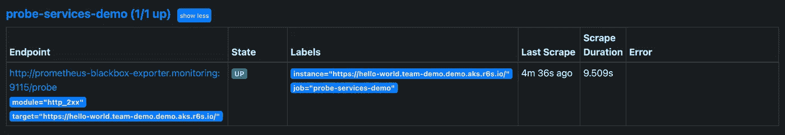

# DevOps 和 Kubernetes。你建造它，你经营它。

> 原文：<https://itnext.io/devops-on-kubernetes-you-build-it-you-run-it-81a98db00e51?source=collection_archive---------1----------------------->



用一个平台在 Kubernetes 上编码、构建、部署、操作和监控容器化的应用。

> 使用 Kubernetes 时，准备好所有工具来支持您的 DevOps 之旅是一项挑战。如果有一个单一的 Kubernetes 安装来支持团队从头到尾实践 DevOps 会怎么样？

在本文中，我将向您展示如何使用 Kubernetes 和 Otomi 开始练习 DevOps，并且没有任何依赖性。从将您的代码推送到 Git repo，构建映像，将映像推送到私有注册表，部署映像，以安全的方式公开应用程序，以及监控应用程序。我们只会使用集成到 Otomi 的技术。所以自我托管，没有使用任何其他(SaaS)服务。唯一的要求是启动并运行 Kubernetes 集群，并访问 DNS 区域。

Otomi 为 Kubernetes 提供了一个完整的自托管 DevOps 平台作为服务，可以一次性安装。对于本文，我将在 Azure Kubernetes 服务(AKS)上安装 Otomi 和 DNS。使用 DNS 和 Let ' s Encrypt production certificates 是将 Harbor 用作映像注册中心的先决条件。

没有 DNS 也可以安装 Otomi。在这种情况下，Otomi 将使用 nip.io 作为主机名，并生成一个自定义 CA。开始使用 Otomi 最简单的方法是从[数字海洋市场](https://marketplace.digitalocean.com/apps/otomi?refcode=476bfcac9ec9&action=deploy)安装它。但是如前所述，在这种情况下，您不能使用 Harbor(或者您需要手动将生成的 CA 添加到集群节点中)。

## 安装 Otomi

安装 otomi 的说明见 [otomi.io](https://otomi.io) 。我正在使用舵图安装 Otomi:

```
helm repo add otomi https://otomi.io/otomi-core
helm repo update
helm install -f values.yaml otomi otomi/otomi
```

这些是我的价值观:

```
cluster:
  k8sVersion: "1.22"
  name: demo
  provider: azure
  domainSuffix: demo.aks.r6s.io # required for DNS
otomi:
  hasExternalDNS: true # required for DNS
dns:
  provider:
    azure:
      resourceGroup: external-dns
      aadClientId: xx
      aadClientSecret: xx
      tenantId: xx
      subscriptionId: xx
apps:
  cert-manager:
    issuer: letsencrypt
    stage: production
    email: [sre@r6s.io](mailto:sre@r6s.io)
  external-dns:
    domainFilters:
      - aks.r6s.io
```

当安装程序工作完成后，按照[这里](https://otomi.io/docs/installation/activation/)描述的激活步骤进行操作。

## 在 Otomi 中激活应用程序

安装 Otomi 后，只有核心应用程序(Keycloak、Istio、cert-manager、Drone 和 Gitea)可用。所有其他应用程序都是可选的。这使得 Otomi 成为一个可组合的平台。让我们首先激活我们将要使用的所有技术:通过将以下应用拖到活动应用平面来激活它们:

*   **Harbor** 作为存储我们图像的私有图像注册表)
*   **Knative** 用于无服务器容器的快速部署和自动伸缩



通过将应用程序拖到“已启用的应用程序”部分来激活它们

现在单击“部署更改”。

其次，我们将在 Otomi 创建一个团队。Otomi 中的团队是 Kubernetes 中的一个名称空间，但也向团队成员提供了自助任务的委托。我们不会在这里深入讨论这个问题，但是请记住，您总是需要至少一个团队来部署应用程序。

现在，应用程序已被激活，团队也已创建，平台上的一切都已准备好构建、部署和运行容器化的应用程序。所以让我们先开始创建一个代码库。

## 在 Gitea 中创建 Git 存储库

转到 Gitea 并创建一个新的存储库。提供回购的名称，并确保回购是私有的。

*   打开 Gitea
*   在右侧的“存储库”下，单击+
*   提供一个名称(团队-演示-helloworld)
*   单击使存储库私有
*   单击创建存储库

对于本文，我将使用一个示例 NodeJS hello-world 应用程序。

复制示例报告:

```
git clone [https://github.com/redkubes/nodejs-helloworld.git](https://github.com/redkubes/nodejs-helloworld.git)
cd cd nodejs-helloworld
```

并将示例 repo 镜像到新的 Gitea repo:

```
git push --mirror [https://gitea.demo.aks.r6s.io/otomi-admin/team-demo-helloworld.git](https://gitea.demo.aks.r6s.io/otomi-admin/team-demo-helloworld.git)
```

克隆新的回购:

```
git clone [https://gitea.demo.aks.r6s.io/otomi-admin/team-demo-helloworld.git](https://gitea.demo.aks.r6s.io/otomi-admin/team-demo-helloworld.git)
```

## 在 Harbor 创建一个机器人帐户

因为我们将从代码中构建一个映像，然后将它推送到一个私有的注册中心，所以我们首先需要创建将映像推送到注册中心的凭证。

前往 Harbor，为团队演示创建一个新的机器人帐户:

1.  点击机器人账户
2.  单击新建机器人帐户
3.  名称:团队演示无人机
4.  选择团队-演示
5.  复制名称和令牌

## 在无人机中配置管道

Drone CI 是 Otomi 自己用的，但是也可以用于自己的项目。打开无人机，进入无人机仪表盘，点击“同步”。您将在存储库列表中看到您的新回购弹出。点击新的回购协议，然后点击“激活”。

现在，我们需要将机器人帐户的凭证作为机密添加到 Drone:

1.  在 Drone 中，单击 team-demo-app 存储库。
2.  在“设置”下，单击“机密”
3.  添加以下两个秘密:

```
REGISTRY_USERNAME = otomi-team-demo-droneREGISTRY_PASSWORD = <the-token-of-the-robot-account>
```

现在，我们将把无人机管道定义添加到我们的回购协议中。

*   将. drone.yml 内容替换为以下内容:

```
kind: pipeline
type: kubernetes
name: default
steps:
  - name: build-push
    image: plugins/docker
    settings:
      registry: harbor.<your-ip>.nip.io
      repo: harbor.<your-ip>.nip.io/team-demo/nginx
      insecure: true
      username:
        from_secret: REGISTRY_USERNAME
      password:
        from_secret: REGISTRY_PASSWORD
      tags:
        - ${DRONE_BRANCH}
```

*   调整. drone.yml 文件中的注册表和 repo 名称
*   推动变革:

```
git add .
git commit -m “add drone pipeline”
git push
```

在无人机中，你会看到管道已经自动开始建设，然后推动新的图像到港口。



无人机流水线执行

在 Harbor 中，您会看到新创建的注册表:


港口图像登记处

可选地，您现在也可以使用 Trivy 扫描图像的漏洞。

## 在 Kubernetes 上部署和展示应用程序

现在映像已经构建好了，我们可以部署它了。Otomi 提供了多种部署选项。您可以:

*   创建您自己的部署和服务清单，并使用 Argo CD 进行部署
*   创建一个舵图，并将其添加到 Harbor 的海图库中
*   使用 Otomi 为您创建一个有价值的服务

在这种情况下，我将使用 Otomi 为自己创建一个新的 Knative 服务。

请注意，当我们在 Otomi 中创建一个团队时，已经为注册表创建了一个 pull secret，并将其添加到团队名称空间中。

*   在 web 控制台的顶部栏中选择演示团队
*   在左侧菜单(在团队演示下)中，单击服务
*   点击新服务
*   填写服务的名称(hello-world)
*   在服务类型下选择新的服务



新创意服务

*   填写存储库名称和标签
*   填写限额和要求



回购和资源请求和限制

*   在暴露入口下，选择入口



配置入口

*   单击提交

在服务列表中，您会看到新创建的服务和 URL。



创建的服务

点击网址。这是你应该看到的:



应用程序已部署并公开展示。在这种情况下，Otomi 不仅创建了 Knative 服务，还生成了所有的入口配置(包括 Istio ),并确保将主机名添加到 DNS 区域并创建了证书。简单对吗？

## 监控应用程序

为了能够监控部署的应用程序，我们首先需要激活几个应用程序。转到左侧菜单中平台下的应用部分，将以下应用拖到活动应用平面:

*   **普罗米修斯**
*   **洛基**(也会自动激活**格拉夫纳**)

现在单击“部署更改”。

当 Prometheus 和 Loki 安装完成后(这可能需要几分钟)，点击左侧菜单中团队演示下的应用项目。让我们首先检查日志。点击 Loki，然后点击右上角的`play`按钮。如您所见，Loki 将立即显示团队中运行的容器的日志。



使用 Loki 的日志聚合

现在去普罗米修斯。单击状态，然后单击目标:



使用黑盒导出器监控服务

Otomi 使用 Blackbox Exporter 自动开始监控新服务的可用性。如果您激活警报管理器，您将在服务关闭时收到通知。

## 包扎

Kubernetes 看起来相对简单，但仍然非常复杂。在你开始使用 Kubernetes 后不久，你会发现香草 Kubernetes 不会让你走得太远。你需要添加许多额外的应用程序，并将它们粘合在一起，以支持你的 DevOps 实践。这可能需要几个月到几年时间。

Otomi 为 Kubernetes 提供了一个完整的自托管 DevOps 平台作为服务，可以在任何 Kubernetes 集群上一次性安装。没有依赖和完全独立，这意味着你不需要任何额外的(SaaS)服务。但是如果你喜欢，你仍然可以。

在本文中，我展示了如何在使用 Kubernetes 时开始使用 Otomi 来支持 DevOps。10 分钟内从建筑代码到完全可观察性。你自己试试！

前往[https://github.com/redkubes/otomi-core](https://github.com/redkubes/otomi-core)开始。