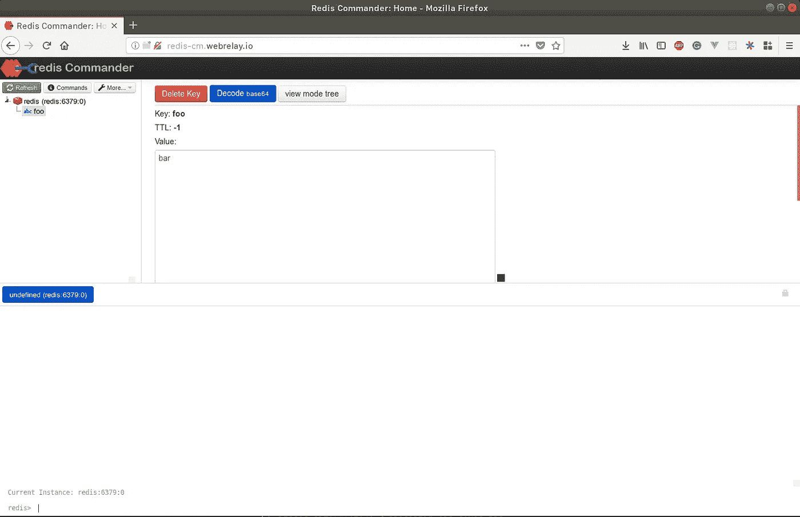

# DevOps 用例:在 Kubernetes 中执行 Redis 维护

> 原文：<https://itnext.io/devops-use-case-performing-redis-maintenance-in-kubernetes-599910e7f649?source=collection_archive---------10----------------------->

如今，在 Kubernetes 集群中运行几乎任何东西都很容易。但是调试这些服务呢？如果您需要快速访问一个通常不向 internet 或 intranet 公开并且只能从集群内部访问的服务，该怎么办？你的服务就像:


在这篇短文中，我将演示如何用一个优秀而强大的 [Redis Commander](https://github.com/joeferner/redis-commander) GUI 连接到一个正在运行的 Redis 实例。

# TL；速度三角形定位法(dead reckoning)

*   部署 [Webhook 中继入口控制器](https://webhookrelay.com/v1/examples/relay-ingress.html)
*   部署 [Redis 指挥官](https://github.com/webhookrelay/k8s-redis-commander/blob/master/redis-commander.yaml)
*   通过 Webhook 中继隧道访问 Redis Commander 并调试您的 Redis 节点

# 先决条件

您首先需要设置一些东西:

*   Kubernetes，您可以使用现有的集群，也可以使用 Minikube 或 Docker for Mac。
*   Webhook 中继账号，在这里注册
*   [Webhook 中继 CLI](https://webhookrelay.com/v1/guide/index.html#Getting-Started)

# 开拍！

让我们部署 Redis(如果已经运行，跳过)，从[克隆的存储库](https://github.com/webhookrelay/k8s-redis-commander)部署它:

```
kubectl apply -f redis.yaml
```

它将创建:

*   Redis 部署
*   使 Redis 在集群内可访问的服务

现在，将我们基于隧道的入口控制器安装到您的集群中:

```
relay ingress init
```

该命令:

*   创建命名空间
*   为入口控制器创建一个认证密码以使用您的帐户
*   部署实际的入口控制器

您可以通过以下方式检查它是否正在运行:

```
$ kubectl get pods -n webrelay-ingress
NAME READY STATUS RESTARTS AGEwebrelay-69996f8d7c-522z8 1/1 Running 0 10s
```

# 配置 Redis 命令程序

现在，在你喜欢的代码编辑器中打开`redis-commander.yaml`(我的是 VSCode:)，编辑几个细节。

如果你在一个自由层，不幸的是，你不能为你的隧道选择一个子域，所以你需要先创建一个。此外，如果您为 Redis 服务选择了不同的名称，那么更新`REDIS_HOSTS`环境变量。

要创建隧道，请运行:

```
$ relay tunnel create — group webrelay-ingress hello-ingress
2p4ptkh9vutgm8tqavigja.webrelay.io← →http://127.0.0.1
```

现在，将`2p4ptkh9vutgm8tqavigja.webrelay.io`复制到最后一个入口部分，并替换`[REPLACE THIS WITH YOUR TUNNEL NAME]`

完成编辑后，创建它:

```
kubectl apply -f redis-commander.yaml
```

现在应该可以从您的浏览器访问它了:



> 很酷，是吗？祝你的其他实验好运！


# 。/wrap_up

总而言之，同样的策略也可以应用于其他服务，比如 Prometheus 或 Grafana。您可以仅在需要时创建隧道，例如，虽然 Grafana 始终可以连接，但当您不确定服务发现是否遗漏了什么或想要使用原始查询时，您可能只想看一眼 Prometheus。

*原载于 2018 年 7 月 23 日*[*【webhookrelay.com*](https://webhookrelay.com/blog/2018/07/23/kubernetes-redis-commander/)*。*